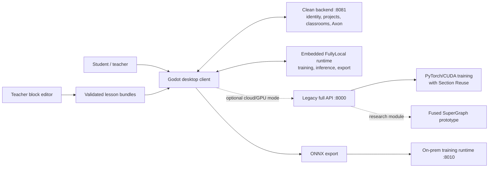

# Neuralese

**A visual AI engineering environment where students build, train, understand, and deploy neural networks without starting from code.**


Neuralese closes the gap between one-click AI demos and professional ML frameworks. Students work with real model structure - layers, tensor flow, datasets, training metrics, and deployment - through a visual graph designed for classrooms.

This repository is the complete hackathon snapshot: desktop client, training backend, Axon AI mentor, teacher lesson editor, on-prem ONNX runtime, installer, landing site, research paper, and runnable Windows/macOS builds.

## Download

| Platform | Build | Notes |
| --- | --- | --- |
| Windows 10/11, x86-64 | [Download `Neuralese-Windows-x86_64.exe`](dist/Neuralese-Windows-x86_64.exe) | Packaged desktop build; format and checksum verified |
| macOS, Apple Silicon and Intel | [Download `Neuralese-macOS-universal.dmg`](dist/Neuralese-macOS-universal.dmg) | Universal `arm64 + x86_64` app bundle |

Checksums are published in [`dist/SHA256SUMS`](dist/SHA256SUMS).

The macOS build is integrity-checked and ad-hoc signed, but it is not Apple-notarized. On a machine where Gatekeeper blocks the first launch, right-click `Neuralese.app`, choose **Open**, and confirm once.

## What students can do

- Build neural networks by connecting layer-level graph nodes.
- Inspect and prepare public or local datasets.
- Train models while observing live loss, accuracy, and graph behavior.
- Ask Axon for context-aware guidance about the current graph.
- Follow structured interactive lessons authored with visual blocks.
- Export trained models to ONNX for deployment outside Neuralese.

## System architecture



The desktop client is built in Godot 4.7. In the checked-in configuration it uses the clean backend on port `8081` for account/project/classroom/Axon services and the embedded FullyLocal runtime for training, inference, and export. The older full API on port `8000` preserves cloud/GPU training and Section Reuse; Fused SuperGraph is included as research and benchmark code, not presented as an active production call path. The standalone teacher editor is a TypeScript/Vite/Blockly application. The on-prem runtime exposes modular HTTP and WebSocket interfaces for local ONNX training. The Windows setup bootstrapper is implemented in Rust with Slint.

## Repository map

| Path | Component | Role |
| --- | --- | --- |
| [`apps/builder`](apps/builder) | Neuralese Builder | Godot desktop graph editor and learning environment |
| [`apps/block-editor`](apps/block-editor) | Teacher Block Editor | Schema-driven visual authoring of syntax-valid lesson bundles |
| [`services/api`](services/api) | Neuralese API | Training, inference, export, datasets, Axon, and update delivery |
| [`services/backend`](services/backend) | Clean Backend | Authentication, profiles, projects, classrooms, billing, and storage |
| [`services/landing`](services/landing) | Landing Site | Public multilingual product site and visual assets |
| [`runtime/onnx-training`](runtime/onnx-training) | On-prem Runtime | Local/cloud-node ONNX training with WebSocket progress and snapshots |
| [`installer/setup`](installer/setup) | Setup Bootstrapper | Windows installer and atomic update foundation |
| [`research`](research) | Research | ISEF paper and evidence behind the platform |
| [`dist`](dist) | Builds | Packaged Windows and macOS artifacts |

Each component starts from a clean snapshot of its original default branch. Exact source repositories, commit SHAs, and the narrow consolidation-only patches are recorded in [`COMPONENTS.md`](COMPONENTS.md).

## Research results

The 2026 study evaluated Neuralese with **83 students** across grades 5-7. The reported post-test differences versus control were **18 percentage points in grade 7** and **10 and 15 percentage points for the two grade-5 experimental groups**, with moderate-to-large effect sizes. The systems experiments also reported up to a **3.4x training speedup** at 16 concurrent users and an **81.6% reduction in CUDA kernel launches**. These are research results reported in the paper, not production service-level guarantees.

Read the full 33-page paper: [`Neuralese-ISEF-2026.pdf`](research/Neuralese-ISEF-2026.pdf).

## Quick development paths

### Desktop client

Open [`apps/builder/project.godot`](apps/builder/project.godot) in Godot 4.7. The current local configuration targets the clean backend at `http://127.0.0.1:8081/` and has embedded FullyLocal training enabled. The Lua and YAML GDExtensions needed by the project are vendored under `apps/builder/addons/`.

### Clean backend

```bash
cd services/backend
python3 -m venv .venv
source .venv/bin/activate
pip install -r requirements.txt
python app.py
```

This starts the default local account/project/classroom/Axon service at `http://127.0.0.1:8081/`. Development defaults allow the service to start without production Clerk, Gumroad, or model-provider credentials; those integrations require their corresponding environment variables.

### Teacher lesson editor

```bash
cd apps/block-editor
npm ci
npm run dev
```

The editor opens at `http://127.0.0.1:5175/`. Its block definitions and YAML mappings are loaded dynamically from JSON schemas; new block types do not require a hardcoded generator branch.

### Legacy full GPU API

[`services/api`](services/api) preserves the older port-`8000` training, inference, export, dataset, and optimization service. Its frozen environment is Windows/CUDA-oriented (`pywin32`, PyTorch CUDA 12.1, and a source dependency), so it is intentionally not presented as a universal copy-paste quickstart. Use a matching Windows x86-64/CUDA environment and the component documentation when working on that path.

### On-prem ONNX training

```bash
cd runtime/onnx-training/code-snapshot/onprem_runtime/deployment
docker compose -f docker-compose.local.yml up --build
```

The dashboard opens at `http://127.0.0.1:8010/` and supports upload, live metrics, stop, and snapshot download. Docker is the supported macOS path because the pinned ONNX Runtime Training wheel targets Linux `amd64`; native Python setup is intended for Linux x86-64.

## How Codex & GPT-5.6 were used

AI-assisted engineering was part of the development loop across the project, not a one-shot generation step at submission time.

### Codex as a repository-scale engineering partner

Codex was used to navigate a system split across Godot/GDScript, Python, TypeScript, Rust, native libraries, ONNX Runtime, and deployment tooling. A Godot MCP bridge provided structured access to project and scene context; repository tracing and the real Godot compiler remained the source of truth.

Concrete contributions included:

1. **Tracing the lesson DSL end to end.** Codex followed the compiler flow from the YAML compiler and DSL registry through generated runtime calls, then helped build a schema-driven Blockly editor. The editor generates the existing Neuralese bundle format instead of inventing a parallel format.
2. **Building syntax parity rather than trusting samples.** Codex helped create generated coverage that sends exported YAML through the actual Godot compiler. This catches wrong field names, branch shapes, enums, nested actions, and topology requirements that snapshot-only tests miss.
3. **Designing the on-prem training runtime.** Codex separated the ONNX training core from HTTP/WebSocket delivery, added local-school and cloud-node modes, dataset references and incremental sync, progress streaming, cancellation, snapshots, authentication, Docker/systemd deployment, and focused tests.
4. **Hardening cross-platform delivery.** Codex investigated native Godot libraries, macOS architecture slices, code signing, trackpad and keyboard differences, installer packaging, update safety, and release verification instead of assuming a Windows export would behave identically on macOS.
5. **Reducing Axon context cost without changing its output contract.** Codex analyzed the real graph/world-state structures and developed compact Markdown/YAML representations for model context while preserving node documentation and tool semantics.
6. **Reviewing changes with evidence.** Pull requests were checked with component tests, builds, generated syntax-parity runs, real Godot compilation, artifact inspection, and SHA-256 verification. AI suggestions were treated as hypotheses until the relevant runtime accepted them.

### GPT-5.6 for the final integration pass

GPT-5.6 Sol was used through Codex as a read-only, high-reasoning second-pass reviewer for this hackathon snapshot on 2026-07-18. It cross-checked the 33-page research paper against the repository structure, challenged unsupported claims, reviewed the architecture explanation for missing links, and checked whether a judge could move from the README to a packaged build or the relevant source component without private context. The review directly caused the port/runtime diagram, Fused SuperGraph status, Godot version, platform quickstarts, and research wording above to be corrected.

The division of work was intentional: Codex handled long-running repository operations and implementation feedback loops; GPT-5.6 focused on cross-component reasoning, research-to-code synthesis, and adversarial review of the final narrative. The result is not "AI wrote the app" - it is a documented human/AI engineering workflow in which generated work is constrained by schemas, compilers, tests, checksums, and real platform behavior.

GPT-5.6 availability in Codex is documented in the [official OpenAI announcement](https://openai.com/index/gpt-5-6/).

### Evidence trail

| AI-assisted work | Repository evidence | Verification evidence |
| --- | --- | --- |
| Lesson DSL tracing and schema-driven editor | [`apps/block-editor`](apps/block-editor), especially `tutorialBlocks.schema.json` and the exporter/compiler scripts | 85 unit tests and 102/102 real Godot syntax-parity cases |
| Modular ONNX training runtime | [`runtime/onnx-training/code-snapshot/onprem_runtime`](runtime/onnx-training/code-snapshot/onprem_runtime) | 95 Python tests plus API/WebSocket snapshot checks |
| Cross-platform packaging and installer work | [`installer/setup`](installer/setup), [`dist`](dist) | PE inspection, universal macOS architecture inspection, DMG verification, code-signature verification, SHA-256 checks |
| Axon context engineering | [`services/backend/axon`](services/backend/axon) | Source review confirmed that the response contract was preserved; no Axon response-schema code was changed during consolidation |
| GPT-5.6 Sol adversarial submission review | This README, [`COMPONENTS.md`](COMPONENTS.md), and the vendored research paper | Read-only Codex review task `019f7609-1d76-7e11-84d8-2228b0bcee11`; resulting corrections are present in this snapshot |

## Verification

Run the root integrity check after cloning:

```bash
./scripts/verify-submission.sh
```

Executed checks and their platform limits are recorded in [`TESTING.md`](TESTING.md). Component-specific test commands live in each component README. The root check validates the repository map, distributable hashes, file formats, and the research artifact; it does not pretend to replace CUDA, Godot, browser, or Windows integration tests.

## Current limitations

- The macOS build is not notarized with an Apple Developer ID.
- The Windows executable was format- and checksum-verified in this consolidation pass, but not runtime-smoke-tested on Windows in this pass.
- GPU training requires a compatible CUDA/PyTorch environment.
- The installer source currently ships a Windows-native setup flow; macOS is distributed directly as a DMG.
- This consolidated snapshot preserves source state, not the individual repositories' full Git histories.

## Research team

Neuralese was developed by **Mikhail Isakov** and **Rakhim Nurmukhanbetov**, students at Specialized School-Lyceum No. 54 named after I.V. Panfilov, under the supervision of **Dina Amirkanova**.

## License and access

No open-source license is granted by this snapshot. All rights remain with the Neuralese team unless a component states otherwise.
