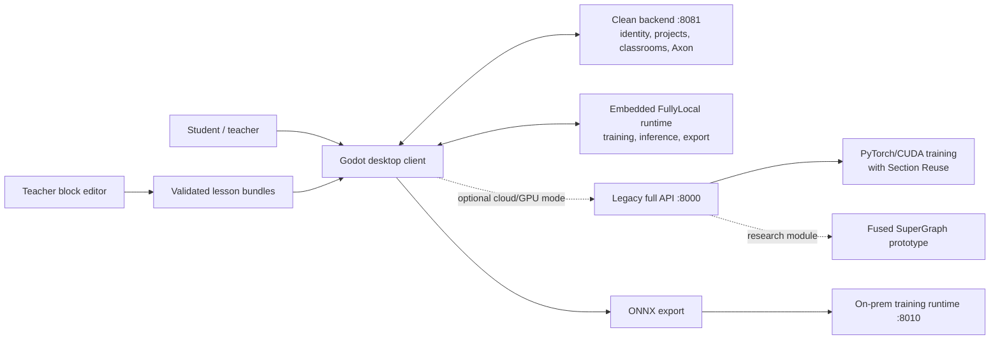

# Neuralese

**A visual AI engineering environment where students build, train, understand, and deploy neural networks without starting from code.**


Neuralese closes the gap between one-click AI demos and professional ML frameworks. Students work with real model structure - layers, tensor flow, datasets, training metrics, and deployment - through a visual graph designed for classrooms.

This repository is the complete hackathon snapshot: desktop client, training backend, Axon AI mentor, teacher lesson editor, on-prem ONNX runtime, installer, landing site, research paper, and runnable Windows/macOS builds.

## Download

| Platform | Build | Notes |
| --- | --- | --- |
| Windows 10/11, x86-64 | [Download `Neuralese-Windows-x86_64.exe`](dist/Neuralese-Windows-x86_64.exe) | Packaged desktop build; format and checksum verified |
| macOS, Apple Silicon and Intel | [Download `Neuralese-macOS-universal.dmg`](dist/Neuralese-macOS-universal.dmg) | Universal `arm64 + x86_64` app bundle |

Checksums are published in [`dist/SHA256SUMS`](dist/SHA256SUMS).

The macOS build is integrity-checked and ad-hoc signed, but it is not Apple-notarized. On a machine where Gatekeeper blocks the first launch, right-click `Neuralese.app`, choose **Open**, and confirm once.

## What students can do

- Build neural networks by connecting layer-level graph nodes.
- Inspect and prepare public or local datasets.
- Train models while observing live loss, accuracy, and graph behavior.
- Ask Axon for context-aware guidance about the current graph.
- Follow structured interactive lessons authored with visual blocks.
- Export trained models to ONNX for deployment outside Neuralese.

## System architecture



The desktop client is built in Godot 4.7. In the checked-in configuration it uses the clean backend on port `8081` for account/project/classroom/Axon services and the embedded FullyLocal runtime for training, inference, and export. The older full API on port `8000` preserves cloud/GPU training and Section Reuse; Fused SuperGraph is included as research and benchmark code, not presented as an active production call path. The standalone teacher editor is a TypeScript/Vite/Blockly application. The on-prem runtime exposes modular HTTP and WebSocket interfaces for local ONNX training. The Windows setup bootstrapper is implemented in Rust with Slint.

## Repository map

| Path | Component | Role |
| --- | --- | --- |
| [`apps/builder`](apps/builder) | Neuralese Builder | Godot desktop graph editor and learning environment |
| [`apps/block-editor`](apps/block-editor) | Teacher Block Editor | Schema-driven visual authoring of syntax-valid lesson bundles |
| [`services/api`](services/api) | Neuralese API | Training, inference, export, datasets, Axon, and update delivery |
| [`services/backend`](services/backend) | Clean Backend | Authentication, profiles, projects, classrooms, billing, and storage |
| [`services/landing`](services/landing) | Landing Site | Public multilingual product site and visual assets |
| [`runtime/onnx-training`](runtime/onnx-training) | On-prem Runtime | Local/cloud-node ONNX training with WebSocket progress and snapshots |
| [`installer/setup`](installer/setup) | Setup Bootstrapper | Windows installer and atomic update foundation |
| [`research`](research) | Research | ISEF paper and evidence behind the platform |
| [`dist`](dist) | Builds | Packaged Windows and macOS artifacts |

Each component starts from a clean snapshot of its original default branch. Exact source repositories, commit SHAs, and the narrow consolidation-only patches are recorded in [`COMPONENTS.md`](COMPONENTS.md).

## Research results

The 2026 study evaluated Neuralese with **83 students** across grades 5-7. The reported post-test differences versus control were **18 percentage points in grade 7** and **10 and 15 percentage points for the two grade-5 experimental groups**, with moderate-to-large effect sizes. The systems experiments also reported up to a **3.4x training speedup** at 16 concurrent users and an **81.6% reduction in CUDA kernel launches**. These are research results reported in the paper, not production service-level guarantees.

Read the full 33-page paper: [`Neuralese-ISEF-2026.pdf`](research/Neuralese-ISEF-2026.pdf).

## Quick development paths

### Desktop client

Open [`apps/builder/project.godot`](apps/builder/project.godot) in Godot 4.7. The current local configuration targets the clean backend at `http://127.0.0.1:8081/` and has embedded FullyLocal training enabled. The Lua and YAML GDExtensions needed by the project are vendored under `apps/builder/addons/`.

### Clean backend

```bash
cd services/backend
python3 -m venv .venv
source .venv/bin/activate
pip install -r requirements.txt
python app.py
```

This starts the default local account/project/classroom/Axon service at `http://127.0.0.1:8081/`. Development defaults allow the service to start without production Clerk, Gumroad, or model-provider credentials; those integrations require their corresponding environment variables.

### Teacher lesson editor

```bash
cd apps/block-editor
npm ci
npm run dev
```

The editor opens at `http://127.0.0.1:5175/`. Its block definitions and YAML mappings are loaded dynamically from JSON schemas; new block types do not require a hardcoded generator branch.

### Legacy full GPU API

[`services/api`](services/api) preserves the older port-`8000` training, inference, export, dataset, and optimization service. Its frozen environment is Windows/CUDA-oriented (`pywin32`, PyTorch CUDA 12.1, and a source dependency), so it is intentionally not presented as a universal copy-paste quickstart. Use a matching Windows x86-64/CUDA environment and the component documentation when working on that path.

### On-prem ONNX training

```bash
cd runtime/onnx-training/code-snapshot/onprem_runtime/deployment
docker compose -f docker-compose.local.yml up --build
```

The dashboard opens at `http://127.0.0.1:8010/` and supports upload, live metrics, stop, and snapshot download. Docker is the supported macOS path because the pinned ONNX Runtime Training wheel targets Linux `amd64`; native Python setup is intended for Linux x86-64.

## How Codex & GPT-5.6 were used

Codex was part of Neuralese's engineering workflow from the early prototype onward, not a tool added for the hackathon submission. Some early chat histories were not retained, so the account below reconstructs that work from the development timeline in the research paper and from surviving code, documentation, tests, and release artifacts. It describes how we worked with Codex; it does not claim that AI independently designed or authored Neuralese.

### How the collaboration evolved with the product

**1. Turning the first Godot experiment into a maintainable graph editor.** Neuralese began in July 2025 as an experimental visual neural-network constructor. During this early phase, we used Codex to read unfamiliar Godot and GDScript paths, map scene-tree and signal relationships, and reason about how visual nodes should represent real layers, tensor shapes, and data flow. Instead of asking for an entire application in one prompt, we brought Codex specific problems: trace why a connection was rejected, find where a node was serialized, explain which scene owned an interaction, or propose a small change without breaking existing behavior. As the project grew, the Godot MCP bridge made scene and script inspection more structured. The running project and the Godot compiler always remained the final authority.

**2. Expanding from a graph demo into a complete learning environment.** When datasets, local execution, simulations, training, inference, and export were added, Codex helped us follow behavior across the Godot client, Python services, Rust modules, and native extensions. It was particularly useful for identifying ownership boundaries: which work belonged in the responsive client, which belonged in the asynchronous backend, and which performance-sensitive operations should remain in Rust. For dataset work, Codex helped inspect the existing block, compression, hashing, and incremental-sync implementation so that later services could reuse its protocol rather than silently create an incompatible copy.

**3. Developing Axon from chat into an in-product mentor.** Axon started as a conversational experiment and evolved into the Narrator/Builder design described in the paper. We used Codex to trace the real graph and world-state structures given to the model, review tool contracts, and separate explanatory behavior from deterministic graph edits. Later, Codex helped reduce context cost by designing compact Markdown/YAML representations of node documentation and world state while preserving the existing Axon response contract. This was an iterative context-engineering task: inspect real payloads, measure their size, compress repeated structure, and test that the model still received every field needed for a correct graph operation.

**4. Building structured lessons and then removing YAML from the teacher workflow.** The first lesson system was authored directly in a custom YAML DSL and interpreted by Godot. Codex helped trace that DSL from the YAML compiler and registry to the runtime calls, including steps, actions, validation rules, branches, and teacher locks. That understanding later became the basis of the standalone Blockly editor in [`apps/block-editor`](apps/block-editor). Its block definitions and YAML mappings are loaded from schemas rather than a hardcoded type-to-YAML switch. Generated exports are checked by the real Godot lesson compiler, giving the editor 102/102 syntax-parity cases in addition to its unit tests.

**5. Supporting the research optimization work.** For Section Reuse and Fused SuperGraph experiments, Codex was used as a code-reading, instrumentation, and review partner. It helped trace topology matching and reusable sections, inspect benchmark harnesses and profiler output, and check that performance claims were tied to recorded experiments rather than inferred from code. The paper reports a 3.4x reduction in cumulative training time for Section Reuse at 16 concurrent users and an 81.6% reduction in CUDA kernel launches for the Fused SuperGraph experiment. In this repository, Section Reuse is connected to the training path; Fused SuperGraph is preserved as research and benchmark code rather than described as an active production path.

**6. Making training deployable inside a school.** When the project needed an on-prem ONNX training service, Codex helped turn the requirement into a discrete core engine plus transport layers. The resulting runtime has separate local-school and cloud-node modes, HTTP and WebSocket APIs, live metrics, cancellation, authenticated access, dataset references, incremental synchronization, trained snapshots, Docker deployment, systemd documentation, and focused tests. The modular boundary was deliberate: the same training engine can be embedded in school hardware or used behind Neuralese infrastructure without coupling it to one web server.

**7. Shipping beyond the development machine.** Codex was also used for the less visible work required to make a research prototype distributable. This included inspecting Godot GDExtensions and macOS architecture slices, diagnosing Gatekeeper and signing behavior, translating Windows shortcuts to macOS Command bindings, adding trackpad navigation, reviewing installer and updater safety, producing Windows and universal macOS artifacts, and verifying hashes and file formats. These tasks were tested with real compilers, platform tools, and manual UI checks rather than accepted from generated code alone.

### The working loop

Across those phases, our normal Codex loop was consistent:

1. Give Codex the relevant repository, bug report, logs, or research requirement.
2. Ask it to trace the existing implementation before proposing a change.
3. Review a scoped plan and apply changes in small, inspectable patches.
4. Run the relevant unit tests, build, compiler, benchmark, or artifact inspection.
5. Manually test visual and platform-specific behavior, then return failures to the same loop.

This approach made Codex most useful on cross-file and cross-language problems while keeping product decisions, experimental interpretation, and final acceptance with the human team.

### GPT-5.6 for the final integration pass

GPT-5.6 Sol was used through Codex as a read-only, high-reasoning second-pass reviewer for this hackathon snapshot on 2026-07-18. It cross-checked the 33-page research paper against the repository structure, challenged unsupported claims, reviewed the architecture explanation for missing links, and checked whether a judge could move from the README to a packaged build or the relevant source component without private context. The review directly caused the port/runtime diagram, Fused SuperGraph status, Godot version, platform quickstarts, and research wording above to be corrected.

The division of work was intentional: Codex handled long-running repository operations and implementation feedback loops; GPT-5.6 focused on cross-component reasoning, research-to-code synthesis, and adversarial review of the final narrative. The result is not "AI wrote the app" - it is a human/AI engineering workflow in which generated work is constrained by schemas, compilers, tests, benchmarks, checksums, and real platform behavior.

GPT-5.6 availability in Codex is documented in the [official OpenAI announcement](https://openai.com/index/gpt-5-6/).

### Evidence trail

| AI-assisted work | Repository evidence | Verification evidence |
| --- | --- | --- |
| Godot graph editor and platform tracing | [`apps/builder`](apps/builder) | Real Godot project compilation, runtime inspection, and manual graph/UI testing |
| Dataset and service-boundary review | [`apps/builder`](apps/builder), [`services/api`](services/api) | Existing block/hash synchronization protocol retained; component behavior checked at its native boundary |
| Section Reuse and Fused SuperGraph analysis | [`services/api/nns/sections`](services/api/nns/sections), [`services/api/nns/topofuse`](services/api/nns/topofuse), [`services/api/optibench.py`](services/api/optibench.py) | Recorded benchmark/profiler artifacts and the results reported in the research paper |
| Lesson DSL tracing and schema-driven editor | [`apps/block-editor`](apps/block-editor), especially `tutorialBlocks.schema.json` and the exporter/compiler scripts | 85 unit tests and 102/102 real Godot syntax-parity cases |
| Modular ONNX training runtime | [`runtime/onnx-training/code-snapshot/onprem_runtime`](runtime/onnx-training/code-snapshot/onprem_runtime) | 95 Python tests plus API/WebSocket snapshot checks |
| Cross-platform packaging and installer work | [`installer/setup`](installer/setup), [`dist`](dist) | PE inspection, universal macOS architecture inspection, DMG verification, code-signature verification, SHA-256 checks |
| Axon context engineering | [`services/backend/axon`](services/backend/axon) | Source review confirmed that the response contract was preserved; no Axon response-schema code was changed during consolidation |
| GPT-5.6 Sol adversarial submission review | This README, [`COMPONENTS.md`](COMPONENTS.md), and the vendored research paper | Read-only Codex review task `019f7609-1d76-7e11-84d8-2228b0bcee11`; resulting corrections are present in this snapshot |

## Verification

Run the root integrity check after cloning:

```bash
./scripts/verify-submission.sh
```

Executed checks and their platform limits are recorded in [`TESTING.md`](TESTING.md). Component-specific test commands live in each component README. The root check validates the repository map, distributable hashes, file formats, and the research artifact; it does not pretend to replace CUDA, Godot, browser, or Windows integration tests.

## Current limitations

- The macOS build is not notarized with an Apple Developer ID.
- The Windows executable was format- and checksum-verified in this consolidation pass, but not runtime-smoke-tested on Windows in this pass.
- GPU training requires a compatible CUDA/PyTorch environment.
- The installer source currently ships a Windows-native setup flow; macOS is distributed directly as a DMG.
- This consolidated snapshot preserves source state, not the individual repositories' full Git histories.

## Research team

Neuralese was developed by **Mikhail Isakov** and **Rakhim Nurmukhanbetov**, students at Specialized School-Lyceum No. 54 named after I.V. Panfilov, under the supervision of **Dina Amirkanova**.

## License and access

No open-source license is granted by this snapshot. All rights remain with the Neuralese team unless a component states otherwise.
