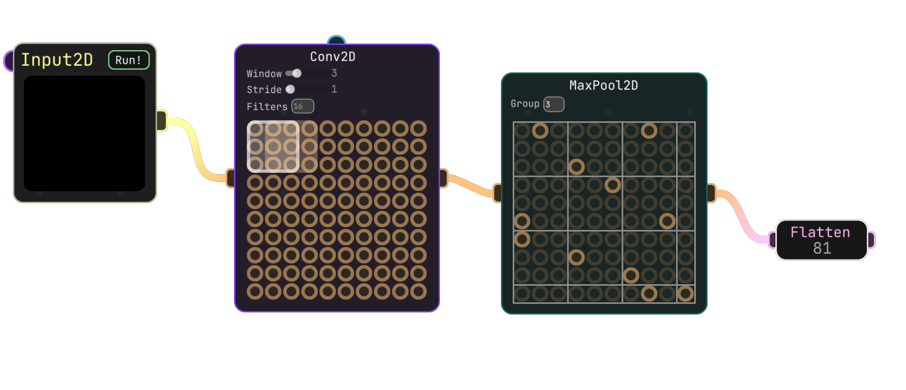
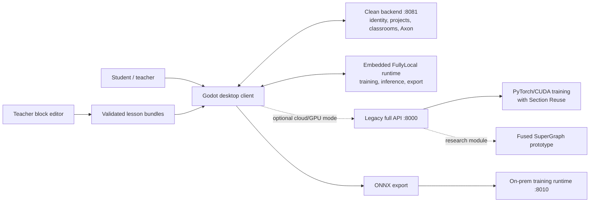

# Neuralese

**A visual AI engineering environment where students build, train, understand, and deploy neural networks without starting from code.**



Neuralese closes the gap between one-click AI demos and professional ML frameworks. Students work with real model structure - layers, tensor flow, datasets, training metrics, and deployment - through a visual graph designed for classrooms.

This repository is the complete hackathon snapshot: desktop client, training backend, Axon AI mentor, teacher lesson editor, on-prem ONNX runtime, installer, landing site, research paper, and runnable Windows/macOS builds.

## Download

| Platform | Build | Notes |
| --- | --- | --- |
| Windows 10/11, x86-64 | [Download `Neuralese-Windows-x86_64.exe`](dist/Neuralese-Windows-x86_64.exe) | Packaged desktop build; format and checksum verified |
| macOS, Apple Silicon and Intel | [Download `Neuralese-macOS-universal.dmg`](dist/Neuralese-macOS-universal.dmg) | Universal `arm64 + x86_64` app bundle |

Checksums are published in [`dist/SHA256SUMS`](dist/SHA256SUMS).

The macOS build is integrity-checked and ad-hoc signed, but it is not Apple-notarized. On a machine where Gatekeeper blocks the first launch, right-click `Neuralese.app`, choose **Open**, and confirm once.

## What students can do

- Build neural networks by connecting layer-level graph nodes.
- Inspect and prepare public or local datasets.
- Train models while observing live loss, accuracy, and graph behavior.
- Ask Axon for context-aware guidance about the current graph.
- Follow structured interactive lessons authored with visual blocks.
- Export trained models to ONNX for deployment outside Neuralese.

## System architecture



The desktop client is built in Godot 4.7. In the checked-in configuration it uses the clean backend on port `8081` for account/project/classroom/Axon services and the embedded FullyLocal runtime for training, inference, and export. The older full API on port `8000` preserves cloud/GPU training and Section Reuse; Fused SuperGraph is included as research and benchmark code, not presented as an active production call path. The standalone teacher editor is a TypeScript/Vite/Blockly application. The on-prem runtime exposes modular HTTP and WebSocket interfaces for local ONNX training. The Windows setup bootstrapper is implemented in Rust with Slint.

## Repository map

| Path | Component | Role |
| --- | --- | --- |
| [`apps/builder`](apps/builder) | Neuralese Builder | Godot desktop graph editor and learning environment |
| [`apps/block-editor`](apps/block-editor) | Teacher Block Editor | Schema-driven visual authoring of syntax-valid lesson bundles |
| [`services/api`](services/api) | Neuralese API | Training, inference, export, datasets, Axon, and update delivery |
| [`services/backend`](services/backend) | Clean Backend | Authentication, profiles, projects, classrooms, billing, and storage |
| [`services/landing`](services/landing) | Landing Site | Public multilingual product site and visual assets |
| [`runtime/onnx-training`](runtime/onnx-training) | On-prem Runtime | Local/cloud-node ONNX training with WebSocket progress and snapshots |
| [`installer/setup`](installer/setup) | Setup Bootstrapper | Windows installer and atomic update foundation |
| [`research`](research) | Research | ISEF paper and evidence behind the platform |
| [`dist`](dist) | Builds | Packaged Windows and macOS artifacts |

Each component starts from a clean snapshot of its original default branch. Exact source repositories, commit SHAs, and the narrow consolidation-only patches are recorded in [`COMPONENTS.md`](COMPONENTS.md).

## Research results

The 2026 study evaluated Neuralese with **83 students** across grades 5-7. The reported post-test differences versus control were **18 percentage points in grade 7** and **10 and 15 percentage points for the two grade-5 experimental groups**, with moderate-to-large effect sizes. The systems experiments also reported up to a **3.4x training speedup** at 16 concurrent users and an **81.6% reduction in CUDA kernel launches**. These are research results reported in the paper, not production service-level guarantees.

Read the full 33-page paper: [`Neuralese-ISEF-2026.pdf`](research/Neuralese-ISEF-2026.pdf).

## Quick development paths

### Desktop client

Open [`apps/builder/project.godot`](apps/builder/project.godot) in Godot 4.7. The current local configuration targets the clean backend at `http://127.0.0.1:8081/` and has embedded FullyLocal training enabled. The Lua and YAML GDExtensions needed by the project are vendored under `apps/builder/addons/`.

### Clean backend

```bash
cd services/backend
python3 -m venv .venv
source .venv/bin/activate
pip install -r requirements.txt
python app.py
```

This starts the default local account/project/classroom/Axon service at `http://127.0.0.1:8081/`. Development defaults allow the service to start without production Clerk, Gumroad, or model-provider credentials; those integrations require their corresponding environment variables.

### Teacher lesson editor

```bash
cd apps/block-editor
npm ci
npm run dev
```

The editor opens at `http://127.0.0.1:5175/`. Its block definitions and YAML mappings are loaded dynamically from JSON schemas; new block types do not require a hardcoded generator branch.

### Legacy full GPU API

[`services/api`](services/api) preserves the older port-`8000` training, inference, export, dataset, and optimization service. Its frozen environment is Windows/CUDA-oriented (`pywin32`, PyTorch CUDA 12.1, and a source dependency), so it is intentionally not presented as a universal copy-paste quickstart. Use a matching Windows x86-64/CUDA environment and the component documentation when working on that path.

### On-prem ONNX training

```bash
cd runtime/onnx-training/code-snapshot/onprem_runtime/deployment
docker compose -f docker-compose.local.yml up --build
```

The dashboard opens at `http://127.0.0.1:8010/` and supports upload, live metrics, stop, and snapshot download. Docker is the supported macOS path because the pinned ONNX Runtime Training wheel targets Linux `amd64`; native Python setup is intended for Linux x86-64.

## How Codex, ChatGPT & GPT-5.6 were used

Codex was part of Neuralese's engineering workflow from the early prototype onward, not a tool added for the hackathon submission. Some early ChatGPT and Codex histories were not retained, so the account below reconstructs that work from the development timeline in the research paper and from surviving code, documentation, tests, and release artifacts. It describes how we worked with AI; it does not claim that AI independently designed or authored Neuralese.

### The division of work from the beginning

The human team defined the educational problem, product behavior, system architecture, service boundaries, and acceptance criteria. Codex was then used as an implementation partner inside those boundaries. This was especially effective on the backend: we designed the architecture and contracts, while Codex automated routine implementation work such as endpoint wiring, validation, persistence adapters, error handling, repetitive transformations, and test scaffolding. Every generated change was read and tested before it became part of the project.

For smaller, self-contained tasks, we also used ChatGPT with GPT-5 directly. Typical examples were discrete input/output functions and helper classes for parsing, serialization, file handling, validation, and request/response conversion. These tasks had narrow interfaces and objective expected outputs, which made them suitable for fast generation and unit testing without delegating larger architectural decisions.

The three AI-assisted workflows had different purposes:

- **ChatGPT with GPT-5** was our fast technical notebook. We used it to discuss an isolated problem, sketch a data transformation, explain an unfamiliar API, or draft a small helper with a clearly defined input and output. It was useful before a task justified loading an entire repository.
- **Codex** was the repository-aware implementation environment. It could inspect neighboring modules, search call sites, edit several languages, run commands, follow test failures, and keep working until a change passed its real verification path. In the Godot client, MCP access added scene-tree and editor context that a normal chat did not have.
- **GPT-5.6** was used for the highest-context reasoning passes. It compared the paper with the code, reviewed architecture across repositories, looked for unsupported claims and missing integration details, and challenged work that appeared complete only because a narrow test passed.

This distinction mattered. A ten-line parser helper did not need a repository-scale agent, while a lesson compiler change could not be trusted from a standalone snippet. We chose the tool according to the amount of context and verification the task required.

### How the collaboration evolved with the product

**1. Turning the first Godot experiment into a maintainable graph editor.** Neuralese began in July 2025 as an experimental visual neural-network constructor, and Codex was already part of the development loop at that stage. We connected it to the project through a Godot MCP bridge so it could work from the actual scene tree, node names, scripts, resources, and editor output instead of guessing from isolated snippets or screenshots. Grounded in that context, the model was often remarkably precise at tracing GDScript execution, signal relationships, graph serialization, and the scene responsible for a particular interaction.

The early workflow was practical. We would reproduce a graph bug in Godot, give Codex the visible behavior and relevant editor output, and ask it to trace the event through scripts such as `base_graph.gd`, `graph_manager.gd`, `connection.gd`, or `camera_2d.gd`. Codex would identify the scene that owned the state, locate connected signals and autoload dependencies, and propose a narrow patch. We then reopened the project and tested node creation, connection rules, serialization, camera movement, and input behavior manually. This was much more reliable than asking a model to generate a new graph editor from scratch because it learned the architecture already present in Neuralese.

ChatGPT/GPT-5 complemented this work with smaller pieces: input normalization helpers, serialization utilities, type conversion, bounds checks, and discrete functions that translated one representation into another. Codex then integrated those pieces where necessary, checked call sites, and adapted them to Godot's actual lifecycle. This combination let us move quickly without turning the codebase into disconnected generated snippets.

**2. Expanding from a graph demo into a complete learning environment.** When datasets, local execution, simulations, training, inference, and export were added, we continued to make the architectural decisions and used Codex to implement and connect the repetitive pieces. We defined which services existed, what data crossed each boundary, and which operations had to stay local. Codex then helped turn those decisions into route handlers, schemas, adapters, validation, error paths, and tests. This was particularly valuable on the backend, where routine API and data-flow work could otherwise consume time needed for the educational and ML design.

The project spans Godot/GDScript, asynchronous Python services, Rust modules exposed through pyo3, Lua simulation code, YAML lessons, ONNX, and native GDExtensions. Codex was used to trace a feature across those boundaries before editing it. For example, a dataset operation might begin in the Godot UI, pass through a serialized request, use Rust compression, and later be consumed by a Python training service. Repository search and call-path tracing made it possible to change the correct layer rather than duplicate logic in whichever language happened to be open.

For dataset synchronization, the requirement was strict: local datasets could be large, so changing one part must not force the client to upload everything again. The existing engine partitions data into blocks, compresses them, hashes them, and transmits only mismatched blocks. Codex helped us read that implementation and preserve its protocol in later runtime work. The important contribution was not inventing a second synchronization scheme; it was recognizing that the mature Rust-backed path already existed and making new code conform to it.

Backend implementation followed a repeated human/AI split. We wrote the service architecture and the behavior expected by the client. Codex generated or refactored repetitive endpoint code, validation branches, provider adapters, persistence operations, and test setup. We reviewed data ownership and failure semantics ourselves, then used tests and real client requests to reject changes that merely looked plausible.

**3. Developing Axon from chat into an in-product mentor.** Axon started as a conversational experiment and evolved into the Narrator/Builder design described in the paper. ChatGPT was useful during the exploratory stage for comparing prompt structures and discussing how a tutor should explain neural-network concepts without completing the student's work. As Axon became connected to real projects, Codex became more useful because the problem was no longer only prompt writing: the model had to receive graph state, understand available nodes, call tools, and preserve an API contract used by the application.

We used Codex to trace the real graph and world-state structures given to Axon, review the tool contracts, and separate explanatory behavior from deterministic graph edits. That work is visible in the provider, service, prompt, node-documentation, and graph-summary modules under [`services/backend/axon`](services/backend/axon). The dual-agent boundary was deliberate: the Narrator could teach and reason conversationally, while the Builder received constrained instructions and performed graph operations without trying to sound helpful at the same time.

Later, the challenge changed from capability to cost. The Builder prompt was dominated by node documentation and JSON world-state payloads. We did not add a fragile keyword router or change Axon's output schema. Instead, Codex helped inspect actual payloads and design compact Markdown/YAML representations that removed repeated JSON punctuation while keeping node names, parameters, edges, and tool semantics. The process was measurement-driven: capture representative states, compare token counts, run test prompts against the real provider path, and check whether the same graph operation could still be produced. GPT-5.6 was useful here as a skeptical reviewer because an output that was shorter but omitted a critical field would have been a regression, not an optimization.

**4. Building structured lessons and then removing YAML from the teacher workflow.** The first lesson system was authored directly in a custom YAML DSL and interpreted by Godot. Teachers could define explanations, UI restrictions, graph checks, branches, and teacher-controlled checkpoints, but authoring the format by hand was too technical. Before building a visual editor, Codex traced the actual execution path from `yaml_comp.gd` through `dsl_compile.gd`, `dsl_registry.gd`, graph utilities, and runtime calls. This produced a dependency graph of the syntax instead of relying on a few example lesson files.

That understanding became the basis of the standalone Blockly editor in [`apps/block-editor`](apps/block-editor). The key architectural rule was that block type to YAML expression mapping could never be a giant hardcoded switch. Codex helped implement a pipeline in which JSON schemas define block fields, connections, colors, validation rules, and emission operations. The web application loads those schemas, creates Blockly definitions and toolbox categories, converts the workspace into a lesson AST, validates invariants, emits YAML, and packages `bundle.yaml` plus lesson files into the expected ZIP structure.

This feature required many rounds where visual behavior and compiler correctness pulled in different directions. Codex helped implement root blocks for the main flow and named branches, branch references, connection-shape rules that make invalid syntax physically difficult to assemble, undo/delete shortcuts, stable dragging, workspace persistence, category styling, and bundle export. Manual browser checks found interaction problems such as camera resets, detached blocks losing drag state, and dropdown text becoming unreadable. Those reports were fed back into Codex as concrete reproductions rather than vague requests to "improve the UI."

The strongest verification did not come from generated snapshots. Codex helped build a parity harness that generates representative lesson cases, exports them from the web editor, and sends them through the real Godot compiler. The final run covered 102/102 syntax-parity cases, alongside 85 unit tests for schemas, branches, workspace invariants, YAML emission, shortcuts, and export behavior. This is an example of AI being used not only to generate code, but also to construct a mechanism capable of proving its generated code wrong.

**5. Supporting the research optimization work.** Section Reuse and Fused SuperGraph were research ideas created to address a property of classroom workloads: many students train similar models at the same time. We used Codex as a code-reading, instrumentation, and review partner rather than asking it to manufacture performance claims. It helped trace topology matching, partition boundaries, reusable weight sections, fusion plans, weight banks, synchronization, and benchmark entry points across [`services/api/nns/sections`](services/api/nns/sections), [`services/api/nns/topofuse`](services/api/nns/topofuse), and `optibench.py`.

ChatGPT/GPT-5 was useful for isolated numerical or data-processing helpers in the experimental scripts, while Codex handled repository integration and repeatable benchmark execution. GPT-5.6 later reviewed whether the README's language matched what the code and paper actually demonstrated. That review caught an important distinction: Section Reuse is connected to the training path, while Fused SuperGraph is preserved as research and benchmark code and should not be presented as an active production call path.

The paper reports a 3.4x reduction in cumulative training time for Section Reuse at 16 concurrent users and an 81.6% reduction in CUDA kernel launches for the Fused SuperGraph experiment. Those numbers come from recorded experiments and the research paper, not from an AI estimate. Codex helped organize, inspect, and validate the implementation around the experiments; the team remained responsible for the hypotheses, benchmark conditions, and interpretation.

**6. Making training deployable inside a school.** When the project needed an on-prem ONNX training service, we first specified the lifecycle: receive an ONNX bundle, resolve its dataset, train it, stream loss and accuracy, stop either on command or after the final epoch, and return a valid trained snapshot. We also required two operating profiles: a self-contained school installation and a cloud-node mode suitable for load-balanced Neuralese infrastructure.

Codex turned that architecture into an implementation plan and then into discrete modules. Bundle parsing, configuration, datasets, event delivery, jobs, ONNX Runtime training, cancellation, and snapshot creation live under `core/`; authentication, profiles, schemas, routes, and WebSocket delivery live under `api/`. This separation means the training engine does not depend on one HTTP framework and can be embedded elsewhere. Codex also implemented dataset references and incremental synchronization by following the existing dataset engine rather than changing its protocol.

The runtime was developed test-first in small steps: bundle validation, job state transitions, event streams, stop requests, mandatory checkpoint/snapshot behavior, profile configuration, auth errors, dataset sync, Docker smoke tests, and deployment documentation. A minimal dashboard was added only to expose the operational flow needed by teachers and school administrators. The completed snapshot has 95 Python tests and deployment paths for Docker and systemd. Here Codex did a large amount of implementation work, but it did so against an architecture and acceptance criteria written by the team.

**7. Shipping beyond the development machine.** Codex was also used for the less visible work required to make a research prototype distributable. The Windows-oriented Godot project depended on native Lua and YAML libraries, so a successful editor import was not enough to prove that a macOS build would work. Codex inspected GDExtension declarations, dynamic-library names, architecture slices, app-bundle contents, signing state, and Gatekeeper behavior. It helped distinguish harmless Godot import warnings from missing runtime dependencies and produced repeatable artifact checks.

Platform input required its own iteration. Mouse interaction worked on macOS, but trackpad panning and Command-based shortcuts did not initially behave like their Windows equivalents. Codex traced the input path, added macOS mappings without removing Windows behavior, and helped package a build for manual testing. The team then tested real trackpad movement, zoom, keyboard shortcuts, and graph interaction before the changes were proposed upstream.

For installation and updates, we designed the safety model before implementation: version manifests, release notes, visible download progress, checksum verification, temporary staging, atomic replacement, and rollback/failure behavior. Codex helped implement and review the Rust/Slint installer foundation and release scripts, while GPT-5.6 inspected failure cases where a partially downloaded or mismatched package could otherwise replace a working installation. Finally, Codex assembled the Windows executable and universal macOS DMG, checked PE and Mach-O formats, verified both architecture slices, validated the DMG, applied an ad-hoc signature, and generated SHA-256 checksums.

### The working loop

Across those phases, our normal Codex loop was consistent:

1. Give Codex the relevant repository, bug report, logs, or research requirement.
2. Ask it to trace the existing implementation before proposing a change.
3. Review a scoped plan and apply changes in small, inspectable patches.
4. Run the relevant unit tests, build, compiler, benchmark, or artifact inspection.
5. Manually test visual and platform-specific behavior, then return failures to the same loop.

This approach made Codex most useful on cross-file and cross-language problems, while GPT-5 handled small bounded helpers efficiently and the human team retained product decisions, architecture, experimental interpretation, and final acceptance.

A typical feature therefore did not begin with "build this entire feature." It began with the team defining a user problem and an architectural boundary. ChatGPT might help explore alternatives or draft a pure helper. Codex would inspect the repository, identify the real call path, propose a plan, implement the selected part, and run verification. A human would test the interaction and return concrete failures. GPT-5.6 was brought in when the remaining risk involved several repositories, a long research document, or subtle disagreement between what tests proved and what the product claimed.

### What remained human-owned

AI assistance did not replace the core research or product work. The team selected the educational problem, designed the visual learning approach, chose the research hypotheses, conducted the 83-student study, designed the overall architecture, decided which tradeoffs were acceptable for schools, and interpreted the experimental results. The team also performed visual acceptance testing and decided when a feature was ready. Codex, ChatGPT, and GPT-5.6 accelerated implementation, debugging, documentation, and review inside that human-defined direction.

### GPT-5.6 for the final integration pass

GPT-5.6 Sol was used through Codex as a read-only, high-reasoning second-pass reviewer for this hackathon snapshot on 2026-07-18. By this stage the problem was no longer a single code change: seven source repositories, two distributable platforms, a 33-page paper, research benchmarks, and several runtime modes had to tell one technically consistent story. GPT-5.6 cross-checked the paper against the repository structure, challenged unsupported claims, reviewed the architecture explanation for missing links, and checked whether a judge could move from the README to a packaged build or the relevant source component without private context.

This review did not simply rewrite prose. It asked which backend port the desktop client actually used, whether training was embedded or remote, whether Fused SuperGraph was called from production, which Godot version the project required, whether the macOS binary was universal, and whether the published research numbers were described with the correct baseline. The answers were verified in source, configuration, artifacts, and the paper. The review directly caused the port/runtime diagram, Fused SuperGraph status, Godot version, platform quickstarts, artifact notes, and research wording above to be corrected.

The division of work was intentional: Codex handled long-running repository operations and implementation feedback loops; GPT-5.6 focused on cross-component reasoning, research-to-code synthesis, and adversarial review of the final narrative. The result is not "AI wrote the app" - it is a human/AI engineering workflow in which generated work is constrained by schemas, compilers, tests, benchmarks, checksums, and real platform behavior.

GPT-5.6 availability in Codex is documented in the [official OpenAI announcement](https://openai.com/index/gpt-5-6/).

### Evidence trail

| AI-assisted work | Repository evidence | Verification evidence |
| --- | --- | --- |
| GPT-5-assisted discrete I/O functions and helper classes | Serialization, validation, file-handling, and conversion helpers across [`apps/builder`](apps/builder) and [`services/backend`](services/backend) | Exercised through their runtime callers, component tests, and manual feature checks |
| Codex implementation of human-designed backend contracts | [`services/backend`](services/backend), [`services/api`](services/api) | Route/service integration checks, provider tests, real client requests, and review of error behavior |
| Godot graph editor and platform tracing | [`apps/builder`](apps/builder) | Real Godot project compilation, runtime inspection, and manual graph/UI testing |
| Dataset and service-boundary review | [`apps/builder`](apps/builder), [`services/api`](services/api) | Existing block/hash synchronization protocol retained; component behavior checked at its native boundary |
| Section Reuse and Fused SuperGraph analysis | [`services/api/nns/sections`](services/api/nns/sections), [`services/api/nns/topofuse`](services/api/nns/topofuse), [`services/api/optibench.py`](services/api/optibench.py) | Recorded benchmark/profiler artifacts and the results reported in the research paper |
| Lesson DSL tracing and schema-driven editor | [`apps/block-editor`](apps/block-editor), especially `tutorialBlocks.schema.json` and the exporter/compiler scripts | 85 unit tests and 102/102 real Godot syntax-parity cases |
| Modular ONNX training runtime | [`runtime/onnx-training/code-snapshot/onprem_runtime`](runtime/onnx-training/code-snapshot/onprem_runtime) | 95 Python tests plus API/WebSocket snapshot checks |
| Cross-platform packaging and installer work | [`installer/setup`](installer/setup), [`dist`](dist) | PE inspection, universal macOS architecture inspection, DMG verification, code-signature verification, SHA-256 checks |
| Axon context engineering | [`services/backend/axon`](services/backend/axon) | Source review confirmed that the response contract was preserved; no Axon response-schema code was changed during consolidation |
| GPT-5.6 Sol adversarial submission review | This README, [`COMPONENTS.md`](COMPONENTS.md), and the vendored research paper | Read-only Codex review task `019f7609-1d76-7e11-84d8-2228b0bcee11`; resulting corrections are present in this snapshot |

## Verification

Run the root integrity check after cloning:

```bash
./scripts/verify-submission.sh
```

Executed checks and their platform limits are recorded in [`TESTING.md`](TESTING.md). Component-specific test commands live in each component README. The root check validates the repository map, distributable hashes, file formats, and the research artifact; it does not pretend to replace CUDA, Godot, browser, or Windows integration tests.

## Current limitations

- The macOS build is not notarized with an Apple Developer ID.
- The Windows executable was format- and checksum-verified in this consolidation pass, but not runtime-smoke-tested on Windows in this pass.
- GPU training requires a compatible CUDA/PyTorch environment.
- The installer source currently ships a Windows-native setup flow; macOS is distributed directly as a DMG.
- This consolidated snapshot preserves source state, not the individual repositories' full Git histories.

## License and access

No open-source license is granted by this snapshot. All rights remain with the Neuralese team unless a component states otherwise.
