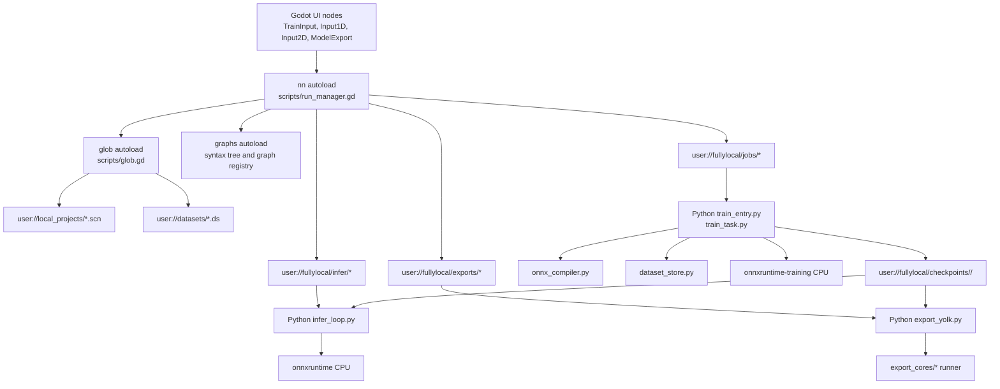
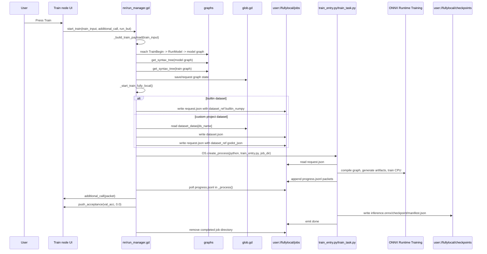
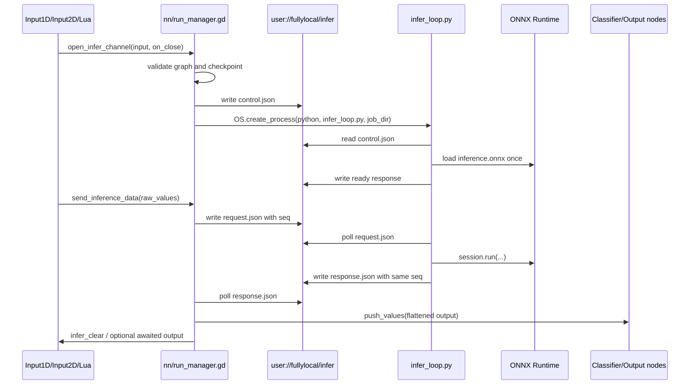
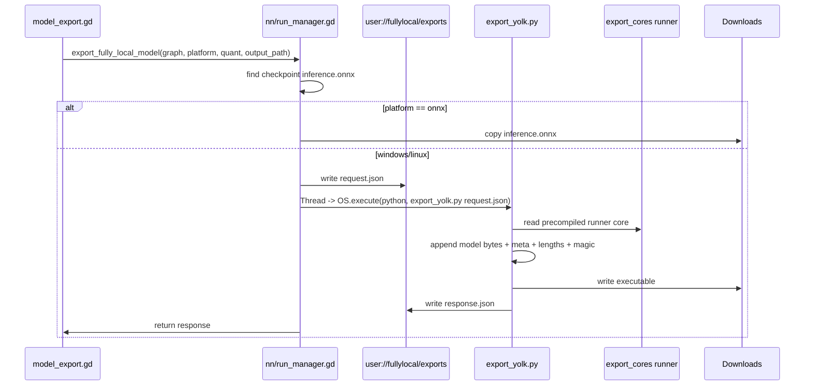
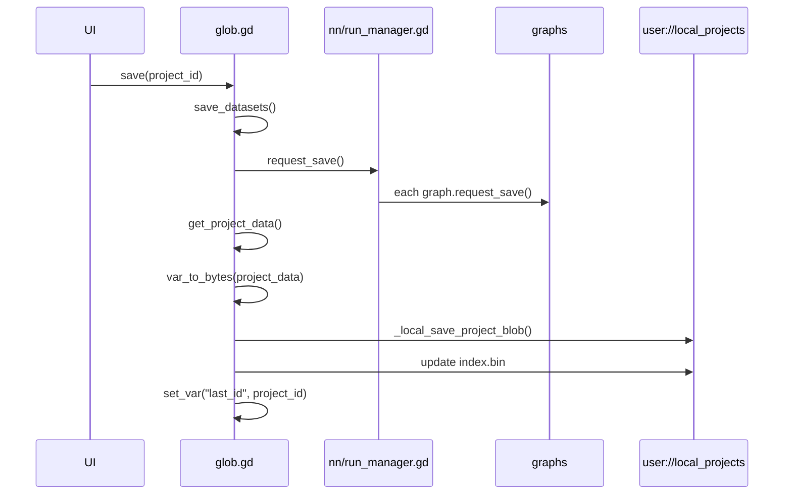
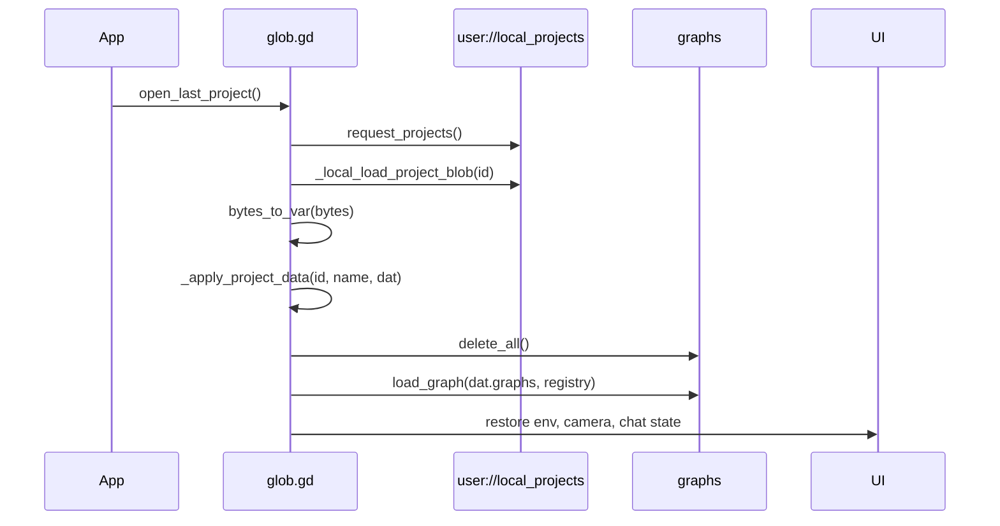

# Neuralese FullyLocal Runtime Documentation

This document explains the current local training, local inference, local executable export, and local project storage systems in the Neuralese Godot frontend. It is written for new contributors who need to modify or debug this subsystem without first reverse-engineering every signal, process, and file contract.

The short version: `scripts/run_manager.gd` is the Godot-side bottleneck for training, inference, model checkpoint deletion, and local export. It launches Python workers from `local_runtime/neuralese_local/`, talks to those workers through JSON files under `user://fullylocal/`, and stores trained ONNX inference models under project-scoped checkpoint directories. `scripts/glob.gd` owns local project and dataset persistence. `scripts/model_export.gd` is the export UI. `local_runtime/yolk_runner_proto/` is the Rust prototype for self-contained exported executables.

## 1. System Scope

The FullyLocal system currently covers four related capabilities:

1. Local training:
   - Converts the visual Neuralese graph to ONNX.
   - Generates ONNX Runtime training artifacts.
   - Trains on CPU through `onnxruntime-training`.
   - Streams progress back to Godot through `progress.jsonl`.
   - Writes `inference.onnx`, `checkpoint`, and `manifest.json` into a persistent checkpoint directory.

2. Local inference:
   - Opens a persistent Python inference process per graph/context.
   - Loads the trained `inference.onnx` once.
   - Reuses that process for repeated input updates.
   - Communicates by writing `request.json` and polling `response.json`.
   - Applies inference outputs back into Neuralese output nodes.

3. Local export:
   - Copies the trained ONNX model for `.onnx` export.
   - Packs a trained ONNX model into a small platform runner for Windows/Linux executable export.
   - Uses a footer layout: runner binary bytes, ONNX bytes, metadata bytes, lengths, magic marker.
   - Does not compile during export; export is intended to be cheap file packing.

4. Local storage:
   - Saves projects locally with `glob.LocalSave`.
   - Saves custom datasets locally as compressed Godot `.ds` payloads.
   - Disables remote dataset stream compression while FullyLocal training is enabled.
   - Stores training checkpoints in local `user://fullylocal/checkpoints/...` directories.

## 2. Important Files

| Path | Responsibility |
| --- | --- |
| `scripts/fully_local_config.gd` | Global codebase constant for FullyLocal mode. Users cannot change this in the UI. |
| `scripts/run_manager.gd` | Main Godot bottleneck for local training, inference, checkpoint deletion, export, process lifecycle, and file IPC. Autoloaded as `nn`. |
| `scripts/glob.gd` | Local project persistence, dataset persistence, dataset listing, dataset compression cache, project load/save. Autoloaded as `glob`. |
| `scripts/model_export.gd` | Export dialog controller. Routes export to local export when FullyLocal mode is enabled. |
| `scripts/input_graph.gd` | Input2D graph node. Starts/stops local inference and streams 28x28 drawing data. |
| `scripts/input_1d.gd` | Input1D graph node. Starts/stops local inference and streams flattened feature vectors. |
| `scripts/lua_process.gd` | Lua/simulation integration. Calls model inference through the current `nn.open_infer_channel` and `nn.send_inference_data` APIs. |
| `local_runtime/neuralese_local/train_entry.py` | Python training process entry point. Reads a job directory and calls `run_training`. |
| `local_runtime/neuralese_local/train_task.py` | ONNX Runtime training implementation. Dataset loading, target coercion, artifact generation, training loop, evaluation, checkpoint persistence. |
| `local_runtime/neuralese_local/onnx_compiler.py` | Converts Neuralese syntax-tree graphs to forward-only ONNX models. |
| `local_runtime/neuralese_local/dataset_store.py` | Loads builtin numpy datasets and Godot-exported JSON datasets into `ArrayDataset`. |
| `local_runtime/neuralese_local/progress_jsonl.py` | Appends JSON progress packets to `progress.jsonl`. |
| `local_runtime/neuralese_local/stop_flag.py` | Stop-file and parent-process death detection for Python workers. |
| `local_runtime/neuralese_local/infer_loop.py` | Persistent local inference process. Loads ONNX once and polls for repeated requests. |
| `local_runtime/neuralese_local/infer_once.py` | One-shot inference helper and shared raw-value shaping helpers. Current Godot path uses `infer_loop.py`. |
| `local_runtime/neuralese_local/export_yolk.py` | Packs ONNX models into standalone runner executables or copies ONNX directly. |
| `local_runtime/yolk_runner_proto/src/main.rs` | Rust self-contained ONNX runner prototype. Reads model bytes appended to itself. |
| `local_runtime/export_cores/` | Precompiled runner cores used by `export_yolk.py` for Windows/Linux executable export. |

## 3. Runtime Configuration

### 3.1 FullyLocal Flag

The single global source of truth is:

```gdscript
# scripts/fully_local_config.gd
class_name FullyLocalConfig
extends RefCounted

const TRAINING := true
```

`scripts/run_manager.gd` and `scripts/glob.gd` preload this file. The current design intentionally makes FullyLocal a code-level constant, not a user setting. Contributors should treat it as a build/product mode, not as a runtime preference.

### 3.2 Run Manager Constants

`scripts/run_manager.gd` defines these important constants:

```gdscript
const FULLY_LOCAL_TRAINING := FullyLocalConfigScript.TRAINING
const FULLY_LOCAL_RUNTIME_ENTRY := "res://local_runtime/neuralese_local/train_entry.py"
const FULLY_LOCAL_EXPORT_ENTRY := "res://local_runtime/neuralese_local/export_yolk.py"
const FULLY_LOCAL_INFER_ENTRY := "res://local_runtime/neuralese_local/infer_once.py"
const FULLY_LOCAL_INFER_LOOP_ENTRY := "res://local_runtime/neuralese_local/infer_loop.py"
const FULLY_LOCAL_PYTHON_RES := "res://local_runtime/python/python.exe"
const FULLY_LOCAL_INFER_DEBUG := true
const FULLY_LOCAL_INFER_IDLE_TIMEOUT_S := 60 * 30
const FULLY_LOCAL_JOB_GC_TTL_S := 60 * 60 * 24
```

`FULLY_LOCAL_INFER_ENTRY` still points to one-shot inference, but the active channel implementation uses `FULLY_LOCAL_INFER_LOOP_ENTRY`.

Builtin local dataset identifiers are duplicated in `run_manager.gd`:

```gdscript
const FULLY_LOCAL_DATASET_NAMES := {
    "mnist": true,
    "iris": true,
    "titanic": true,
    "car_track": true,
}
```

Dataset previews and metadata are listed separately in `scripts/glob.gd` under `FULLY_LOCAL_BUILTIN_DATASETS`.

### 3.3 LocalSave Flag

`scripts/glob.gd` currently sets:

```gdscript
const LocalSave: bool = 1
```

When enabled, project save/load/list/delete operations use local `user://` files rather than server routes. This is independent from training mode, although the current product direction uses both together.

## 4. Storage Layout

Godot `user://` resolves to the application user data folder. On Windows during development, paths look like:

```text
C:/Users/<user>/AppData/Roaming/Godot/app_userdata/nnets/
```

### 4.1 Persistent Paths

| Logical path | Owner | Purpose |
| --- | --- | --- |
| `user://local_projects/index.bin` | `glob.gd` | Local project index. Maps project id to name, metadata, context ids, chat id, modified time. |
| `user://local_projects/<project_id>.scn` | `glob.gd` | Local project blob. Contains `var_to_bytes(get_project_data())`. |
| `user://cached_projects/<project_id>.scn` | `glob.gd` | Fallback cached copy of a project blob. |
| `user://datasets/<sha1(dataset_name)>.ds` | `glob.gd` | Custom dataset storage. Godot var bytes compressed with zstd. |
| `user://fullylocal/checkpoints/<project_id>/<context_id>/inference.onnx` | `run_manager.gd` and `train_task.py` | Trained forward-only ONNX model used by local inference and export. |
| `user://fullylocal/checkpoints/<project_id>/<context_id>/checkpoint` | `train_task.py` | ONNX Runtime training checkpoint. |
| `user://fullylocal/checkpoints/<project_id>/<context_id>/manifest.json` | `train_task.py` | Metadata for the last completed local training run. |

### 4.2 Temporary Paths

| Logical path | Owner | Purpose |
| --- | --- | --- |
| `user://fullylocal/jobs/<timestamp>_<rand>/request.json` | `run_manager.gd` | Training request passed to Python. |
| `user://fullylocal/jobs/<timestamp>_<rand>/dataset.json` | `run_manager.gd` | Temporary uncompressed custom dataset payload for local training. Only used for project-created datasets. |
| `user://fullylocal/jobs/<timestamp>_<rand>/progress.jsonl` | `train_task.py` | Append-only training progress stream read by Godot. |
| `user://fullylocal/jobs/<timestamp>_<rand>/artifacts/` | `train_task.py` | Temporary ONNX training/eval/optimizer artifacts and exported inference model. |
| `user://fullylocal/jobs/<timestamp>_<rand>/result.json` | `train_task.py` | Final training result. |
| `user://fullylocal/jobs/<timestamp>_<rand>/stop` | `run_manager.gd` | Stop-file signal for the training process. |
| `user://fullylocal/infer/<context_id>/<timestamp>_<rand>/control.json` | `run_manager.gd` | Persistent inference process control file. |
| `user://fullylocal/infer/<context_id>/<timestamp>_<rand>/request.json` | `run_manager.gd` | Latest inference request. |
| `user://fullylocal/infer/<context_id>/<timestamp>_<rand>/response.json` | `infer_loop.py` | Latest inference response. |
| `user://fullylocal/infer/<context_id>/<timestamp>_<rand>/stop` | `run_manager.gd` | Stop-file signal for the inference process. |
| `user://fullylocal/exports/<timestamp>_<rand>/request.json` | `run_manager.gd` | Export request passed to `export_yolk.py`. |
| `user://fullylocal/exports/<timestamp>_<rand>/response.json` | `export_yolk.py` | Export result. |

### 4.3 Cleanup Rules

`run_manager.gd` performs local runtime cleanup in `_ready()` and `_process()`:

- `_ready()` calls `_gc_fully_local_runtime_dirs(true)`.
- Startup cleanup deletes the entire inference temp root and recreates it.
- Training job directories older than `FULLY_LOCAL_JOB_GC_TTL_S` are deleted.
- `_notification(NOTIFICATION_WM_CLOSE_REQUEST)` calls `close_all(true)`, which stops/kills known training and inference processes.
- Python workers also watch the Godot parent pid through `StopFlag`, so they should exit when the app dies unexpectedly.

Known gap: export temp directories under `user://fullylocal/exports/` are created but are not currently cleaned by `_gc_fully_local_runtime_dirs()`.

## 5. High-Level Architecture



## 6. Godot-Side Components

### 6.1 `scripts/run_manager.gd`

`run_manager.gd` is autoloaded as `nn`. It is the local/remote boundary for model execution. FullyLocal routes all training, inference, export, and context deletion through this file.

Important public functions:

| Function | Purpose |
| --- | --- |
| `start_train(train_input, additional_call, run_but)` | Builds a training payload and starts local or remote training. In FullyLocal mode it calls `_start_train_fully_local`. |
| `stop_train(train_input, force_process=false)` | Stops a local training process by writing a stop file, optionally killing the pid. |
| `open_infer_channel(input, on_close, run_but)` | Opens a local persistent inference channel or remote websocket channel. |
| `send_inference_data(input, data, output=false)` | Sends input data through the open inference channel. For local mode this writes `request.json`. |
| `close_infer_channel(input, force_process=false)` | Closes a local inference channel by writing `stop`, optionally killing the pid. |
| `delete_ctx(id)` | Deletes a local checkpoint directory in FullyLocal mode, otherwise calls the remote `delete_ctx` route. |
| `export_fully_local_model(input, platform, quant, output_path)` | Exports the trained local `inference.onnx` as ONNX or a packed executable. |
| `can_export_fully_local(input)` | Returns true when a graph has an existing local `inference.onnx`. |
| `check_valid(input, train=false)` | Performs graph validation before training/inference. Training requires `RunModel`, `OutputMap`, `ModelName`, and `DatasetName`; inference requires `ClassifierNode`. |
| `validate_infer_channel(input)` | Validates whether inference can open. In FullyLocal mode this requires a checkpointed `inference.onnx`. |
| `request_save()` | Calls `request_save()` on every graph node before serialization. |
| `close_all(force_processes)` | Stops all known local training and inference processes. |

Important internal functions:

| Function | Purpose |
| --- | --- |
| `_build_train_payload(train_input)` | Traces from the training graph to the model graph, validates both, serializes syntax trees, and merges training data. |
| `_start_train_fully_local(train_input, prepared, additional_call)` | Creates a training job directory, writes `request.json`, optionally writes `dataset.json`, launches Python, and registers the job for polling. |
| `_poll_local_training_jobs()` | Reads new lines from `progress.jsonl`, calls `_handle_train_state_dict`, and finalizes terminal jobs. |
| `_handle_train_state_dict(dict, additional, training_head)` | Dispatches progress packets to the UI callback and updates acceptance UI on the training head. |
| `_local_dataset_to_training_json(ds_name)` | Converts a Godot custom dataset from `glob.dataset_datas` into `x`/`y` JSON for Python local training. |
| `_open_infer_channel_fully_local(input, on_close)` | Creates a `LocalInferChannel`, writes `control.json`, launches `infer_loop.py`, and stores the channel. |
| `_queue_local_inference_data(input, channel, data, await_response=false)` | Writes inference requests. Coalesces high-frequency updates so only the newest pending request survives while another request is in flight. |
| `_poll_local_inference_channels()` | Reads `response.json`, ignores stale indexes, handles ready/inference/error/closed packets, applies outputs, and flushes coalesced requests. |
| `_infer_result_to_outputs(dict, ws=null)` | Converts Python inference packets into `Graph.push_values()` calls. |
| `_run_local_export_process(args)` | Runs the Python export process inside a Godot `Thread` so export does not block the main UI thread. |
| `_gc_fully_local_runtime_dirs(startup=false)` | Deletes stale job directories and startup inference directories. |
| `_remove_dir_recursive_abs(path, allowed_roots)` | Guarded recursive deletion helper. Refuses to delete outside allowed roots. |
| `_local_python_path()` | Finds the bundled Python executable or falls back to `python`. |

#### `LocalInferChannel`

`LocalInferChannel` is a `RefCounted` class inside `run_manager.gd`. It stores all state needed for one persistent local inference process:

```gdscript
class LocalInferChannel:
    var model_path: String
    var graph: Dictionary
    var context_id: String
    var output_node_id: String
    var on_close: Callable
    var closed: bool
    var index: int
    var pid: int
    var job_dir: String
    var control_path: String
    var request_path: String
    var response_path: String
    var stop_path: String
    var last_response_index: int
    var last_request_msec: int
    var no_response_logged: bool
    var parse_fail_count: int
    var request_in_flight: bool
    var pending_data
```

The important concurrency rule is:

- At most one request is considered in-flight per channel.
- If another non-blocking request arrives while one is in-flight, `_queue_local_inference_data()` stores it in `pending_data`.
- When the response for the in-flight request arrives, `_poll_local_inference_channels()` immediately flushes the latest coalesced request.
- This protects the Python worker and JSON file transport from rapid redraw spam.

### 6.2 `scripts/glob.gd`

`glob.gd` owns project and dataset state. FullyLocal affects it in three major places:

1. Local project persistence:
   - `LocalSave` routes `save()`, `save_empty()`, `load_scene()`, `request_projects()`, and delete flows to local files.

2. Builtin dataset listing:
   - `FULLY_LOCAL_BUILTIN_DATASETS` adds `mnist`, `iris`, `titanic`, and `car_track` to the dataset list returned by `get_loaded_datasets()`.

3. Dataset stream compression:
   - `local_training_disables_dataset_stream_cache()` returns `FullyLocalConfigScript.TRAINING`.
   - `cache_rle_compress()` returns immediately when FullyLocal training is enabled.
   - This disables background RLE/block compression used for remote websocket dataset streaming.
   - Custom datasets are still persisted to `.ds` files with zstd. The disabled part is the server transmission cache, not the on-disk dataset save format.

Important local project functions:

| Function | Purpose |
| --- | --- |
| `_local_project_blob_path(id)` | Returns `local_projects/<id>.scn`. |
| `_local_store_var(path, value)` | Writes a Godot Variant to `user://<path>`. |
| `_local_read_var(path)` | Reads a Godot Variant from `user://<path>`. |
| `_local_project_index()` | Reads `local_projects/index.bin`. |
| `_local_store_project_index(index)` | Writes the local project index. |
| `_local_request_projects()` | Returns local project index after removing missing blobs. |
| `_local_save_project_blob(id, bytes, name, contexts, last_id, chat_id)` | Saves project bytes and updates index. |
| `_local_load_project_blob(id)` | Loads a project blob, falling back to `cached_projects/<id>.scn`. |
| `_local_delete_project(id)` | Removes local project metadata and project/cache blobs. |
| `save(from)` | Saves datasets, requests graph node save, serializes `get_project_data()`, then saves local or remote. |
| `load_scene(from, clear_lesson=false)` | Loads local or remote project data and calls `_apply_project_data()`. |
| `_apply_project_data(from, project_name, dat, clear_lesson=false)` | Clears the current scene, loads graph data, restores Lua/env/camera state, waits for UI settle, and closes the action batch. |

Important dataset functions:

| Function | Purpose |
| --- | --- |
| `get_loaded_datasets()` | Returns remote datasets when remote mode is active, then merges builtin FullyLocal dataset previews. In `LocalSave`, remote request is skipped. |
| `load_dataset(name)` | Returns preview for a custom or builtin dataset. Custom previews use `DsObjRLE.get_preview()`. |
| `save_godot_dataset(ds_obj)` | Persists a custom dataset to a `.ds` file asynchronously. |
| `load_datasets()` | Loads persisted `.ds` files into `dataset_datas`. |
| `save_datasets()` | Flushes dirty datasets before project save. |
| `cache_rle_compress(who, changed_rows, mode)` | Builds remote-streaming compression cache, but is disabled when FullyLocal training is active. |

### 6.3 `scripts/model_export.gd`

`model_export.gd` is the export dialog controller. Its main entry point is `_on_trainn_released()`.

When FullyLocal training is enabled:

1. It validates the selected graph name.
2. It builds a filename like `model_<graph_name>_<quant><ext>`.
3. It writes to the user's Downloads directory.
4. It calls:

```gdscript
var local_result = await nn.export_fully_local_model(got, type, type_quant, output_path)
```

5. It verifies that the output file exists before showing "Saved!".

When FullyLocal training is disabled, it falls back to the remote `web.POST("export", ...)` route.

Important export UI details:

- Default platform is ONNX.
- When FullyLocal mode is enabled, default quantization is `none`.
- TensorRT export is rejected in the local exporter.
- ONNX export is a direct file copy of the latest checkpointed `inference.onnx`.
- Windows/Linux export uses `export_yolk.py`.

### 6.4 `scripts/input_graph.gd`

This is the Input2D graph node.

Important behavior:

- `_useful_properties()` returns:

```gdscript
{
    "raw_values": get_raw_values(),
    "config": {"rows": 28, "columns": 28, "subname": "Input2D"},
    "shape": 28 * 28
}
```

- `_on_run_released()` toggles local/remote inference:
  - If already running, it closes the channel.
  - Otherwise it calls `await nn.open_infer_channel(self, close_runner, run_but)`.
  - On success it sends the initial drawing through `nn.send_inference_data(...)`.

- `_process(delta)` auto-sends drawing updates while running:
  - It waits for a small cooldown.
  - It hashes the flattened raw drawing.
  - It sends only when the hash changes.
  - It sends data shaped for Input2D.

- `graph_updated()` sends:

```gdscript
nn.send_inference_data(self, {"full_graph": graphs.get_syntax_tree(self)})
```

This allows the persistent inference process to receive updated graph routing metadata without reopening.

### 6.5 `scripts/input_1d.gd`

This is the Input1D graph node.

Important behavior:

- `to_tensor(cells=false)` flattens the configured input feature controls:
  - float/int-like values become numeric scalars.
  - bool features become 0/1.
  - class features become one-hot vectors.

- `_useful_properties()` returns:

```gdscript
{
    "raw_values": to_tensor(),
    "config": {
        "input_features": input_features,
        "subname": "Input1D"
    },
    "shape": len(to_tensor())
}
```

- `_on_run_released()` opens/closes inference just like Input2D.

- `graph_updated()` sends `full_graph` updates through `nn.send_inference_data(...)`.

- `_process(delta)` sends inference data when the input vector changes while the channel is open.

### 6.6 `scripts/lua_process.gd`

Lua/simulation model calls should use the same inference API as UI nodes:

1. Resolve the model graph by name.
2. Ensure an inference channel is open:

```gdscript
var open_res = await nn.open_infer_channel(node, node.close_runner)
```

3. Build useful input properties and set `raw_values`.
4. Call:

```gdscript
var result = await nn.send_inference_data(node, useful, true)
```

The `output=true` flag makes `send_inference_data()` await the next output packet and return the applied outputs. This is required for synchronous script-style model calls from simulation logic.

## 7. Python Runtime Components

### 7.1 `train_entry.py`

`train_entry.py` is launched as:

```text
python train_entry.py <job_dir>
```

It performs minimal setup:

1. Reads `<job_dir>/request.json`.
2. Creates `ProgressJsonl(<job_dir>/progress.jsonl)`.
3. Creates `StopFlag(<job_dir>/stop, parent_pid=request["parent_pid"])`.
4. Calls `train_task.run_training(request, progress.emit, stop)`.
5. On top-level failure, writes a `phase:error` packet to `progress.jsonl`.

### 7.2 `progress_jsonl.py`

`ProgressJsonl.emit(packet)` appends one JSON object per line:

```python
text = json.dumps(packet, ensure_ascii=False, default=_json_default)
with self.path.open("a", encoding="utf-8", newline="\n") as f:
    f.write(text)
    f.write("\n")
    f.flush()
```

Godot reads this file by line count. `run_manager.gd` ignores a last partial line if the file does not end with a newline, which protects against parsing half-written JSON.

### 7.3 `stop_flag.py`

`StopFlag` allows Python workers to shut down when:

- The `stop` file exists.
- The Godot parent process dies.

On Windows, parent liveness is checked through `kernel32.OpenProcess()` and `GetExitCodeProcess()`. On Unix-like platforms it uses `os.kill(pid, 0)`.

The first time `requested()` sees a stop condition, it invokes registered callbacks.

### 7.4 `dataset_store.py`

`dataset_store.py` normalizes local training datasets into:

```python
@dataclass
class ArrayDataset:
    name: str
    x: np.ndarray
    y: np.ndarray
    val_x: Optional[np.ndarray] = None
    val_y: Optional[np.ndarray] = None
    meta: Optional[Dict[str, Any]] = None
```

Normalization rules:

- `x` is always converted to `float32`.
- floating `y` stays `float32`, which is important for MSE/regression.
- one-dimensional integer/bool `y` becomes `int64`, which is important for cross entropy.
- multi-dimensional integer/bool `y` becomes `float32`, supporting one-hot or multi-output cases.
- validation arrays fall back to training arrays when not present.

Builtin dataset loading:

```python
load_builtin_dataset(runtime_root, name)
```

Expected locations:

```text
local_runtime/datasets/<name>/train.npz
```

or:

```text
local_runtime/datasets/<name>/train_x.npy
local_runtime/datasets/<name>/train_y.npy
local_runtime/datasets/<name>/val_x.npy      optional
local_runtime/datasets/<name>/val_y.npy      optional
local_runtime/datasets/<name>/test_x.npy     optional fallback
local_runtime/datasets/<name>/test_y.npy     optional fallback
local_runtime/datasets/<name>/meta.json      optional
```

Custom Godot dataset loading:

```python
load_godot_json_dataset(path, name="")
```

Expected JSON shape:

```json
{
  "name": "my_dataset",
  "x": [[0.0], [0.1], [0.2]],
  "y": [0.0, 1.0, 2.0],
  "meta": {
    "col_names": ["Input:float", "Output:num"],
    "outputs_from": 1,
    "preview": {}
  }
}
```

For MSE/regression, `train_task._coerce_targets_for_loss()` later reshapes one-dimensional targets from `[N]` to `[N, 1]`, because ORT training artifacts expect prediction and target ranks to match.

### 7.5 `onnx_compiler.py`

`onnx_compiler.py` compiles Neuralese graph syntax trees to forward-only ONNX models. It can also normalize a legacy flat graph format through `normalize_flat_graph_to_syntax_tree()`.

Input graph contract:

```json
{
  "pages": {
    "0": {
      "123": {
        "type": "InputNode",
        "props": {
          "shape": 784,
          "config": {"rows": 28, "columns": 28}
        },
        "emit": {
          "input_out": {"456": ["layer_in"]}
        }
      }
    }
  },
  "expect": {
    "456": {"layer_in": 1}
  },
  "train": 1
}
```

Port/routing rules:

- `tensor_routing[nid][port]` maps a node output port to an ONNX tensor name.
- `input_deliveries[nid][port]` maps a target input port to delivered ONNX tensor names.
- After each node is compiled, `deliver_outputs()` walks `emit` and fills downstream `input_deliveries`.

Supported nodes:

| Neuralese node | ONNX generated | Notes |
| --- | --- | --- |
| `InputNode`, `input_1d`, `input_2d` | graph input named `input` | 1D shape is `[batch_size, shape]`; 2D shape with rows/columns is `[batch_size, 1, rows, columns]`. |
| `NeuronLayer` dense | `Gemm` plus optional activation | Trainable params are `w_<nid>` and `b_<nid>`. |
| `NeuronLayer` Conv2D | `Conv` plus optional activation | Flat square input can be reshaped to 4D. `keep_size` uses `auto_pad=SAME_UPPER`. |
| `NeuronLayer` MaxPool2D | `MaxPool` | Requires 4D tensor. |
| `NeuronLayer` dropout | `Dropout` | Uses ratio initializer. |
| `SoftmaxNode` | `Softmax` or pass-through | Output softmax is skipped during cross entropy training. |
| `Flatten` | `Flatten(axis=1)` | Converts spatial tensors to features. |
| `Reshape2D` | `Reshape` | Computes rows/columns from config or feature count. |
| `Concat` | `Concat(axis=1)` | Supports configured `concat_order`. |
| `Add`, `AddNode` | one or more `Add` nodes | Supports residual/skip-style additions. |
| `OutputMap`, `ClassifierNode`, `RunModel` | pass-through | Routes incoming tensor to `model_out`/`layer_out`. |

Cross entropy detail:

- When loss is cross entropy, `_output_softmax_nodes()` finds visual output `SoftmaxNode` nodes where `config.role == "output"`.
- These softmax nodes are disabled during training so ORT `CrossEntropyLoss` receives logits.
- `train_task._restore_visual_output_softmax_for_inference()` restores an ONNX `Softmax` node after exporting the inference model, so UI inference outputs probabilities when the visual graph contains a softmax.

Important assumption: the compiler picks the final model output by walking pages from the end and selecting the last non-training node with a known output port. Incorrect graph ordering or unexpected pass-through nodes can affect which output is exported.

### 7.6 `train_task.py`

`train_task.py` is the actual trainer.

#### Training Request

Godot writes a request like:

```json
{
  "session": "neriqward",
  "graph": {"pages": {}, "expect": {}, "train": 1},
  "train_graph": {"pages": {}, "expect": {}, "train": 1},
  "scene_id": "123456",
  "context": "185636",
  "epochs": 10,
  "batch_size": 128,
  "dataset_ref": {
    "kind": "builtin_numpy",
    "name": "mnist"
  },
  "runtime_root": "C:/godotprojs/nnets/teachneurons/local_runtime",
  "job_dir": "C:/Users/.../fullylocal/jobs/...",
  "checkpoint_dir": "C:/Users/.../fullylocal/checkpoints/123456/185636",
  "local_mode": "fullylocal_ort",
  "parent_pid": 1234
}
```

For custom Godot datasets, `dataset_ref` becomes:

```json
{
  "kind": "godot_json",
  "name": "my_dataset",
  "path": "C:/Users/.../fullylocal/jobs/.../dataset.json"
}
```

#### Training Config Extraction

`_extract_training_config(train_graph)` reads:

- `RunModel.props.config.branch_losses`
  - first loss value becomes the loss.
  - common values: `cross_entropy`, `mse`.

- `TrainInput.props.config`
  - `optimizer`: usually `adam` or `sgd`.
  - `lr`: string or numeric learning rate.
  - `weight_decay`: currently read into config but not wired into ORT optimizer setup.
  - `momentum`: currently read into config but not wired into ORT optimizer setup.

Current limitation: single output training is the supported path. Multiple branch losses are not fully implemented.

#### Target Coercion

`_coerce_targets_for_loss(dataset, loss_name)` is critical:

- For MSE:
  - Converts `y` to `float32`.
  - If `y` is rank 1, reshapes to `[N, 1]`.
  - Does the same for validation targets.

- For cross entropy:
  - One-hot/multi-dimensional labels are converted with `argmax(axis=1)`.
  - One-dimensional labels are cast to `int64`.

This exists because ORT training loss artifacts are strict about target type and rank. A one-output regression model predicts shape `[batch, 1]`; the target must also be `[batch, 1]`, not `[batch]`.

#### Optimizer Handling

`_resolve_optimizer_type(name)` supports:

- `adam`, `adamw` -> `artifacts.OptimType.AdamW`.
- `sgd`, `stochastic_gradient_descent` -> `artifacts.OptimType.SGD` or `SGDOptimizer` if present in the installed ORT build.

If the installed `onnxruntime-training` build does not expose SGD, the code:

1. Emits a warning packet.
2. Falls back to AdamW.
3. Clamps learning rate to `0.001` when the requested SGD learning rate is higher than `1e-3`.

This fallback prevents common SGD defaults such as `1e-2` from destabilizing AdamW fallback training.

#### Training Loop

Per epoch:

1. `session.train()`.
2. Shuffle dataset indices.
3. For each batch:
   - slice `dataset.x` and `dataset.y`;
   - `session.lazy_reset_grad()`;
   - `loss = session(bx, by)`;
   - `optimizer.step()`;
   - accumulate loss.
4. Export/evaluate only when:
   - epoch is 0;
   - `(epoch + 1) % EXPORT_EVAL_INTERVAL == 0`;
   - epoch is the last epoch.

`EXPORT_EVAL_INTERVAL` is currently `5`.

This optimization avoids exporting a fresh inference model and running validation after every epoch. It improves speed, especially on larger datasets such as MNIST.

#### Evaluation

`_evaluate(inference_path, dataset, loss_name, max_samples=None)`:

- Creates an ONNX Runtime inference session.
- Uses validation arrays if present, otherwise training arrays.
- Uses at most `EVAL_MAX_SAMPLES` samples for non-final evaluation.
- For MSE:
  - reshapes target if needed;
  - computes mean squared error;
  - reports `val_acc = 1 / (1 + val_loss)` as a UI-friendly proxy.
- For cross entropy:
  - computes predicted labels with `argmax`;
  - computes accuracy;
  - computes cross entropy from probabilities or logits.

#### Progress Packets

Training starts with:

```json
{"phase": "start", "mode": "train", "backend": "fullylocal_ort"}
```

A normal epoch packet:

```json
{
  "phase": "state",
  "data": {
    "epoch": 4,
    "left": 85,
    "type": "loss",
    "data": {
      "train_loss": 1.4049,
      "val_loss": 1.3975,
      "train_acc": 0.6763,
      "val_acc": 0.6763,
      "length": 3750,
      "batch_size": 16,
      "evaluated": true,
      "last_evaluated_epoch": 4,
      "epoch_seconds": 1.23,
      "eval_seconds": 0.15
    }
  }
}
```

Warnings:

```json
{"phase": "warning", "warning": "This onnxruntime-training build does not expose SGD artifacts; using AdamW fallback."}
```

Stop:

```json
{"phase": "stopped"}
```

Completion:

```json
{"phase": "done"}
```

Error:

```json
{
  "phase": "error",
  "error": {
    "type": "TrainError",
    "message": "..."
  }
}
```

#### Final Artifacts

On success, `train_task.py` writes:

```text
<checkpoint_dir>/inference.onnx
<checkpoint_dir>/checkpoint
<checkpoint_dir>/manifest.json
<job_dir>/result.json
```

`manifest.json` includes:

```json
{
  "status": "ok",
  "backend": "fullylocal_ort",
  "artifact": ".../inference.onnx",
  "checkpoint_dir": "...",
  "dataset": "mnist",
  "context": "185636",
  "scene_id": "123456",
  "model_outputs": ["tensor_..."],
  "loss": "cross_entropy",
  "optimizer": "adam",
  "actual_optimizer": "adamw",
  "learning_rate": 0.001,
  "export_eval_interval": 5
}
```

## 8. Local Training Workflow



### 8.1 Exact Godot Call Chain

The precise Godot path starts wherever the training button calls into `nn.start_train()`. From there:

1. `nn.start_train(train_input, additional_call, run_but)`
2. `nn._build_train_payload(train_input)`
3. `nn.check_valid(train_input, true)`
4. `graphs._reach_input(train_input, "TrainBegin")`
5. `graphs.reach(train_input_origin, cachify)`
6. `graphs.get_input_graph_by_name(to.parent_graph.name_graph)`
7. `nn.check_valid(execute_input_origin, false)`
8. `nn.request_save()`
9. `train_input_origin.get_training_data()`
10. `graphs.get_syntax_tree(execute_input_origin)`
11. `graphs.get_syntax_tree(train_input_origin)`
12. `nn._start_train_fully_local(train_input, prepared, additional_call)`
13. `nn._is_fully_local_dataset(ds_name)`
14. if custom dataset: `nn._local_dataset_to_training_json(ds_name)`
15. `nn._write_json(job_dir.path_join("request.json"), payload)`
16. `OS.create_process(_local_python_path(), [train_entry.py, job_dir])`
17. `nn._poll_local_training_jobs()` on future frames
18. `nn._handle_train_state_dict(packet, additional_call, training_head)`
19. `additional_call.call(packet)`
20. `training_head.push_acceptance(acc, 0.0)` for state packets

### 8.2 Python Call Chain

1. `train_entry.main()`
2. `ProgressJsonl(job_dir / "progress.jsonl")`
3. `StopFlag(job_dir / "stop", parent_pid=request["parent_pid"])`
4. `train_task.run_training(request, progress.emit, stop)`
5. `_load_ort_training_api()`
6. `_load_dataset(request, runtime_root)`
7. `_extract_training_config(train_graph)`
8. `_coerce_targets_for_loss(dataset, loss_name)`
9. `_resolve_optimizer_type(optimizer_name)`
10. `build_onnx_model_from_graph(graph, loss_name)`
11. `artifacts.generate_artifacts(...)`
12. `CheckpointState.load_checkpoint(...)`
13. `Module(training_model, state, eval_model, device="cpu")`
14. `Optimizer(optimizer_model, session)`
15. training epoch/batch loop
16. periodic `session.export_model_for_inferencing(...)`
17. `_restore_visual_output_softmax_for_inference(...)`
18. `_evaluate(...)`
19. final checkpoint and manifest writes

## 9. Dataset Flow

### 9.1 Builtin Dataset Flow

Builtin datasets are visible to users because `glob.get_loaded_datasets()` merges `FULLY_LOCAL_BUILTIN_DATASETS` into the dataset list.

Training does not send builtin dataset content through Godot. Instead:

1. User selects a builtin dataset in the UI.
2. `train_input_origin.dataset_meta.name` becomes something like `mnist`.
3. `_start_train_fully_local()` writes:

```json
{"dataset_ref": {"kind": "builtin_numpy", "name": "mnist"}}
```

4. Python loads:

```text
local_runtime/datasets/mnist/train.npz
```

or:

```text
local_runtime/datasets/mnist/train_x.npy
local_runtime/datasets/mnist/train_y.npy
```

### 9.2 Custom Dataset Flow

Custom datasets are stored in Godot as `glob.dataset_datas[ds_name]`. They are not compressed and streamed to Python for local training. Instead:

1. User selects a custom project dataset.
2. `_start_train_fully_local()` calls `_local_dataset_to_training_json(ds_name)`.
3. Godot converts each row into numeric input and output vectors.
4. Godot writes uncompressed `dataset.json` inside the training job directory.
5. Python loads that file through `load_godot_json_dataset()`.

This avoids the remote-mode compression and decompression roundtrip.

### 9.3 Godot Custom Dataset Conversion

`run_manager.gd` uses:

```gdscript
func _column_dtype_from_name(column_name: String) -> String
func _cell_to_training_values(cell, dtype: String) -> Array
func _local_dataset_to_training_json(ds_name: String) -> Dictionary
```

Column dtype comes from the suffix after `:` in a column name, for example:

```text
Input:float
Output:num
```

Cell conversion rules:

| Type | Conversion |
| --- | --- |
| plain numeric cell | one float |
| dictionary with `num` | one float |
| dictionary with `val` | one float if numeric, otherwise 0 |
| `image` cell with texture | converted to `Image.FORMAT_L8`, then flattened to floats in `[0, 1]` |
| `image` cell without texture | zero array sized from metadata `x * y` |
| unknown/text | numeric if parseable, else 0 |

The split point is `outputs_from` from the dataset object. Columns before it become `x`; columns at or after it become `y`.

### 9.4 Remote Dataset Compression Disabled in Local Training

Remote training uses `ws_ds_frames()` and `glob.rle_cache` to stream dataset blocks to the backend. FullyLocal mode explicitly avoids that path:

```gdscript
func ws_ds_frames(...):
    if FULLY_LOCAL_TRAINING:
        push_warning("Skipping websocket dataset frames because FullyLocal training is enabled.")
        return
```

And in `glob.gd`:

```gdscript
func cache_rle_compress(...):
    if local_training_disables_dataset_stream_cache():
        return
```

This disables background compression for server transmission. It does not disable `.ds` dataset persistence.

## 10. Local Inference Workflow



### 10.1 Opening a Channel

Godot call chain:

1. Input node calls `nn.open_infer_channel(self, close_runner, run_but)`.
2. `nn.open_infer_channel(...)`
3. `nn.check_valid(input)`
4. `nn._open_infer_channel_fully_local(input, on_close)`
5. `_local_inference_model_path(input.context_id)` checks:

```text
user://fullylocal/checkpoints/<project_id>/<context_id>/inference.onnx
```

6. `graphs.get_syntax_tree(input)`
7. `_find_local_output_node_id(graph)`
8. `_make_local_infer_job_dir(input.context_id)`
9. `_write_json(control.json, {...})`
10. `OS.create_process(_local_python_path(), [infer_loop.py, job_dir])`
11. `input.set_state_open()`
12. `inference_sockets[input] = channel`

`control.json` shape:

```json
{
  "model_path": "C:/Users/.../fullylocal/checkpoints/123/185636/inference.onnx",
  "graph": {"pages": {}, "expect": {}},
  "context": "185636",
  "output_node_id": "60796861",
  "parent_pid": 1234,
  "idle_timeout_s": 1800
}
```

### 10.2 Sending Data

For non-blocking UI inference:

```gdscript
nn.send_inference_data(self, {
    "raw_values": raw_values,
    "config": {"rows": 28, "columns": 28, "subname": "Input2D"},
    "shape": 784
})
```

For synchronous Lua/simulation inference:

```gdscript
var result = await nn.send_inference_data(node, useful, true)
```

`request.json` shape:

```json
{
  "seq": 42,
  "graph": {"pages": {}, "expect": {}},
  "data": {
    "raw_values": [0.0, 0.1, 0.2],
    "config": {},
    "shape": 3
  },
  "context": "185636",
  "output_node_id": "60796861",
  "index": 42
}
```

If a graph changes, data can contain:

```json
{
  "full_graph": {"pages": {}, "expect": {}}
}
```

`_queue_local_inference_data()` updates the channel graph and output node id before writing the request.

### 10.3 Python Inference Loop

`infer_loop.py` does:

1. Read `control.json`.
2. Load `onnxruntime.InferenceSession(model_path, providers=["CPUExecutionProvider"])`.
3. Write:

```json
{"phase": "ready", "ok": true, "index": -1}
```

4. Poll `request.json` every `0.01` seconds.
5. Ignore invalid JSON. This tolerates Godot writing a file while Python tries to read it.
6. Ignore stale `seq` values.
7. Extract raw values with helpers from `infer_once.py`.
8. Shape input based on ONNX input shape.
9. Run ORT inference.
10. Atomically write `response.json`.
11. Exit on stop file, dead parent pid, or idle timeout.

`response.json` shape:

```json
{
  "phase": "inference",
  "ok": true,
  "index": 42,
  "result": {
    "60796861": {
      "model_out": [[[0.02, 0.03, 0.95]]]
    }
  }
}
```

### 10.4 Applying Outputs in Godot

`_poll_local_inference_channels()` reads `response.json`. For `phase == "inference"`:

1. Calls `_infer_result_to_outputs(parsed)`.
2. `_infer_result_to_outputs()` loops through `result` keys.
3. Finds graph node by id:

```gdscript
var node: Graph = graphs._graphs.get(int(i))
```

4. For each output value:
   - flatten with `glob.flatten_array(to_push)`;
   - if `node.is_head`, call `node.push_values(flattened, node.per)`;
   - store `outs[node.get_title()] = flattened`.

5. Calls `infer_clear(input, outs)`.

`infer_clear()` stores outputs in `inference_polling[input]`, which is how `send_inference_data(..., output=true)` unblocks.

### 10.5 Closing a Channel

Input nodes call `nn.close_infer_channel(self)`, usually through `close_runner()`.

Local close:

1. `_close_local_infer_channel(input, channel, force_process, call_on_close)`
2. Write `stop` file.
3. If `force_process`, kill pid.
4. Erase `inference_sockets[input]`.
5. Erase `inference_polling[input]`.
6. Remove job dir when forced or terminal closed packet is observed.
7. Call `channel.on_close`, which resets the input node's button state.

The Python process writes:

```json
{"phase": "closed", "ok": true, "index": <last_seq>}
```

when it exits cleanly.

## 11. Local Export Workflow



### 11.1 UI to Godot Export Call Chain

1. User opens model export dialog.
2. `scripts/model_export.gd._ready()` selects ONNX by default and selects `none` quantization in FullyLocal mode.
3. User presses export button.
4. `_on_trainn_released()` validates graph name.
5. It builds `output_path` in Downloads.
6. If `nn.FULLY_LOCAL_TRAINING`, it calls:

```gdscript
await nn.export_fully_local_model(got, type, type_quant, output_path)
```

7. On success it verifies `FileAccess.file_exists(saved_path)`.

### 11.2 Godot Export Implementation

`run_manager.gd.export_fully_local_model(input, platform, quant, output_path)`:

1. Requires `FULLY_LOCAL_TRAINING`.
2. Requires a valid graph instance.
3. Rejects `tensorrt`.
4. Locates:

```text
user://fullylocal/checkpoints/<project_id>/<context_id>/inference.onnx
```

5. If `platform == "onnx"`, copies the file directly with `_copy_file_abs()`.
6. Otherwise writes export `request.json` and starts a Godot `Thread`.
7. The thread calls `_run_local_export_process(args)`.
8. `_run_local_export_process()` executes:

```text
python export_yolk.py <request.json>
```

9. Godot yields frames while the thread runs, preventing UI freeze.
10. Returns parsed `response.json`.

### 11.3 Export Request

Typical request:

```json
{
  "model_path": "C:/Users/.../fullylocal/checkpoints/123/185636/inference.onnx",
  "output_path": "C:/Users/Mike/Downloads/model_MyGraph_none.exe",
  "platform": "windows",
  "quant": "none"
}
```

### 11.4 `export_yolk.py`

`export_yolk.py` supports:

- `platform == "onnx"`: copy ONNX model and emit metadata.
- `platform == "windows"`: pack with `local_runtime/export_cores/windows-x64/neuralese_yolk_runner.exe`.
- `platform == "linux"`: pack with `local_runtime/export_cores/linux-x64/neuralese_yolk_runner`.

It validates runner cores by checking that their bytes contain:

```python
MAGIC = b"NLESE_YOLK_v001!"
```

This is a compatibility marker, not the appended model footer. It ensures the core was built from the expected Neuralese Yolk runner code.

### 11.5 Executable Payload Format

The packed executable file layout is:

```text
[runner core bytes]
[onnx model bytes]
[metadata JSON bytes]
[metadata length: uint64 little endian]
[model length: uint64 little endian]
[MAGIC: b"NLESE_YOLK_v001!"]
```

At runtime the runner opens its own executable path, seeks from the end, validates the magic marker, reads the two lengths, slices the appended bytes, and loads the ONNX model from memory.

Metadata shape:

```json
{
  "format": "neuralese_yolk_v1",
  "input_name": "input",
  "input_shape": [1, 784],
  "input_dtype": "f32",
  "output_names": ["tensor_60796861_model_out"]
}
```

Dynamic dimensions are collapsed to `1` for the standalone runner because the runner consumes one sample per stdin line.

### 11.6 Rust Runner Contract

`local_runtime/yolk_runner_proto/src/main.rs`:

1. Prints Neuralese greeting.
2. Extracts appended ONNX and metadata from its own executable bytes.
3. Creates an ORT session with graph optimization level 3.
4. Reads stdin line-by-line.
5. Parses each non-empty line as a JSON array of numbers.
6. Flattens nested arrays.
7. Verifies the number of values equals `product(input_shape)`.
8. Builds an ONNX tensor as `f32`, `i8`, or `u8`.
9. Runs inference.
10. Prints output arrays using Rust debug array formatting, for example:

```text
[0.019, 0.030, 0.951]
```

Current limitation: output is "stringified arrays", not structured JSON with output names. That matches current product request but may need a stricter contract later.

## 12. Local Project Storage

### 12.1 Save Workflow



`glob.save(from)` ignores the `from` argument and uses `glob.get_project_id()`:

```gdscript
from = str(glob.get_project_id())
```

It saves dirty datasets first, then serializes:

```gdscript
var bytes = var_to_bytes(get_project_data())
```

The local index entry includes:

```gdscript
index[id] = {
    "name": name,
    "scene": id,
    "local": true,
    "modified": Time.get_unix_time_from_system(),
    "last_id": last_id,
    "chat_id": chat_id,
    "contexts": contexts,
}
```

### 12.2 Load Workflow



`_apply_project_data()` is intentionally asynchronous and waits for UI/graph settle:

- clears current state;
- stops active lessons;
- enters graph view;
- deletes current graph nodes;
- loads serialized graph data;
- restores Lua environment data;
- restores camera;
- waits 15 frames;
- waits another `0.5` seconds;
- closes the action batch.

This wait is one likely contributor to the visible local project loading delay.

### 12.3 Project Export and Import

This is distinct from model export.

`model_export.gd._on_saveall_released()` calls:

```gdscript
var bytes = await glob.export_project()
```

and writes:

```text
save_<scene_name>.nls
```

`glob.export_project(include_contexts=false)` packs:

- project graph/env/camera data;
- dataset blobs used by `DatasetName` nodes;
- optional context data if requested.

`glob.import_project(bytes)` parses the packed file, writes dataset files, loads datasets into `dataset_datas`, and applies graph/env/camera data.

## 13. Checkpoint Lifecycle

### 13.1 Creation

Checkpoints are created at the end of successful local training:

```text
user://fullylocal/checkpoints/<project_id>/<context_id>/
```

The context id comes from the executable model graph:

```gdscript
payload["checkpoint_dir"] = _local_context_dir_abs(prepared["execute_input_origin"].context_id)
```

### 13.2 Use

The checkpointed `inference.onnx` is used by:

- `open_infer_channel()` for local inference.
- `export_fully_local_model()` for ONNX and executable export.

### 13.3 Deletion

`nn.delete_ctx(id)` does:

```gdscript
if FULLY_LOCAL_TRAINING:
    _delete_local_ctx(str(id))
else:
    await web.POST("delete_ctx", ...)
```

Local deletion removes:

```text
user://fullylocal/checkpoints/<project_id>/<context_id>/
```

using guarded recursive deletion. `_remove_dir_recursive_abs()` refuses to delete outside the checkpoint root unless a different allowed root is explicitly passed.

Important behavior: deleting a context removes the trained local `inference.onnx`. After deletion, local inference and export will fail until the model is trained again.

## 14. Local vs Remote Boundaries

`run_manager.gd` still contains both remote and local paths.

| Operation | FullyLocal path | Remote path |
| --- | --- | --- |
| Train | `_start_train_fully_local()` launches Python worker. | `_start_train_remote()` opens websocket `ws/train`, sends compressed graph payload, streams dataset frames. |
| Stop train | Write local stop file, optionally kill pid. | Send compressed `{"stop":"true"}` through websocket. |
| Inference | `_open_infer_channel_fully_local()` launches persistent Python worker. | `sockets.connect_to("ws/infer")`. |
| Send inference data | Write `request.json`; poll `response.json`. | Compress packet with zstd and websocket send. |
| Delete context | Delete local checkpoint dir. | POST `delete_ctx`. |
| Export model | Copy ONNX or pack executable locally. | POST `export`. |
| Dataset upload | Disabled. Custom datasets are converted to job-local JSON. | RLE/block-compressed frames through `ws_ds_frames()`. |
| Project save | `glob.LocalSave` writes local project blob. | POST `save`. |

Contributors should be careful when modifying functions that contain both paths. A small change for FullyLocal can silently alter remote behavior, and vice versa.

## 15. IPC Contracts

### 15.1 Training IPC

Directory:

```text
user://fullylocal/jobs/<timestamp>_<rand>/
```

Godot writes:

```text
request.json
dataset.json       only for custom datasets
```

Python writes:

```text
progress.jsonl
result.json
artifacts/*
```

Godot stops Python by writing:

```text
stop
```

Progress stream is append-only JSONL. Do not replace it with an ordinary JSON array unless `_poll_local_training_jobs()` is updated.

### 15.2 Inference IPC

Directory:

```text
user://fullylocal/infer/<context_id>/<timestamp>_<rand>/
```

Godot writes:

```text
control.json       once at process start
request.json       overwritten per request
stop               created to stop
```

Python writes:

```text
response.json      overwritten per response
```

Both Godot and Python use atomic-ish writes:

- Godot writes temp file and renames.
- Python writes temp file and uses `os.replace()`.

Inference is intentionally latest-state oriented. It is not a guaranteed queue. Rapid UI updates can be coalesced.

### 15.3 Export IPC

Directory:

```text
user://fullylocal/exports/<timestamp>_<rand>/
```

Godot writes:

```text
request.json
```

Python writes:

```text
response.json
```

`export_fully_local_model()` awaits a Godot worker thread, not a persistent process.

## 16. Error Handling and Debugging

### 16.1 Missing Python Runtime

`run_manager.gd._local_python_path()` checks:

1. `res://local_runtime/python/python.exe`
2. `res://local_runtime/python/Scripts/python.exe`
3. executable-adjacent `local_runtime/python/python.exe`
4. executable-adjacent `local_runtime/python/Scripts/python.exe`
5. executable-adjacent `python/python.exe`
6. fallback `python`

If process launch fails:

```text
Could not start FullyLocal Python runtime. Tried executable: ...
```

Check that `local_runtime/python` exists and includes `numpy`, `onnx`, `onnxruntime`, and `onnxruntime-training`.

### 16.2 Missing Builtin Dataset

Python error:

```text
Builtin dataset 'mnist' is not installed at ... Expected train.npz or train_x.npy/train_y.npy.
```

Check:

```text
local_runtime/datasets/<name>/
```

### 16.3 Target Rank Error

Typical ORT error:

```text
Invalid rank for input: target Got: 1 Expected: 2
```

This usually means a regression/MSE target is `[N]` while predictions are `[N, 1]`. The current fix is in `train_task._as_regression_targets()`, called from `_coerce_targets_for_loss()`. If this reappears, inspect the loss name from `RunModel.branch_losses` and the shape of `dataset.y` after coercion.

### 16.4 Softmax / Cross Entropy Confusion

For cross entropy:

- Training must use logits, so visual output softmax is disabled during ONNX training graph compilation.
- Inference should honor the visual graph, so `train_task._restore_visual_output_softmax_for_inference()` appends a Softmax to the exported inference model.

If inference outputs logits despite a visual softmax, inspect:

- Is loss recognized as cross entropy?
- Does the visual graph contain `SoftmaxNode` with `props.config.role == "output"`?
- Did `_restore_visual_output_softmax_for_inference()` run after `session.export_model_for_inferencing()`?

### 16.5 SGD Missing

SGD depends on the installed `onnxruntime-training` build exposing either:

```python
artifacts.OptimType.SGD
artifacts.OptimType.SGDOptimizer
```

If neither exists, training falls back to AdamW and emits a warning. To verify a runtime:

```python
from onnxruntime.training import artifacts
print(dir(artifacts.OptimType))
```

Because `train_task.py` has a special `_load_ort_training_api()` import path, use the same bundled Python environment when testing.

### 16.6 Inference Stops Updating

Look at `run_manager.gd` logs when `FULLY_LOCAL_INFER_DEBUG` is true:

- `open requested`
- `channel prepared`
- `channel opened`
- `send local`
- `request queued`
- `request coalesced`
- `waiting for response file`
- `response parse failed`
- `response received`
- `outputs applied`
- `flushing coalesced request`
- `close local requested`

Useful files:

```text
user://fullylocal/infer/<context>/<job>/control.json
user://fullylocal/infer/<context>/<job>/request.json
user://fullylocal/infer/<context>/<job>/response.json
```

Common causes:

- The Python process exited and Godot has not observed `phase:closed`.
- `request.json` is being overwritten faster than Python can read, though current coalescing should reduce this.
- `response.json` is stale and has an old index.
- Output node id is wrong after graph changes.
- The input node closed locally but UI button state did not receive `on_close`.

### 16.7 Export Core Missing or Incompatible

Executable export error:

```text
Runner core not found: ...
```

or:

```text
Runner core is incompatible with Neuralese Yolk v1 payloads...
```

Check:

```text
local_runtime/export_cores/windows-x64/neuralese_yolk_runner.exe
local_runtime/export_cores/linux-x64/neuralese_yolk_runner
```

The core binary must contain `NLESE_YOLK_v001!`.

### 16.8 Local Project Load Delay

`glob._apply_project_data()` deliberately waits:

```gdscript
for i in 15:
    await get_tree().process_frame
...
await glob.wait(0.5)
```

This makes project loading more stable but creates a visible delay. Before removing it, inspect graph loading, UI text reload, `ai_help_menu.re_recv()`, and action batch timing.

## 17. Adding New Functionality

### 17.1 Add a New Builtin Dataset

1. Add dataset files:

```text
local_runtime/datasets/<name>/train.npz
```

or:

```text
local_runtime/datasets/<name>/train_x.npy
local_runtime/datasets/<name>/train_y.npy
```

Optional:

```text
val_x.npy
val_y.npy
test_x.npy
test_y.npy
meta.json
```

2. Add preview metadata to `glob.gd` `FULLY_LOCAL_BUILTIN_DATASETS`.

3. Add the identifier to `run_manager.gd` `FULLY_LOCAL_DATASET_NAMES`.

4. Verify selection through the dataset UI.

5. Train a simple model and inspect:

```text
user://fullylocal/jobs/.../progress.jsonl
user://fullylocal/checkpoints/<project>/<context>/manifest.json
```

### 17.2 Add a New Custom Dataset Cell Type

1. Update `run_manager.gd._cell_to_training_values(cell, dtype)`.
2. Make sure it returns a flat numeric `Array`.
3. Ensure the dataset preview still describes the input/output shape.
4. Test a custom dataset export to job `dataset.json`.
5. Test training with both MSE and cross entropy when relevant.

### 17.3 Add a New Neuralese Layer

1. Add or update the visual graph node scripts/scenes.
2. Ensure `graphs.get_syntax_tree()` produces a stable `type`, `props.config`, and `emit` shape.
3. Add compiler support in `local_runtime/neuralese_local/onnx_compiler.py`.
4. Track output tensor shape in `tensor_shapes`.
5. Track port routing in `tensor_routing`.
6. Deliver outputs with `deliver_outputs(nid, emit)`.
7. Add smoke tests with a tiny graph.
8. Verify training and inference export.

### 17.4 Add GPU Later

Current training uses:

```python
Module(..., device="cpu")
InferenceSession(..., providers=["CPUExecutionProvider"])
```

GPU work should be staged:

1. Add a device selection config in Python.
2. Keep Godot API stable.
3. Detect provider availability.
4. Fall back to CPU cleanly.
5. Avoid exposing children to confusing device settings unless the product wants that.

### 17.5 Add Linux Executable Export Core

1. Build `local_runtime/yolk_runner_proto` for Linux x64.
2. Copy the binary to:

```text
local_runtime/export_cores/linux-x64/neuralese_yolk_runner
```

3. Ensure the core contains `NLESE_YOLK_v001!`.
4. Run a pack smoke test with `export_yolk.py`.
5. Run the exported Linux binary with stdin arrays.

### 17.6 Add Quantized Export

Currently `export_fully_local_model()` warns that local executable export uses the trained f32 ONNX model. Quantization is not implemented locally.

A proper quantization implementation should:

1. Decide whether quantization happens before or during `export_yolk.py`.
2. Use ONNX Runtime quantization tooling in Python.
3. Update `_model_meta()` for dtype and shape.
4. Ensure Rust runner supports the input dtype and model expectations.
5. Keep ONNX export predictable: users selecting ONNX should receive the exact requested variant.

## 18. Contributor Checklist

Before modifying FullyLocal training:

- Read `scripts/run_manager.gd` training functions.
- Read `local_runtime/neuralese_local/train_task.py`.
- Read `local_runtime/neuralese_local/onnx_compiler.py`.
- Confirm the graph JSON shape produced by `graphs.get_syntax_tree()`.
- Confirm the selected dataset ref and target loss.
- Run at least one tiny MSE smoke and one cross entropy smoke.

Before modifying FullyLocal inference:

- Read `LocalInferChannel` in `scripts/run_manager.gd`.
- Read `_queue_local_inference_data()` and `_poll_local_inference_channels()`.
- Read `local_runtime/neuralese_local/infer_loop.py`.
- Test rapid Input2D updates and stop/start button behavior.
- Test `send_inference_data(..., output=true)` from Lua/simulation paths.

Before modifying export:

- Read `scripts/model_export.gd`.
- Read `nn.export_fully_local_model()`.
- Read `local_runtime/neuralese_local/export_yolk.py`.
- Read `local_runtime/yolk_runner_proto/src/main.rs`.
- Test ONNX export and executable export separately.

Before modifying local storage:

- Read `glob.save()`, `glob.load_scene()`, and `_apply_project_data()`.
- Read `_local_save_project_blob()` and `_local_load_project_blob()`.
- Read dataset save/load functions and `cache_rle_compress()`.
- Verify project save/load without login and without backend.

## 19. Known Risks and Technical Debt

### 19.1 `run_manager.gd` Is a God Object

`run_manager.gd` owns:

- remote training;
- local training;
- remote inference;
- local inference;
- export;
- checkpoint deletion;
- process lifecycle;
- local dataset conversion;
- JSON file IPC.

This makes the file risky to edit. A future refactor could split it into:

- `local_training_manager.gd`;
- `local_inference_manager.gd`;
- `local_export_manager.gd`;
- `remote_run_manager.gd`;
- `dataset_training_adapter.gd`.

### 19.2 File IPC Is Simple but Fragile

The current file-based protocol is easy to ship and debug, but it has edge cases:

- concurrent readers/writers;
- stale response indexes;
- overwritten requests;
- job directories left behind after crashes;
- antivirus or filesystem latency on Windows;
- no durable queue semantics.

The coalescing logic intentionally makes inference latest-state oriented rather than every-event oriented.

### 19.3 Export Temp GC Missing

Training jobs and inference jobs have cleanup paths. Export job directories currently do not have a matching TTL cleanup path.

### 19.4 Local Project Load Delay Is Partly Intentional

`_apply_project_data()` waits frames and time to stabilize UI state. Removing those waits may expose race conditions in graph loading, tree window reload, and action batches.

### 19.5 Python Runtime Size

The shipped app currently needs Python plus numpy/onnx/onnxruntime/onnxruntime-training for training and local export. Standalone exported runner binaries also include ORT through the Rust runner core. This duplicates runtime payloads across product and exports.

### 19.6 Output Selection Is Heuristic

`_find_local_output_node_id()` and `onnx_compiler.py` both pick final output based on graph/page ordering and ignored node types. For multi-output training/inference this will need a more explicit output contract.

### 19.7 Training Config Is Partially Used

`weight_decay` and `momentum` are read from `TrainInput` config but not fully wired into ORT optimizer artifacts. SGD support depends on the installed ORT training build.

### 19.8 Builtin Dataset Metadata Is Split

Builtin dataset identifiers are in `run_manager.gd`; builtin previews are in `glob.gd`; actual arrays are in `local_runtime/datasets/`. Adding a dataset currently requires updating all relevant places.

### 19.9 Debug Logging Is Enabled

`FULLY_LOCAL_INFER_DEBUG := true` prints verbose inference logs. This is useful for development but noisy for a shipped build.

## 20. Quick Reference

### Train a Model Locally

1. Build a valid model graph ending in a classifier/output head.
2. Build a training graph with `TrainBegin`, `RunModel`, `OutputMap`, `TrainInput`, `DatasetName`, and `ModelName`.
3. Select a builtin or custom local dataset.
4. Press Train.
5. Watch:

```text
user://fullylocal/jobs/<job>/progress.jsonl
```

6. On success, verify:

```text
user://fullylocal/checkpoints/<project>/<context>/inference.onnx
```

### Run Inference Locally

1. Train first, so `inference.onnx` exists.
2. Press Run on Input1D or Input2D.
3. Godot opens `infer_loop.py`.
4. Input changes write `request.json`.
5. Python writes `response.json`.
6. Godot pushes outputs into output nodes.

### Export ONNX

1. Train first.
2. Open model export dialog.
3. Select ONNX.
4. Press export.
5. File appears in Downloads as:

```text
model_<graph_name>_none.onnx
```

### Export Executable

1. Train first.
2. Ensure runner core exists in `local_runtime/export_cores/<platform>/`.
3. Select Windows or Linux.
4. Press export.
5. Packed executable appears in Downloads.
6. Run it and type JSON-like input arrays on stdin.

### Delete Checkpoint

Call:

```gdscript
nn.delete_ctx(context_id)
```

In FullyLocal mode this removes:

```text
user://fullylocal/checkpoints/<project>/<context_id>/
```

## 21. Suggested Smoke Tests

### 21.1 Local MSE Regression

Use a custom dataset:

```json
{
  "x": [[0.0], [0.1], [0.2], [0.3]],
  "y": [0.0, 1.0, 2.0, 3.0]
}
```

Graph:

```text
Input1D(shape=1) -> Dense(1, activation=none) -> ClassifierNode
```

Training graph:

```text
TrainBegin -> RunModel(branch_losses: dense_node_id = mse) -> OutputMap -> TrainInput(adam)
```

Expected:

- No target rank error.
- `progress.jsonl` shows state packets.
- `manifest.json` shows `loss: mse`.

### 21.2 MNIST Cross Entropy

Graph:

```text
Input2D(28x28) -> Flatten -> Dense(128, relu) -> Dense(10, none) -> Softmax(role=output) -> ClassifierNode
```

Training graph:

```text
TrainBegin -> RunModel(branch_losses: softmax_node_id = cross_entropy) -> OutputMap -> TrainInput(adam)
```

Expected:

- Training compiler skips visual output softmax for loss.
- Exported inference model restores softmax.
- Inference output sums approximately to 1.

### 21.3 Export Runner

1. Train a tiny model.
2. Export Windows runner.
3. Run:

```text
neuralese_runner_windows_x64.exe
```

4. Enter:

```json
[0, 0, 0, 0]
```

Expected:

- Greeting prints.
- Model loads.
- Output prints as a stringified array.

## 22. Glossary

| Term | Meaning |
| --- | --- |
| FullyLocal | Product/runtime mode where training, inference, export, and project save are local-first. |
| Context id | Neuralese model context/checkpoint identity. Used as checkpoint directory name. |
| Syntax tree | Graph serialization produced by `graphs.get_syntax_tree()`, containing `pages`, `expect`, node `props`, and `emit`. |
| Training graph | The graph containing `TrainBegin`, `RunModel`, `OutputMap`, and `TrainInput`. |
| Execute/model graph | The visual model graph referenced by `RunModel.name_graph`. |
| Checkpoint dir | `user://fullylocal/checkpoints/<project>/<context>/`. |
| Job dir | Temporary directory for one training, inference, or export worker. |
| Yolk | The standalone exported executable format: runner core plus appended ONNX model and metadata. |
| RLE dataset cache | Remote websocket dataset transmission cache. Disabled in FullyLocal mode. |
| `progress.jsonl` | Append-only JSONL stream from Python training to Godot. |
| `request.json` | File written by Godot to tell a Python worker what to do. |
| `response.json` | File written by Python inference/export worker for Godot to consume. |

