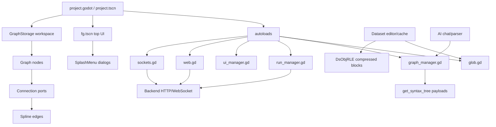
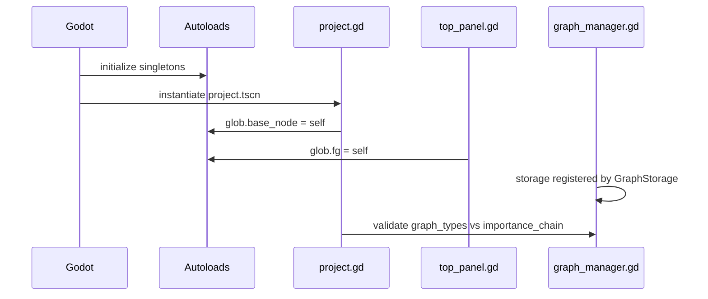
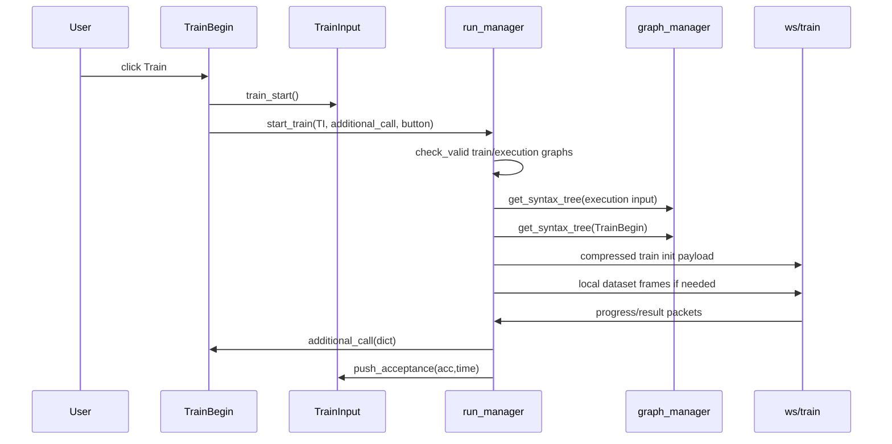
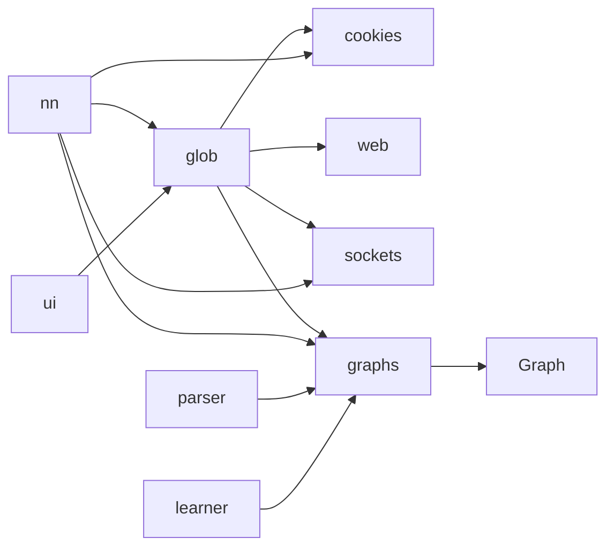
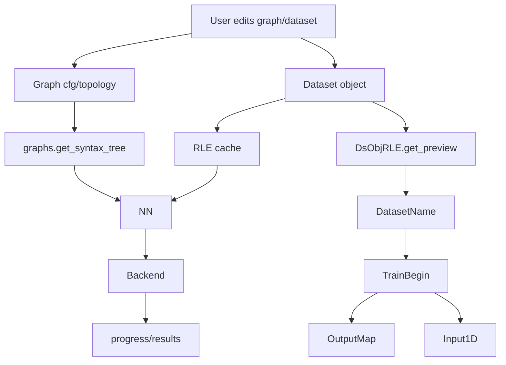
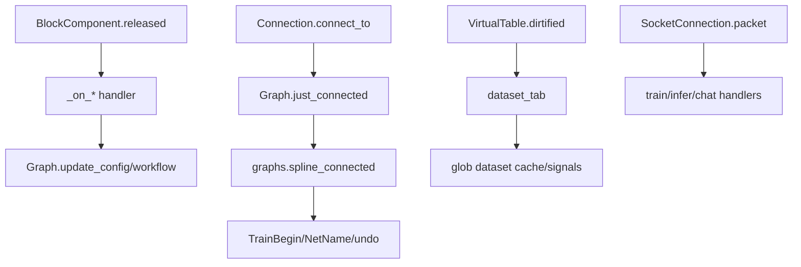

# Neuralese Godot Frontend Documentation

Generated from static repository inspection on 2026-05-25. Scope: first-party Godot scripts/scenes/resources/configuration plus vendor/addon inventory. Backend behavior is documented only where visible from frontend call sites; uncertain server-side details are explicitly marked.

## 1. Executive Summary

Neuralese is a Godot-based visual neural-network frontend. It provides a graph canvas for building model/training/inference pipelines, a typed local dataset editor, project save/load/import/export flows, lesson/AI assistance, and HTTP/WebSocket clients for backend training, inference, export, project persistence, datasets, and chat.

This pass scanned **185** first-party GDScript files, **77** scenes, **39** resource/config files, **91** declared script signals, and **153** editor scene connections.

The highest-leverage files are `project.godot`, `scenes/project.tscn`, `scripts/project.gd`, `scripts/glob.gd`, `scripts/graph_manager.gd`, `scripts/base_graph.gd`, `scripts/connection.gd`, `scripts/block_component.gd`, `scripts/run_manager.gd`, `scripts/train_begin.gd`, `scripts/train_input.gd`, `scripts/dataset_tab.gd`, `scripts/virtualt.gd`, `scripts/ds_obj_serialize.gd`, and `scripts/graph_script_parser.gd`.

The biggest engineering risks are global mutable state in `glob.gd`, multi-responsibility graph logic in `base_graph.gd`, implicit backend packet contracts in `run_manager.gd`, dynamic signal chains through `BlockComponent`, and dataset compression/upload race conditions around `VirtualTable`, `glob`, and `DsObjRLE`.

## 2. Architecture Overview

Runtime layers:
- Godot starts `scenes/project.tscn` from `project.godot` and initializes autoload singletons.
- `project.tscn` hosts top UI (`fg.tscn`), graph workspace (`WIN_GRAPH/GraphStorage`), menus, camera, background, and loading overlays.
- `graphs` creates graph-node scenes from type keys and owns active graph/id/connection maps.
- `Graph`, `Connection`, and `Spline` implement node, port, and edge behavior.
- `BlockComponent` and `SplashMenu` implement the custom UI interaction framework.
- `glob` owns app/project/dataset/AI/login state and is the central service locator.
- `nn`, `web`, `sockets`, and `socket_connection` implement the backend boundary.
- Dataset editing flows through `dataset_tab`, `VirtualTable`, `DsObjRLE`, `dataset_helpers`, and `cli`.
- AI and guided lessons flow through `ai_help`, `glob.update_message_stream`, `graph_script_parser`, `learner`, `lesson_code`, DSL, and Lua scripts.



## 3. Repository Map

- `project.godot`: application settings, main scene, autoloads, input actions, rendering/audio config.
- `scenes/`: main scene, graph node scenes, dialogs/splashes, dataset/editor windows, reusable UI scenes, particles/loading effects, legacy/experimental scenes.
- `scripts/`: first-party GDScript, including autoloads, graph framework, node implementations, UI framework, dataset editor, backend clients, lessons, DSL, Lua, and utilities.
- `resources/`: shader materials, themes, syntax highlighters, button configs, graph/port UI materials.
- `addons/yaml/`: third-party YAML plugin used by YAML helper paths.
- `.godot/`: generated editor/import/export cache; inventoried but not treated as source architecture.
- `export_presets.cfg`: Android export preset.

## 4. Godot Configuration

Application settings:
- `config/name="nnets"`
- `run/main_scene="uid://dbgi78pifb8xh"`
- `config/features=PackedStringArray("4.6", "Forward Plus")`
- `boot_splash/show_image=false`
- `config/icon="res://game_assets/icons/icon.svg"`

Autoloads in initialization order:
- `cookies="*res://scripts/cookie_manager.gd"`
- `ui="*res://scripts/ui_manager.gd"`
- `glob="*res://scripts/glob.gd"`
- `graphs="*res://scripts/graph_manager.gd"`
- `web="*res://scripts/web.gd"`
- `sockets="*res://scripts/sockets.gd"`
- `nn="*res://scripts/run_manager.gd"`
- `luas="*res://scripts/lua_envs.gd"`
- `parser="*res://scripts/graph_script_parser.gd"`
- `dsl_reg="*res://scripts/dsl_registry.gd"`
- `dsreader="*res://scripts/dataset_helpers.gd"`
- `learner="*res://scripts/learner.gd"`

Input actions:
- `ui_mouse={`
- `ui_mouse_alt={`
- `right={`
- `left={`
- `up={`
- `down={`
- `scroll_up={`
- `scroll_down={`
- `ui_mouse_middle={`
- `ui_x={`
- `ui_esc={`
- `ui_enter={`
- `ui_shift_enter={`
- `shift={`
- `ctrl_z={`
- `ctrl_y={`
- `ui_shift={`
- `f2={`
- `ctrl_s={`

Important notes: `run/main_scene` resolves to `scenes/project.tscn`; `config/features` includes `4.6`; audio input is enabled at 16000 Hz for transcription; rendering uses mobile renderer settings and transparent clear color.

## 5. Autoloads / Singletons

### `glob` -> `scripts/glob.gd`
Owns project/session/login/dataset/AI/undo/window/localization state. Public workflow groups include project `open_last_project`, `request_projects`, `load_scene`, `save`, `save_empty`, project import/export; dataset `load_datasets`, `save_datasets`, `cache_rle_compress`, `join_ds_processing`, `create_dataset`, `dirtify_dataset`, `change_local_ds`, `invalidate_local_ds`; backend roots `get_root_ws`, `get_root_http`; auth `try_auto_login`, `login_req`, `splash_login`; AI `update_message_stream`, `message_chunk_received`, `sock_end_life`.

### `graphs` -> `scripts/graph_manager.gd`
Owns graph type registration, active graph registry, graph ids, connection ids, graph load/save, reachability, shape propagation, connection hover arbitration, and `get_syntax_tree` backend serialization.

Registered graph type map:


Signals: `model_updated(who)`, `spline_connected(from_conn,to_conn)`, `spline_disconnected(from_conn,to_conn)`, `node_added(who)`.

### Other singletons
- `cookies`: storage/auth header manager used by login, project, HTTP, and WebSocket calls.
- `ui`: splash/dialog/effects/focus manager.
- `web`: HTTP/SSE client with RequestHandle signals.
- `sockets`: WebSocket connection registry/poller.
- `nn`: training/inference/export bridge.
- `luas`: Lua environment registry.
- `parser`: AI graph action parser.
- `dsl_reg`: DSL registry.
- `dsreader`: CSV/dataset helper.
- `learner`: lesson/tutorial runtime.

## 6. Scene-by-Scene Documentation

`scenes/project.tscn` is the main scene. It contains `fg`, `WIN_GRAPH`, `GraphStorage`, menus, camera, follow menus, background, and AI loader. `scripts/project.gd._enter_tree` sets `glob.base_node`; `_ready` validates that all `graphs.graph_types` keys have an entry in the `importance_chain` used by graph load ordering.

Graph node scenes define `server_typename`, `base_config`, `Connection` children, accepted datatypes, UI controls, and attached scripts. Script subclasses implement backend properties, validation, shape propagation, and runtime behavior.

### `scenes/activation_node.tscn`
- Purpose: Activation selector graph/menu component.
- UID: `uid://ca6p5f7voeq2`
- Root: `[node name="Base" instance=ExtResource("1_0jgoj")]`
- Node count: 11
- Attached/extern scripts: `res://scripts/button_config.gd`, `res://scripts/loc.gd`
- Key properties:
  - L22: `server_typename = &"ActivationNode"`
  - L31: `_accepted_datatypes = "layer"`
  - L34: `connection_type = 0`
  - L49: `_accepted_datatypes = "layer"`
  - L52: `connection_type = 1`

### `scenes/ai_help.tscn`
- Purpose: AI assistant/chat splash.
- UID: `uid://f081neg4h7dv`
- Root: `[node name="Node2D" type="Control" node_paths=PackedStringArray("_user_message", "_ai_message", "first_line")]`
- Node count: 23
- Attached/extern scripts: `res://scripts/ai_help.gd`, `res://scripts/ai_text.gd`, `res://scripts/button_config.gd`, `res://scripts/end.gd`, `res://scripts/loc.gd`, `res://scripts/text.gd`
- Key properties:
  - L273: `hint = &"Add"`
  - L310: `hint = &"login"`
- Editor signal connections:
  - `[connection signal="text_accept" from="ColorRect/Label2" to="." method="on_send"]`
  - `[connection signal="text_changed" from="ColorRect/Label2" to="." method="_on_label_2_text_changed"]`
  - `[connection signal="text_changed" from="ColorRect/Label2" to="ColorRect/Label2" method="_on_text_changed"]`
  - `[connection signal="hovering" from="ColorRect/Label2/train" to="." method="_on_train_hovering"]`
  - `[connection signal="released" from="ColorRect/train" to="." method="_on_cl_released"]`

### `scenes/aiload.tscn`
- Purpose: AI/loading overlay.
- UID: `uid://dnhvvwjmwgaag`
- Root: `[node name="Aiload" type="Control"]`
- Node count: 2
- Attached/extern scripts: `res://scripts/ccc.gd`

### `scenes/augment_transform.tscn`
- Purpose: Scene scanned. Purpose is inferred from attached scripts, root node, and key properties; likely reusable UI, dialog variant, visual effect, legacy scene, or specialized utility scene.
- UID: `uid://w43j2o5b6yn5`
- Root: `[node name="Base" type="Control" node_paths=PackedStringArray("OO", "II", "IO", "OI")]`
- Node count: 13
- Attached/extern scripts: `res://scripts/augment_transform.gd`, `res://scripts/image_draw.gd`
- Key properties:
  - L46: `server_typename = &"AugmentTF"`
  - L56: `_accepted_datatypes = "input2d"`
  - L58: `connection_type = 0`
  - L75: `_accepted_datatypes = "input2d"`
  - L77: `connection_type = 1`

### `scenes/augment_tune.tscn`
- Purpose: Scene scanned. Purpose is inferred from attached scripts, root node, and key properties; likely reusable UI, dialog variant, visual effect, legacy scene, or specialized utility scene.
- UID: `uid://cp0sggav0hojo`
- Root: `[node name="Base" type="Control"]`
- Node count: 18
- Attached/extern scripts: `res://scripts/image_draw.gd`, `res://scripts/image_tune.gd`
- Key properties:
  - L33: `server_typename = &"AugmentTune"`
  - L43: `_accepted_datatypes = "input2d"`
  - L45: `connection_type = 0`
  - L62: `_accepted_datatypes = "input2d"`
  - L64: `connection_type = 1`
- Editor signal connections:
  - `[connection signal="value_changed" from="Label4/HSlider" to="." method="thre_changed"]`
  - `[connection signal="value_changed" from="Label5/HSlider" to="." method="lumi_changed"]`
  - `[connection signal="value_changed" from="Label6/HSlider" to="." method="cont_changed"]`

### `scenes/backupps.tscn`
- Purpose: Scene scanned. Purpose is inferred from attached scripts, root node, and key properties; likely reusable UI, dialog variant, visual effect, legacy scene, or specialized utility scene.
- UID: `uid://e571jfr6y62u`
- Root: `[node name="Node2D" type="Node2D"]`
- Node count: 2
- Attached/extern scripts: none parsed
- Key properties:
  - L14: `_accepted_datatypes = "netname"`
  - L15: `hint = 1`
  - L17: `connection_type = 0`

### `scenes/backups.tscn`
- Purpose: Scene scanned. Purpose is inferred from attached scripts, root node, and key properties; likely reusable UI, dialog variant, visual effect, legacy scene, or specialized utility scene.
- UID: `uid://cmxye5g434f4r`
- Root: `[node name="Control" type="Control"]`
- Node count: 8
- Attached/extern scripts: `res://scripts/button_config.gd`
- Key properties:
  - L68: `hint = &"1"`
  - L90: `hint = &"2"`
  - L134: `hint = &"1"`
  - L156: `hint = &"3"`
  - L178: `hint = &"5"`

### `scenes/base_graph.tscn`
- Purpose: Base graph node visual template.
- UID: `uid://dvy7srp0sk1qm`
- Root: `[node name="Base" type="Control"]`
- Node count: 4
- Attached/extern scripts: `res://scripts/base_graph.gd`

### `scenes/BaseBComponent.tscn`
- Purpose: Reusable BlockComponent button/menu template.
- UID: `uid://wd63efdi6bdn`
- Root: `[node name="ColorRect" type="ColorRect"]`
- Node count: 2
- Attached/extern scripts: `res://scripts/block_component.gd`

### `scenes/bg.tscn`
- Purpose: Workspace background layer.
- UID: `uid://by1briddb0hwg`
- Root: `[node name="Node" type="CanvasLayer" unique_id=1626059463]`
- Node count: 7
- Attached/extern scripts: `res://scripts/bg.gd`, `res://scripts/color_rect.gd`, `res://scripts/sub_viewport.gd`, `res://scripts/texture_rect.gd`

### `scenes/blur.tscn`
- Purpose: Scene scanned. Purpose is inferred from attached scripts, root node, and key properties; likely reusable UI, dialog variant, visual effect, legacy scene, or specialized utility scene.
- UID: `uid://d4e4ytk46aneb`
- Root: `[node name="bg" type="ColorRect"]`
- Node count: 1
- Attached/extern scripts: `res://scripts/blur.gd`

### `scenes/branch_mapping.tscn`
- Purpose: OutputMap branch/loss mapping graph node.
- UID: `uid://tl4ael3dfb7d`
- Root: `[node name="Base" type="Control" node_paths=PackedStringArray("unit")]`
- Node count: 17
- Attached/extern scripts: `res://scripts/branches.gd`, `res://scripts/button_config.gd`, `res://scripts/conn.gd`, `res://scripts/label_auto_resize.gd`, `res://scripts/loc.gd`
- Key properties:
  - L40: `server_typename = &"OutputMap"`
  - L50: `_accepted_datatypes = "model_output"`
  - L52: `connection_type = 0`
  - L67: `_accepted_datatypes = "output_mapped"`
  - L69: `connection_type = 1`
  - L228: `hint = &"mse"`
  - L251: `hint = &"cross_entropy"`
  - L268: `_accepted_datatypes = "pellet"`
  - L269: `hint = 4`
  - L271: `connection_type = 0`

### `scenes/cbox.tscn`
- Purpose: Scene scanned. Purpose is inferred from attached scripts, root node, and key properties; likely reusable UI, dialog variant, visual effect, legacy scene, or specialized utility scene.
- UID: `uid://ygrfr7ybq2ix`
- Root: `[node name="Cbox" type="CheckBox"]`
- Node count: 1
- Attached/extern scripts: none parsed

### `scenes/cell.tscn`
- Purpose: Scene scanned. Purpose is inferred from attached scripts, root node, and key properties; likely reusable UI, dialog variant, visual effect, legacy scene, or specialized utility scene.
- UID: `uid://bgkssjbgc6d7b`
- Root: `[node name="Node2D" type="Control"]`
- Node count: 2
- Attached/extern scripts: `res://scripts/text_cell.gd`, `res://scripts/validate_line.gd`
- Editor signal connections:
  - `[connection signal="changed" from="Label" to="." method="_on_label_changed"]`
  - `[connection signal="line_enter" from="Label" to="." method="_on_label_line_enter"]`

### `scenes/circle.tscn`
- Purpose: Scene scanned. Purpose is inferred from attached scripts, root node, and key properties; likely reusable UI, dialog variant, visual effect, legacy scene, or specialized utility scene.
- UID: `uid://db45gd3qrpsew`
- Root: `[node name="Circle" type="ColorRect"]`
- Node count: 1
- Attached/extern scripts: none parsed

### `scenes/classes.tscn`
- Purpose: Scene scanned. Purpose is inferred from attached scripts, root node, and key properties; likely reusable UI, dialog variant, visual effect, legacy scene, or specialized utility scene.
- UID: `uid://lqwdppwgyrum`
- Root: `[node name="Node2D" type="Control"]`
- Node count: 2
- Attached/extern scripts: `res://scripts/num.gd`, `res://scripts/validate_number.gd`
- Editor signal connections:
  - `[connection signal="changed" from="Label" to="." method="_on_label_changed"]`
  - `[connection signal="line_enter" from="Label" to="." method="_on_label_line_enter"]`

### `scenes/classifier_graph.tscn`
- Purpose: Classifier/output graph node.
- UID: `uid://de6mgawywaidj`
- Root: `[node name="Base" type="Control" node_paths=PackedStringArray("unit", "add_button", "input", "line_edit")]`
- Node count: 17
- Attached/extern scripts: `res://scripts/button_config.gd`, `res://scripts/classifier.gd`, `res://scripts/loc.gd`, `res://scripts/unit.gd`, `res://scripts/validate_line.gd`
- Key properties:
  - L76: `server_typename = &"ClassifierNode"`
  - L80: `base_config = Dictionary[StringName, Variant]({`
  - L267: `_accepted_datatypes = "layer1d"`
  - L268: `hint = 1`
  - L270: `connection_type = 0`
- Editor signal connections:
  - `[connection signal="changed" from="ColorRect/root/Label" to="." method="_on_label_changed"]`
  - `[connection signal="pressed" from="input/ColorRect2" to="." method="_on_color_rect_2_pressed"]`

### `scenes/classroom_create.tscn`
- Purpose: Classroom creation dialog.
- UID: `uid://ynnt38bpbktg`
- Root: `[node name="Node2D" type="Control" node_paths=PackedStringArray("accept", "first_line")]`
- Node count: 10
- Attached/extern scripts: `res://scripts/button_config.gd`, `res://scripts/classroom_create.gd`, `res://scripts/end.gd`, `res://scripts/loc.gd`, `res://scripts/validate_line.gd`
- Key properties:
  - L126: `hint = &"Add"`
- Editor signal connections:
  - `[connection signal="released" from="ColorRect/train" to="." method="_on_trainn_released"]`

### `scenes/confetti.tscn`
- Purpose: Confetti particle effect.
- UID: `uid://cgee2ltadrvxi`
- Root: `[node name="GPUParticles2D" type="GPUParticles2D"]`
- Node count: 2
- Attached/extern scripts: `res://scenes/campit.gd`, `res://scripts/meow.gd`

### `scenes/Connection.tscn`
- Purpose: Reusable graph port scene.
- UID: `uid://cyyhr5tmi4ljw`
- Root: `[node name="ColorRect" type="ColorRect" unique_id=1178528860]`
- Node count: 3
- Attached/extern scripts: `res://scripts/connection.gd`

### `scenes/conv2d.tscn`
- Purpose: Conv2D graph node.
- UID: `uid://70bqejl8x5np`
- Root: `[node name="Base" type="Control" node_paths=PackedStringArray("unit")]`
- Node count: 23
- Attached/extern scripts: `res://scripts/conv_2d.gd`, `res://scripts/loc.gd`, `res://scripts/validate_number.gd`
- Key properties:
  - L35: `server_typename = &"NeuronLayer"`
  - L37: `base_config = Dictionary[StringName, Variant]({`
  - L52: `_accepted_datatypes = "activation"`
  - L54: `connection_type = 0`
  - L71: `_accepted_datatypes = "input2d layer2d"`
  - L72: `hint = 1`
  - L74: `connection_type = 0`
  - L91: `_accepted_datatypes = "layer2d"`
  - L93: `connection_type = 1`
- Editor signal connections:
  - `[connection signal="value_changed" from="Label/HSlider" to="." method="_on_h_slider_value_changed"]`
  - `[connection signal="value_changed" from="Label2/HSlider2" to="." method="_on_h_slider_2_value_changed"]`
  - `[connection signal="submitted" from="Y" to="." method="_on_yf_submitted"]`

### `scenes/dataset.tscn`
- Purpose: DatasetName graph node.
- UID: `uid://dkx7jmpcdb0sw`
- Root: `[node name="Base" type="Control"]`
- Node count: 8
- Attached/extern scripts: `res://scripts/button_config.gd`, `res://scripts/dataset_node.gd`, `res://scripts/label_auto_resize.gd`, `res://scripts/loc.gd`
- Key properties:
  - L32: `server_typename = &"DatasetName"`
  - L34: `base_config = Dictionary[StringName, Variant]({`
  - L47: `_accepted_datatypes = "dataset_type"`
  - L49: `connection_type = 1`
- Editor signal connections:
  - `[connection signal="released" from="run" to="." method="_on_run_released"]`

### `scenes/dataset_create.tscn`
- Purpose: Dataset create/import splash.
- UID: `uid://oaujm3r8gbfd`
- Root: `[node name="Node2D" type="Control" node_paths=PackedStringArray("accept", "first_line")]`
- Node count: 13
- Attached/extern scripts: `res://scripts/button_config.gd`, `res://scripts/dataset_create.gd`, `res://scripts/end.gd`, `res://scripts/label_auto_resize.gd`, `res://scripts/loc.gd`, `res://scripts/validate_line.gd`
- Key properties:
  - L145: `hint = &"Add"`
  - L191: `hint = &"Add"`
- Editor signal connections:
  - `[connection signal="released" from="ColorRect/train" to="." method="_on_trainn_released"]`
  - `[connection signal="released" from="ColorRect/train2" to="." method="_on_load_released"]`

### `scenes/dataset_tab.tscn`
- Purpose: Local dataset editor tab/window.
- UID: `uid://cuuew2v4inm7k`
- Root: `[node name="Control" type="Node2D" node_paths=PackedStringArray("line_edit", "console", "camera")]`
- Node count: 47
- Attached/extern scripts: `res://scripts/button_config.gd`, `res://scripts/cli.gd`, `res://scripts/cmdparse.gd`, `res://scripts/console.gd`, `res://scripts/dataset_tab.gd`, `res://scripts/edit_graph.gd`, `res://scripts/label_auto_resize.gd`, `res://scripts/loader.gd`, `res://scripts/loc.gd`, `res://scripts/loc3.gd`, `res://scripts/procedural_nodes22.gd`, `res://scripts/sakuta.gd`, `res://scripts/unr.gd`, `res://scripts/value.gd`, `res://scripts/virtualt.gd`
- Key properties:
  - L142: `window_name = "ds"`
  - L571: `hint = &"login"`
  - L620: `hint = &"layer"`
  - L734: `hint = &"delete"`
  - L762: `hint = &"insert"`
- Editor signal connections:
  - `[connection signal="child_button_release" from="Control/scenes/list" to="." method="_on_list_child_button_release"]`
  - `[connection signal="released" from="Control/scenes/plus" to="." method="_on_plus_released"]`
  - `[connection signal="item_rect_changed" from="Control/view/Control" to="." method="_on_control_item_rect_changed"]`
  - `[connection signal="deleted" from="Control/CodeEdit" to="." method="_on_code_edit_deleted"]`
  - `[connection signal="dirtified" from="Control/CodeEdit" to="." method="_on_code_edit_dirtified"]`
  - `[connection signal="preview_refreshed" from="Control/CodeEdit" to="." method="_on_code_edit_preview_refreshed"]`
  - `[connection signal="released" from="Control/console/train2" to="." method="_on_train_2_released"]`
  - `[connection signal="released" from="Control/console/9" to="." method="_on__released"]`

### `scenes/default_spline.tscn`
- Purpose: Reusable graph edge/spline scene.
- UID: `uid://c273ln1w241b0`
- Root: `[node name="spline" type="Node2D" unique_id=288424739 node_paths=PackedStringArray("line_2d")]`
- Node count: 3
- Attached/extern scripts: `res://scripts/spline.gd`

### `scenes/dropout.tscn`
- Purpose: Dropout graph node.
- UID: `uid://6tgq6ifq5dbw`
- Root: `[node name="Base" type="Control"]`
- Node count: 12
- Attached/extern scripts: `res://scripts/dropout.gd`, `res://scripts/img_pusher.gd`, `res://scripts/loc.gd`
- Key properties:
  - L35: `server_typename = &"NeuronLayer"`
  - L37: `base_config = Dictionary[StringName, Variant]({`
  - L48: `_accepted_datatypes = "layer1d"`
  - L50: `connection_type = 0`
  - L67: `_accepted_datatypes = "layer1d"`
  - L69: `connection_type = 1`
- Editor signal connections:
  - `[connection signal="value_changed" from="ColorRect/root/Label4/HSlider" to="." method="_on_h_slider_value_changed"]`

### `scenes/env_tab.tscn`
- Purpose: Lua/environment editor tab.
- UID: `uid://cn053wastjqhs`
- Root: `[node name="Control" type="Node2D" node_paths=PackedStringArray("camera")]`
- Node count: 27
- Attached/extern scripts: `res://scenes/other_procnodes.gd`, `res://scripts/button_config.gd`, `res://scripts/code_edit.gd`, `res://scripts/console.gd`, `res://scripts/env_tab.gd`, `res://scripts/label_auto_resize.gd`, `res://scripts/loc.gd`, `res://scripts/loc3.gd`, `res://scripts/lua_highliter.gd`, `res://scripts/unr.gd`
- Key properties:
  - L167: `window_name = "env"`
  - L258: `hint = &"login"`
  - L393: `hint = &"layer"`
- Editor signal connections:
  - `[connection signal="text_changed" from="Control/CodeEdit" to="." method="_on_code_edit_text_changed"]`
  - `[connection signal="draw" from="Control/console" to="." method="_on_console_draw"]`
  - `[connection signal="released" from="Control/console/train2" to="." method="_on_train_2_released"]`
  - `[connection signal="child_button_release" from="Control/scenes/list" to="." method="_on_list_child_button_release"]`
  - `[connection signal="scroll_changed" from="Control/scenes/list" to="." method="_on_list_scroll_changed"]`
  - `[connection signal="released" from="Control/scenes/9" to="." method="_on__released"]`
  - `[connection signal="released" from="Control/scenes/plus" to="." method="_on_plus_released"]`
  - `[connection signal="released" from="Control/view/run" to="." method="_on_run_released"]`

### `scenes/env_tag.tscn`
- Purpose: Scene scanned. Purpose is inferred from attached scripts, root node, and key properties; likely reusable UI, dialog variant, visual effect, legacy scene, or specialized utility scene.
- UID: `uid://d3wqi2b2fibp6`
- Root: `[node name="Base" type="Control"]`
- Node count: 7
- Attached/extern scripts: `res://scripts/button_config.gd`, `res://scripts/env_tag.gd`, `res://scripts/label_auto_resize.gd`
- Key properties:
  - L31: `server_typename = &"LuaEnv"`
  - L33: `base_config = Dictionary[StringName, Variant]({`
  - L46: `_accepted_datatypes = "dataset_type"`
  - L48: `connection_type = 1`
- Editor signal connections:
  - `[connection signal="released" from="run" to="." method="_on_run_released"]`

### `scenes/fg.tscn`
- Purpose: Foreground/top navigation panel.
- UID: `uid://tjiw5jmnnrgh`
- Root: `[node name="fg" type="CanvasLayer"]`
- Node count: 46
- Attached/extern scripts: `res://scripts/button_config.gd`, `res://scripts/graphic.gd`, `res://scripts/lesson_header.gd`, `res://scripts/loc.gd`, `res://scripts/loc2.gd`, `res://scripts/lua_procedure.gd`, `res://scripts/mist.gd`, `res://scripts/scalefg.gd`, `res://scripts/selector_box.gd`, `res://scripts/submenu_neuron.gd`, `res://scripts/top_panel.gd`, `res://scripts/validate_line.gd`
- Key properties:
  - L322: `hint = &"layer"`
  - L350: `hint = &"layer"`
  - L388: `hint = &"ai_help"`
  - L477: `hint = &"login"`
  - L522: `hint = &"login"`
  - L568: `hint = &"login"`
  - L632: `hint = &"layer"`
- Editor signal connections:
  - `[connection signal="released" from="ColorRect/Control/login" to="ColorRect" method="_on_login_released"]`
  - `[connection signal="released" from="ColorRect/Control/export" to="ColorRect" method="_on_export_released"]`
  - `[connection signal="released" from="ColorRect/Control/ai" to="ColorRect" method="_on_ai_released"]`
  - `[connection signal="released" from="ColorRect/Control3/graphs" to="ColorRect" method="_on_graphs_released"]`
  - `[connection signal="released" from="ColorRect/Control3/datasets" to="ColorRect" method="_on_datasets_released"]`
  - `[connection signal="released" from="ColorRect/Control3/minigames" to="ColorRect" method="_on_minigames_released"]`
  - `[connection signal="released" from="ColorRect/works" to="ColorRect" method="_on_workslist"]`

### `scenes/flatten.tscn`
- Purpose: Flatten graph node.
- UID: `uid://bdifkrhjy3tt3`
- Root: `[node name="Base" type="Control"]`
- Node count: 8
- Attached/extern scripts: `res://scripts/flatten.gd`, `res://scripts/loc.gd`
- Key properties:
  - L15: `server_typename = &"Flatten"`
  - L25: `_accepted_datatypes = "layer2d input2d"`
  - L27: `connection_type = 0`
  - L44: `_accepted_datatypes = "layer1d"`
  - L46: `connection_type = 1`

### `scenes/float.tscn`
- Purpose: Scene scanned. Purpose is inferred from attached scripts, root node, and key properties; likely reusable UI, dialog variant, visual effect, legacy scene, or specialized utility scene.
- UID: `uid://dwt5bitp0h1cn`
- Root: `[node name="Node2D" type="Control"]`
- Node count: 3
- Attached/extern scripts: `res://scripts/floatcell.gd`, `res://scripts/h_slider.gd`, `res://scripts/validate_number.gd`
- Editor signal connections:
  - `[connection signal="value_changed" from="HSlider" to="." method="_on_h_slider_value_changed"]`
  - `[connection signal="changed" from="Label" to="." method="_on_label_changed"]`

### `scenes/graph_shadow.tscn`
- Purpose: Scene scanned. Purpose is inferred from attached scripts, root node, and key properties; likely reusable UI, dialog variant, visual effect, legacy scene, or specialized utility scene.
- UID: `uid://dach6yrsxigha`
- Root: `[node name="GraphShadow" type="ColorRect"]`
- Node count: 1
- Attached/extern scripts: `res://scripts/graph_shadow.gd`

### `scenes/hint.tscn`
- Purpose: Scene scanned. Purpose is inferred from attached scripts, root node, and key properties; likely reusable UI, dialog variant, visual effect, legacy scene, or specialized utility scene.
- UID: `uid://7tvsn43p5su`
- Root: `[node name="Control2" type="Control" node_paths=PackedStringArray("scroll_cont")]`
- Node count: 18
- Attached/extern scripts: `res://scripts/button_config.gd`, `res://scripts/container.gd`, `res://scripts/layout.gd`, `res://scripts/loc.gd`, `res://scripts/qhint.gd`
- Editor signal connections:
  - `[connection signal="item_rect_changed" from="." to="." method="_on_item_rect_changed"]`
  - `[connection signal="child_entered_tree" from="ColorRect/ScrollContainer/c/text" to="ColorRect/ScrollContainer/c/text" method="_on_child_entered_tree"]`
  - `[connection signal="child_entered_tree" from="ColorRect/ScrollContainer/c/checkbox" to="ColorRect/ScrollContainer/c/checkbox" method="_on_child_entered_tree"]`
  - `[connection signal="child_entered_tree" from="ColorRect/ScrollContainer/c/next" to="ColorRect/ScrollContainer/c/next" method="_on_child_entered_tree"]`
  - `[connection signal="child_entered_tree" from="ColorRect/ScrollContainer/c/radio" to="ColorRect/ScrollContainer/c/radio" method="_on_child_entered_tree"]`

### `scenes/hourglass.tscn`
- Purpose: Scene scanned. Purpose is inferred from attached scripts, root node, and key properties; likely reusable UI, dialog variant, visual effect, legacy scene, or specialized utility scene.
- UID: `uid://c302ey6c8nfi7`
- Root: `[node name="Node2D" type="TextureRect"]`
- Node count: 1
- Attached/extern scripts: `res://scripts/hourglass.gd`

### `scenes/img.tscn`
- Purpose: Scene scanned. Purpose is inferred from attached scripts, root node, and key properties; likely reusable UI, dialog variant, visual effect, legacy scene, or specialized utility scene.
- UID: `uid://cgnnkam6b06f3`
- Root: `[node name="Node2D" type="Control"]`
- Node count: 4
- Attached/extern scripts: `res://scripts/button_config.gd`, `res://scripts/img.gd`, `res://scripts/label_auto_resize.gd`
- Key properties:
  - L78: `hint = &"login"`
- Editor signal connections:
  - `[connection signal="released" from="Label/train2" to="." method="_on_train_2_released"]`

### `scenes/input_1d.tscn`
- Purpose: 1D/tabular input graph node.
- UID: `uid://coifi5ok0t7lo`
- Root: `[node name="Base" type="Control" node_paths=PackedStringArray("unit", "add_button", "input", "line_edit")]`
- Node count: 34
- Attached/extern scripts: `res://scripts/button_config.gd`, `res://scripts/conn_slider.gd`, `res://scripts/input_1d.gd`, `res://scripts/label_auto_resize.gd`, `res://scripts/loc.gd`, `res://scripts/loc2a.gd`, `res://scripts/validate_number.gd`
- Key properties:
  - L157: `server_typename = &"InputNode"`
  - L160: `base_config = Dictionary[StringName, Variant]({`
  - L173: `_accepted_datatypes = "netname"`
  - L174: `hint = 1`
  - L176: `connection_type = 0`
  - L196: `_accepted_datatypes = "input1d"`
  - L198: `connection_type = 1`
  - L488: `hint = &"float"`
  - L512: `hint = &"sfloat"`
  - L536: `hint = &"int"`
  - L560: `hint = &"class"`
  - L584: `hint = &"bool"`
- Editor signal connections:
  - `[connection signal="pressed" from="input/ColorRect2" to="." method="_on_color_rect_2_pressed"]`
  - `[connection signal="child_button_release" from="input/type" to="." method="_on_type_child_button_release"]`
  - `[connection signal="released" from="run" to="." method="_on_run_released"]`

### `scenes/input_graph.tscn`
- Purpose: 2D drawing input graph node.
- UID: `uid://e3l6g3u21slb`
- Root: `[node name="Base" instance=ExtResource("1_6ucvy")]`
- Node count: 9
- Attached/extern scripts: `res://scripts/button_config.gd`, `res://scripts/image_draw.gd`, `res://scripts/input_graph.gd`, `res://scripts/loc.gd`, `res://scripts/loc2a.gd`
- Key properties:
  - L46: `server_typename = &"InputNode"`
  - L58: `_accepted_datatypes = "netname"`
  - L59: `hint = 1`
  - L61: `connection_type = 0`
  - L79: `_accepted_datatypes = "input2d"`
  - L81: `connection_type = 1`
- Editor signal connections:
  - `[connection signal="released" from="run" to="." method="_on_run_released"]`

### `scenes/io_graph.tscn`
- Purpose: Scene scanned. Purpose is inferred from attached scripts, root node, and key properties; likely reusable UI, dialog variant, visual effect, legacy scene, or specialized utility scene.
- UID: `uid://ddl50qlfjt4st`
- Root: `[node name="Base" node_paths=PackedStringArray("unit", "add_button", "input", "line_edit") instance=ExtResource("1_2pdka")]`
- Node count: 11
- Attached/extern scripts: `res://scripts/button_config.gd`, `res://scripts/io_graph.gd`, `res://scripts/unit.gd`
- Key properties:
  - L89: `connection_type = 1`
  - L150: `connection_type = 0`
- Editor signal connections:
  - `[connection signal="pressed" from="input/ColorRect2" to="." method="_on_color_rect_2_pressed"]`

### `scenes/lanpop.tscn`
- Purpose: Scene scanned. Purpose is inferred from attached scripts, root node, and key properties; likely reusable UI, dialog variant, visual effect, legacy scene, or specialized utility scene.
- UID: `uid://ph6fhu5csdwt`
- Root: `[node name="Lanpop" type="Control"]`
- Node count: 3
- Attached/extern scripts: `res://scripts/lanpop.gd`
- Editor signal connections:
  - `[connection signal="pressed" from="Button" to="." method="_on_button_pressed"]`

### `scenes/layer.tscn`
- Purpose: Dense layer graph node.
- UID: `uid://dk05hn4etkckc`
- Root: `[node name="Base" unique_id=2070929760 node_paths=PackedStringArray("unit", "line_edit") instance=ExtResource("1_oobeh")]`
- Node count: 11
- Attached/extern scripts: `res://scripts/loc.gd`, `res://scripts/neuron_layer.gd`, `res://scripts/neuron_unit.gd`, `res://scripts/validate_number.gd`
- Key properties:
  - L31: `server_typename = &"NeuronLayer"`
  - L32: `base_config = Dictionary[StringName, Variant]({`
  - L45: `_accepted_datatypes = "activation"`
  - L47: `connection_type = 0`
  - L64: `_accepted_datatypes = "layer1d input1d"`
  - L65: `hint = 1`
  - L67: `connection_type = 0`
  - L84: `_accepted_datatypes = "layer1d"`
  - L86: `connection_type = 1`
- Editor signal connections:
  - `[connection signal="changed" from="LineEdit" to="." method="_on_line_edit_changed"]`
  - `[connection signal="submitted" from="LineEdit" to="." method="_on_line_edit_submitted_1"]`
  - `[connection signal="text_changed" from="LineEdit" to="." method="_on_line_edit_text_changed"]`

### `scenes/layer_concat.tscn`
- Purpose: Concat graph node.
- UID: `uid://dedy0f202jvre`
- Root: `[node name="Base" type="Control" node_paths=PackedStringArray("unit", "add_button", "input")]`
- Node count: 13
- Attached/extern scripts: `res://scripts/button_config.gd`, `res://scripts/layer_concat.gd`, `res://scripts/loc.gd`, `res://scripts/unit.gd`
- Key properties:
  - L43: `server_typename = &"Concat"`
  - L45: `base_config = Dictionary[StringName, Variant]({`
  - L130: `_accepted_datatypes = "layer1d"`
  - L132: `connection_type = 0`
  - L182: `_accepted_datatypes = "layer1d"`
  - L184: `connection_type = 1`
- Editor signal connections:
  - `[connection signal="pressed" from="input/ColorRect2" to="." method="_on_color_rect_2_pressed"]`

### `scenes/lessonlist.tscn`
- Purpose: Lesson selector splash.
- UID: `uid://dpmuagvcdif1x`
- Root: `[node name="Node2D" type="Control"]`
- Node count: 14
- Attached/extern scripts: `res://scripts/button_config.gd`, `res://scripts/end.gd`, `res://scripts/lessonlist.gd`, `res://scripts/loc.gd`, `res://scripts/works_list.gd`, `res://scripts/works_unroll.gd`
- Key properties:
  - L184: `hint = &"login"`
- Editor signal connections:
  - `[connection signal="child_button_release" from="ColorRect/list" to="." method="_on_list_child_button_release"]`
  - `[connection signal="scroll_changed" from="ColorRect/list" to="." method="_on_list_scroll_changed"]`
  - `[connection signal="released" from="ColorRect/lessons" to="." method="_on_lessons_released"]`

### `scenes/line_drawer.tscn`
- Purpose: Scene scanned. Purpose is inferred from attached scripts, root node, and key properties; likely reusable UI, dialog variant, visual effect, legacy scene, or specialized utility scene.
- UID: `uid://cf4dd5tkhp4td`
- Root: `[node name="LineDrawer" type="Node2D" node_paths=PackedStringArray("lines")]`
- Node count: 2
- Attached/extern scripts: `res://scripts/linebatch.gd`, `res://scripts/linetest.gd`

### `scenes/loop.tscn`
- Purpose: Scene scanned. Purpose is inferred from attached scripts, root node, and key properties; likely reusable UI, dialog variant, visual effect, legacy scene, or specialized utility scene.
- UID: `uid://c21qi0hgkbyds`
- Root: `[node name="Base" instance=ExtResource("1_gg3sf")]`
- Node count: 5
- Attached/extern scripts: `res://scripts/loop.gd`
- Key properties:
  - L26: `connection_type = 0`
  - L36: `connection_type = 1`

### `scenes/loop1.tscn`
- Purpose: Scene scanned. Purpose is inferred from attached scripts, root node, and key properties; likely reusable UI, dialog variant, visual effect, legacy scene, or specialized utility scene.
- UID: `uid://ch72ow567m3v`
- Root: `[node name="Base" instance=ExtResource("1_0eu46")]`
- Node count: 4
- Attached/extern scripts: `res://scripts/loop_1.gd`
- Key properties:
  - L24: `connection_type = 0`
  - L35: `connection_type = 0`

### `scenes/maxpool.tscn`
- Purpose: MaxPool graph node.
- UID: `uid://ctesghfdkge1l`
- Root: `[node name="Base" type="Control" node_paths=PackedStringArray("unit")]`
- Node count: 13
- Attached/extern scripts: `res://scripts/adraw.gd`, `res://scripts/loc.gd`, `res://scripts/maxpool.gd`, `res://scripts/validate_number.gd`
- Key properties:
  - L37: `server_typename = &"NeuronLayer"`
  - L39: `base_config = Dictionary[StringName, Variant]({`
  - L50: `_accepted_datatypes = "layer2d"`
  - L51: `hint = 1`
  - L53: `connection_type = 0`
  - L70: `_accepted_datatypes = "layer2d"`
  - L72: `connection_type = 1`
- Editor signal connections:
  - `[connection signal="changed" from="YY" to="." method="_on_yy_changed"]`
  - `[connection signal="submitted" from="YY" to="." method="_on_yy_submitted"]`

### `scenes/menus.tscn`
- Purpose: Workspace add/context/detach menu layer.
- UID: `uid://8u7275kgyen4`
- Root: `[node name="menus" type="CanvasLayer"]`
- Node count: 43
- Attached/extern scripts: `res://scripts/button_config.gd`, `res://scripts/cmenu.gd`, `res://scripts/detatch.gd`, `res://scripts/detatch_menu.gd`, `res://scripts/edit_graph.gd`, `res://scripts/loc.gd`, `res://scripts/menus.gd`, `res://scripts/subctx.gd`, `res://scripts/subctx_menu.gd`, `res://scripts/validate_line.gd`
- Key properties:
  - L83: `skip = Array[String](["augment_tf", "train_rl", "lua_env"])`
  - L108: `hint = &"input"`
  - L126: `hint = &"act"`
  - L144: `hint = &"layer"`
  - L162: `hint = &"train_input"`
  - L180: `hint = &"softmax"`
  - L198: `hint = &"reshape2d"`
  - L216: `hint = &"flatten"`
  - L234: `hint = &"conv2d"`
  - L252: `hint = &"maxpool"`
  - L270: `hint = &"classifier"`
  - L288: `hint = &"train_begin"`
  - L306: `hint = &"model_name"`
  - L324: `hint = &"dataset"`
  - L342: `hint = &"run_model"`
  - L360: `hint = &"augment_tf"`
  - L378: `hint = &"output_map"`
  - L396: `hint = &"input1d"`
  - L414: `hint = &"lua_env"`
  - L432: `hint = &"train_rl"`
  - ... 5 more
- Editor signal connections:
  - `[connection signal="changed" from="add_graph/Label2" to="add_graph" method="_on_label_2_changed"]`

### `scenes/model_export.tscn`
- Purpose: Model export splash.
- UID: `uid://d2yowpw486lai`
- Root: `[node name="Node2D" type="Control" unique_id=292327099 node_paths=PackedStringArray("accept", "first_line")]`
- Node count: 27
- Attached/extern scripts: `res://scripts/button_config.gd`, `res://scripts/end.gd`, `res://scripts/loc.gd`, `res://scripts/loc4.gd`, `res://scripts/model_export.gd`, `res://scripts/validate_line.gd`
- Key properties:
  - L142: `hint = &"Add"`
  - L186: `hint = &"windows"`
  - L235: `hint = &"linux"`
  - L263: `hint = &"onnx"`
  - L291: `hint = &"tensorrt"`
  - L324: `hint = &"float16"`
  - L352: `hint = &"int8"`
  - L380: `hint = &"none"`
  - L449: `hint = &"saveall"`
- Editor signal connections:
  - `[connection signal="released" from="ColorRect/train" to="." method="_on_trainn_released"]`
  - `[connection signal="released" from="ColorRect/windows" to="." method="_on_windows_released"]`
  - `[connection signal="released" from="ColorRect/linux" to="." method="_on_linux_released"]`
  - `[connection signal="released" from="ColorRect/onnx" to="." method="_on_onnx_released"]`
  - `[connection signal="released" from="ColorRect/tensor" to="." method="_on_tensor_released"]`
  - `[connection signal="released" from="ColorRect/quant/float16" to="." method="_on_float_16_released"]`
  - `[connection signal="released" from="ColorRect/quant/int8" to="." method="_on_int_8_released"]`
  - `[connection signal="released" from="ColorRect/quant/none" to="." method="_on_none_released"]`
  - `[connection signal="released" from="ColorRect/train2" to="." method="_on_saveall_released"]`

### `scenes/moving_analytics.tscn`
- Purpose: Scene scanned. Purpose is inferred from attached scripts, root node, and key properties; likely reusable UI, dialog variant, visual effect, legacy scene, or specialized utility scene.
- UID: `uid://cy68aiofs1yc3`
- Root: `[node name="ColorRect" type="ColorRect"]`
- Node count: 3
- Attached/extern scripts: `res://scripts/moving_analytics.gd`

### `scenes/netname.tscn`
- Purpose: ModelName graph node.
- UID: `uid://wav7n44fxbkf`
- Root: `[node name="Base" type="Control"]`
- Node count: 8
- Attached/extern scripts: `res://scripts/loc.gd`, `res://scripts/netname.gd`
- Key properties:
  - L16: `server_typename = &"ModelName"`
  - L18: `base_config = Dictionary[StringName, Variant]({`
  - L30: `_accepted_datatypes = "netname"`
  - L32: `connection_type = 1`
- Editor signal connections:
  - `[connection signal="changed" from="LineEdit" to="." method="_on_line_edit_changed"]`

### `scenes/neuron.tscn`
- Purpose: Scene scanned. Purpose is inferred from attached scripts, root node, and key properties; likely reusable UI, dialog variant, visual effect, legacy scene, or specialized utility scene.
- UID: `uid://cbtf5jh2s8v3j`
- Root: `[node name="config" instance=ExtResource("1_mms1l")]`
- Node count: 14
- Attached/extern scripts: `res://scripts/button_config.gd`, `res://scripts/loc.gd`, `res://scripts/neuron_config.gd`, `res://scripts/plot_draw.gd`
- Key properties:
  - L27: `server_typename = &"LayerConfig"`
  - L28: `base_config = Dictionary[StringName, Variant]({`
  - L40: `_accepted_datatypes = "activation"`
  - L42: `connection_type = 1`
  - L119: `hint = &"none"`
  - L150: `hint = &"relu"`
  - L170: `hint = &"sigmoid"`
  - L191: `hint = &"tanh"`
- Editor signal connections:
  - `[connection signal="child_button_release" from="ColorRect2" to="." method="_on_color_rect_2_child_button_release"]`

### `scenes/num.tscn`
- Purpose: Scene scanned. Purpose is inferred from attached scripts, root node, and key properties; likely reusable UI, dialog variant, visual effect, legacy scene, or specialized utility scene.
- UID: `uid://c7jnxwfveckfp`
- Root: `[node name="Node2D" type="Control"]`
- Node count: 2
- Attached/extern scripts: `res://scripts/num.gd`, `res://scripts/validate_number.gd`
- Editor signal connections:
  - `[connection signal="changed" from="Label" to="." method="_on_label_changed"]`
  - `[connection signal="line_enter" from="Label" to="." method="_on_label_line_enter"]`

### `scenes/path_open.tscn`
- Purpose: Filesystem picker dialog.
- UID: `uid://bhuefgcxyu8a0`
- Root: `[node name="Node2D" type="Control"]`
- Node count: 18
- Attached/extern scripts: `res://scenes/other_procnodes.gd`, `res://scripts/button_config.gd`, `res://scripts/end.gd`, `res://scripts/filegrid.gd`, `res://scripts/path_open.gd`, `res://scripts/unr.gd`, `res://scripts/validate_line.gd`
- Key properties:
  - L152: `hint = &"Add"`
  - L182: `hint = &"layer"`
  - L224: `hint = &"layer"`
- Editor signal connections:
  - `[connection signal="line_enter" from="ColorRect/Label" to="." method="_on_label_line_enter"]`
  - `[connection signal="released" from="ColorRect/train" to="." method="_on_trainn_released"]`
  - `[connection signal="released" from="ColorRect/undo" to="." method="_on_undo_released"]`
  - `[connection signal="released" from="ColorRect/refresh" to="." method="_on_refresh_released"]`
  - `[connection signal="child_button_release" from="ColorRect/list" to="." method="_on_list_child_button_release"]`
  - `[connection signal="directory_entered" from="ColorRect/ScrollContainer/GridContainer" to="." method="_on_grid_container_directory_entered"]`
  - `[connection signal="file_hovered" from="ColorRect/ScrollContainer/GridContainer" to="." method="_on_grid_container_file_hovered"]`
  - `[connection signal="file_selected" from="ColorRect/ScrollContainer/GridContainer" to="." method="_on_grid_container_file_selected"]`
  - `[connection signal="refreshed" from="ColorRect/ScrollContainer/GridContainer" to="." method="_on_grid_container_refreshed"]`
  - `[connection signal="line_enter" from="ColorRect/toppath" to="." method="_on_toppath_line_enter"]`
  - `[connection signal="text_submitted" from="ColorRect/toppath" to="." method="_on_toppath_text_submitted"]`

### `scenes/project.tscn`
- Purpose: Main runtime scene: top UI, graph workspace, GraphStorage, menus, camera, background, and AI loader.
- UID: `uid://dbgi78pifb8xh`
- Root: `[node name="base" type="Node2D"]`
- Node count: 10
- Attached/extern scripts: `res://scripts/camera_2d.gd`, `res://scripts/follow_menus.gd`, `res://scripts/gview.gd`, `res://scripts/project.gd`, `res://scripts/storer.gd`, `res://scripts/win_graph.gd`
- Key properties:
  - L22: `window_name = "graph"`

### `scenes/project_create.tscn`
- Purpose: New project dialog.
- UID: `uid://b4eyheq367smq`
- Root: `[node name="Node2D" type="Control" node_paths=PackedStringArray("accept", "first_line")]`
- Node count: 10
- Attached/extern scripts: `res://scripts/button_config.gd`, `res://scripts/end.gd`, `res://scripts/loc.gd`, `res://scripts/project_create.gd`, `res://scripts/validate_line.gd`
- Key properties:
  - L127: `hint = &"Add"`
- Editor signal connections:
  - `[connection signal="released" from="ColorRect/train" to="." method="_on_trainn_released"]`

### `scenes/quest.tscn`
- Purpose: Lesson/question UI.
- UID: `uid://cid477464f0eh`
- Root: `[node name="Control2" type="Control" node_paths=PackedStringArray("scroll_cont")]`
- Node count: 18
- Attached/extern scripts: `res://scripts/button_config.gd`, `res://scripts/container.gd`, `res://scripts/layout.gd`, `res://scripts/loc.gd`, `res://scripts/quest.gd`
- Editor signal connections:
  - `[connection signal="item_rect_changed" from="." to="." method="_on_item_rect_changed"]`
  - `[connection signal="child_entered_tree" from="ColorRect/ScrollContainer/c/text" to="ColorRect/ScrollContainer/c/text" method="_on_child_entered_tree"]`
  - `[connection signal="child_entered_tree" from="ColorRect/ScrollContainer/c/checkbox" to="ColorRect/ScrollContainer/c/checkbox" method="_on_child_entered_tree"]`
  - `[connection signal="child_entered_tree" from="ColorRect/ScrollContainer/c/next" to="ColorRect/ScrollContainer/c/next" method="_on_child_entered_tree"]`
  - `[connection signal="child_entered_tree" from="ColorRect/ScrollContainer/c/radio" to="ColorRect/ScrollContainer/c/radio" method="_on_child_entered_tree"]`

### `scenes/quest_legacy.tscn`
- Purpose: Legacy lesson/question UI.
- UID: `uid://xcoy2jxx2861`
- Root: `[node name="Control2" type="Control" node_paths=PackedStringArray("scroll_cont")]`
- Node count: 18
- Attached/extern scripts: `res://scripts/bubble_unit_legacy.gd`, `res://scripts/button_config.gd`, `res://scripts/c_legacy.gd`, `res://scripts/loc.gd`, `res://scripts/quest_legacy.gd`
- Key properties:
  - L92: `hint = &"ai_help"`
- Editor signal connections:
  - `[connection signal="item_rect_changed" from="." to="." method="_on_item_rect_changed"]`
  - `[connection signal="released" from="ai" to="." method="_on_ai_released"]`
  - `[connection signal="child_entered_tree" from="ColorRect/ScrollContainer/c/radio" to="ColorRect/ScrollContainer/c/radio" method="_on_child_entered_tree"]`
  - `[connection signal="child_entered_tree" from="ColorRect/ScrollContainer/c/text" to="ColorRect/ScrollContainer/c/text" method="_on_child_entered_tree"]`
  - `[connection signal="child_entered_tree" from="ColorRect/ScrollContainer/c/checkbox" to="ColorRect/ScrollContainer/c/checkbox" method="_on_child_entered_tree"]`
  - `[connection signal="child_entered_tree" from="ColorRect/ScrollContainer/c/next" to="ColorRect/ScrollContainer/c/next" method="_on_child_entered_tree"]`

### `scenes/reshape.tscn`
- Purpose: Reshape2D graph node.
- UID: `uid://b743v0abvh8r1`
- Root: `[node name="Base" type="Control"]`
- Node count: 9
- Attached/extern scripts: `res://scripts/loc.gd`, `res://scripts/reshape.gd`, `res://scripts/validate_number.gd`
- Key properties:
  - L17: `server_typename = &"Reshape2D"`
  - L19: `base_config = Dictionary[StringName, Variant]({`
  - L31: `_accepted_datatypes = "layer1d input1d"`
  - L33: `connection_type = 0`
  - L50: `_accepted_datatypes = "layer2d"`
  - L52: `connection_type = 1`
- Editor signal connections:
  - `[connection signal="changed" from="X" to="." method="_on_x_changed"]`
  - `[connection signal="changed" from="X" to="." method="_on_x_text_changed"]`
  - `[connection signal="changed" from="Y" to="." method="_on_y_changed"]`
  - `[connection signal="changed" from="Y" to="." method="_on_y_text_changed"]`

### `scenes/run_model.tscn`
- Purpose: RunModel graph node.
- UID: `uid://bajnadkdpiu3h`
- Root: `[node name="Base" type="Control" node_paths=PackedStringArray("unit")]`
- Node count: 22
- Attached/extern scripts: `res://scripts/button_config.gd`, `res://scripts/conn.gd`, `res://scripts/label_auto_resize.gd`, `res://scripts/loc.gd`, `res://scripts/run_m.gd`
- Key properties:
  - L40: `server_typename = &"RunModel"`
  - L42: `base_config = Dictionary[StringName, Variant]({`
  - L56: `_accepted_datatypes = "netname"`
  - L57: `hint = 1`
  - L59: `connection_type = 0`
  - L77: `_accepted_datatypes = "data"`
  - L79: `connection_type = 0`
  - L94: `_accepted_datatypes = "model_output"`
  - L96: `connection_type = 1`
  - L176: `_accepted_datatypes = "pellet"`
  - L177: `hint = 4`
  - L179: `connection_type = 1`
  - L277: `hint = &"mse"`
  - L300: `hint = &"cross_entropy"`
  - L350: `hint = &"mse"`
  - L373: `hint = &"cross_entropy"`

### `scenes/scene_create.tscn`
- Purpose: New scene/classroom-style dialog.
- UID: `uid://bw340y1d3u505`
- Root: `[node name="Node2D" type="Control" node_paths=PackedStringArray("accept", "first_line")]`
- Node count: 10
- Attached/extern scripts: `res://scripts/button_config.gd`, `res://scripts/end.gd`, `res://scripts/loc.gd`, `res://scripts/scene_create.gd`, `res://scripts/validate_line.gd`
- Key properties:
  - L127: `hint = &"Add"`
- Editor signal connections:
  - `[connection signal="released" from="ColorRect/train" to="." method="_on_trainn_released"]`

### `scenes/select_dataset.tscn`
- Purpose: Dataset selection splash.
- UID: `uid://bsgahiw7rcbh5`
- Root: `[node name="Node2D" type="Control"]`
- Node count: 13
- Attached/extern scripts: `res://scripts/button_config.gd`, `res://scripts/dataset.gd`, `res://scripts/end.gd`, `res://scripts/list_datasets.gd`, `res://scripts/listds.gd`, `res://scripts/loc.gd`, `res://scripts/validate_line.gd`
- Editor signal connections:
  - `[connection signal="child_button_release" from="ColorRect/list" to="." method="_on_list_child_button_release"]`

### `scenes/settings.tscn`
- Purpose: Settings/account/language/classroom splash.
- UID: `uid://co81wbc7nvnue`
- Root: `[node name="Node2D" type="Control" unique_id=1088075713 node_paths=PackedStringArray("loader")]`
- Node count: 59
- Attached/extern scripts: `res://scripts/animspin.gd`, `res://scripts/button_config.gd`, `res://scripts/confirm.gd`, `res://scripts/end.gd`, `res://scripts/label_auto_resize.gd`, `res://scripts/loc.gd`, `res://scripts/settings.gd`, `res://scripts/validate_number.gd`, `res://scripts/works_list.gd`, `res://scripts/works_unroll.gd`
- Key properties:
  - L242: `hint = &"login"`
  - L281: `hint = &"login"`
  - L542: `hint = &"Add"`
  - L589: `hint = &"Add"`
  - L687: `hint = &"no_ctx"`
  - L788: `hint = &"Add"`
  - L824: `hint = &"Add"`
  - L868: `hint = &"Add"`
  - L945: `hint = &"Add"`
  - L984: `hint = &"login"`
  - L1034: `hint = &"Add"`
- Editor signal connections:
  - `[connection signal="released" from="ColorRect/buts/train" to="." method="_on_logout"]`
  - `[connection signal="released" from="ColorRect/buts/lang" to="." method="_on_lang_released"]`
  - `[connection signal="valid" from="ColorRect/studentjoin/confirm" to="." method="_on_confirm_valid"]`
  - `[connection signal="released" from="ColorRect/studentyes/train" to="." method="leave_press"]`
  - `[connection signal="released" from="ColorRect/studentyes/train2" to="." method="_on_llist_released"]`
  - `[connection signal="child_button_release" from="ColorRect/classroomstatus/list" to="." method="_on_list_child_button_release"]`
  - `[connection signal="released" from="ColorRect/classroomstatus/left" to="." method="_on_left_released"]`
  - `[connection signal="released" from="ColorRect/classroomstatus/lock" to="." method="_on_lock_released"]`
  - `[connection signal="released" from="ColorRect/classroomstatus/right" to="." method="_on_right_released"]`
  - `[connection signal="released" from="ColorRect/classroomstatus/cont" to="." method="_on_continue_released"]`
  - `[connection signal="released" from="ColorRect/classroomstatus/upload" to="." method="_on_upload_released"]`
  - `[connection signal="released" from="ColorRect/classroomcr/train2" to="." method="classroom_create"]`

### `scenes/signup.tscn`
- Purpose: Signup splash.
- UID: `uid://dsg7ev0kvghnj`
- Root: `[node name="Node2D" type="Control" node_paths=PackedStringArray("accept", "first_line")]`
- Node count: 19
- Attached/extern scripts: `res://scripts/button_config.gd`, `res://scripts/end.gd`, `res://scripts/loc.gd`, `res://scripts/signup.gd`, `res://scripts/validate_line.gd`
- Key properties:
  - L171: `hint = &"login"`
  - L217: `hint = &"login"`
- Editor signal connections:
  - `[connection signal="text_changed" from="ColorRect/Label2" to="." method="_on_label_2_text_changed"]`
  - `[connection signal="released" from="ColorRect/train" to="." method="_on_train_releasedd"]`
  - `[connection signal="released" from="ColorRect/train2" to="." method="_on_train_2_releaseda"]`
  - `[connection signal="released" from="ColorRect/switch" to="." method="_on_switch_released"]`

### `scenes/softmax.tscn`
- Purpose: Softmax graph node.
- UID: `uid://bb1li7gs5rtsc`
- Root: `[node name="Base" instance=ExtResource("1_q72yv")]`
- Node count: 6
- Attached/extern scripts: `res://scripts/loc.gd`, `res://scripts/softmax_node.gd`
- Key properties:
  - L10: `server_typename = &"SoftmaxNode"`
  - L19: `_accepted_datatypes = "layer1d"`
  - L21: `connection_type = 0`
  - L38: `_accepted_datatypes = "layer1d"`
  - L40: `connection_type = 1`

### `scenes/splash.tscn`
- Purpose: Login splash.
- UID: `uid://cqdev2bbac1o5`
- Root: `[node name="Node2D" type="Control" node_paths=PackedStringArray("accept", "first_line")]`
- Node count: 14
- Attached/extern scripts: `res://scripts/button_config.gd`, `res://scripts/end.gd`, `res://scripts/loc.gd`, `res://scripts/splash_menu.gd`, `res://scripts/validate_line.gd`
- Key properties:
  - L159: `hint = &"login"`
  - L205: `hint = &"login"`
- Editor signal connections:
  - `[connection signal="released" from="ColorRect/train" to="." method="_on_train_released"]`
  - `[connection signal="released" from="ColorRect/train2" to="." method="_on_train_2_released"]`

### `scenes/tags.tscn`
- Purpose: Scene scanned. Purpose is inferred from attached scripts, root node, and key properties; likely reusable UI, dialog variant, visual effect, legacy scene, or specialized utility scene.
- UID: `uid://3ysaq3xq2pay`
- Root: `[node name="Control" type="Control"]`
- Node count: 2
- Attached/extern scripts: `res://scripts/h_flow_container.gd`

### `scenes/tests.tscn`
- Purpose: Scene scanned. Purpose is inferred from attached scripts, root node, and key properties; likely reusable UI, dialog variant, visual effect, legacy scene, or specialized utility scene.
- UID: `uid://bu8yc76xlia1j`
- Root: `[node name="Tests" type="Node2D"]`
- Node count: 8
- Attached/extern scripts: `res://scripts/button_config.gd`, `res://scripts/detatch.gd`
- Key properties:
  - L87: `hint = &"sgd"`
  - L109: `hint = &"adam"`
  - L156: `hint = &"cross_entropy"`

### `scenes/topr.tscn`
- Purpose: Scene scanned. Purpose is inferred from attached scripts, root node, and key properties; likely reusable UI, dialog variant, visual effect, legacy scene, or specialized utility scene.
- UID: `uid://bsbdls0nw0uf2`
- Root: `[node name="Control2" type="Control"]`
- Node count: 4
- Attached/extern scripts: `res://scripts/ai_text.gd`, `res://scripts/aibox.gd`, `res://scripts/button_config.gd`
- Key properties:
  - L111: `hint = &"ai_help"`
- Editor signal connections:
  - `[connection signal="released" from="ai" to="." method="_on_ai_released"]`

### `scenes/train_begin.tscn`
- Purpose: TrainBegin graph node and Train/Clear UI.
- UID: `uid://274a5p56vhfv`
- Root: `[node name="Base" type="Control"]`
- Node count: 22
- Attached/extern scripts: `res://scripts/button_config.gd`, `res://scripts/label_auto_resize.gd`, `res://scripts/loc.gd`, `res://scripts/loc3.gd`, `res://scripts/sakuta.gd`, `res://scripts/train_begin.gd`, `res://scripts/validate_number.gd`
- Key properties:
  - L51: `server_typename = &"TrainBegin"`
  - L64: `_accepted_datatypes = "dataset_type"`
  - L66: `connection_type = 0`
  - L84: `_accepted_datatypes = "data"`
  - L86: `connection_type = 1`
  - L344: `hint = &"login"`
- Editor signal connections:
  - `[connection signal="released" from="train" to="." method="_on_train_released"]`
  - `[connection signal="released" from="train2" to="." method="_on_train_2_released"]`

### `scenes/train_input.tscn`
- Purpose: Optimizer/training configuration graph node.
- UID: `uid://cl5yhw1xp0afw`
- Root: `[node name="Base" instance=ExtResource("1_h6r10")]`
- Node count: 30
- Attached/extern scripts: `res://scripts/button_config.gd`, `res://scripts/loc.gd`, `res://scripts/train_input.gd`
- Key properties:
  - L45: `server_typename = &"TrainInput"`
  - L46: `base_config = Dictionary[StringName, Variant]({`
  - L134: `_accepted_datatypes = "output_mapped"`
  - L136: `connection_type = 0`
  - L211: `hint = &"sgd"`
  - L233: `hint = &"adam"`
  - L279: `hint = &"0"`
  - L300: `hint = &"1"`
  - L322: `hint = &"2"`
- Editor signal connections:
  - `[connection signal="child_button_release" from="optimizer" to="." method="_on_optimizer_child_button_release"]`
  - `[connection signal="child_button_release" from="lr" to="." method="_on_lr_child_button_release"]`
  - `[connection signal="child_button_release" from="lr" to="." method="_on_loss_child_button_release"]`
  - `[connection signal="released" from="switch" to="." method="_on_switch_released"]`
  - `[connection signal="value_changed" from="sgd_tab/Label4/HSlider" to="." method="_on_h_slider_value_changed"]`

### `scenes/train_rl.tscn`
- Purpose: Scene scanned. Purpose is inferred from attached scripts, root node, and key properties; likely reusable UI, dialog variant, visual effect, legacy scene, or specialized utility scene.
- UID: `uid://ftmeipklcuh3`
- Root: `[node name="Base" type="Control"]`
- Node count: 30
- Attached/extern scripts: `res://scripts/button_config.gd`, `res://scripts/train_rl.gd`
- Key properties:
  - L35: `server_typename = &"TrainRL"`
  - L37: `base_config = Dictionary[StringName, Variant]({`
  - L103: `_accepted_datatypes = "model_output"`
  - L105: `connection_type = 0`
  - L180: `hint = &"sgd"`
  - L202: `hint = &"adam"`
  - L248: `hint = &"0"`
  - L269: `hint = &"1"`
  - L291: `hint = &"2"`
  - L337: `hint = &"0"`
  - L359: `hint = &"1"`
  - L381: `hint = &"2"`
- Editor signal connections:
  - `[connection signal="child_button_release" from="optimizer" to="." method="_on_optimizer_child_button_release"]`
  - `[connection signal="child_button_release" from="lr" to="." method="_on_lr_child_button_release"]`
  - `[connection signal="child_button_release" from="lr" to="." method="_on_loss_child_button_release"]`
  - `[connection signal="value_changed" from="sgd_tab/Label4/HSlider" to="." method="_on_h_slider_value_changed"]`

### `scenes/trainwindow.tscn`
- Purpose: Scene scanned. Purpose is inferred from attached scripts, root node, and key properties; likely reusable UI, dialog variant, visual effect, legacy scene, or specialized utility scene.
- UID: `uid://bueh342gd427x`
- Root: `[node name="Control" type="Control"]`
- Node count: 2
- Attached/extern scripts: `res://scripts/button_config.gd`

### `scenes/tt.tscn`
- Purpose: Scene scanned. Purpose is inferred from attached scripts, root node, and key properties; likely reusable UI, dialog variant, visual effect, legacy scene, or specialized utility scene.
- UID: `uid://cepj11roym7vr`
- Root: `[node name="Base" type="Control" node_paths=PackedStringArray("unit", "add_button", "input", "line_edit")]`
- Node count: 11
- Attached/extern scripts: `res://scripts/button_config.gd`, `res://scripts/conn_slider.gd`, `res://scripts/env_tag.gd`
- Key properties:
  - L67: `server_typename = &"LuaEnv"`
  - L69: `base_config = Dictionary[StringName, Variant]({`
  - L81: `_accepted_datatypes = "dataset_type"`
  - L83: `connection_type = 1`

### `scenes/validate.tscn`
- Purpose: Scene scanned. Purpose is inferred from attached scripts, root node, and key properties; likely reusable UI, dialog variant, visual effect, legacy scene, or specialized utility scene.
- UID: `uid://cbe74hclhjp0e`
- Root: `[node name="LineEdit" type="LineEdit"]`
- Node count: 1
- Attached/extern scripts: `res://scripts/validate_line.gd`

### `scenes/vbox.tscn`
- Purpose: Scene scanned. Purpose is inferred from attached scripts, root node, and key properties; likely reusable UI, dialog variant, visual effect, legacy scene, or specialized utility scene.
- UID: `uid://c2f5gahmyr3mq`
- Root: `[node name="ScrollContainer" type="ScrollContainer"]`
- Node count: 2
- Attached/extern scripts: `res://scripts/scrollcont.gd`

### `scenes/works.tscn`
- Purpose: Project/work list variant.
- UID: `uid://e3jqwgerexfo`
- Root: `[node name="Node2D" type="Control"]`
- Node count: 20
- Attached/extern scripts: `res://scenes/loca.gd`, `res://scripts/button_config.gd`, `res://scripts/edit_graph.gd`, `res://scripts/end.gd`, `res://scripts/loc.gd`, `res://scripts/works.gd`, `res://scripts/works_list.gd`, `res://scripts/works_unroll.gd`
- Key properties:
  - L223: `hint = &"login"`
  - L266: `hint = &"login"`
  - L309: `hint = &"login"`
  - L348: `hint = &"login"`
- Editor signal connections:
  - `[connection signal="child_button_release" from="ColorRect/list" to="." method="_on_list_child_button_release"]`
  - `[connection signal="scroll_changed" from="ColorRect/list" to="." method="_on_list_scroll_changed"]`
  - `[connection signal="released" from="ColorRect/train" to="." method="_on_logout"]`
  - `[connection signal="released" from="ColorRect/train2" to="." method="_on_add"]`
  - `[connection signal="released" from="ColorRect/import" to="." method="_on_import_released"]`
  - `[connection signal="released" from="ColorRect/lang" to="." method="_on_lang_released"]`

### `scenes/workslist.tscn`
- Purpose: Project/work list splash.
- UID: `uid://ctiauo8kt0kev`
- Root: `[node name="Node2D" type="Control"]`
- Node count: 20
- Attached/extern scripts: `res://scenes/loca.gd`, `res://scripts/button_config.gd`, `res://scripts/edit_graph.gd`, `res://scripts/end.gd`, `res://scripts/loc.gd`, `res://scripts/works_list.gd`, `res://scripts/works_unroll.gd`, `res://scripts/workslist.gd`
- Key properties:
  - L253: `hint = &"login"`
  - L296: `hint = &"login"`
  - L335: `hint = &"login"`
- Editor signal connections:
  - `[connection signal="child_button_release" from="ColorRect/list" to="." method="_on_list_child_button_release"]`
  - `[connection signal="scroll_changed" from="ColorRect/list" to="." method="_on_list_scroll_changed"]`
  - `[connection signal="released" from="ColorRect/train2" to="." method="_on_add"]`
  - `[connection signal="released" from="ColorRect/import" to="." method="_on_import_released"]`
  - `[connection signal="released" from="ColorRect/lessons" to="." method="_on_lessons_released"]`

## 7. Script-by-Script Documentation

### Workflow-Critical Script Details

`scripts/base_graph.gd` (`Graph`) is the node contract. Important methods: `update_config`, `update_config_subfield`, `_config_field`, `get_info`, `map_properties`, `llm_map`, `useful_properties`, `propagate`, `gather`, `just_connected`, `just_disconnected`, `check_valid`, `is_valid`, `delete`, `copy`, drag/group-drag helpers, `mark_new_subgraph`, `propagate_subgraph`, `_merge_subgraphs`, and `_recompute_context_for_subgraph`. Side effects include undo recording, config mutation, validation visuals, port/spline updates, graph context assignment, and global signal emission.

`scripts/graph_manager.gd` (`graphs`) is the registry/serializer. `get_graph` instantiates scenes from type keys; `load_graph` restores project graph state and reconnects saved edges; `reach`/`simple_reach`/`_reach_input` trace topology; `get_syntax_tree` builds backend payloads; `reg_gather` asks nodes for `useful_properties`; `_process` maintains active/hovered connection candidates.

`scripts/run_manager.gd` (`nn`) validates and runs backend workflows. `start_train` validates train and execution graphs, resolves TrainBegin/RunModel/input origins, requests graph saves, builds compressed train payloads, opens `ws/train`, optionally streams local dataset blocks, and routes progress packets. `open_infer_channel`, `send_inference_data`, and `close_infer_channel` manage `ws/infer`.

`scripts/dataset_tab.gd`, `scripts/virtualt.gd`, and `scripts/ds_obj_serialize.gd` form the dataset system: UI edits -> dirty signals -> preview validation -> global dataset change signals -> RLE/block cache recompression -> local save or train upload.

`scripts/graph_script_parser.gd` is a second graph mutation surface besides manual UI. It parses streamed AI tags (`change_nodes`, `connect_ports`, `delete_nodes`, `disconnect_ports`, `thinking`) and applies batched graph edits, node creation, config mapping, connection restoration, layout, and camera focus.

### Complete Script Inventory and Function Catalogue
#### `scripts/activ.gd`
- Purpose: Inspected first-party script. Purpose should be confirmed from scene attachment/function names; likely utility, visual control, dialog helper, legacy/experimental code, or specialized UI component.
- Lines: 5
- Extends: `extends BlockComponent`
- Class: `(none)`
- Functions:
  - L4: `func _menu_handle_press(button: BlockComponent):`

#### `scripts/adraw.gd`
- Purpose: Inspected first-party script. Purpose should be confirmed from scene attachment/function names; likely utility, visual control, dialog helper, legacy/experimental code, or specialized UI component.
- Lines: 65
- Extends: `extends Control`
- Class: `(none)`
- Exported variables/properties:
  - L2: `@export var _unit: Control`
  - L3: `@export var grid_padding: float = 0.0`
  - L4: `@export var grid: Vector2i = Vector2i.ZERO`
  - L5: `@export var target_grid: Vector2i = Vector2i.ZERO`
  - L6: `@export var max_displayed: int = 20`
  - L8: `@export var group: int = 5`
- Functions:
  - L11: `func _draw() -> void:`
  - L47: `func _process(delta: float) -> void:`

#### `scripts/ai_help.gd`
- Purpose: AI chat splash; streams assistant text and hands graph actions to parser on socket close.
- Lines: 329
- Extends: `extends SplashMenu`
- Class: `class_name AIHelpMenu`
- Exported variables/properties:
  - L7: `@export var _user_message: HBoxContainer`
  - L8: `@export var _ai_message: HBoxContainer`
- Functions:
  - L4: `func _enter_tree() -> void:`
  - L34: `func quit(data: Dictionary = {}):`
  - L49: `func re_recv():`
  - L91: `func _ready() -> void:`
  - L107: `func text_receive(arr):`
  - L131: `func set_last_id(last_id: int):`
  - L134: `func get_last_id():`
  - L139: `func send_message(text: String):`
  - L173: `func set_messages(messages: Array):`
  - L177: `func add_message(message: Dictionary):`
  - L191: `func _just_splash():`
  - L200: `func _process(delta: float) -> void:`
  - L241: `func _quit_request():`
  - L244: `func _on_train_hovering() -> void:`
  - L248: `func get_last_message():`
  - L251: `func get_my_ws():`
  - L255: `func on_send(txt: String) -> void:`
  - L312: `func _on_label_2_text_changed() -> void:`
  - L318: `func clear_all():`
  - L324: `func _on_cl_released() -> void:`
- Code signal connections:
  - L22: `##scroller.tree_exiting.connect(print.bind("hello"))`
  - L73: `got[0].kill.connect(func():`
  - L98: `#quitting.connect(reparent_stuff)`
- Signal emissions:
  - L35: `quitting.emit()`
  - L46: `emitter.res.emit(data)`

#### `scripts/ai_text.gd`
- Purpose: Inspected first-party script. Purpose should be confirmed from scene attachment/function names; likely utility, visual control, dialog helper, legacy/experimental code, or specialized UI component.
- Lines: 145
- Extends: `extends RichTextLabel`
- Class: `(none)`
- Functions:
  - L55: `func _strip_trailing_visual_blank(s: String) -> String:`
  - L80: `func _render_now() -> void:`
  - L103: `func push_text(chunk: String) -> void:`
  - L109: `func set_thinking(yes: bool) -> void:`
  - L116: `func set_building(yes: bool) -> void:`
  - L122: `func set_txt(full: String) -> void:`
  - L126: `func _normalize_newlines(s: String) -> String:`
  - L136: `func _process(delta: float) -> void:`

#### `scripts/aibox.gd`
- Purpose: Inspected first-party script. Purpose should be confirmed from scene attachment/function names; likely utility, visual control, dialog helper, legacy/experimental code, or specialized UI component.
- Lines: 33
- Extends: `extends Control`
- Class: `(none)`
- Functions:
  - L3: `func _enter_tree():`
  - L6: `func _process(delta: float) -> void:`
  - L26: `func show_text(txt: String):`
  - L32: `func _on_ai_released() -> void:`

#### `scripts/animspin.gd`
- Purpose: Inspected first-party script. Purpose should be confirmed from scene attachment/function names; likely utility, visual control, dialog helper, legacy/experimental code, or specialized UI component.
- Lines: 18
- Extends: `extends Node`
- Class: `class_name AnimSpin`
- Signals:
  - L11: `signal cycle_made`
- Functions:
  - L5: `func play():`
  - L12: `func _process(delta: float) -> void:`

#### `scripts/arrow_2d.gd`
- Purpose: Inspected first-party script. Purpose should be confirmed from scene attachment/function names; likely utility, visual control, dialog helper, legacy/experimental code, or specialized UI component.
- Lines: 154
- Extends: `extends Node2D`
- Class: `class_name Arrow2D`
- Exported variables/properties:
  - L12: `@export var start: Vector2 = Vector2.ZERO :`
  - L17: `@export var end: Vector2 = Vector2(200, 0) :`
  - L22: `@export var color: Color = Color.WHITE :`
  - L27: `@export_range(1.0, 20.0, 0.5)`
  - L33: `@export var dashed: bool = false :`
  - L38: `@export var dash_length: float = 10.0 :`
  - L43: `@export var gap_length: float = 6.0 :`
  - L48: `@export var start_end: ArrowEnd = ArrowEnd.NONE :`
  - L53: `@export var end_end: ArrowEnd = ArrowEnd.TRIANGLE :`
  - L58: `@export var end_size: float = 12.0 :`
- Functions:
  - L64: `func _draw() -> void:`
  - L92: `func _draw_dashed_line(a: Vector2, b: Vector2) -> void:`
  - L111: `func _draw_end_shape(pos: Vector2, dir: Vector2, kind: ArrowEnd) -> void:`
  - L124: `func _draw_triangle(pos: Vector2, dir: Vector2) -> void:`
  - L141: `func _draw_square(pos: Vector2, dir: Vector2) -> void:`

#### `scripts/augment_transform.gd`
- Purpose: Inspected first-party script. Purpose should be confirmed from scene attachment/function names; likely utility, visual control, dialog helper, legacy/experimental code, or specialized UI component.
- Lines: 95
- Extends: `extends Graph`
- Class: `(none)`
- Exported variables/properties:
  - L58: `@export var OO: Sprite2D`
  - L59: `@export var II: Sprite2D`
  - L60: `@export var IO: Sprite2D`
  - L61: `@export var OI: Sprite2D`
- Functions:
  - L6: `func _can_drag() -> bool:`
  - L9: `func _just_connected(who: Connection, to: Connection):`
  - L14: `func _just_disconnected(who: Connection, to: Connection):`
  - L17: `func _just_attached(other_conn: Connection, my_conn: Connection):`
  - L24: `func repos():`
  - L32: `func params():`
  - L52: `func _ready() -> void:`
  - L63: `func _after_process(delta: float):`

#### `scripts/base_graph.gd`
- Purpose: Base class for visual graph nodes. Handles config, ports, serialization, propagation, validation, connection lifecycle, subgraphs/contexts, selection, dragging, delete/copy, and undo integration.
- Lines: 1740
- Extends: `extends Control`
- Class: `class_name Graph`
- Exported variables/properties:
  - L4: `@export var base_dt: String = "1d"`
  - L5: `@export var server_typename: StringName = ""`
  - L17: `@export var z_space: int = 2`
  - L18: `@export var is_input: bool = false`
  - L19: `@export var is_head: bool = false`
  - L22: `@export_flags("none", "new") var graph_flags = 0`
  - L23: `@export var area_padding: float = 10.0`
  - L47: `@export_group("Base Config")`
  - L48: `@export var base_config: Dictionary[StringName, Variant] = {}`
  - L49: `@export_group("")`
- Functions:
  - L9: `func set_screenshotting():`
  - L13: `func set_not_screenshotting():`
  - L36: `func _new_animate(delta: float): # virtual`
  - L39: `func _is_suitable_other_conn(other: Connection, mine: Connection) -> bool:`
  - L42: `func hold_for_frame():`
  - L51: `func get_first_descendants() -> Array[Graph]:`
  - L60: `func get_first_ancestors() -> Array[Graph]:`
  - L69: `func get_descendant() -> Graph:`
  - L73: `func get_ancestor() -> Graph:`
  - L77: `func request_save():`
  - L80: `func _request_save(): # virtual`
  - L93: `func open_undo_redo(no_batch: bool = false):`
  - L98: `func close_undo_redo():`
  - L103: `func select():`
  - L110: `func select_effect(color: Color):`
  - L113: `func unselect():`
  - L121: `func update_config(update: Dictionary):`
  - L148: `func has_config_subfield(query: String) -> bool:`
  - L152: `func update_config_subfield(update: Dictionary):`
  - L183: `func get_named_ancestor(named: String) -> Graph:`
  - L189: `func get_named_descendant(named: String) -> Graph:`
  - L195: `func get_config_dict() -> Dictionary:`
  - L198: `func _config_field(field: StringName, value: Variant):`
  - L201: `func _layout_size() -> Vector2:`
  - L204: `func _llm_config(prev: Dictionary) -> Dictionary:`
  - L207: `func llm_config() -> Dictionary:`
  - L212: `func llm_map(pack: Dictionary):`
  - L221: `func _llm_map(pack: Dictionary):`
  - L233: `func animate(delta: float):`
  - L238: `func _after_ready():`
  - L244: `func ensure_input_has_context(n: Graph) -> void:`
  - L254: `func _set_subgraph_context(sub_id: int, ctx: int) -> void:`
  - L261: `func collect_component_nodes(root: Graph) -> Array:`
  - L270: `func graph_updated():`
  - L274: `func just_connected(who: Connection, to: Connection):`
  - L350: `func _count_connected_nodes(start: Graph, visited = {}) -> int:`
  - L362: `func _choose_context_owner(left: Graph, right: Graph) -> Graph:`
  - L373: `func _is_valid() -> bool:`
  - L376: `func get_title() -> String:`
  - L381: `func check_valid(changed_fields: Dictionary) -> void:`
  - L399: `func _visualise_valid(ok: bool):`
  - L404: `func just_deattached(other_conn: Connection, my_conn: Connection):`
  - L411: `func _just_deattached(other_conn: Connection, my_conn: Connection):`
  - L419: `func just_attached(other_conn: Connection, my_conn: Connection):`
  - L425: `func reload_config():`
  - L428: `func get_x():`
  - L431: `func _get_x() -> Variant:`
  - L434: `func _is_suitable_conn(who: Connection, other: Connection) -> bool:`
  - L437: `func _just_attached(other_conn: Connection, my_conn: Connection):`
  - L440: `func deattaching(other_conn: Connection, my_conn: Connection):`
  - L449: `func connecting(my_conn: Connection, other_conn: Connection):`
  - L455: `func _deattaching(other_conn: Connection, my_conn: Connection):`
  - L458: `func just_disconnected(who: Connection, from: Connection):`
  - L472: `func disconnecting(who: Connection, from: Connection):`
  - L480: `func _just_connected(who: Connection, to: Connection):pass`
  - L481: `func _disconnecting(who: Connection, to: Connection):pass`
  - L482: `func _connecting(who: Connection, to: Connection):pass`
  - L483: `func _just_disconnected(who: Connection, from: Connection):pass`
  - L491: `func add_connection(conn: Connection):`
  - L515: `func get_inputs_set() -> Dictionary[Connection, int]: return input_key_by_conn`
  - L516: `func get_outputs_set() -> Dictionary[Connection, int]: return output_key_by_conn`
  - L518: `func reach(call: Callable):`
  - L521: `func conn_exit(conn: Connection):`
  - L543: `func _exit_tree() -> void:`
  - L559: `func register_in_subgraph(id: int) -> void:`
  - L574: `func mark_new_subgraph() -> void:`
  - L630: `func _count_contexts(nodes: Array) -> Dictionary:`
  - L638: `func _pick_context_for_merge(nodes_a: Array, nodes_b: Array, dominant_input: Graph) -> int:`
  - L661: `func _reassign_subgraph_recursive(old_id: int, new_id: int, visited = {}):`
  - L682: `func any_input_upstream(visited = {}) -> bool:`
  - L697: `func propagate_subgraph(id: int, visited = {}):`
  - L716: `func _merge_subgraphs(a_id: int, b_id: int) -> void:`
  - L741: `func _new_subgraph_id() -> int:`
  - L744: `func _new_context_id() -> int:`
  - L748: `func _chain_incoming(cache: Dictionary):`
  - L751: `func useful_properties() -> Dictionary:`
  - L754: `func _useful_properties() -> Dictionary:`
  - L762: `func block(darken: bool = true, _drag: bool  = false):`
  - L774: `func unblock():`
  - L786: `func enter_selection_mode():`
  - L802: `func choose(effect: bool = false):`
  - L812: `func choose_progress():`
  - L817: `func unchoose(effect: bool = false):`
  - L826: `func exit_selection_mode():`
  - L832: `func prohibit_deletion():`
  - L835: `func allow_deletion():`
  - L840: `func blink_tween(data: Dictionary, delta: float):`
  - L873: `func blink_end():`
  - L877: `func blink(with_end: bool = true):`
  - L896: `func _ready() -> void:`
  - L927: `func all_connections() -> Array[Connection]:`
  - L937: `func _collect_inputs_in_subgraph(sub_id: int) -> Array:`
  - L946: `func collect_branch_nodes(root: Graph, out: Array, old_id: int, visited = {}):`
  - L960: `func _recompute_context_for_subgraph(sub_id: int, dominant_input: Graph = null) -> void:`
  - L980: `func _context_policy(a: Graph, b: Graph, a_nodes: Array, b_nodes: Array) -> Graph:`
  - L998: `func is_mouse_inside(rectangle: float = area_padding) -> bool:`
  - L1020: `func _io(inputs: Dictionary) -> Variant:`
  - L1025: `func _seq_push_input(connection_key: int, value) -> void:`
  - L1031: `func get_info() -> Dictionary:`
  - L1060: `func map_properties(pack: Dictionary, careful: bool = false):`
  - L1110: `func _map_properties(pack: Dictionary):`
  - L1117: `func _get_info() -> Dictionary:`
  - L1120: `func propagate(input_vals: Dictionary, sequential_branching: bool = false) -> void:`
  - L1147: `func gather():`
  - L1152: `func _can_drag() -> bool:`
  - L1155: `func _default_info() -> void: # virtual`
  - L1159: `func set_info(name: String, value: Variant):`
  - L1167: `func drag_start():`
  - L1208: `func drag_ended():`
  - L1256: `func stopped_processing():`
  - L1272: `func _stopped_processing():`
  - L1279: `func delete(disconn: bool = true):`
  - L1306: `func _size_changed(): # virtual`
  - L1310: `func size_changed():`
  - L1316: `func _init() -> void:`
  - L1322: `func _dragged():`
  - L1325: `func _proceed_hold() -> bool:`
  - L1331: `func put_back():`
  - L1339: `func push_position(pos: Vector2):`
  - L1345: `func _commit_batched_undo():`
  - L1378: `func _selected_nodes():`
  - L1382: `func _enter_group_drag(leader: Graph) -> void:`
  - L1402: `func _exit_group_drag() -> void:`
  - L1413: `func sync_group_visuals():`
  - L1427: `func get_inputs() -> Array[Spline]:`
  - L1436: `func get_outputs() -> Array[Spline]:`
  - L1444: `func delete_call():`
  - L1498: `func copy():`
  - L1509: `func _process(delta: float) -> void:`
  - L1716: `func is_valid() -> bool:`
  - L1722: `func is_being_group_dragged() -> bool:`
  - L1726: `func reposition_conns():`
  - L1729: `func reposition_splines():`
  - L1739: `func _after_process(delta: float):`
- Signal emissions:
  - L345: `graphs.spline_connected.emit(who, to)`
  - L475: `graphs.spline_disconnected.emit(who, from)`
- TODO/FIXME/deprecated markers:
  - L1560: `# TODO: remove this crutch`

#### `scripts/base_layer.gd`
- Purpose: Base class for trainable layer graph nodes.
- Lines: 13
- Extends: `extends DynamicGraph`
- Class: `class_name BaseNeuronLayer`
- Exported variables/properties:
  - L4: `@export var layer_name: String = ""`
- Functions:
  - L12: `func _neurons_fix_set(v: bool):`

#### `scripts/bg.gd`
- Purpose: Inspected first-party script. Purpose should be confirmed from scene attachment/function names; likely utility, visual control, dialog helper, legacy/experimental code, or specialized UI component.
- Lines: 16
- Extends: `extends CanvasLayer`
- Class: `(none)`
- Functions:
  - L4: `func _enter_tree():`
  - L10: `func set_screenshotting():`
  - L14: `func set_not_screenshotting():`

#### `scripts/block_component.gd`
- Purpose: Core custom UI primitive for buttons, menus, dynamic children, scrolling, hover/press/release signals, and block-style text rendering.
- Lines: 1376
- Extends: `extends ColorRect`
- Class: `class_name BlockComponent`
- Signals:
  - L59: `signal text_changed(new_text: String)`
  - L158: `signal hovered`
  - L159: `signal hovering`
  - L160: `signal pressed`
  - L161: `signal pressing`
  - L162: `signal released`
  - L185: `signal child_button_hover(button: BlockComponent)`
  - L186: `signal child_button_hovering(button: BlockComponent)`
  - L187: `signal child_button_press(button: BlockComponent)`
  - L188: `signal child_button_pressing(button: BlockComponent)`
  - L189: `signal child_button_release(button: BlockComponent)`
  - L390: `signal menu_hiding`
  - L517: `signal predelete`
  - L662: `signal children_revealed`
  - L1004: `signal fin_trigger(arg)`
  - L1178: `signal scroll_changed`
- Exported variables/properties:
  - L27: `@export var button_type: ButtonType = ButtonType.CONTEXT_MENU`
  - L28: `@export var area_padding: float = 0.0`
  - L29: `@export var placeholder: bool = false`
  - L30: `@export var top: bool = false`
  - L32: `@export_tool_button("Editor Refresh") var _editor_refresh = func():`
  - L36: `@export_group("Meta")`
  - L37: `@export var metadata: Dictionary = {}`
  - L38: `@export var hint: StringName = &""`
  - L40: `@export_group("Text")`
  - L41: `@export var auto_trim_text: bool = false`
  - L42: `@export var base_scale_x: float = 0.643:`
  - L47: `@export var resize_after: int = 0:`
  - L61: `@export var text: String = "":`
  - L76: `@export var text_color: Color = Color.WHITE:`
  - L81: `@export var text_alignment: Vector2 = Vector2()`
  - L82: `@export var text_offset: Vector2 = Vector2()`
  - L84: `@export_group("Marquee")`
  - L85: `@export var marquee_enabled: bool = false`
  - L88: `@export var _scroll_delay: float = 0.2`
  - L89: `@export var _scroll_pause: float = 0.7`
  - L90: `@export var scroll_padding_spaces: int = 3`
  - L95: `@export_group("Rect")`
  - L96: `@export var base_size: Vector2 = size`
  - L97: `@export var alignment: Vector2 = Vector2(0,0):`
  - L105: `@export_group("Context Menu")`
  - L106: `@export var static_mode: bool = false`
  - L107: `@export var closed_by_rm: bool = false`
  - L108: `@export var left_activate: bool = false`
  - L109: `@export var size_add: float = 0.0`
  - L110: `@export var _scroll_container = null:`
  - L133: `@export var secondary: bool = false`
  - L136: `@export var expanded_size: int = 190`
  - L139: `@export var scale_anim: bool = false`
  - L140: `@export var expand_anim: bool = true`
  - L141: `@export var arrangement_padding: Vector2 = Vector2(10, 5)`
  - ... 19 more
- Functions:
  - L12: `func freeze_input() -> void: is_frozen = true`
  - L13: `func unfreeze_input() -> void: is_frozen = false`
  - L14: `func block_input(disable: bool = false) -> void:`
  - L21: `func unblock_input(re_on: bool = false) -> void:`
  - L54: `func set_txt_no_emit(txt: String):`
  - L121: `func default_scroll():`
  - L128: `func _init() -> void:`
  - L191: `func _menu_handle_hover(button: BlockComponent):`
  - L194: `func _menu_handle_hovering(button: BlockComponent):`
  - L197: `func _menu_handle_press(button: BlockComponent):`
  - L200: `func _menu_handle_pressing(button: BlockComponent):`
  - L203: `func _menu_handle_release(button: BlockComponent):`
  - L209: `func contain(child: BlockComponent):`
  - L244: `func initialize() -> void:`
  - L288: `func dynamic_child_exit(child: BlockComponent):`
  - L301: `func dynamic_child_enter(child: BlockComponent):`
  - L312: `func set_menu_size(x: float, y: float):`
  - L336: `func _wrap_text(txt: String) -> String:`
  - L358: `func resize(_size: Vector2, set_base_size: bool = true, set_pos: bool = true) -> void:`
  - L394: `func arrange():`
  - L434: `func _enter_tree() -> void:`
  - L442: `func _create_scaler_wrapper() -> void:`
  - L519: `func _notification(what: int) -> void:`
  - L523: `func _ready() -> void:`
  - L544: `func _sub_process(delta: float):`
  - L550: `func _process_dropout_menu(delta: float) -> void:`
  - L606: `func _process(delta: float) -> void:`
  - L630: `func is_mouse_inside() -> bool:`
  - L666: `func _align_label() -> void:`
  - L731: `func press(press_time: float = 0.0):`
  - L742: `func _update_scroll_text(delta: float) -> void:`
  - L784: `func _process_block_button(delta: float) -> void:`
  - L918: `func get_tb():`
  - L923: `func _menu_hiding():`
  - L928: `func update_children_reveal() -> void:`
  - L1001: `func _proceed_show(at_position: Vector2) -> bool: # virtual`
  - L1006: `func ask_and_wait(at_position: Vector2, hide: bool = true, show: bool = true):`
  - L1021: `func _showing():`
  - L1024: `func menu_show(at_position: Vector2) -> void:`
  - L1066: `func menu_hide() -> void:`
  - L1087: `func menu_expand() -> void:`
  - L1091: `func _is_not_menu():`
  - L1096: `func pos_clamp(pos: Vector2):`
  - L1113: `func reparent_hide():`
  - L1119: `func _arm_menu_hit_tests() -> void:`
  - L1126: `func _disarm_menu_hit_tests() -> void:`
  - L1138: `func set_tuning(color_: Color):`
  - L1141: `func reset_tuning():`
  - L1145: `func unroll():`
  - L1166: `func set_albedo_indexed(albedo: float, lrp = false):`
  - L1180: `func _process_context_menu(delta: float) -> void:`
- Code signal connections:
  - L219: `child.hovered.connect(_menu_handle_hover.bind(child))`
  - L220: `child.hovering.connect(_menu_handle_hovering.bind(child))`
  - L221: `child.pressed.connect(_menu_handle_press.bind(child))`
  - L222: `child.pressing.connect(_menu_handle_pressing.bind(child))`
  - L223: `child.released.connect(`
  - L256: `bar.scrolling.connect(update_children_reveal)`
  - L537: `scroll.get_v_scroll_bar().value_changed.connect(func(x):`
  - L1349: `glob.wait(3, true).connect(update_children_reveal)`
- Signal emissions:
  - L69: `text_changed.emit(text)`
  - L192: `child_button_hover.emit(button)`
  - L195: `child_button_hovering.emit(button)`
  - L198: `child_button_press.emit(button)`
  - L201: `child_button_pressing.emit(button)`
  - L204: `child_button_release.emit(button)`
  - L226: `fin_trigger.emit(child)`
  - L521: `predelete.emit()`
  - L538: `scroll_changed.emit())`
  - L840: `pressed.emit()`
  - L843: `pressing.emit()`
  - L859: `hovering.emit()`
  - L861: `hovered.emit()`
  - L871: `released.emit()`
  - L991: `children_revealed.emit()`
  - L1070: `fin_trigger.emit(null)`
  - L1281: `scroll_changed.emit()`

#### `scripts/blur.gd`
- Purpose: Inspected first-party script. Purpose should be confirmed from scene attachment/function names; likely utility, visual control, dialog helper, legacy/experimental code, or specialized UI component.
- Lines: 11
- Extends: `extends ColorRect`
- Class: `(none)`
- Functions:
  - L3: `func _process(delta: float) -> void:`
  - L8: `func set_tuning(color_: Color):`

#### `scripts/branches.gd`
- Purpose: OutputMap graph node for mapping dataset outputs to model output branches/losses.
- Lines: 150
- Extends: `extends DynamicGraph`
- Class: `(none)`
- Functions:
  - L6: `func _useful_properties() -> Dictionary:`
  - L11: `func _request_save():`
  - L15: `func dis():`
  - L22: `func _map_properties(pack: Dictionary):`
  - L30: `func get_label(who: Control):`
  - L35: `func _process(delta: float) -> void:`
  - L40: `func _just_attached(other_conn: Connection, my_conn: Connection):`
  - L49: `func _just_deattached(other_conn: Connection, my_conn: Connection):`
  - L57: `func def(who):`
  - L64: `func set_pellets(pellets):`
  - L82: `func _get_unit(kw: Dictionary) -> Control: #virtual`
  - L103: `func _unit_removal(id: int):`
  - L109: `func aw():`
  - L113: `func get_label_name(who: Control):`
  - L116: `func push_meta(who: Graph, data: Dictionary, force: bool = false):`
  - L143: `func unpush_meta():`
  - L148: `func _ready() -> void:`
- Code signal connections:
  - L119: `#get_tree().process_frame.connect()`

#### `scripts/bubble_unit_legacy.gd`
- Purpose: Inspected first-party script. Purpose should be confirmed from scene attachment/function names; likely utility, visual control, dialog helper, legacy/experimental code, or specialized UI component.
- Lines: 249
- Extends: `extends Control`
- Class: `(none)`
- Signals:
  - L16: `signal toggled(a: bool)`
- Exported variables/properties:
  - L6: `@export var static_size: bool = false`
  - L7: `@export var unit_type = UnitType.Text`
  - L8: `@export var abstract: bool = false`
  - L9: `@export var root: Control = null`
  - L11: `@export var height_lerp_speed: float = 22.0`
  - L12: `@export var snap_eps: float = 0.35`
- Functions:
  - L42: `func _ready() -> void:`
  - L97: `func _process(delta: float) -> void:`
  - L125: `func rect_change():`
  - L142: `func set_persistent(val: bool):`
  - L155: `func mouse_in():`
  - L161: `func expand():`
  - L167: `func mouse_out():`
  - L173: `func reinit():`
  - L188: `func _recalc_heights() -> void:`
  - L222: `func count_size_for_current_visibility() -> float:`
  - L233: `func overlay_start_y() -> float:`
  - L237: `func overlay_cut_y() -> float:`
- Code signal connections:
  - L51: `next.released.connect(func(): toggled.emit(true))`
  - L78: `$CheckBox.toggled.connect(func(a): toggled.emit(a))`
  - L80: `item_rect_changed.connect(rect_change)`
- Signal emissions:
  - L51: `next.released.connect(func(): toggled.emit(true))`
  - L78: `$CheckBox.toggled.connect(func(a): toggled.emit(a))`

#### `scripts/button_config.gd`
- Purpose: Inspected first-party script. Purpose should be confirmed from scene attachment/function names; likely utility, visual control, dialog helper, legacy/experimental code, or specialized UI component.
- Lines: 21
- Extends: `extends Resource`
- Class: `class_name ButtonConfig`
- Exported variables/properties:
  - L4: `@export var as_mult: bool = false`
  - L5: `@export_subgroup("Hover")`
  - L6: `@export var hover_color: Color = Color.BLUE`
  - L7: `@export var hover_mult: float = 1.0`
  - L10: `@export_range(0.5, 1.5) var _hover_scale: float = 1.03`
  - L12: `@export_subgroup("Press")`
  - L13: `@export var press_color: Color = Color.RED`
  - L14: `@export_range(0.5, 1.5) var _press_scale: float = 0.9`
  - L15: `@export var press_mult: float = 1.0`
  - L17: `@export_subgroup("Release")`
  - L18: `@export_range(0.0, 30.0) var animation_scale: float = 0.0`
  - L19: `@export_range(0.0, 6.0) var animation_speed: float = 0.0`
  - L20: `@export_range(1.0, 6.0) var animation_decay: float = 0.0`
  - L21: `@export_range(0.5, 6.0) var animation_duration: float = 1.0`
- Functions:
  - L8: `func _init() -> void:`

#### `scripts/c_legacy.gd`
- Purpose: Inspected first-party script. Purpose should be confirmed from scene attachment/function names; likely utility, visual control, dialog helper, legacy/experimental code, or specialized UI component.
- Lines: 18
- Extends: `extends Control`
- Class: `(none)`
- Functions:
  - L3: `func _ready() -> void:`
  - L7: `func relayout() -> float:`

#### `scripts/camera_2d.gd`
- Purpose: Workspace camera pan/zoom controller.
- Lines: 294
- Extends: `extends Camera2D`
- Class: `class_name GraphViewport`
- Exported variables/properties:
  - L4: `@export var main: bool = false`
  - L5: `@export var zoom_speed: float = 300.0`
  - L6: `@export var drag_button: int = 1`
  - L7: `@export var drag_speed: float = 1.0`
  - L8: `@export var zoom_interpolation_speed: float = 10.0`
  - L9: `@export var edge_pan_rate: float = 0.6`
  - L10: `@export var reference_size: float = 746496`
  - L13: `@export var go_duration_default: float = 0.55`
- Functions:
  - L36: `func _enter_tree() -> void:`
  - L43: `func _ready() -> void:`
  - L48: `func reset() -> void:`
  - L59: `func stop() -> void:`
  - L64: `func resume() -> void:`
  - L68: `func _cancel_go_camera() -> void:`
  - L72: `func _smoothstep(t: float) -> float:`
  - L77: `func go_camera(new_zoom: float, new_center: Vector2, duration: float = -1.0) -> void:`
  - L94: `func change_cam(new_zoom: float, center: Vector2) -> void:`
  - L99: `func _on_selector_pan(direction: Vector2) -> void:`
  - L120: `func _handle_mouse_wrap(pos: Vector2) -> void:`
  - L145: `func _input(event: InputEvent) -> void:`
  - L168: `func _toroidal_delta(prev: Vector2, curr: Vector2) -> Vector2:`
  - L187: `func mouse_range(pos: float, edge_start: float, edge_end: float, axis: int):`
  - L207: `func _bbox_of(nodes) -> Rect2:`
  - L220: `func emp_node(nodes) -> void:`
  - L229: `func _process(delta: float) -> void:`
- Code signal connections:
  - L44: `glob.selector_box.request_pan.connect(_on_selector_pan)`

#### `scripts/ccc.gd`
- Purpose: Inspected first-party script. Purpose should be confirmed from scene attachment/function names; likely utility, visual control, dialog helper, legacy/experimental code, or specialized UI component.
- Lines: 144
- Extends: `extends Control`
- Class: `(none)`
- Exported variables/properties:
  - L12: `@export var MOVE_INTERVAL = 2.5`
  - L13: `@export var HOLD_TIME = 0.5`
  - L14: `@export var LERP_SPEED = 1.2`
  - L15: `@export var MARGIN = 64.0`
  - L16: `@export var NOISE_STRENGTH_IDLE = 0.02`
  - L17: `@export var NOISE_STRENGTH_MOVE = 0.08`
  - L18: `@export var NOISE_FALLOFF = 2.0`
  - L19: `@export var CENTER_BIAS = 0.6`
  - L20: `@export var RETURN_FORCE = 3.5`
  - L21: `@export var MAX_SPEED = 400.0               # pixels / s, clamp for safety`
- Functions:
  - L28: `func stop():`
  - L32: `func resume():`
  - L37: `func target_visible():`
  - L43: `func target_invisible():`
  - L46: `func _ready() -> void:`
  - L58: `func _process(delta: float) -> void:`
  - L126: `func _pick_new_point(rect: Rect2, center: Vector2) -> Vector2:`

#### `scripts/cell.gd`
- Purpose: Inspected first-party script. Purpose should be confirmed from scene attachment/function names; likely utility, visual control, dialog helper, legacy/experimental code, or specialized UI component.
- Lines: 77
- Extends: `extends Control`
- Class: `class_name TableCell`
- Signals:
  - L10: `signal changed`
- Exported variables/properties:
  - L5: `@export var cell_type: StringName`
  - L6: `@export var height: float = 67.0`
  - L7: `@export var expensive: bool = false`
  - L8: `@export var base_field: String = ""`
  - L63: `@export var coord: Vector2i = Vector2i()`
- Functions:
  - L12: `func _field_convert(who: String, data: String):`
  - L15: `func _defaults() -> Dictionary:`
  - L19: `func _ready() -> void:`
  - L23: `func get_data() -> Dictionary:`
  - L26: `func _height_key(info: Dictionary):`
  - L29: `func _modify(field: String, value):`
  - L38: `func _resized():`
  - L41: `func _mouse_enter():`
  - L45: `func _mouse_exit():`
  - L48: `func _convert(data: Dictionary, dtype: String) -> Dictionary:`
  - L52: `func _dense_data():`
  - L55: `func _creating(row: int, col: int, data: Dictionary):`
  - L59: `func _deleting(row: int, col: int, data: Dictionary):`
  - L64: `func map_data(data: Dictionary) -> void:`
  - L69: `func _map_data(data: Dictionary) -> void:`
  - L72: `func _estimate_height(data: Dictionary):`
  - L76: `func get_desired_size() -> Vector2:`

#### `scripts/classifier.gd`
- Purpose: Classifier/output graph node; manages labels and displays inference outputs.
- Lines: 193
- Extends: `extends DynamicGraph`
- Class: `class_name OutputGraph`
- Signals:
  - L182: `signal label_changed(text: String)`
- Functions:
  - L6: `func unit_set(unit, value, text):`
  - L9: `func _request_save():`
  - L15: `func set_names(names: Array):`
  - L26: `func _config_field(field: StringName, value: Variant):`
  - L44: `func _can_drag() -> bool:`
  - L47: `func _proceed_hold() -> bool:`
  - L51: `func get_title() -> String:`
  - L55: `func push_values(values: Array, percent: bool = false):`
  - L77: `func _get_unit(kw: Dictionary) -> Control: #virtual`
  - L89: `func _unit_just_added() -> void:`
  - L119: `func _deattaching(other_conn: Connection, my_conn: Connection):`
  - L126: `func _unit_removal(id: int):`
  - L157: `func _just_attached(other_conn: Connection, my_conn: Connection):`
  - L165: `func push_result_meta(meta: Dictionary):`
  - L170: `func _after_process(delta: float):`
  - L174: `func ch():`
  - L183: `func _on_label_changed() -> void:`
- Signal emissions:
  - L179: `graphs.model_updated.emit(got)`
  - L193: `#label_changed.emit($ColorRect/root/Label.text)`

#### `scripts/classroom_create.gd`
- Purpose: Inspected first-party script. Purpose should be confirmed from scene attachment/function names; likely utility, visual control, dialog helper, legacy/experimental code, or specialized UI component.
- Lines: 36
- Extends: `extends SplashMenu`
- Class: `(none)`
- Functions:
  - L3: `func _ready() -> void:`
  - L8: `func _process(delta: float) -> void:`
  - L11: `func _resultate(data: Dictionary):`
  - L18: `func _quit_request():`
  - L24: `func _on_trainn_released() -> void:`
- Signal emissions:
  - L12: `emitter.res.emit(data)`

#### `scripts/cli.gd`
- Purpose: Dataset command-line editor for table transforms, filters, column conversion, output boundary, and row operations.
- Lines: 966
- Extends: `extends CodeEdit`
- Class: `(none)`
- Exported variables/properties:
  - L5: `@export var table: VirtualTable = null`
  - L7: `@export var console: RichTextLabel`
- Functions:
  - L13: `func connect_ds(ds: Array):`
  - L16: `func dataset_updated(force_full: bool = false):`
  - L25: `func debug_print(text: String):`
  - L31: `func _gui_input(event: InputEvent) -> void:`
  - L54: `func _ready():`
  - L59: `func compile():`
  - L212: `func _on_go_command(_data: Dictionary):`
  - L235: `func _on_dcol_command(_data: Dictionary):`
  - L278: `func _on_outs_command(_data: Dictionary):`
  - L305: `func _convert_column(col_idx: int, to_dtype: String, force: bool = false) -> bool:`
  - L386: `func _on_acol_command(_data: Dictionary):`
  - L487: `func _conv_args(args: Dictionary, dtype: String):`
  - L497: `func _on_convert_command(_data: Dictionary):`
  - L520: `func _on_cols_command(_data: Dictionary):`
  - L671: `func _on_filter_command(data: Dictionary):`
  - L711: `func _on_shuffle_command(_data: Dictionary):`
  - L718: `func _on_delete_command(_data: Dictionary):`
  - L726: `func _on_drop_command(_data: Dictionary):`
  - L732: `func _parse_col_args(raw_token: String, dtype: String):`
  - L791: `func _parse_inline_cells(expr: String) -> Array:`
  - L864: `func _on_nrow_command(_data: Dictionary):`
  - L952: `func _on_drow_command(data: Dictionary):`
- Code signal connections:
  - L55: `table.ds_cleared.connect(func(): dataset = table.dataset)`

#### `scripts/cmdparse.gd`
- Purpose: Dataset CLI command grammar/parser.
- Lines: 172
- Extends: `extends Node`
- Class: `class_name Commands`
- Functions:
  - L7: `func _init(_name: String, _required: bool = true):`
  - L22: `func _init(`
  - L43: `func get_usage() -> String:`
  - L58: `func register(cmd: CommandDef):`
  - L61: `func parse(line: String) -> Dictionary:`
  - L77: `func _tokenize(line: String) -> Array:`
  - L94: `func _parse_tokens(tokens: Array, def: CommandDef) -> Dictionary:`
  - L145: `func _err(code: String, extra = null, def: CommandDef = null, allowed = null) -> Dictionary:`

#### `scripts/cmenu.gd`
- Purpose: Add-node context menu. Filters node list and instantiates selected graph scenes through `graphs.get_graph`.
- Lines: 393
- Extends: `extends BlockComponent`
- Class: `(none)`
- Exported variables/properties:
  - L4: `@export var name_groups: Array[PackedStringArray] = []`
  - L5: `@export var skip: Array[String] = []`
- Functions:
  - L10: `func _rebuild_buttons(names: Array[StringName]) -> void:`
  - L40: `func _settle_after_rebuild() -> void:`
  - L52: `func _menu_hiding():`
  - L56: `func _recalc_sizes_after_rebuild() -> void:`
  - L86: `func _apply_scrollbar_alpha_now() -> void:`
  - L103: `func _clear_contained_buttons_hard() -> void:`
  - L120: `func _menu_handle_release(button: BlockComponent):`
  - L129: `func _ready():`
  - L155: `func _showing():`
  - L165: `func apply_filter(filter_text: String) -> void:`
  - L173: `func apply_task(filter_text):`
  - L220: `func ru_title(i: Dictionary):`
  - L235: `func kz_title(i: Dictionary):`
  - L250: `func _build_defs_and_order() -> void:`
  - L315: `func _call_reveal_next_frame() -> void:`
  - L323: `func _instantiate_button(def: Dictionary) -> BlockComponent:`
  - L341: `func _lift_color(c: Color, min_v: float = 0.55) -> Color:`
  - L348: `func _rgb_to_hsv(c: Color) -> Dictionary:`
  - L370: `func _hsv_to_rgb(h: float, s: float, v: float, a: float = 1.0) -> Color:`
  - L392: `func _on_label_2_changed() -> void:`
- Code signal connections:
  - L132: `glob.language_changed.connect(apply_filter.bind(""))`

#### `scripts/code_edit.gd`
- Purpose: Inspected first-party script. Purpose should be confirmed from scene attachment/function names; likely utility, visual control, dialog helper, legacy/experimental code, or specialized UI component.
- Lines: 57
- Extends: `extends CodeEdit`
- Class: `(none)`
- Functions:
  - L43: `func _ready() -> void:`
  - L49: `func _on_request_code_completion(...args) -> void:`
- Code signal connections:
  - L45: `text_changed.connect(_on_request_code_completion)`

#### `scripts/color_rect.gd`
- Purpose: Inspected first-party script. Purpose should be confirmed from scene attachment/function names; likely utility, visual control, dialog helper, legacy/experimental code, or specialized UI component.
- Lines: 12
- Extends: `extends ColorRect`
- Class: `(none)`
- Exported variables/properties:
  - L3: `@export var rect: TextureRect`
  - L4: `@export var offset_mult: float = 1.0`
- Functions:
  - L6: `func process(delta: float) -> void:`

#### `scripts/confetti'.gd`
- Purpose: Inspected first-party script. Purpose should be confirmed from scene attachment/function names; likely utility, visual control, dialog helper, legacy/experimental code, or specialized UI component.
- Lines: 0
- Extends: `(none parsed)`
- Class: `(none)`

#### `scripts/confirm.gd`
- Purpose: Inspected first-party script. Purpose should be confirmed from scene attachment/function names; likely utility, visual control, dialog helper, legacy/experimental code, or specialized UI component.
- Lines: 105
- Extends: `extends Control`
- Class: `class_name ControlConfirmer`
- Signals:
  - L4: `signal valid(input: String)`
- Functions:
  - L11: `func _ready() -> void:`
  - L25: `func _input(event: InputEvent) -> void:`
  - L39: `func _move_relative(dir: int) -> void:`
  - L55: `func _unlock_nav() -> void:`
  - L58: `func _focused_index() -> int:`
  - L64: `func _on_child_focus(idx: int) -> void:`
  - L68: `func _on_child_bsp(idx: int):`
  - L73: `func _on_child_changed(idx: int) -> void:`
  - L91: `func begin():`
  - L94: `func validate():`
  - L98: `func get_input() -> String:`
  - L104: `func result():`
- Code signal connections:
  - L18: `vn.changed.connect(_on_child_changed.bind(i))`
  - L19: `vn.backspace_attempt.connect(_on_child_bsp.bind(i))`
  - L20: `vn.focus_entered.connect(_on_child_focus.bind(i))`
- Signal emissions:
  - L105: `valid.emit(get_input())`

#### `scripts/conn.gd`
- Purpose: Inspected first-party script. Purpose should be confirmed from scene attachment/function names; likely utility, visual control, dialog helper, legacy/experimental code, or specialized UI component.
- Lines: 4
- Extends: `extends Control`
- Class: `(none)`

#### `scripts/conn_slider.gd`
- Purpose: Inspected first-party script. Purpose should be confirmed from scene attachment/function names; likely utility, visual control, dialog helper, legacy/experimental code, or specialized UI component.
- Lines: 43
- Extends: `extends Control`
- Class: `(none)`
- Exported variables/properties:
  - L3: `@export var for_conn_size: Vector2 = Vector2()`
  - L4: `@export var connections: Array[Connection] = []`
- Functions:
  - L10: `func get_value():`
  - L21: `func set_weight(text: String):`
  - L28: `func _process(delta: float) -> void:`

#### `scripts/connection.gd`
- Purpose: Graph port class. Handles datatype compatibility, spline lifecycle, hover/drag connection UX, connection ids, and attach/detach side effects.
- Lines: 670
- Extends: `extends ColorRect`
- Class: `class_name Connection`
- Exported variables/properties:
  - L4: `@export var config_conn: bool = false`
  - L7: `@export var dynamic: bool = false`
  - L8: `@export var virtual: bool = false`
  - L12: `@export var _accepted_datatypes: String = "": ##any(empty), float, config`
  - L27: `@export var hint: int = 0`
  - L28: `@export var server_name: StringName = "":`
  - L32: `@export var keyword: StringName = &""`
  - L33: `@export_enum("Input", "Output") var connection_type: int = INPUT`
  - L34: `@export var area_paddings: Vector4 = Vector4(10,10,10,10)`
  - L35: `@export var multiple_splines: bool = false`
  - L36: `@export var origin_offset: Vector2 = Vector2()`
  - L37: `@export var unpadded_area: Vector4 = Vector4()`
  - L38: `@export var max_splines_by_keyword: Dictionary[StringName, int] = {}`
  - L40: `@export var dir_vector: Vector2 = Vector2.RIGHT`
  - L42: `@export var parent_graph: Graph`
  - L296: `@export var auto_rename: bool = false`
  - L337: `@export var off: float = 0`
  - L382: `@export var conn_count_keyword: String = ""`
  - L401: `@export_custom(PROPERTY_HINT_EXPRESSION, "") var suitable_custom_check: String = ""`
  - L471: `@export var gradient_color: Color = Color.WHITE`
- Functions:
  - L19: `func repoll_accepted():`
  - L55: `func _rev_start():`
  - L70: `func _rev_end():`
  - L79: `func _rev_active() -> bool:`
  - L82: `func disconnect_all(disconn: bool = true):`
  - L86: `func delete(disconn: bool = true):`
  - L99: `func is_mouse_inside(padding:Vector4=-Vector4.ONE) -> bool:`
  - L114: `func reposition_splines():`
  - L165: `func add_spline() -> int:`
  - L176: `func start_spline(id: int):`
  - L193: `func set_fork_allowed(fork: bool):`
  - L209: `func end_spline(id, hide: bool = true):`
  - L237: `func forget_spline(spline: Spline, from_conn: Connection):`
  - L242: `func attach_spline(id: int, target: Connection):`
  - L265: `func update_conn_id(new: int):`
  - L271: `func _init() -> void:`
  - L276: `func detatch_spline(spline: Spline, manual: bool = false):`
  - L298: `func hide_forks():`
  - L301: `func show_forks():`
  - L309: `func align_plots():`
  - L340: `func _ready() -> void:`
  - L353: `func _exit_tree() -> void:`
  - L362: `func get_origin() -> Vector2:`
  - L380: `func _is_suitable(conn: Connection) -> bool: return true # virtual`
  - L384: `func _accepts(conn: Connection) -> bool:`
  - L389: `func multiple(conn: Connection, is_rev: bool = false) -> bool:`
  - L406: `func get_target() -> Connection:`
  - L412: `func disconnect_from(target: Connection, force: bool = false, manual: bool = false):`
  - L417: `func connect_to(target: Connection, force: bool = false) -> bool:`
  - L444: `func dtype(conn: Connection):`
  - L451: `func is_suitable(conn: Connection, is_rev: bool = false) -> bool:`
  - L473: `func _stylize_spline(spline: Spline, hovered_suitable: bool, finalize: bool = false):`
  - L494: `func hover():`
  - L501: `func _process(delta: float) -> void:`

#### `scripts/console.gd`
- Purpose: Inspected first-party script. Purpose should be confirmed from scene attachment/function names; likely utility, visual control, dialog helper, legacy/experimental code, or specialized UI component.
- Lines: 32
- Extends: `extends RichTextLabel`
- Class: `(none)`
- Exported variables/properties:
  - L3: `@export var wheel_mult : float = 6.0  # adjust this to suit`
  - L4: `@export var is_custom: bool  =false`
- Functions:
  - L8: `func _ready():`
  - L17: `func _process(delta: float) -> void:`
  - L22: `func _gui_input(event: InputEvent) -> void:`

#### `scripts/container.gd`
- Purpose: Inspected first-party script. Purpose should be confirmed from scene attachment/function names; likely utility, visual control, dialog helper, legacy/experimental code, or specialized UI component.
- Lines: 156
- Extends: `extends Control`
- Class: `class_name BubbleUnit`
- Signals:
  - L14: `signal toggled(a: bool)`
- Exported variables/properties:
  - L7: `@export var static_size: bool = false`
  - L8: `@export var unit_type = UnitType.Text`
  - L9: `@export var abstract: bool = false`
  - L10: `@export var root: Control = null`
- Functions:
  - L26: `func _enter_tree() -> void:`
  - L31: `func _ready() -> void:`
  - L70: `func rect_change():`
  - L83: `func set_persistent(val: bool):`
  - L92: `func set_valid(valid: int):`
  - L115: `func block_input():`
  - L118: `func unblock_input():`
  - L123: `func reinit():`
  - L144: `func count_size() -> float:`
- Code signal connections:
  - L41: `next.released.connect(func(): toggled.emit(true))`
  - L47: `$CheckBox.toggled.connect(func(a):`
  - L56: `item_rect_changed.connect(rect_change)`
- Signal emissions:
  - L41: `next.released.connect(func(): toggled.emit(true))`
  - L54: `toggled.emit(a))`

#### `scripts/control_2.gd`
- Purpose: Inspected first-party script. Purpose should be confirmed from scene attachment/function names; likely utility, visual control, dialog helper, legacy/experimental code, or specialized UI component.
- Lines: 6
- Extends: `extends Control`
- Class: `(none)`
- Exported variables/properties:
  - L3: `@export var got: Node`
- Functions:
  - L5: `func _process(delta: float) -> void:`

#### `scripts/conv_2d.gd`
- Purpose: Conv2D layer graph node with filter/kernel/stride visualization and 2D shape propagation.
- Lines: 433
- Extends: `extends BaseNeuronLayer`
- Class: `class_name Conv2D`
- Exported variables/properties:
  - L4: `@export var group_size: int = 5:`
  - L9: `@export var grid: Vector2i = Vector2i(0, 0):`
  - L14: `@export var grid_padding: float = 5.0:`
  - L19: `@export var offset: Vector2 = Vector2():`
  - L24: `@export var size_add_vec: Vector2 = Vector2():`
  - L76: `@export var label_offset: float = 25.0`
  - L121: `@export var max_size: Vector2 = Vector2()`
  - L122: `@export var outline_padding: float = 1.0`
  - L170: `@export var kernel_size: Vector2i = Vector2i():`
  - L174: `@export var stride: int = 2:`
  - L265: `@export var max_displayed: int = 4`
- Functions:
  - L29: `func _just_connected(who: Connection, to: Connection):`
  - L44: `func _useful_properties() -> Dictionary:`
  - L65: `func _after_ready() -> void:`
  - L77: `func _size_changed() -> void:`
  - L97: `func _dragged():`
  - L100: `func set_extents():`
  - L113: `func get_unit(_kw: Dictionary) -> Control:`
  - L124: `func recompute_filter():`
  - L142: `func get_filter_cells(origin: Vector2i, kernel_size: Vector2i):`
  - L155: `func _can_drag() -> bool:`
  - L160: `func _proceed_hold() -> bool:`
  - L179: `func recompute_visible_grid() -> void:`
  - L200: `func _after_process(delta: float) -> void:`
  - L213: `func fade_process(delta: float):`
  - L260: `func update_grid(x: int, y: int):`
  - L266: `func set_grid(x: int, y: int) -> void:`
  - L276: `func add_cell(i: int, j: int) -> void:`
  - L298: `func _cell_added(i: int, j: int):`
  - L301: `func _cell_removing(i: int, j: int):`
  - L304: `func remove_cell(i: int, j: int) -> void:`
  - L312: `func recompute_biggest_size_possible() -> void:`
  - L341: `func _grid_visualised(columns: int, rows: int):`
  - L345: `func visualise_grid(columns: int, rows: int) -> void:`
  - L392: `func _layout_size():`
  - L395: `func _on_h_slider_value_changed(value: float) -> void:`
  - L402: `func _config_field(field: StringName, val: Variant):`
  - L418: `func _on_h_slider_2_value_changed(value: float) -> void:`
  - L430: `func _on_yf_submitted(new_text: String) -> void:`

#### `scripts/cookie_manager.gd`
- Purpose: Inspected first-party script. Purpose should be confirmed from scene attachment/function names; likely utility, visual control, dialog helper, legacy/experimental code, or specialized UI component.
- Lines: 131
- Extends: `extends Node`
- Class: `class_name Cookies`
- Functions:
  - L7: `func _ready() -> void:`
  - L10: `func get_auth_header() -> Dictionary:`
  - L13: `func set_profile(field: String, val):`
  - L16: `func profile(field: String):`
  - L22: `func get_username() -> String:`
  - L25: `func get_pass() -> String:`
  - L28: `func user() -> String:`
  - L31: `func pwd() -> String:`
  - L34: `func open_or_create(path: String, path_from: String = "user://") -> FileAccess:`
  - L58: `func dir_or_create(path: String) -> DirAccess:`
  - L75: `func _save_cookies() -> void:`
  - L81: `func set_cookie(name: String, value: String) -> void:`
  - L85: `func has_cookie(name: String) -> bool:`
  - L88: `func delete_cookie(name: String) -> void:`
  - L93: `func _load_cookies() -> void:`
  - L105: `func update_from_headers(headers: PackedStringArray) -> void:`
  - L113: `func _parse_cookie(cookie_str: String) -> void:`
  - L120: `func get_header() -> String:`
  - L128: `func clear():`

#### `scripts/dataset.gd`
- Purpose: Inspected first-party script. Purpose should be confirmed from scene attachment/function names; likely utility, visual control, dialog helper, legacy/experimental code, or specialized UI component.
- Lines: 79
- Extends: `extends SplashMenu`
- Class: `(none)`
- Functions:
  - L7: `func _process(delta: float) -> void:`
  - L16: `func _ready() -> void:`
  - L57: `func _resultate(data: Dictionary):`
  - L62: `func _on_list_child_button_release(button: BlockComponent) -> void:`
  - L68: `func _on_add() -> void:`
  - L78: `func _on_logout() -> void:`
- Code signal connections:
  - L38: `#quitting.connect(`
- Signal emissions:
  - L58: `emitter.res.emit(data)`

#### `scripts/dataset_create.gd`
- Purpose: Inspected first-party script. Purpose should be confirmed from scene attachment/function names; likely utility, visual control, dialog helper, legacy/experimental code, or specialized UI component.
- Lines: 84
- Extends: `extends SplashMenu`
- Class: `(none)`
- Functions:
  - L3: `func _ready() -> void:`
  - L18: `func _process(delta: float) -> void:`
  - L47: `func _resultate(data: Dictionary):`
  - L72: `func _on_trainn_released() -> void:`
  - L81: `func _on_load_released() -> void:`
- Signal emissions:
  - L36: `#emitter.res.emit(data)`
  - L57: `emitter.res.emit(data)`

#### `scripts/dataset_helpers.gd`
- Purpose: CSV import helper: encoding/delimiter detection and conversion into Neuralese dataset objects.
- Lines: 145
- Extends: `extends Node`
- Class: `(none)`
- Functions:
  - L3: `func _normalize_newlines(raw: String) -> String:`
  - L8: `func _detect_encoding(bytes: PackedByteArray) -> String:`
  - L25: `func _decode_cp1251(bytes: PackedByteArray) -> String:`
  - L37: `func parse_csv_lines(path: String) -> Array:`
  - L72: `func detect_csv_delimiter_from_preview(preview_text: String) -> String:`
  - L111: `func _row_to_cells(row: Array) -> Array[Dictionary]:`
  - L118: `func parse_csv_dataset(path: String) -> Dictionary:`

#### `scripts/dataset_node.gd`
- Purpose: DatasetName graph node. Opens selector, stores dataset name, loads preview metadata, and propagates to TrainBegin.
- Lines: 120
- Extends: `extends Graph`
- Class: `(none)`
- Functions:
  - L3: `func _can_drag() -> bool:`
  - L7: `func _llm_map(pack: Dictionary):`
  - L22: `func _config_field(field: StringName, value: Variant):`
  - L58: `func _ready() -> void:`
  - L73: `func _is_suitable_conn(who: Connection, other: Connection) -> bool:`
  - L78: `func _on_line_edit_changed() -> void:`
  - L85: `func _just_connected(who: Connection, to: Connection):`
  - L90: `func push_meta(meta: Dictionary):`
  - L99: `func unpush_meta():`
  - L103: `func _just_disconnected(who: Connection, to: Connection):`
  - L107: `func _on_run_released() -> void:`
- Code signal connections:
  - L60: `glob.ds_invalid.connect(func(who: String):`
  - L66: `glob.ds_change.connect(func(who: String):`

#### `scripts/dataset_tab.gd`
- Purpose: Local dataset editor window coordinating dataset list, VirtualTable, CLI, preview validation, dirty state, and RLE cache updates.
- Lines: 682
- Extends: `extends TabWindow`
- Class: `(none)`
- Exported variables/properties:
  - L79: `@export var console_bottom_offset: float = 41  # visual gap under console (only affects size/end)`
  - L149: `@export var line_edit: Control`
  - L150: `@export var console: RichTextLabel`
- Functions:
  - L9: `func flush_pending_changes() -> void:`
  - L47: `func _ready() -> void:`
  - L81: `func repos():`
  - L120: `func _window_hide():`
  - L134: `func _window_show():`
  - L152: `func _process(delta: float) -> void:`
  - L199: `func set_code_hidden(hidden: bool) -> void:`
  - L226: `func tick(force: bool = false) -> void:`
  - L314: `func handle_top_drag() -> void:`
  - L359: `func handle_division_drag() -> void:`
  - L430: `func _on__released() -> void:`
  - L435: `func _on_plus_released() -> void:`
  - L452: `func request_texts() -> Dictionary:`
  - L460: `func reload_scenes():`
  - L486: `func _on_list_child_button_release(button: BlockComponent) -> void:`
  - L537: `func _on_train_2_released() -> void:`
  - L541: `func _on_run_released() -> void:`
  - L548: `func _on_code_edit_preview_refreshed(pr: Dictionary) -> void:`
  - L628: `func _on_control_item_rect_changed() -> void:`
  - L643: `func _on_code_edit_dirtified(idx: Variant, is_insert: bool = false, is_delete: bool = false) -> void:`
  - L677: `func _on_code_edit_deleted() -> void:`

#### `scripts/detatch.gd`
- Purpose: Inspected first-party script. Purpose should be confirmed from scene attachment/function names; likely utility, visual control, dialog helper, legacy/experimental code, or specialized UI component.
- Lines: 39
- Extends: `extends ProceduralNodes`
- Class: `(none)`
- Functions:
  - L3: `func _ready():`
  - L8: `func _get_nodes(args, kwargs = {}) -> Array[Node]:`

#### `scripts/detatch_menu.gd`
- Purpose: Spline detach/delete context menu.
- Lines: 76
- Extends: `extends BlockComponent`
- Class: `(none)`
- Functions:
  - L5: `func show_up(iter, node):`
  - L22: `func _menu_handle_hovering(button: BlockComponent):`
  - L30: `func _sub_process(delta:float):`
  - L53: `func _menu_handle_pressing(button: BlockComponent):`
  - L62: `func _menu_handle_release(button: BlockComponent):`

#### `scripts/drawer.gd`
- Purpose: Inspected first-party script. Purpose should be confirmed from scene attachment/function names; likely utility, visual control, dialog helper, legacy/experimental code, or specialized UI component.
- Lines: 112
- Extends: `extends Control`
- Class: `(none)`
- Exported variables/properties:
  - L4: `@export var origin_y: float = 0.0`
  - L5: `@export var y_mult: float = 70.0`
  - L6: `@export var spacing: float = 5.0`
  - L7: `@export var width: float = 0.0`
  - L8: `@export var offset_x: float = 0.0`
  - L79: `@export var window_width: float = 0.0`
  - L80: `@export var fade_width: float = 24.0`
- Functions:
  - L13: `func _ready() -> void:`
  - L19: `func init_polygon():`
  - L24: `func init_columns():`
  - L29: `func reline() -> void:`
  - L35: `func reline_polygon():`
  - L56: `func reline_columns():`
  - L82: `func _process(_delta: float) -> void:`
  - L87: `func process_fade(_delta: float):`

#### `scripts/dropout.gd`
- Purpose: Dropout graph node.
- Lines: 46
- Extends: `extends BaseNeuronLayer`
- Class: `(none)`
- Exported variables/properties:
  - L7: `@export var img_size: Vector2i = Vector2i(14,8)`
- Functions:
  - L3: `func _useful_properties() -> Dictionary:`
  - L11: `func get_noise():`
  - L24: `func _can_drag() -> bool:`
  - L31: `func _config_field(field: StringName, value: Variant):`
  - L37: `func _on_h_slider_value_changed(value: float) -> void:`
  - L42: `func _ready() -> void:`

#### `scripts/ds_highliter.gd`
- Purpose: Inspected first-party script. Purpose should be confirmed from scene attachment/function names; likely utility, visual control, dialog helper, legacy/experimental code, or specialized UI component.
- Lines: 134
- Extends: `extends SyntaxHighlighter`
- Class: `class_name DatasetSyntaxHighlighter`
- Functions:
  - L24: `func define_group(name: String, color: Color, words: PackedStringArray) -> void:`
  - L27: `func add_keyword_to_group(group_name: String, word: String, color: Color = Color.WHITE) -> void:`
  - L34: `func remove_group(name: String) -> void:`
  - L38: `func clear_groups() -> void:`
  - L44: `func _highlight_symbols(s: String, regions: Array) -> void:`
  - L53: `func _get_line_syntax_highlighting(line: int) -> Dictionary:`
  - L133: `func _is_word_char(c: int) -> bool:`

#### `scripts/ds_obj_probe.gd`
- Purpose: Inspected first-party script. Purpose should be confirmed from scene attachment/function names; likely utility, visual control, dialog helper, legacy/experimental code, or specialized UI component.
- Lines: 202
- Extends: `extends Node`
- Class: `class_name DsObjProbe`
- Functions:
  - L12: `func _init(buf: PackedByteArray) -> void:`
  - L17: `func set_pos(bitpos: int) -> void:`
  - L20: `func pop(bits: int) -> int:`

#### `scripts/ds_obj_serialize.gd`
- Purpose: Dataset preview validation and compressed block/RLE serialization for local dataset upload.
- Lines: 709
- Extends: `(none parsed)`
- Class: `class_name DsObjRLE`

#### `scripts/dsl_compile.gd`
- Purpose: Inspected first-party script. Purpose should be confirmed from scene attachment/function names; likely utility, visual control, dialog helper, legacy/experimental code, or specialized UI component.
- Lines: 773
- Extends: `extends RefCounted`
- Class: `class_name DSLCompile`
- Functions:
  - L11: `func step_apply_create(out_step: Dictionary, create_val) -> bool:`
  - L20: `func step_apply_require(out_step: Dictionary, req_val) -> bool:`
  - L27: `func compile_action_ask(v) -> Dictionary:`
  - L90: `func _compile_goto_target(v) -> Dictionary:`
  - L115: `func compile_action_arrow(v) -> Dictionary:`
  - L154: `func compile_action_hide_arrows(_v) -> Dictionary:`
  - L161: `func step_apply_actions(out_step: Dictionary, actions_val) -> bool:`
  - L202: `func compile_action_explain_button(v) -> Dictionary:`
  - L208: `func compile_action_prohibit_deletion(v) -> Dictionary:`
  - L215: `func compile_action_allow_deletion(v) -> Dictionary:`
  - L221: `func compile_action_explain_next(v) -> Dictionary:`
  - L227: `func compile_action_set_dense_units(v) -> Dictionary:`
  - L235: `func compile_action_confetti(v) -> Dictionary:`
  - L269: `func compile_action_explain(v) -> Dictionary:`
  - L300: `func compile_action_select(v) -> Dictionary:`
  - L326: `func compile_action_require(req_val) -> Dictionary:`
  - L332: `func compile_action_create(v) -> Dictionary:`
  - L348: `func compile_require_list(req_val) -> Array:`
  - L404: `func compile_req_wait(v) -> Dictionary:`
  - L415: `func compile_req_lock(_v) -> Dictionary:`
  - L418: `func compile_req_node(v) -> Dictionary:`
  - L430: `func compile_req_connection(v) -> Dictionary:`
  - L449: `func compile_req_config(v) -> Dictionary:`
  - L463: `func compile_req_topology(v) -> Dictionary:`
  - L515: `func compile_create(create_val) -> Array:`
  - L538: `func compile_topology_node_spec(spec) -> Dictionary:`
  - L577: `func compile_config_exprs(cfg_in: Dictionary) -> Dictionary:`
  - L592: `func _parse_edge_endpoint(s: String) -> Dictionary:`
  - L625: `func compile_edge(e) -> Dictionary:`
  - L682: `func normalize_node_ref(v):`
  - L687: `func compile_action_highlight(v) -> Dictionary:`
  - L717: `func _compile_highlight_selector(v) -> Dictionary:`

#### `scripts/dsl_graph_utils.gd`
- Purpose: Inspected first-party script. Purpose should be confirmed from scene attachment/function names; likely utility, visual control, dialog helper, legacy/experimental code, or specialized UI component.
- Lines: 252
- Extends: `extends RefCounted`
- Class: `class_name DSLGraphUtils`
- Functions:
  - L5: `func _init() -> void:`
  - L8: `func eval_cfg_expressions(cfg: Dictionary, exprs: Dictionary) -> bool:`
  - L19: `func graph_has_connection(from_id, to_id, out_port: int, in_port: int) -> bool:`
  - L61: `func graph_has_any_connection(from_id, to_id) -> bool:`
  - L73: `func collect_reachable(root) -> Dictionary:`
  - L163: `func match_graph(scene: Dictionary, tpl: Dictionary) -> bool:`
  - L188: `func assign_nodes(names: Array, cand: Dictionary, assigned: Dictionary, edges: Array) -> bool:`
  - L204: `func check_edges(map: Dictionary, edges: Array) -> bool:`

#### `scripts/dsl_registry.gd`
- Purpose: Inspected first-party script. Purpose should be confirmed from scene attachment/function names; likely utility, visual control, dialog helper, legacy/experimental code, or specialized UI component.
- Lines: 134
- Extends: `extends Node`
- Class: `class_name DSLRegistry`
- Functions:
  - L13: `func _ready() -> void:`
  - L129: `func build_runtime_map_by_type() -> Dictionary:`

#### `scripts/dsl_runtime.gd`
- Purpose: Inspected first-party script. Purpose should be confirmed from scene attachment/function names; likely utility, visual control, dialog helper, legacy/experimental code, or specialized UI component.
- Lines: 790
- Extends: `extends RefCounted`
- Class: `class_name DSLRuntime`
- Functions:
  - L7: `func run_action_explain_button(act: Dictionary, lesson) -> bool:`
  - L11: `func run_action_prohibit_deletion(act: Dictionary, lesson) -> bool:`
  - L22: `func run_action_allow_deletion(act: Dictionary, lesson) -> bool:`
  - L31: `func run_action_explain_next(act: Dictionary, lesson) -> bool:`
  - L35: `func run_action_set_dense_units(act: Dictionary, lesson) -> bool:`
  - L39: `func run_action_ask(act: Dictionary, lesson) -> bool:`
  - L75: `func run_action_select(act: Dictionary, lesson) -> bool:`
  - L99: `func run_action_explain(act: Dictionary, lesson) -> bool:`
  - L133: `func run_action_create(act: Dictionary, lesson) -> bool:`
  - L152: `func run_action_require(act: Dictionary, lesson) -> bool:`
  - L172: `func check_node(req: Dictionary, node_bindings: Dictionary) -> bool:`
  - L176: `func check_connection(req: Dictionary, node_bindings: Dictionary) -> bool:`
  - L190: `func check_config(req: Dictionary, node_bindings: Dictionary) -> bool:`
  - L203: `func check_topology_graph(req: Dictionary, node_bindings: Dictionary) -> bool:`
  - L267: `func _rebind_bind(node_bindings: Dictionary, bind_name: String, graph_id: int) -> void:`
  - L281: `func _infer_topology_root_alias(req: Dictionary) -> String:`
  - L321: `func _find_nodes_matching_topo_spec_global(spec: Dictionary) -> Array:`
  - L351: `func _find_topology_assignment(scene: Dictionary, topo_req: Dictionary, forced: Dictionary) -> Dictionary:`
  - L416: `func _dfs_assign(`
  - L474: `func check_wait(req: Dictionary, _node_bindings: Dictionary) -> bool:`
  - L481: `func check_ask(req: Dictionary, _node_bindings: Dictionary) -> bool:`
  - L495: `func check_lock(req: Dictionary, _node_bindings: Dictionary) -> bool:`
  - L513: `func resolve_node_ids(spec: Dictionary, node_bindings: Dictionary) -> Array:`
  - L547: `func run_action_highlight(act: Dictionary, lesson) -> bool:`
  - L565: `func run_action_arrow(act: Dictionary, lesson) -> bool:`
  - L628: `func run_action_hide_arrows(_act: Dictionary, _lesson) -> bool:`
  - L634: `func run_action_confetti(act: Dictionary, lesson) -> bool:`
  - L658: `func _resolve_highlight_selector(sel: Dictionary, node_bindings: Dictionary) -> Array:`
  - L681: `func _resolve_by_type_and_exprs(sel: Dictionary) -> Array:`
  - L696: `func _resolve_by_rough_topology(topo_req: Dictionary, node_bindings: Dictionary) -> Array:`
  - L717: `func _collect_topology_nodes(scene: Dictionary, topo_req: Dictionary) -> Array:`
  - L767: `func _collect_assignments(`
- Signal emissions:
  - L113: `lesson.explain_requested.emit(segs, wait_mode)`

#### `scripts/dsl_single.gd`
- Purpose: Inspected first-party script. Purpose should be confirmed from scene attachment/function names; likely utility, visual control, dialog helper, legacy/experimental code, or specialized UI component.
- Lines: 17
- Extends: `extends Node`
- Class: `class_name LessonRouter`

#### `scripts/edit_graph.gd`
- Purpose: Graph node context menu actions.
- Lines: 35
- Extends: `extends BlockComponent`
- Class: `(none)`
- Exported variables/properties:
  - L4: `@export var implement: bool = true`
- Functions:
  - L8: `func show_up(input: String, call: Callable):`
  - L14: `func set_txt(txt: String):`
  - L25: `func _process(delta: float) -> void:`
  - L28: `func _menu_handle_release(button: BlockComponent):`

#### `scripts/end.gd`
- Purpose: Inspected first-party script. Purpose should be confirmed from scene attachment/function names; likely utility, visual control, dialog helper, legacy/experimental code, or specialized UI component.
- Lines: 6
- Extends: `extends Node`
- Class: `(none)`
- Functions:
  - L3: `func _process(delta: float) -> void:`

#### `scripts/env_tab.gd`
- Purpose: Environment editor tab.
- Lines: 479
- Extends: `extends TabWindow`
- Class: `(none)`
- Functions:
  - L4: `func _ready() -> void:`
  - L37: `func repos():`
  - L59: `func _window_hide():`
  - L72: `func reload_scenes():`
  - L99: `func _window_show():`
  - L121: `func _process(_delta: float) -> void:`
  - L168: `func set_code_hidden(hidden: bool) -> void:`
  - L182: `func handle_top_drag() -> void:`
  - L230: `func tick(force: bool = false) -> void:`
  - L312: `func handle_division_drag() -> void:`
  - L373: `func _on__released() -> void:`
  - L377: `func get_current_game_name() -> String:`
  - L381: `func get_current_game_code() -> String:`
  - L386: `func request_texts() -> Dictionary:`
  - L393: `func get_texts():`
  - L397: `func debug_print(args: Array):`
  - L406: `func _on_run_released() -> void:`
  - L428: `func reset():`
  - L439: `func _on_list_child_button_release(button: BlockComponent) -> void:`
  - L458: `func _on_code_edit_text_changed() -> void:`
  - L467: `func _on_plus_released() -> void:`
  - L478: `func _on_train_2_released() -> void:`
- Code signal connections:
  - L421: `process.execution_finished.connect(func():`

#### `scripts/env_tag.gd`
- Purpose: Lua environment tag graph node.
- Lines: 55
- Extends: `extends Graph`
- Class: `(none)`
- Functions:
  - L3: `func _can_drag() -> bool:`
  - L7: `func _config_field(field: StringName, value: Variant):`
  - L19: `func _on_line_edit_changed() -> void:`
  - L24: `func _just_connected(who: Connection, to: Connection):`
  - L29: `func push_meta(meta: Dictionary):`
  - L35: `func unpush_meta():`
  - L39: `func _just_disconnected(who: Connection, to: Connection):`
  - L43: `func _on_run_released() -> void:`

#### `scripts/fcplot.gd`
- Purpose: Inspected first-party script. Purpose should be confirmed from scene attachment/function names; likely utility, visual control, dialog helper, legacy/experimental code, or specialized UI component.
- Lines: 0
- Extends: `(none parsed)`
- Class: `(none)`

#### `scripts/file_grid_extender.gd`
- Purpose: Inspected first-party script. Purpose should be confirmed from scene attachment/function names; likely utility, visual control, dialog helper, legacy/experimental code, or specialized UI component.
- Lines: 350
- Extends: `extends GridContainer`
- Class: `(none)`
- Signals:
  - L21: `signal file_selected(path: String)`
  - L22: `signal directory_entered(path: String)`
  - L23: `signal scan_finished`
  - L78: `signal refreshed`
  - L316: `signal file_hovered(path: String, is_dir: bool)`
- Exported variables/properties:
  - L3: `@export var file_icon: Texture2D`
  - L4: `@export var dir_icon: Texture2D`
  - L6: `@export var icon_size: Vector2 = Vector2(64, 64)`
  - L7: `@export var cell_size: Vector2 = Vector2(112, 120)`
  - L8: `@export var label_font_scale: float = 0.85`
  - L9: `@export var vertical_padding: int = 6`
  - L10: `@export var max_label_chars: int = 48`
  - L11: `@export var batch_size: int = 32`
- Functions:
  - L38: `func _ready() -> void:`
  - L45: `func _prepare_caches() -> void:`
  - L63: `func _create_loading_overlay() -> void:`
  - L79: `func _refresh() -> void:`
  - L102: `func _thread_scan_dir(dir_path: String) -> void:`
  - L125: `func _on_scan_finished(dirs: PackedStringArray, files: PackedStringArray) -> void:`
  - L133: `func _create_entries_async(dirs: PackedStringArray, files: PackedStringArray) -> void:`
  - L149: `func _get_tile() -> PanelContainer:`
  - L155: `func _recycle_tile(tile: PanelContainer) -> void:`
  - L169: `func _add_entry(file_name: String, is_dir: bool) -> void:`
  - L228: `func select_path(path: String, emit_signal_on_select: bool = false) -> void:`
  - L248: `func _measure_text(text: String) -> float:`
  - L257: `func _format_filename(name: String) -> String:`
  - L297: `func _on_tile_input_meta(event: InputEvent, tile: Control) -> void:`
  - L318: `func _on_tile_hover_meta(tile: Control, entered: bool) -> void:`
  - L324: `func _select_tile(tile: Control, path: String, is_dir: bool) -> void:`
  - L333: `func _clear_selection() -> void:`
  - L341: `func go_up() -> void:`
  - L349: `func refresh() -> void:`
- Code signal connections:
  - L218: `tile.gui_input.connect(_on_tile_input_meta.bind(tile))`
  - L220: `tile.mouse_entered.connect(_on_tile_hover_meta.bind(tile, true))`
  - L222: `tile.mouse_exited.connect(_on_tile_hover_meta.bind(tile, false))`
- Signal emissions:
  - L99: `refreshed.emit()`
  - L130: `scan_finished.emit()`
  - L242: `directory_entered.emit(path)`
  - L244: `file_selected.emit(path)`
  - L308: `directory_entered.emit(path)`
  - L311: `file_selected.emit(path)`
  - L313: `file_hovered.emit(path, is_dir)`
  - L346: `directory_entered.emit(current_dir)`

#### `scripts/filegrid.gd`
- Purpose: Inspected first-party script. Purpose should be confirmed from scene attachment/function names; likely utility, visual control, dialog helper, legacy/experimental code, or specialized UI component.
- Lines: 147
- Extends: `extends GridVisualiser`
- Class: `class_name FileGrid`
- Signals:
  - L24: `signal file_selected(path: String)`
  - L25: `signal directory_entered(path: String)`
  - L26: `signal scan_finished`
  - L27: `signal file_hovered(path: String, is_dir: bool)`
- Exported variables/properties:
  - L5: `@export var file_icon: Texture2D`
  - L6: `@export var dir_icon: Texture2D`
- Functions:
  - L31: `func _ready() -> void:`
  - L36: `func _refresh() -> void:`
  - L48: `func _thread_scan_dir(dir_path: String) -> void:`
  - L68: `func _on_scan_finished(dirs: PackedStringArray, files: PackedStringArray) -> void:`
  - L75: `func _create_entries_async(dirs: PackedStringArray, files: PackedStringArray) -> void:`
  - L91: `func _add_entry(file_name: String, is_dir: bool) -> void:`
  - L105: `func select_path(path: String, emit_signal_on_select: bool = false) -> void:`
  - L123: `func _on_item_selected(key: String, meta: Dictionary, tile: Control) -> void:`
  - L128: `func _on_item_activated(key: String, meta: Dictionary, tile: Control) -> void:`
  - L139: `func go_up() -> void:`
  - L146: `func refresh() -> void:`
- Signal emissions:
  - L73: `scan_finished.emit()`
  - L119: `directory_entered.emit(path)`
  - L121: `file_selected.emit(path)`
  - L126: `file_hovered.emit(path, is_dir)`
  - L135: `directory_entered.emit(path)`
  - L137: `file_selected.emit(path)`
  - L144: `directory_entered.emit(current_dir)`

#### `scripts/flatten.gd`
- Purpose: Flatten layer graph node.
- Lines: 62
- Extends: `extends Graph`
- Class: `(none)`
- Functions:
  - L4: `func _just_attached(other_conn: Connection, my_conn: Connection):`
  - L16: `func _just_connected(who: Connection, to: Connection):`
  - L23: `func _just_disconnected(who: Connection, from: Connection):`
  - L28: `func _get_x() -> Variant:`
  - L32: `func set_count(count: int):`
  - L50: `func call_count(from: Connection, to: Connection, branch_cache: Dictionary):`
  - L58: `func _just_deattached(other_conn: Connection, my_conn: Connection):`

#### `scripts/floatcell.gd`
- Purpose: Inspected first-party script. Purpose should be confirmed from scene attachment/function names; likely utility, visual control, dialog helper, legacy/experimental code, or specialized UI component.
- Lines: 106
- Extends: `extends TableCell`
- Class: `(none)`
- Functions:
  - L2: `func _map_data(data: Dictionary) -> void:`
  - L9: `func _input(event: InputEvent) -> void:`
  - L26: `func setval(who: float):`
  - L31: `func _height_key(info: Dictionary) :`
  - L34: `func _convert(data: Dictionary, dtype: String) -> Dictionary:`
  - L39: `func _field_convert(who: String, data: String):`
  - L42: `func _defaults() -> Dictionary:`
  - L46: `func _resized():`
  - L78: `func _on_label_changed() -> void:`
  - L100: `func _on_h_slider_value_changed(value: float) -> void:`

#### `scripts/follow_menus.gd`
- Purpose: Inspected first-party script. Purpose should be confirmed from scene attachment/function names; likely utility, visual control, dialog helper, legacy/experimental code, or specialized UI component.
- Lines: 4
- Extends: `extends CanvasLayer`
- Class: `(none)`
- Functions:
  - L3: `func _enter_tree() -> void:`

#### `scripts/fork.gd`
- Purpose: Inspected first-party script. Purpose should be confirmed from scene attachment/function names; likely utility, visual control, dialog helper, legacy/experimental code, or specialized UI component.
- Lines: 17
- Extends: `extends Control`
- Class: `class_name SplineFork`
- Functions:
  - L4: `func plot_hide():`
  - L9: `func plot_show():`
  - L12: `func upd():`
  - L16: `func set_color(col: Color):`

#### `scripts/glob.gd`
- Purpose: Global app state/service locator: login, project save/load, local datasets/RLE cache, undo/redo, tabs, localization, AI chat, and backend root selection.
- Lines: 2548
- Extends: `extends Node2D`
- Class: `(none)`
- Signals:
  - L246: `signal timeout`
  - L972: `signal language_changed`
  - L988: `signal language_just_changed`
  - L1981: `signal ds_saved`
  - L2059: `signal finished`
  - L2080: `signal finished`
  - L2234: `signal ds_invalid(who: String)`
  - L2238: `signal ds_change(who: String)`
- Functions:
  - L32: `func ref(inst, name):`
  - L35: `func flatten_array(arr: Array) -> Array:`
  - L49: `func getref(name):`
  - L58: `func get_spline(for_connection: Connection, keyword: StringName = &"default") -> Spline:`
  - L65: `func activate_spline(spline: Spline, add: bool = true):`
  - L71: `func deactivate_spline(spline: Spline):`
  - L82: `func _init(iterable, wrapper: Callable):`
  - L85: `func _iter_init(iter):`
  - L89: `func _iter_next(iter):`
  - L93: `func _iter_get(iter):`
  - L97: `func gen(iterable, wrapper: Callable) -> GenArray:`
  - L100: `func is_occupied(node: Node, layer: StringName) -> bool:`
  - L104: `func get_occupied(layer: StringName):`
  - L109: `func loaded(string: String) -> int:`
  - L124: `func go_window(window_name: String):`
  - L138: `func cap(value: float, decimals: int) -> float:`
  - L142: `func is_occupator(node: Node, layer: StringName) -> bool:`
  - L146: `func occupy(node: Control, layer: StringName):`
  - L150: `func un_occupy(node: Control, layer: StringName):`
  - L159: `func is_my_menu(node: BlockComponent) -> bool:`
  - L162: `func set_menu_type(occ: Node, type: StringName, low_priority_types=null ):`
  - L166: `func reset_menu_type(occ, type: StringName):`
  - L173: `func get_occupator():`
  - L180: `func free_slot():`
  - L184: `func show_menu(name: StringName, at_pos: Vector2 = Vector2()):`
  - L190: `func hide_all_menus() -> void: hide_menus = true`
  - L192: `func get_global_z_index(init_node: CanvasItem) -> int:`
  - L202: `func set_scroll_possible(who: Control):`
  - L205: `func set_scroll_impossible(who: Control):`
  - L208: `func is_scroll_possible() -> bool:`
  - L211: `func get_label_text_size_unscaled(lbl: Control, _unused: float = 1.0, auto_size: int = 0) -> Vector2:`
  - L218: `func get_label_text_size(lbl: Control, use_scale: float = 1.0, cust_text = null) -> Vector2:`
  - L224: `func layer_to_global(layer: CanvasLayer, point: Vector2):`
  - L227: `func global_to_layer(layer: CanvasLayer, point: Vector2):`
  - L230: `func spring(from, to, t: float,`
  - L247: `func _init(wait_time: float, _frames: bool):`
  - L252: `func timer(wait_time: float, frames: bool = false) -> _Timer:`
  - L256: `func wait(wait_time: float, frames: bool = false) -> Signal:`
  - L263: `func get_project_id() -> int:`
  - L266: `func set_var(n: String, val: Variant, space = "memory.bin"):`
  - L272: `func get_var(n: String, deft = null, space = "memory.bin") -> Variant:`
  - L275: `func get_stored(space = "memory.bin") -> Dictionary:`
  - L282: `func open_last_project():`
  - L301: `func create_empty_project(name: String, save: bool = true) -> int:`
  - L313: `func request_projects(lessons: bool = false):`
  - L335: `func random_project_id() -> int:`
  - L340: `func _after_process(delta: float) -> void:`
  - L396: `func compact(n: int) -> String:`
  - L414: `func to_set(arr, ...args) -> Dictionary:`
  - L423: `func is_array(a) -> bool: return typeof(a) in arrays`
  - L424: `func is_iterable(a) -> bool: return typeof(a) in iterables`
  - L426: `func deep_map(root: Variant, mapper: Callable) -> Variant:`
  - L464: `func list(type: int):`
  - L481: `func consume_input(inst: Control, input: StringName):`
  - L485: `func is_consumed(inst: Control, input: StringName):`
  - L488: `func get_consumed(input: StringName):`
  - L493: `func press_poll():`
  - L521: `func reset_presses():`
  - L524: `func cull(gp: Vector2, s: Vector2) -> bool:`
  - L540: `func input_poll():`
  - L549: `func cast_variant(value: Variant, target_type: int) -> Variant:`
  - L602: `func get_display_mouse_position():`
  - L605: `func twine(a: float, b: float, factor: float):`
  - L618: `func world_to_screen(p_world: Vector2) -> Vector2:`
  - L621: `func screen_to_world(p_screen: Vector2) -> Vector2:`
  - L633: `func try_auto_login():`
  - L653: `func login_req(user: String, passw: String):`
  - L656: `func dummy_login():`
  - L660: `func set_logged_in(user: String, passw: String):`
  - L664: `func reset_logged_in(pers: bool = false):`
  - L671: `func logged_in() -> bool:`
  - L676: `func _process(delta: float) -> void:`
  - L757: `func is_graph_inside() -> bool: return is_occupied(self, "graph")`
  - L759: `func byte(x) -> PackedByteArray:`
  - L764: `func compress_dict_gzip(dict: Dictionary):`
  - L769: `func compress_dict_zstd(dict: Dictionary):`
  - L779: `func is_vec_approx(a: Vector2, b: Vector2, eps: float = 0.01) -> bool:`
  - L782: `func inst_uniform(who: CanvasItem, uniform: StringName, val):`
  - L785: `func inst_uniform_read(who: CanvasItem, uniform: StringName):`
  - L790: `func in_out_quad(t: float) -> float:`
  - L794: `func lerp_quad(a: float, b: float, k: float) -> float:`
  - L797: `func in_expo(t: float) -> float: t = clamp(t, 0.0, 1.0); return 0.0 if t == 0.0 else pow(2.0, 10.0 * t - 10.0)`
  - L798: `func lerp_expo_in(a: float, b: float, k: float) -> float: return lerp(a, b, in_expo(k))`
  - L800: `func out_expo(t: float) -> float: t = clamp(t, 0.0, 1.0); return 1.0 if t == 1.0 else 1.0 - pow(2.0, -10.0 * t)`
  - L801: `func lerp_expo_out(a: float, b: float, k: float) -> float: return lerp(a, b, out_expo(k))`
  - L803: `func in_out_expo(t: float) -> float: t = clamp(t, 0.0, 1.0); return 0.0 if t == 0.0 else (1.0 if t == 1.0 else (pow(2.0, 20.0 * t - 10.0) / 2.0 if t < 0.5 else (2.0 - pow(2.0, -20.0 * t + 10.0)) / 2.0))`
  - L804: `func lerp_expo(a: float, b: float, k: float) -> float: return lerp(a, b, in_out_expo(k))`
  - L806: `func get_project_data(empty: bool = false) -> Dictionary:`
  - L829: `func init_scene(scene: String):`
  - L833: `func delete_project(scene: int):`
  - L841: `func def(...args) -> void:`
  - L852: `func get_root_ws():`
  - L861: `func get_root_http():`
  - L871: `func message_chunk_received(data, sock: SocketConnection):`
  - L922: `func get_llm_tag(who: Graph) -> String:`
  - L945: `func load_dataset(name: String) -> Dictionary:`
  - L954: `func get_loaded_datasets():`
  - L966: `func del_dataset_file(nm: String):`
  - L975: `func switch_lang():`
  - L982: `func change_lang(lang: String):`
  - L989: `func get_lang():`
  - L992: `func _enter_tree() -> void:`
  - L1000: `func push(value: int, bits: int) -> void:`
  - L1006: `func _set_bit(pos: int, bit: int) -> void:`
  - L1018: `func to_bytes() -> PackedByteArray:`
  - L1023: `func set_llm_tag(who: Graph, val: String):`
  - L1048: `func test_place():`
  - L1123: `func sock_end_life(chat_id: int, on_close: Callable, sock: SocketConnection):`
  - L1144: `func splash_login(run_but: BlockComponent = null) -> bool:`
  - L1165: `func stable_json(val: Variant) -> String:`
  - L1185: `func _stable_json(val: Variant) -> String:`
  - L1203: `func _sha256_text(s: String) -> String:`
  - L1210: `func unzip_to_temp_dir(zip_path: String) -> DirAccess:`
  - L1252: `func update_message_stream(`
  - L1326: `func ask_once(input_text: String) -> String:`
  - L1344: `func get_my_message_state(chat_id: int, text_update: Callable = def) -> Array:`
  - L1352: `func clear_all():`
  - L1367: `func clear_chats():`
  - L1375: `func canvas_to_world(p: Vector2) -> Vector2:`
  - L1381: `func world_to_canvas(p: Vector2) -> Vector2:`
  - L1390: `func load_scene(from: String, clear_lesson: bool = false):`
  - L1442: `func load_lesson(from: String):`
  - L1458: `func update_chat_cache(chat_id: String, update: Dictionary):`
  - L1465: `func change_chat_cache(chat_id: String, update: Dictionary):`
  - L1468: `func rem_chat_cache(chat_id: String):`
  - L1471: `func _project_header_dict() -> Dictionary:`
  - L1483: `func get_packed_ds(name: String) -> Dictionary:`
  - L1503: `func _read_packed_ds_from_disk(name: String) -> Dictionary:`
  - L1538: `func preprocess_import_project(bytes: PackedByteArray) -> Dictionary:`
  - L1600: `func import_project(bytes: PackedByteArray) -> bool:`
  - L1708: `func import_project_from_file(path: String):`
  - L1717: `func export_project(include_contexts: bool = false) -> PackedByteArray:`
  - L1754: `func get_world_visible_rect() -> Rect2:`
  - L1768: `func set_remote_config(cfg):`
  - L1772: `func rem_cfg(field: String):`
  - L1775: `func login(user: String, passw: String) -> Dictionary:`
  - L1810: `func create_account(user: String, passw: String, cfg: Dictionary) -> Dictionary:`
  - L1844: `func clear_chat(chat_id: int, req=true):`
  - L1853: `func request_chat(chat_id: String):`
  - L1878: `func load_empty_scene(pr_id: int, name: String):`
  - L1900: `func save(from: String):`
  - L1922: `func save_empty(from: String, name: String):`
  - L1943: `func is_auto_action() -> bool:`
  - L1951: `func get_default_script(script_name: String):`
  - L1965: `func bound(callable: Callable, pos: Vector2, cfg: Dictionary, select: bool = true):`
  - L1982: `func _ds_save_finish(nm, length, compressed):`
  - L1994: `func _comp_thread(dict: Dictionary, who: String, changed_rows: Array):`
  - L2004: `func _comp_finish(dict: Dictionary, who: String):`
  - L2009: `func cache_rle_compress(who: String, changed_rows: Variant = null, mode: Variant = null):`
  - L2062: `func poll(delta: float):`
  - L2068: `func _init(_who: Object, _prop: String, _from, _to, _t: float):`
  - L2072: `func finish():`
  - L2084: `func poll(delta: float):`
  - L2087: `func _init(dt: Dictionary, cb : Callable):`
  - L2089: `func finish():`
  - L2092: `func tween(who: Object, prop: String, from: Variant, to: Variant, t: float) -> bool:`
  - L2098: `func tween_call(data: Dictionary, callb: Callable) -> bool:`
  - L2107: `func tween_call_obj(data: Dictionary, callb: Callable) -> TweenCall:`
  - L2114: `func join_ds_processing():`
  - L2119: `func ds_processing() -> bool:`
  - L2124: `func load_datasets():`
  - L2145: `func _save_worker(path: String, ds_obj, pre_bytes: bool = false):`
  - L2172: `func join_ds_save():`
  - L2181: `func save_godot_dataset(ds_obj: Dictionary):`
  - L2200: `func sha1(who: String):`
  - L2206: `func md5(who: String):`
  - L2214: `func save_datasets(filter=null):`
  - L2235: `func invalidate_local_ds(who: String):`
  - L2239: `func change_local_ds(who: String):`
  - L2243: `func default_dataset() -> Dictionary:`
  - L2248: `func get_dataset_at(id: String):`
  - L2253: `func create_dataset(id: int, name: String, data = null):`
  - L2259: `func dirtify_dataset(name: String):`
  - L2262: `func add_action(undo: Callable, redo: Callable, ...args):`
  - L2298: `func delay_close():`
  - L2303: `func _end_auto_action(kind: String):`
  - L2312: `func open_action_batch(permanent: bool = false):`
  - L2318: `func close_action_batch():`
  - L2337: `func close_action(owner):`
  - L2352: `func rget_children(from_root: Node) -> Array:`
  - L2365: `func create_conns(conns):`
  - L2374: `func destroy_conns(conns):`
  - L2383: `func _window_scenes() -> Dictionary:`
  - L2390: `func connect_action(from: Connection, to: Connection):`
  - L2415: `func disconnect_action(from: Connection, to: Connection):`
  - L2440: `func reset_mouse():`
  - L2451: `func download_update(url: String):`
  - L2483: `func _ready() -> void:`
  - L2546: `func disconnect_all(from_signal: Signal):`
- Code signal connections:
  - L1288: `sock.packet.connect(func(pkt):`
  - L1317: `sock.kill.connect(sock_end_life.bind(chat_id, on_close, sock))`
  - L2467: `handle.on_chunk.connect(func(chunk):`
  - L2493: `graphs.spline_connected.connect(connect_action)`
  - L2494: `#graphs.spline_disconnected.connect(disconnect_action)`
- Signal emissions:
  - L740: `timer.timeout.emit()`
  - L985: `language_changed.emit()`
  - L986: `language_just_changed.emit()`
  - L1986: `ds_saved.emit()`
  - L2066: `finished.emit()`
  - L2086: `is_finished = true; finished.emit()`
  - L2236: `ds_invalid.emit(who)`
  - L2241: `ds_change.emit(who)`

#### `scripts/graph_manager.gd`
- Purpose: Autoload graph registry/serializer/traverser. Owns graph scene type map, graph ids, connection ids, load/save, reachability, shape propagation, and backend syntax tree generation.
- Lines: 1105
- Extends: `extends Node2D`
- Class: `(none)`
- Signals:
  - L623: `signal model_updated(who: String)`
  - L641: `signal spline_connected(from_conn: Connection, to_conn: Connection)`
  - L642: `signal spline_disconnected(from_conn: Connection, to_conn: Connection)`
  - L952: `signal node_added(who: Graph)`
- Functions:
  - L8: `func next_frame_propagate(tied_to: Connection, key: int, value: Variant):`
  - L11: `func next_frame_from(from: Connection, tied_to: Connection):`
  - L16: `func next_frame_gather(tied_to: Connection, key: int):`
  - L20: `func gather_cycle():`
  - L32: `func _init(_size: Vector2):`
  - L37: `func drag(graph: Graph) -> void:`
  - L56: `func stop_drag(graph: Graph) -> void:`
  - L59: `func pack64(x: int, y: int) -> int:`
  - L62: `func mark_rect(graph: Graph):`
  - L83: `func can_move(graph: Graph, vec: Vector2) -> Vector2:`
  - L96: `func _init(_iterable, default):`
  - L107: `func get_deltas() -> Dictionary:`
  - L128: `func store_delta(graph: Graph):`
  - L208: `func nodes_of_type(type: String) -> Dictionary:`
  - L211: `func add(graph: Graph):`
  - L216: `func remove(graph: Graph):`
  - L222: `func get_by_id(graph_id: int) -> Graph:`
  - L225: `func attach_edge(from_conn: Connection, to_conn: Connection):`
  - L229: `func remove_edge(from_conn: Connection, to_conn: Connection):`
  - L232: `func validate_acyclic_edge(from_conn: Connection, to_conn: Connection) -> bool:`
  - L246: `func _reach_input(from: Graph, custom: String = "InputNode"):`
  - L262: `func _ensure_conn_space(ns: StringName) -> Dictionary:`
  - L269: `func register_conn_candidate(conn: Connection, ns: StringName = "activate") -> void:`
  - L275: `func _distance_key(c: Connection, mouse_pos: Vector2) -> Array:`
  - L286: `func choose_conn_under_mouse(ns: StringName = "activate") -> Connection:`
  - L320: `func clear_conn_candidates(ns: StringName = "activate") -> void:`
  - L325: `func chosen_conn(ns: StringName = "activate") -> Connection:`
  - L328: `func advance_conn_frame(ns: StringName = "activate") -> void:`
  - L341: `func reg_conn(who: Connection):`
  - L344: `func del_conn(who: Connection):`
  - L368: `func bind_cache(who: Graph, name: String, whose: Graph = null):`
  - L373: `func where_am_i(who: Graph):`
  - L376: `func uncache(who: Graph, name: String, whose: Graph = null):`
  - L381: `func get_cache(name: String, whose: Graph = null):`
  - L387: `func load_graph(state: Dictionary, reg: Dictionary):`
  - L463: `func set_selected(graph: Graph):`
  - L466: `func unselect(graph: Graph):`
  - L471: `func unselect_all():`
  - L477: `func delete_all():`
  - L485: `func get_project_data() -> Dictionary:`
  - L494: `func save():`
  - L516: `func get_abstract(graph: Graph, emit = {}) -> Dictionary:`
  - L523: `func reg_gather(gather_into, expect: Dictionary) -> Dictionary:`
  - L542: `func propagate_cycle(gather: Variant=null) -> void:`
  - L557: `func _relationship():`
  - L561: `func _chain(from: Connection, to: Connection, branch_cache: Dictionary):`
  - L585: `func update_dependencies(from: Graph = null):`
  - L592: `func def_call(from: Connection, to: Connection, branch_cache: Dictionary):`
  - L604: `func add_input_graph_name(who: Graph, name_: String):`
  - L608: `func has_named_input_graph(who: Graph) -> bool:`
  - L611: `func input_graph_name_exists(strr: String) -> bool:`
  - L614: `func rename_input_graph(who: Graph, name_: String):`
  - L620: `func get_input_graph_by_name(name_: String):`
  - L625: `func get_input_name_by_graph(input: Graph):`
  - L628: `func forget_input_graph_name(name_: String):`
  - L633: `func forget_input_graph(who: Graph):`
  - L645: `func simple_reach(from_graph: Graph, configs: bool = false) -> Dictionary[Graph, bool]:`
  - L663: `func allow_deletion_all():`
  - L668: `func set_fork_allow(do: bool):`
  - L677: `func reach(from_graph: Graph, call: Callable = def_call):`
  - L716: `func is_node(who: Graph, typename: String) -> bool:`
  - L719: `func is_nodes(who: Graph, ...typenames: Array) -> bool:`
  - L725: `func in_nodes(who: Graph, typenames: Dictionary) -> bool:`
  - L731: `func get_syntax_tree(input) -> Dictionary:`
  - L757: `func get_llm_summary():`
  - L787: `func gload(sp: String):`
  - L883: `func _enter_tree() -> void:`
  - L888: `func _reindex_for_buttons():`
  - L908: `func _top_graph_under_mouse(pad: float = 10.0) -> Graph:`
  - L925: `func delete_graph_by_id(id: int):`
  - L930: `func get_graph(typename = "base", flags = Graph.Flags.NONE, id: int = 0, tag: String = "") -> Graph:`
  - L955: `func _ready():`
  - L960: `func is_layer(g: Graph, layer: StringName):`
  - L963: `func push_1d(columns: int, who: Graph):`
  - L981: `func push_2d(columns: int, rows: int, target):`
  - L992: `func unpush_2d(target):`
  - L1000: `func conning() -> bool:`
  - L1005: `func _process(delta: float) -> void:`
- Signal emissions:
  - L948: `node_added.emit(new)`
- TODO/FIXME/deprecated markers:
  - L500: `# TODO: make actual delta transfer`

#### `scripts/graph_script_parser.gd`
- Purpose: AI action tag parser and graph mutation applier: create/delete/connect/configure/layout graph nodes from streamed chat actions.
- Lines: 800
- Extends: `extends Node`
- Class: `(none)`
- Functions:
  - L9: `func tag_strip(text: String) -> Array:`
  - L65: `func _match_tag_token(buf: String, pos: int) -> Variant:`
  - L90: `func parse_stream_tags(sock, chunk: String) -> String:`
  - L166: `func clean_message(s: String):`
  - L175: `func preprocess(actions: Dictionary):`
  - L189: `func _grid_snap(p: Vector2, step: float = 8.0) -> Vector2:`
  - L195: `func _choose_origins(nodes) -> Array:`
  - L205: `func _find_best_position(bbox: Rect2, padding: float) -> Vector2:`
  - L261: `func model_changes_apply(actions: Dictionary, txt: String):`
  - L474: `func prop_map(real_node):`
  - L489: `func _get_all_descendants(start_node: Graph) -> Array[Graph]:`
  - L509: `func _find_subgraphs(nodes: Dictionary[String, Graph]) -> Array:`
  - L544: `func _layout_subgraph(nodes: Array, origins: Array, padding: float):`
  - L581: `func _position_special_nodes(node: Graph):`
  - L620: `func _bbox_of(nodes) -> Rect2:`
  - L635: `func _place_subgraph_non_overlapping(nodes: Array, padding: float) -> Vector2:`
  - L656: `func _auto_layout(creating: Dictionary[String, Graph], to_rearrange, padding: float = 100.0):`

#### `scripts/graph_shadow.gd`
- Purpose: Inspected first-party script. Purpose should be confirmed from scene attachment/function names; likely utility, visual control, dialog helper, legacy/experimental code, or specialized UI component.
- Lines: 23
- Extends: `extends ColorRect`
- Class: `class_name GraphShadow`
- Exported variables/properties:
  - L6: `@export var outline: bool = false`
  - L9: `@export var extents: Vector2 = Vector2(50,50):`
  - L15: `@export_range(1.0,100.0) var blur_size: float = 2.0:`
- Functions:
  - L22: `func _ready() -> void:`

#### `scripts/graphic.gd`
- Purpose: Inspected first-party script. Purpose should be confirmed from scene attachment/function names; likely utility, visual control, dialog helper, legacy/experimental code, or specialized UI component.
- Lines: 20
- Extends: `extends Line2D`
- Class: `(none)`
- Exported variables/properties:
  - L6: `@export_custom(PROPERTY_HINT_EXPRESSION, "") var expr = "":`
- Functions:
  - L12: `func _formula(x: float) -> float:`
  - L15: `func update():`

#### `scripts/grid_vis.gd`
- Purpose: Inspected first-party script. Purpose should be confirmed from scene attachment/function names; likely utility, visual control, dialog helper, legacy/experimental code, or specialized UI component.
- Lines: 268
- Extends: `extends GridContainer`
- Class: `class_name GridVisualiser`
- Signals:
  - L17: `signal refreshed`
- Exported variables/properties:
  - L5: `@export var icon_size: Vector2 = Vector2(64, 64)`
  - L6: `@export var cell_size: Vector2 = Vector2(112, 120)`
  - L7: `@export var label_font_scale: float = 0.85`
  - L8: `@export var vertical_padding: int = 6`
  - L9: `@export var max_label_chars: int = 48`
  - L10: `@export var batch_size: int = 32`
- Functions:
  - L33: `func _ready() -> void:`
  - L37: `func _prepare_caches() -> void:`
  - L54: `func _create_loading_overlay() -> void:`
  - L69: `func _vis_begin_refresh() -> void:`
  - L80: `func _vis_end_refresh() -> void:`
  - L85: `func _get_tile() -> PanelContainer:`
  - L90: `func _recycle_tile(tile: PanelContainer) -> void:`
  - L105: `func add_item(key: String, display_name: String, icon_tex: Texture2D, tooltip_text: String = "", meta: Dictionary = {}) -> void:`
  - L165: `func has_item(key: String) -> bool:`
  - L168: `func get_tile(key: String) -> PanelContainer:`
  - L173: `func select_key(key: String) -> void:`
  - L181: `func _on_tile_input_meta(event: InputEvent, tile: Control) -> void:`
  - L194: `func _on_tile_hover_meta(tile: Control, entered: bool) -> void:`
  - L199: `func _on_item_selected(key: String, meta: Dictionary, tile: Control) -> void:`
  - L203: `func _on_item_activated(key: String, meta: Dictionary, tile: Control) -> void:`
  - L207: `func _select_tile(tile: Control, key: String, meta: Dictionary) -> void:`
  - L217: `func _clear_selection() -> void:`
  - L224: `func _measure_text(text: String) -> float:`
  - L231: `func _format_filename(name: String) -> String:`
- Code signal connections:
  - L155: `tile.gui_input.connect(_on_tile_input_meta.bind(tile))`
  - L157: `tile.mouse_entered.connect(_on_tile_hover_meta.bind(tile, true))`
  - L159: `tile.mouse_exited.connect(_on_tile_hover_meta.bind(tile, false))`
- Signal emissions:
  - L83: `refreshed.emit()`

#### `scripts/gview.gd`
- Purpose: GraphStorage registration script.
- Lines: 6
- Extends: `extends Node2D`
- Class: `(none)`
- Exported variables/properties:
  - L3: `@export var target_offset: Vector2 = Vector2(0, 0)`
- Functions:
  - L5: `func _process(delta: float) -> void:`

#### `scripts/h_flow_container.gd`
- Purpose: Inspected first-party script. Purpose should be confirmed from scene attachment/function names; likely utility, visual control, dialog helper, legacy/experimental code, or specialized UI component.
- Lines: 191
- Extends: `extends HFlowContainer`
- Class: `(none)`
- Signals:
  - L190: `signal tag_added(tag: String)`
  - L191: `signal tag_removed(tag: String)`
- Exported variables/properties:
  - L4: `@export var chip_color: Color = Color(0.25, 0.5, 0.8, 1.0)`
  - L5: `@export var chip_text_color: Color = Color.WHITE`
  - L6: `@export var chip_padding: Vector2 = Vector2(12, 6)`
  - L7: `@export var chip_spacing: int = 6`
  - L8: `@export var font_size: int = 14`
  - L109: `@export var border_color: Color = Color.WHITE`
- Functions:
  - L16: `func _ready() -> void:`
  - L44: `func _on_text_submitted(...args) -> void:`
  - L66: `func _on_submitted() -> void:`
  - L73: `func _process(delta: float) -> void:`
  - L90: `func _input(event: InputEvent) -> void:`
  - L111: `func add_tag(tag: String) -> void:`
  - L152: `func clear():`
  - L157: `func remove_tag(index: int) -> void:`
  - L174: `func get_tags() -> Array[String]:`
  - L177: `func set_tags(new_tags: Array[String]) -> void:`
  - L183: `func clear_tags() -> void:`
- Code signal connections:
  - L37: `line_edit.focus_exited.connect(_on_text_submitted)`
  - L38: `line_edit.text_submitted.connect(_on_text_submitted)`
  - L39: `#	line_edit.submitted.connect(_on_submitted)`
  - L40: `#line_edit.gui_input.connect(_on_line_edit_input)`
- Signal emissions:
  - L150: `tag_added.emit(tag)`
  - L172: `tag_removed.emit(removed_tag)`

#### `scripts/h_slider.gd`
- Purpose: Inspected first-party script. Purpose should be confirmed from scene attachment/function names; likely utility, visual control, dialog helper, legacy/experimental code, or specialized UI component.
- Lines: 1
- Extends: `extends HSlider`
- Class: `(none)`

#### `scripts/hourglass.gd`
- Purpose: Inspected first-party script. Purpose should be confirmed from scene attachment/function names; likely utility, visual control, dialog helper, legacy/experimental code, or specialized UI component.
- Lines: 50
- Extends: `extends TextureRect`
- Class: `(none)`
- Functions:
  - L9: `func _process(delta: float) -> void:`
  - L31: `func on():`
  - L40: `func off(force: bool = false):`

#### `scripts/icon_text_grid.gd`
- Purpose: Inspected first-party script. Purpose should be confirmed from scene attachment/function names; likely utility, visual control, dialog helper, legacy/experimental code, or specialized UI component.
- Lines: 58
- Extends: `extends GridVisualiser`
- Class: `class_name IconTextGrid`
- Signals:
  - L5: `signal item_selected(key: String, meta: Dictionary)`
  - L8: `signal item_activated(key: String, meta: Dictionary)`
- Functions:
  - L11: `func _ready() -> void:`
  - L16: `func clear() -> void:`
  - L21: `func add_text_item(`
  - L37: `func add_items(items: Array) -> void:`
  - L53: `func _on_item_selected(key: String, meta: Dictionary, tile: Control) -> void:`
  - L57: `func _on_item_activated(key: String, meta: Dictionary, tile: Control) -> void:`
- Signal emissions:
  - L54: `item_selected.emit(key, meta)`
  - L58: `item_activated.emit(key, meta)`

#### `scripts/image_draw.gd`
- Purpose: Inspected first-party script. Purpose should be confirmed from scene attachment/function names; likely utility, visual control, dialog helper, legacy/experimental code, or specialized UI component.
- Lines: 153
- Extends: `extends TextureRect`
- Class: `(none)`
- Exported variables/properties:
  - L5: `@export var size_pix: Vector2i = Vector2i(28, 28)`
  - L7: `@export var brush_radius: int = 4`
  - L8: `@export var brush_hardness: float = 0.35`
  - L9: `@export var flow_per_second: float = 1.75`
  - L10: `@export var max_luma: float = 0.92`
  - L11: `@export var headroom_power: float = 1.25`
  - L122: `@export var active: bool = true`
- Functions:
  - L19: `func _ready() -> void:`
  - L30: `func clear():`
  - L34: `func put_pixel(coord: Vector2i, color: Color, reassign: bool = true):`
  - L40: `func get_pixel(coord: Vector2i) -> Color:`
  - L45: `func reassign_image():`
  - L49: `func _local_to_img_coords(local_pos: Vector2) -> Vector2:`
  - L60: `func _accumulate_circle_at(img_center: Vector2, dt: float) -> void:`
  - L98: `func _add_headroom_limited(x: int, y: int, add: float, changed_ref: bool) -> void:`
  - L108: `func _draw_segment(prev_img: Vector2, curr_img: Vector2, dt: float) -> void:`
  - L127: `func _process(delta: float) -> void:`

#### `scripts/image_tune.gd`
- Purpose: Inspected first-party script. Purpose should be confirmed from scene attachment/function names; likely utility, visual control, dialog helper, legacy/experimental code, or specialized UI component.
- Lines: 66
- Extends: `extends Graph`
- Class: `(none)`
- Functions:
  - L6: `func _can_drag() -> bool:`
  - L10: `func some_focus():`
  - L13: `func _just_connected(who: Connection, to: Connection):`
  - L19: `func _just_disconnected(who: Connection, to: Connection):`
  - L22: `func _just_attached(other_conn: Connection, my_conn: Connection):`
  - L29: `func params():`
  - L32: `func _ready() -> void:`
  - L39: `func _after_process(delta: float):`
  - L51: `func upd():`
  - L54: `func thre_changed(value: float) -> void:`
  - L59: `func lumi_changed(value: float) -> void:`
  - L64: `func cont_changed(value: float) -> void:`

#### `scripts/img.gd`
- Purpose: Inspected first-party script. Purpose should be confirmed from scene attachment/function names; likely utility, visual control, dialog helper, legacy/experimental code, or specialized UI component.
- Lines: 168
- Extends: `extends TableCell`
- Class: `(none)`
- Functions:
  - L4: `func _map_data(data: Dictionary) -> void:`
  - L31: `func _creating(row: int, col: int, data: Dictionary):`
  - L42: `func change_cache(row: int, col: int, old_dims: Vector2i, data: Dictionary):`
  - L62: `func _deleting(row: int, col: int, data: Dictionary):`
  - L75: `func _height_key(info: Dictionary) :`
  - L78: `func _field_convert(who: String, data: String):`
  - L83: `func get_dims():`
  - L86: `func _defaults() -> Dictionary:`
  - L91: `func _mouse_enter():`
  - L94: `func _mouse_exit():`
  - L98: `func _convert(data: Dictionary, dtype: String) -> Dictionary:`
  - L104: `func _resized():`
  - L112: `func _on_label_line_enter() -> void:`
  - L117: `func _on_label_changed() -> void:`
  - L136: `func _on_train_2_released() -> void:`

#### `scripts/img_pusher.gd`
- Purpose: Inspected first-party script. Purpose should be confirmed from scene attachment/function names; likely utility, visual control, dialog helper, legacy/experimental code, or specialized UI component.
- Lines: 17
- Extends: `extends Node`
- Class: `class_name SizePusher`
- Exported variables/properties:
  - L5: `@export var size: Vector2i = Vector2i():`
  - L9: `@export var rgb: bool = false`
- Functions:
  - L11: `func _ready():`
  - L15: `func re():`

#### `scripts/input_1d.gd`
- Purpose: 1D/tabular input node. Builds dynamic controls from dataset metadata and streams tensor data to inference.
- Lines: 505
- Extends: `extends DynamicGraph`
- Class: `(none)`
- Signals:
  - L431: `signal label_changed(text: String)`
- Functions:
  - L3: `func _get_unit(kw: Dictionary) -> Control: #virtual`
  - L25: `func _llm_map(pack: Dictionary):`
  - L38: `func class_unroll(frozen_duplicate: BlockComponent, args, kwargs):`
  - L54: `func _adding_unit(who: Control, kw: Dictionary):`
  - L128: `func set_class(kw: Dictionary, switch):`
  - L138: `func set_weight_dec(kw: Dictionary, switch):`
  - L149: `func to_tensor(cells: bool = false):`
  - L178: `func hslider_val_changed(val: float, slider: HSlider, kw: Dictionary):`
  - L186: `func _useful_properties() -> Dictionary:`
  - L200: `func unit_set(unit, value, text):`
  - L203: `func _config_field(field: StringName, value: Variant):`
  - L217: `func _just_connected(who: Connection, to: Connection):`
  - L222: `func get_x():`
  - L225: `func something_focus() -> bool:`
  - L230: `func _can_drag() -> bool:`
  - L244: `func _proceed_hold() -> bool:`
  - L260: `func get_title() -> String:`
  - L264: `func push_values(values: Array, percent: bool = false):`
  - L296: `func _unit_just_added() -> void:`
  - L306: `func get_netname():`
  - L316: `func push_result_meta(meta: Dictionary):`
  - L321: `func repr():`
  - L327: `func validate(pack: Dictionary):`
  - L332: `func set_state_open():`
  - L346: `func _after_process(delta: float):`
  - L389: `func _unit_removal(id: int):`
  - L404: `func ch():`
  - L411: `func _on_color_rect_2_pressed() -> void:`
  - L432: `func _on_label_changed() -> void:`
  - L443: `func _ready() -> void:`
  - L454: `func _on_type_child_button_release(button: BlockComponent) -> void:`
  - L470: `func graph_updated():`
  - L477: `func _on_run_released() -> void:`
  - L500: `func close_runner():`
- Code signal connections:
  - L76: `who.get_node("val").tree_exiting.connect(func(): hsliders.erase(idx))`
  - L80: `hslider.value_changed.connect(hslider_val_changed.bind(hslider, kw))`
  - L84: `hslider.tree_exiting.connect(func(): hsliders.erase(idx))`
  - L92: `hslider.value_changed.connect(hslider_val_changed.bind(hslider, kw))`
  - L96: `hslider.tree_exiting.connect(func(): hsliders.erase(idx))`
  - L106: `got.predelete.connect(func(): hsliders.erase(idx))`
  - L107: `who.get_node("loss").released.connect(set_class.bind(kw, who.get_node("loss")))`
  - L112: `#who.get_node("loss").predelete.connect(func(): hsliders.erase(idx))`
  - L117: `got.predelete.connect(func(): hsliders.erase(idx))`
  - L118: `who.get_node("bool").released.connect(set_weight_dec.bind(kw, who.get_node("bool")))`
  - L122: `#who.get_node("bool").predelete.connect(func(): hsliders.erase(idx))`
- Signal emissions:
  - L126: `graphs.model_updated.emit(get_ancestor().cfg["name"])`
  - L401: `graphs.model_updated.emit(get_ancestor().cfg["name"])`
  - L409: `graphs.model_updated.emit(got)`
  - L440: `#label_changed.emit($ColorRect/root/Label.text)`

#### `scripts/input_graph.gd`
- Purpose: 2D drawing input node for inference. Captures canvas pixels and streams data to ws/infer.
- Lines: 134
- Extends: `extends Graph`
- Class: `(none)`
- Functions:
  - L3: `func _can_drag() -> bool:`
  - L6: `func get_raw_values():`
  - L23: `func get_netname():`
  - L29: `func _just_connected(who: Connection, to: Connection):`
  - L39: `func _just_disconnected(who: Connection, to: Connection):`
  - L45: `func graph_updated():`
  - L50: `func _useful_properties() -> Dictionary:`
  - L55: `func repr():`
  - L61: `func validate(pack: Dictionary):`
  - L68: `func _process(delta: float) -> void:`
  - L86: `func _proceed_hold() -> bool:`
  - L91: `func _after_ready() -> void:`
  - L96: `func set_state_open():`
  - L109: `func _on_run_released() -> void:`
  - L130: `func close_runner():`

#### `scripts/io_graph.gd`
- Purpose: Inspected first-party script. Purpose should be confirmed from scene attachment/function names; likely utility, visual control, dialog helper, legacy/experimental code, or specialized UI component.
- Lines: 236
- Extends: `extends Graph`
- Class: `class_name DynamicGraph`
- Exported variables/properties:
  - L4: `@export var bottom_attached: bool = false`
  - L5: `@export var unit: Control`
  - L6: `@export var add_button: BlockComponent`
  - L7: `@export var input: Control`
  - L8: `@export var padding: float = 0.0`
  - L9: `@export var line_edit: ValidInput`
  - L10: `@export var unit_offset_y: float = 0.0`
  - L11: `@export var wait_enclose: bool = false`
  - L12: `@export var enclose_pad: float = 0.0`
  - L27: `@export var target_size: float = 94`
  - L96: `@export var min_size: float = 0.0`
  - L97: `@export var size_add: float = 0.0`
  - L135: `@export var lerp_size: bool = true`
  - L136: `@export var input_y_add: float = 0.0`
- Functions:
  - L17: `func _unit_modulate_updated(unit: Control, fin: bool = false, diss: bool = false):`
  - L21: `func _enter_tree():`
  - L31: `func _after_ready():`
  - L40: `func _can_drag() -> bool:`
  - L47: `func _get_unit(kw: Dictionary) -> Control: #virtual`
  - L56: `func _adding_unit(who: Control, kw: Dictionary):`
  - L61: `func _unit_removal(id: int):`
  - L64: `func remove_unit(id: int):`
  - L89: `func add_unit(kw: Dictionary = {}, instant=false):`
  - L100: `func _unit_just_added() -> void: # virtual`
  - L103: `func _add_q(kw: Dictionary):`
  - L139: `func _unit_pos_change(un: Control):`
  - L145: `func _after_process(delta: float):`
  - L231: `func _on_color_rect_2_pressed() -> void:`

#### `scripts/label_auto_resize.gd`
- Purpose: Inspected first-party script. Purpose should be confirmed from scene attachment/function names; likely utility, visual control, dialog helper, legacy/experimental code, or specialized UI component.
- Lines: 120
- Extends: `extends Label`
- Class: `class_name LabelAutoResize`
- Exported variables/properties:
  - L7: `@export var auto_get_base_size: bool = false`
  - L9: `@export var padding: Vector2 = Vector2(4, 4) # optional extra spacing`
  - L10: `@export var min_scale: float = 0.1`
  - L11: `@export var parent_indep: bool = false`
  - L12: `@export var base_size: Vector2`
  - L13: `@export var simple: bool = false`
  - L14: `@export var simple_letters: int = 0`
  - L62: `@export var unscaled_size: bool = false`
  - L63: `@export var debug: bool = false`
  - L64: `@export var pivoting: bool = false`
- Functions:
  - L16: `func _ready() -> void:`
  - L29: `func frame() -> void:`
  - L39: `func _resize_simple() -> void:`
  - L67: `func resize() -> void:`
  - L105: `func resize_dep() -> void:`
- Code signal connections:
  - L22: `item_rect_changed.connect(resize)`
  - L24: `get_tree().process_frame.connect(frame)`

#### `scripts/lanpop.gd`
- Purpose: Inspected first-party script. Purpose should be confirmed from scene attachment/function names; likely utility, visual control, dialog helper, legacy/experimental code, or specialized UI component.
- Lines: 15
- Extends: `extends Control`
- Class: `(none)`
- Signals:
  - L3: `signal ip_entered(ip: String)`
- Functions:
  - L5: `func _ready() -> void:`
  - L8: `func _on_button_pressed() -> void:`
- Signal emissions:
  - L14: `ip_entered.emit($LineEdit.text)`

#### `scripts/layer.gd`
- Purpose: Inspected first-party script. Purpose should be confirmed from scene attachment/function names; likely utility, visual control, dialog helper, legacy/experimental code, or specialized UI component.
- Lines: 1
- Extends: `extends DynamicGraph`
- Class: `(none)`

#### `scripts/layer_concat.gd`
- Purpose: Dynamic concatenation graph node.
- Lines: 121
- Extends: `extends DynamicGraph`
- Class: `(none)`
- Functions:
  - L4: `func _useful_properties() -> Dictionary:`
  - L15: `func _get_unit(kw: Dictionary) -> Control: #virtual`
  - L25: `func calc_x():`
  - L33: `func _get_x():`
  - L37: `func _just_connected(who: Connection, to: Connection):`
  - L42: `func _request_save():`
  - L54: `func _config_field(field: StringName, value: Variant):`
  - L68: `func _unit_removal(id: int):`
  - L85: `func _ready() -> void:`
  - L89: `func _unit_pos_change(un: Control):`
  - L92: `func _size_changed():`
  - L97: `func _just_attached(other_conn: Connection, my_conn: Connection):`
  - L107: `func _after_process(delta: float):`
  - L120: `func _on_color_rect_2_pressed() -> void:`

#### `scripts/layout.gd`
- Purpose: Inspected first-party script. Purpose should be confirmed from scene attachment/function names; likely utility, visual control, dialog helper, legacy/experimental code, or specialized UI component.
- Lines: 18
- Extends: `extends Control`
- Class: `(none)`
- Functions:
  - L3: `func _ready() -> void:`
  - L7: `func relayout() -> float:`

#### `scripts/learner.gd`
- Purpose: Lesson/tutorial runtime manager and graph invariant watcher.
- Lines: 407
- Extends: `extends Node`
- Class: `(none)`
- Signals:
  - L131: `signal end_signal`
- Functions:
  - L7: `func cache():`
  - L16: `func ack_explain_next():`
  - L20: `func _enter_tree() -> void:`
  - L25: `func active() -> bool:`
  - L28: `func try_load_cached():`
  - L32: `func dbg_load_lesson(path:String):`
  - L38: `func _ready() -> void:`
  - L43: `func lesson_re_reg():`
  - L59: `func stop_lesson():`
  - L72: `func join_classroom(id: String) -> Dictionary:`
  - L82: `func cache_classroom_data():`
  - L90: `func leave_classroom() -> bool:`
  - L99: `func is_lesson_open(who):`
  - L104: `func create_classroom(name: String = "Untitled") -> String:`
  - L117: `func classroom_stream():`
  - L133: `func wait_unblock():`
  - L158: `func _process(delta: float) -> void:`
  - L165: `func lesson_list():`
  - L181: `func load_classroom_data(data: Dictionary):`
  - L196: `func get_classroom_frontend():`
  - L200: `func enter_lesson(lesson_key):`
  - L222: `func push_classroom_event(event: Dictionary, target = null):`
  - L229: `func upload_classroom_meta(meta: Dictionary):`
  - L235: `func upload_lesson_customs(lesson_id: int, meta: Dictionary):`
  - L241: `func mark_explanation_made(idx: int = -1):`
  - L248: `func _exit_tree() -> void:`
  - L251: `func on_graph_deleted(who: Graph):`
  - L254: `func _on_step_started(idx: int, step: Dictionary) -> void:`
  - L270: `func estimate_read_time(text: String) -> float:`
  - L305: `func _on_step_completed(idx: int, step: Dictionary) -> void:`
  - L309: `func _on_invariant_broken(idx: int, step: Dictionary, reason: String) -> void:`
  - L312: `func _build_smoke_test() -> Dictionary:`
  - L406: `func notify_update():`
- Code signal connections:
  - L51: `lesson.step_started.connect(_on_step_started)`
  - L52: `lesson.step_completed.connect(_on_step_completed)`
  - L53: `lesson.invariant_broken.connect(_on_invariant_broken)`
  - L54: `graphs.node_added.connect(lesson.on_node_created)`
  - L152: `h.on_sse.connect(x)`
- Signal emissions:
  - L150: `end.end_signal.emit()`
  - L151: `#if evt["end"]: end.end_signal.emit()`

#### `scripts/lesson_code.gd`
- Purpose: Lesson DSL/state machine.
- Lines: 570
- Extends: `extends Node`
- Class: `class_name LessonCode`
- Signals:
  - L5: `signal step_started(step_index: int, step: Dictionary)`
  - L6: `signal step_completed(step_index: int, step: Dictionary)`
  - L7: `signal invariant_broken(step_index: int, step: Dictionary, reason: String)`
  - L10: `signal explain_requested(text: String, wait_mode: String)`
  - L11: `signal explain_next_ack()`
- Functions:
  - L13: `func ack_explain_next() -> void:`
  - L16: `func _ready() -> void:`
  - L31: `func stop() -> void:`
  - L57: `func load_code(code: Dictionary) -> void:`
  - L139: `func get_main_total_steps() -> int:`
  - L142: `func get_main_step_index() -> int:`
  - L153: `func start() -> void:`
  - L157: `func on_graph_changed() -> void:`
  - L163: `func _request_evaluate() -> void:`
  - L170: `func on_node_created(node: Graph) -> void:`
  - L179: `func _dbg(msg: String) -> void:`
  - L182: `func _advance_to_next_step() -> void:`
  - L214: `func register_bind_spec(spec_in: Dictionary) -> void:`
  - L240: `func set_bind_prohibit(binds_in, on: bool) -> void:`
  - L257: `func _refresh_binds() -> void:`
  - L283: `func _ensure_bind(bind_name: String) -> void:`
  - L302: `func _pick_candidate_for_bind(bind_name: String, spec: Dictionary) -> int:`
  - L330: `func _node_matches_spec(g, spec: Dictionary) -> bool:`
  - L337: `func _claim(bind_name: String, id: int) -> void:`
  - L350: `func _unbind(bind_name: String) -> void:`
  - L359: `func _apply_bind_flags(bind_name: String) -> void:`
  - L377: `func _ensure_node_seq_meta() -> void:`
  - L394: `func call_branch(flow_name: String) -> void:`
  - L420: `func _switch_flow(flow_name: String, restart: bool) -> void:`
  - L438: `func _return_from_flow_if_needed() -> bool:`
  - L466: `func _evaluate_current_step() -> void:`
  - L489: `func _run_actions(step: Dictionary) -> bool:`
  - L506: `func _run_action(step: Dictionary, act: Dictionary) -> bool:`
  - L519: `func _requirements_satisfied(reqs: Array) -> bool:`
  - L532: `func _complete_step(step: Dictionary) -> void:`
  - L545: `func _step_satisfied(step: Dictionary) -> bool:`
  - L554: `func _compile_requirement(req: Dictionary) -> Callable:`
  - L566: `func _check_invariants() -> void:`
- Signal emissions:
  - L14: `explain_next_ack.emit()`
  - L210: `step_started.emit(current_step_index, step)`
  - L537: `step_completed.emit(current_step_index, step)`
  - L569: `invariant_broken.emit(current_step_index, steps[current_step_index], "Invariant broken")`

#### `scripts/lesson_header.gd`
- Purpose: Inspected first-party script. Purpose should be confirmed from scene attachment/function names; likely utility, visual control, dialog helper, legacy/experimental code, or specialized UI component.
- Lines: 72
- Extends: `extends ColorRect`
- Class: `(none)`
- Functions:
  - L6: `func appear():`
  - L12: `func dissapear():`
  - L18: `func _ready():`
  - L21: `func _enter_tree():`
  - L24: `func _process(delta: float) -> void:`
  - L34: `func sizing_tick():`
  - L38: `func re_data():`
  - L43: `func update_data(packet: Dictionary, force: bool = false, lerper: bool = false):`
- Code signal connections:
  - L19: `glob.language_changed.connect(re_data)`

#### `scripts/lessonlist.gd`
- Purpose: Inspected first-party script. Purpose should be confirmed from scene attachment/function names; likely utility, visual control, dialog helper, legacy/experimental code, or specialized UI component.
- Lines: 142
- Extends: `extends SplashMenu`
- Class: `(none)`
- Functions:
  - L5: `func _process(delta: float) -> void:`
  - L12: `func _ready() -> void:`
  - L40: `func unroll_do():`
  - L50: `func unroll(dup, args, kwargs):`
  - L73: `func _on_list_child_button_release(button: BlockComponent) -> void:`
  - L80: `func _on_list_scroll_changed() -> void:`
  - L84: `func _on_lang_released() -> void:`
  - L92: `func _resultate(data: Dictionary):`
  - L131: `func _on_import_released() -> void:`
  - L137: `func _on_lessons_released() -> void:`
- Code signal connections:
  - L23: `#quitting.connect(`
- Signal emissions:
  - L108: `emitter.res.emit(data)`

#### `scripts/line_edit.gd`
- Purpose: Inspected first-party script. Purpose should be confirmed from scene attachment/function names; likely utility, visual control, dialog helper, legacy/experimental code, or specialized UI component.
- Lines: 1
- Extends: `extends LineEdit`
- Class: `(none)`

#### `scripts/linebatch.gd`
- Purpose: Inspected first-party script. Purpose should be confirmed from scene attachment/function names; likely utility, visual control, dialog helper, legacy/experimental code, or specialized UI component.
- Lines: 101
- Extends: `extends MultiMeshInstance2D`
- Class: `class_name LineDrawer2D`
- Exported variables/properties:
  - L6: `@export var default_thickness: float = 2.0`
  - L7: `@export var use_per_instance_color: bool = true`
  - L8: `@export var constant_color: Color = Color.WHITE`
- Functions:
  - L11: `func _ready() -> void:`
  - L24: `func set_count(n: int) -> void:`
  - L27: `func set_line(idx: int, a: Vector2, b: Vector2, thickness: float = default_thickness, color: Color = Color.WHITE) -> void:`
  - L56: `func hide_line(idx: int) -> void:`
  - L69: `func clear_all(alpha_only: bool = true) -> void:`
  - L81: `func _make_unit_quad_mesh() -> ArrayMesh:`

#### `scripts/linetest.gd`
- Purpose: Inspected first-party script. Purpose should be confirmed from scene attachment/function names; likely utility, visual control, dialog helper, legacy/experimental code, or specialized UI component.
- Lines: 16
- Extends: `extends Node2D`
- Class: `(none)`
- Exported variables/properties:
  - L4: `@export var lines: LineDrawer2D`
- Functions:
  - L6: `func _process(delta: float) -> void:`

#### `scripts/list_datasets.gd`
- Purpose: Inspected first-party script. Purpose should be confirmed from scene attachment/function names; likely utility, visual control, dialog helper, legacy/experimental code, or specialized UI component.
- Lines: 48
- Extends: `extends BlockComponent`
- Class: `(none)`
- Functions:
  - L8: `func _ready() -> void:`
  - L23: `func _process(delta: float) -> void:`
  - L28: `func show_up(iter, node=null):`
  - L41: `func tune(with_who: String):`

#### `scripts/listds.gd`
- Purpose: Inspected first-party script. Purpose should be confirmed from scene attachment/function names; likely utility, visual control, dialog helper, legacy/experimental code, or specialized UI component.
- Lines: 30
- Extends: `extends ProceduralNodes`
- Class: `(none)`
- Functions:
  - L3: `func _ready():`
  - L7: `func _get_nodes(args, kwargs = {}) -> Array[Node]:`

#### `scripts/loader.gd`
- Purpose: Inspected first-party script. Purpose should be confirmed from scene attachment/function names; likely utility, visual control, dialog helper, legacy/experimental code, or specialized UI component.
- Lines: 36
- Extends: `extends Control`
- Class: `(none)`
- Exported variables/properties:
  - L3: `@export var table: VirtualTable`
- Functions:
  - L5: `func _ready() -> void:`
  - L18: `func _process(delta: float) -> void:`

#### `scripts/loc.gd`
- Purpose: Inspected first-party script. Purpose should be confirmed from scene attachment/function names; likely utility, visual control, dialog helper, legacy/experimental code, or specialized UI component.
- Lines: 171
- Extends: `extends Node`
- Class: `class_name Loc`
- Exported variables/properties:
  - L4: `@export var auto: bool = false`
  - L8: `@export var localizations_ru: Dictionary[String, String] = {}`
  - L9: `@export var localizations_kz: Dictionary[String, String] = {}`
  - L19: `@export var defer_translate: bool = false`
- Functions:
  - L22: `func _ready() -> void:`
  - L53: `func _bind_signals() -> void:`
  - L70: `func _on_parent_text_changed(arg = null) -> void:`
  - L78: `func _get_text() -> String:`
  - L86: `func _set_text(t: String) -> void:`
  - L100: `func translate():`
  - L106: `func _translate_now() -> void:`
  - L115: `func _translate_to(text: String, lang: String) -> String:`
  - L138: `func sanitize(src: String) -> String:`
  - L170: `func _aux(text: String, lang: String): pass`
  - L171: `func _handle_custom(node: Node) -> void: pass`
- Code signal connections:
  - L55: `_parent.draw.connect(func():`
  - L61: `_parent.text_changed.connect(_on_parent_text_changed)`
  - L65: `glob.language_changed.connect(func():`

#### `scripts/loc2.gd`
- Purpose: Inspected first-party script. Purpose should be confirmed from scene attachment/function names; likely utility, visual control, dialog helper, legacy/experimental code, or specialized UI component.
- Lines: 7
- Extends: `extends Loc`
- Class: `(none)`
- Functions:
  - L3: `func _aux(text: String, lang: String):`

#### `scripts/loc2a.gd`
- Purpose: Inspected first-party script. Purpose should be confirmed from scene attachment/function names; likely utility, visual control, dialog helper, legacy/experimental code, or specialized UI component.
- Lines: 8
- Extends: `extends Loc`
- Class: `(none)`
- Functions:
  - L3: `func _aux(text: String, lang: String):`

#### `scripts/loc3.gd`
- Purpose: Inspected first-party script. Purpose should be confirmed from scene attachment/function names; likely utility, visual control, dialog helper, legacy/experimental code, or specialized UI component.
- Lines: 13
- Extends: `extends Loc`
- Class: `(none)`
- Functions:
  - L3: `func _aux(text: String, lang: String):`

#### `scripts/loc4.gd`
- Purpose: Inspected first-party script. Purpose should be confirmed from scene attachment/function names; likely utility, visual control, dialog helper, legacy/experimental code, or specialized UI component.
- Lines: 13
- Extends: `extends Loc`
- Class: `(none)`
- Functions:
  - L3: `func _aux(text: String, lang: String):`

#### `scripts/locoffset.gd`
- Purpose: Inspected first-party script. Purpose should be confirmed from scene attachment/function names; likely utility, visual control, dialog helper, legacy/experimental code, or specialized UI component.
- Lines: 9
- Extends: `extends Loc`
- Class: `(none)`
- Functions:
  - L3: `func _aux(text: String, lang: String):`

#### `scripts/loop.gd`
- Purpose: Inspected first-party script. Purpose should be confirmed from scene attachment/function names; likely utility, visual control, dialog helper, legacy/experimental code, or specialized UI component.
- Lines: 5
- Extends: `extends Graph`
- Class: `(none)`
- Functions:
  - L3: `func _io(inputs: Dictionary):`

#### `scripts/loop_1.gd`
- Purpose: Inspected first-party script. Purpose should be confirmed from scene attachment/function names; likely utility, visual control, dialog helper, legacy/experimental code, or specialized UI component.
- Lines: 1
- Extends: `extends Graph`
- Class: `(none)`

#### `scripts/lua_envs.gd`
- Purpose: Global Lua environment/process registry.
- Lines: 31
- Extends: `extends Node`
- Class: `(none)`
- Functions:
  - L6: `func _ready() -> void:`
  - L9: `func create_process(name: String, code: String) -> LuaProcess:`
  - L17: `func remove_process(name: String) -> void:`
  - L24: `func _process(delta: float) -> void:`
- Code signal connections:
  - L13: `proc.error_splashed.connect(func(): processes.erase(name))`
  - L14: `proc.execution_finished.connect(func(): processes.erase(name))`

#### `scripts/lua_highliter.gd`
- Purpose: Inspected first-party script. Purpose should be confirmed from scene attachment/function names; likely utility, visual control, dialog helper, legacy/experimental code, or specialized UI component.
- Lines: 51
- Extends: `extends CodeHighlighter`
- Class: `class_name LuaHighlighter`
- Functions:
  - L17: `func _init() -> void:`
  - L49: `func _add_keywords_color(words: PackedStringArray, color: Color) -> void:`

#### `scripts/lua_procedure.gd`
- Purpose: Inspected first-party script. Purpose should be confirmed from scene attachment/function names; likely utility, visual control, dialog helper, legacy/experimental code, or specialized UI component.
- Lines: 331
- Extends: `extends Node`
- Class: `class_name LuaProcRunner`
- Signals:
  - L4: `signal execution_finished`
  - L5: `signal error_splashed`
- Functions:
  - L29: `func is_completed() -> bool:`
  - L32: `func get_result() -> Variant:`
  - L35: `func _complete(v: Variant) -> void:`
  - L40: `func _init(name: String = "", code: String = "") -> void:`
  - L50: `func _ready() -> void:`
  - L56: `func _process(d: float) -> void:`
  - L68: `func start(name: String, code: String) -> void:`
  - L74: `func stop() -> void:`
  - L96: `func _safe_free() -> void:`
  - L102: `func _exit_tree() -> void:`
  - L107: `func _tick(dt: float) -> void:`
  - L145: `func _on_lua_error(msg: String) -> void:`
  - L154: `func _init_lua_vm(name: String, code: String) -> void:`
  - L287: `func _register_future_helpers() -> void:`
  - L292: `func _debug_print(args) -> void:`
  - L297: `func _get_exposed_functions() -> Array[String]:`
  - L305: `func _expose_gd_to_lua() -> void:`
  - L327: `func lua_get_time() -> float:`
  - L330: `func lua_get_delta() -> float:`
- Signal emissions:
  - L92: `execution_finished.emit()`
  - L134: `execution_finished.emit()`
  - L149: `error_splashed.emit()`
  - L150: `execution_finished.emit()`

#### `scripts/lua_process.gd`
- Purpose: Lua process/interpreter bridge.
- Lines: 976
- Extends: `extends Node2D`
- Class: `class_name LuaProcess`
- Signals:
  - L48: `signal execution_finished`
  - L49: `signal error_splashed`
  - L775: `signal finished`
- Functions:
  - L18: `func is_completed() -> bool: return _done`
  - L19: `func get_result() -> Variant: return _result`
  - L20: `func _complete(v: Variant) -> void:`
  - L27: `func _process(delta: float) -> void:`
  - L40: `func _register_future_helpers():`
  - L54: `func _get_exposed_functions() -> Array[String]:`
  - L61: `func _get_exposed_function_names() -> Array[String]:`
  - L68: `func stepping() -> bool:`
  - L74: `func update(d: float):`
  - L146: `func _physics_process(delta: float) -> void:`
  - L158: `func _draw() -> void:`
  - L173: `func lua_Circle(x: float, y: float, r: float) -> int:`
  - L186: `func lua_Rectangle(x: float, y: float, w: float, h: float) -> int:`
  - L202: `func lua_enable_physics(id: int, enabled: bool) -> void:`
  - L227: `func lua_apply_force(id: int, fx: float, fy: float) -> void:`
  - L233: `func lua_set_velocity(id: int, vx: float, vy: float) -> void:`
  - L242: `func lua_raycast(x1: float, y1: float, x2: float, y2: float) -> Dictionary:`
  - L255: `func _init(name: String = "", code: String = ""):`
  - L263: `func _ready():`
  - L274: `func _init_lua_vm(name: String, code: String) -> void:`
  - L452: `func _after_vm_ready():`
  - L455: `func _call_lua_ready(fn: Callable) -> void:`
  - L468: `func _expose_gd_to_lua():`
  - L491: `func lua_overlap_point(x: float, y: float) -> bool:`
  - L496: `func lua_move(id: int, dx: float, dy: float) -> void:`
  - L506: `func lua_set_pos(id: int, x: float, y: float) -> void:`
  - L516: `func lua_set_color(id: int, r: float, g: float, b: float) -> void:`
  - L521: `func lua_set_size(id: int, s: float) -> void:`
  - L530: `func lua_delete(id: int) -> void:`
  - L540: `func lua_set_x(id: int, x: float) -> void:`
  - L549: `func lua_set_y(id: int, y: float) -> void:`
  - L559: `func lua_get_x(id: int) -> float:`
  - L563: `func lua_get_y(id: int) -> float:`
  - L567: `func lua_get_width(id: int) -> float:`
  - L572: `func lua_get_height(id: int) -> float:`
  - L577: `func lua_get_radius(id: int) -> float:`
  - L581: `func lua_get_color(id: int) -> Dictionary:`
  - L587: `func lua_get_key(keyname: String) -> bool:`
  - L600: `func lua_get_mouse_pos() -> Dictionary:`
  - L611: `func enq_open_model(node: Graph, name: String) -> void:`
  - L643: `func async_lua_open_model(name: String) -> LuaFuture:`
  - L648: `func _open_model_task(name: String, fut: LuaFuture) -> void:`
  - L704: `func _ensure_qshape(name: String):`
  - L715: `func lua_push_model(name: String, input: Array):`
  - L750: `func lua_can_pull_model(name: String):`
  - L754: `func lua_pull_model(name: String):`
  - L777: `func infer_job(name, node, useful, job: InferJob):`
  - L810: `func async_lua_run_model(name: String, input: Array) -> LuaFuture:`
  - L817: `func _debug_print(args) -> void:`
  - L823: `func _call_inference(name: String, input: Array, fut: LuaFuture) -> void:`
  - L827: `func _exit_tree() -> void:`
  - L835: `func _call_inference_task(name: String, input: Array, fut: LuaFuture) -> void:`
  - L873: `func lua_get_time() -> float:`
  - L876: `func lua_get_delta() -> float:`
  - L879: `func lua_clear() -> void:`
  - L892: `func stop() -> void:`
  - L941: `func _safe_free():`
  - L948: `func lua_set_rotation(id: int, angle: float) -> void:`
  - L956: `func lua_get_rotation(id: int) -> float:`
  - L960: `func lua_rotate(id: int, angle: float) -> void:`
  - L972: `func _get_shape(id: int) -> Dictionary:`
- Signal emissions:
  - L95: `error_splashed.emit()`
  - L96: `execution_finished.emit()`
  - L106: `error_splashed.emit()`
  - L107: `execution_finished.emit()`
  - L115: `error_splashed.emit()`
  - L116: `execution_finished.emit()`
  - L137: `error_splashed.emit()`
  - L138: `execution_finished.emit()`
  - L382: `error_splashed.emit(); execution_finished.emit()`
  - L392: `error_splashed.emit(); execution_finished.emit()`
  - L461: `error_splashed.emit()`
  - L462: `execution_finished.emit()`
  - L793: `job.finished.emit()`

#### `scripts/maxpool.gd`
- Purpose: MaxPool layer graph node.
- Lines: 123
- Extends: `extends Conv2D`
- Class: `(none)`
- Exported variables/properties:
  - L51: `@export var group: int = 5:`
- Functions:
  - L6: `func _after_ready():`
  - L10: `func _useful_properties() -> Dictionary:`
  - L27: `func _after_process(delta: float):`
  - L34: `func _grid_visualised(columns: int, rows: int):`
  - L37: `func repush(columns: int, rows: int):`
  - L60: `func _just_connected(who: Connection, to: Connection):`
  - L63: `func _layout_size():`
  - L66: `func _proceed_hold() -> bool:`
  - L69: `func _cell_added(x: int, y: int):`
  - L91: `func _config_field(field: StringName, val: Variant):`
  - L101: `func _can_drag() -> bool:`
  - L104: `func update_grid(x: int, y: int):`
  - L109: `func _on_yy_submitted(new_text: String) -> void:`
  - L117: `func _on_yy_changed() -> void:`

#### `scripts/menus.gd`
- Purpose: Workspace menu layer bootstrap.
- Lines: 6
- Extends: `extends CanvasLayer`
- Class: `(none)`
- Exported variables/properties:
  - L3: `@export var namings: Array[PackedStringArray] = []`
- Functions:
  - L5: `func _enter_tree() -> void:`

#### `scripts/meow.gd`
- Purpose: Inspected first-party script. Purpose should be confirmed from scene attachment/function names; likely utility, visual control, dialog helper, legacy/experimental code, or specialized UI component.
- Lines: 21
- Extends: `extends Node2D`
- Class: `class_name ConfettiSplash`
- Signals:
  - L9: `signal die`
- Functions:
  - L4: `func dying():`
  - L11: `func _ready() -> void:`
- Code signal connections:
  - L21: `glob.wait(1).connect(dying)`
- Signal emissions:
  - L6: `die.emit()`

#### `scripts/mist.gd`
- Purpose: Inspected first-party script. Purpose should be confirmed from scene attachment/function names; likely utility, visual control, dialog helper, legacy/experimental code, or specialized UI component.
- Lines: 29
- Extends: `extends ColorRect`
- Class: `(none)`
- Functions:
  - L4: `func target_visible():`
  - L9: `func _enter_tree() -> void:`
  - L12: `func target_invisible():`
  - L15: `func _ready() -> void:`
  - L21: `func _process(delta: float) -> void:`

#### `scripts/model_export.gd`
- Purpose: Model export splash; serializes selected graph and requests backend export formats/quantization.
- Lines: 177
- Extends: `extends SplashMenu`
- Class: `(none)`
- Functions:
  - L3: `func _ready() -> void:`
  - L13: `func _process(delta: float) -> void:`
  - L16: `func _splash():`
  - L20: `func quit(data: Dictionary = {}):`
  - L27: `func _resultate(data: Dictionary):`
  - L34: `func set_downloading():`
  - L38: `func reset_downloading():`
  - L43: `func _on_trainn_released() -> void:`
  - L99: `func un_all():`
  - L105: `func quant_un_all():`
  - L112: `func on(who: BlockComponent):`
  - L117: `func qon(who: BlockComponent):`
  - L121: `func _on_tensor_released() -> void:`
  - L126: `func _on_onnx_released() -> void:`
  - L131: `func _on_linux_released() -> void:`
  - L136: `func _on_windows_released() -> void:`
  - L141: `func _on_float_16_released() -> void:`
  - L145: `func _on_int_8_released() -> void:`
  - L149: `func _on_none_released() -> void:`
  - L155: `func _on_saveall_released() -> void:`
- Code signal connections:
  - L67: `#handle.on_chunk.connect(print)`
- Signal emissions:
  - L21: `quitting.emit()`
  - L25: `emitter.res.emit(data)`
  - L28: `emitter.res.emit(data)`

#### `scripts/moving_analytics.gd`
- Purpose: Inspected first-party script. Purpose should be confirmed from scene attachment/function names; likely utility, visual control, dialog helper, legacy/experimental code, or specialized UI component.
- Lines: 246
- Extends: `extends ColorRect`
- Class: `class_name MovingAnalytics`
- Exported variables/properties:
  - L4: `@export var alive: bool = false:`
  - L7: `@export var dot_represents: float = 0.3`
  - L8: `@export_enum("Lines", "Polygon") var mode = 0`
  - L9: `@export var tweener: bool = false`
  - L11: `@export_group("Drawing Settings")`
  - L12: `@export var origin_y: float = 65.0`
  - L13: `@export var y_mult: float = 60.0`
  - L14: `@export var spacing: float = 10.0`
  - L15: `@export var width: float = 4.0`
  - L16: `@export var offset_x: float = 2.5`
  - L17: `@export var window_width: float = 0.0`
  - L18: `@export var fade_width: float = 20`
  - L19: `@export var smoothed: bool = false`
  - L20: `@export_group("")`
  - L31: `@export var window_size: int = 20`
  - L32: `@export var snapshot_every: float = 0.1`
  - L39: `@export var max_value: float = 1.0`
- Functions:
  - L42: `func get_time() -> float:`
  - L45: `func _ready() -> void:`
  - L55: `func get_last_value() -> float:`
  - L58: `func push_input(time: float, value: float, last: int = 0) -> void:`
  - L66: `func _process(delta: float) -> void:`
  - L95: `func _point_step() -> void:`
  - L120: `func _init_polygon() -> void:`
  - L124: `func _init_columns() -> void:`
  - L131: `func _reline() -> void:`
  - L137: `func _reline_polygon() -> void:`
  - L156: `func _reline_columns() -> void:`
  - L184: `func _process_fade(_delta: float) -> void:`
  - L214: `func clear_window() -> void:`

#### `scripts/msgpack.gd`
- Purpose: Inspected first-party script. Purpose should be confirmed from scene attachment/function names; likely utility, visual control, dialog helper, legacy/experimental code, or specialized UI component.
- Lines: 403
- Extends: `(none parsed)`
- Class: `class_name Messagepack`

#### `scripts/netname.gd`
- Purpose: ModelName graph node and model update propagation.
- Lines: 130
- Extends: `extends Graph`
- Class: `(none)`
- Functions:
  - L3: `func _can_drag() -> bool:`
  - L6: `func _proceed_hold() -> bool:`
  - L10: `func _just_connected(who: Connection, to: Connection):`
  - L24: `func _disconnecting(who: Connection, to: Connection):`
  - L31: `func _is_valid() -> bool:`
  - L45: `func _visualise_valid(ok: bool):`
  - L52: `func _config_field(field: StringName, value: Variant):`
  - L76: `func _ready() -> void:`
  - L109: `func recheck(old_name: String, new_name: String):`
  - L117: `func reload():`
  - L121: `func _on_line_edit_changed() -> void:`
- Code signal connections:
  - L78: `graphs.spline_connected.connect(`
  - L87: `graphs.model_updated.connect(func(str: String):`
  - L91: `graphs.spline_disconnected.connect(`

#### `scripts/neuron_config.gd`
- Purpose: Inspected first-party script. Purpose should be confirmed from scene attachment/function names; likely utility, visual control, dialog helper, legacy/experimental code, or specialized UI component.
- Lines: 49
- Extends: `extends Graph`
- Class: `(none)`
- Functions:
  - L5: `func _after_ready():`
  - L9: `func _config_field(field: StringName, value: Variant):`
  - L18: `func activ_show(hint: String):`
  - L39: `func _on_color_rect_2_child_button_release(button: BlockComponent) -> void:`
  - L48: `func _proceed_hold() -> bool:`

#### `scripts/neuron_layer.gd`
- Purpose: Dense layer graph node.
- Lines: 159
- Extends: `extends BaseNeuronLayer`
- Class: `class_name NeuronLayer`
- Exported variables/properties:
  - L28: `@export var group_size: int = 1:`
  - L86: `@export var max_units = 20`
- Functions:
  - L5: `func _useful_properties() -> Dictionary:`
  - L16: `func _neurons_fix_set(v: bool):`
  - L22: `func _layout_size():`
  - L25: `func push_neuron_count(parsed: int):`
  - L36: `func _get_unit(kw: Dictionary) -> Control:`
  - L42: `func _get_info() -> Dictionary:`
  - L49: `func _size_changed():`
  - L56: `func _dragged():`
  - L59: `func _after_process(delta:float):`
  - L71: `func _just_connected(who: Connection, to: Connection):`
  - L74: `func _just_disconnected(who: Connection, from: Connection):`
  - L77: `func _unit_modulate_updated(of: Control, fin: bool = false, diss: bool = false):`
  - L88: `func _apply_grouping() -> void:`
  - L124: `func _config_field(field: StringName, val: Variant):`
  - L143: `func _get_x() -> Variant:`
  - L146: `func re_upd():`
  - L149: `func _on_line_edit_changed() -> void:`
  - L155: `func _on_line_edit_submitted_1(new_text: String) -> void:`
- TODO/FIXME/deprecated markers:
  - L6: `#assert (input_keys[0].inputs, "no config. TODO: implement error handling")`

#### `scripts/neuron_unit.gd`
- Purpose: Inspected first-party script. Purpose should be confirmed from scene attachment/function names; likely utility, visual control, dialog helper, legacy/experimental code, or specialized UI component.
- Lines: 60
- Extends: `extends Control`
- Class: `(none)`
- Exported variables/properties:
  - L5: `@export var resize_after: int = 0`
- Functions:
  - L11: `func set_extents(vec: Vector4) -> void:`
  - L16: `func _center_label(text_str: String, scale: float, font: Font, fs: int) -> void:`
  - L23: `func set_text(text: int, last: bool = false) -> void:`

#### `scripts/num.gd`
- Purpose: Inspected first-party script. Purpose should be confirmed from scene attachment/function names; likely utility, visual control, dialog helper, legacy/experimental code, or specialized UI component.
- Lines: 101
- Extends: `extends TableCell`
- Class: `(none)`
- Functions:
  - L2: `func _map_data(data: Dictionary) -> void:`
  - L30: `func _height_key(info: Dictionary) :`
  - L33: `func _convert(data: Dictionary, dtype: String) -> Dictionary:`
  - L41: `func _field_convert(who: String, data: String):`
  - L44: `func _defaults() -> Dictionary:`
  - L48: `func _resized():`
  - L72: `func _on_label_line_enter() -> void:`
  - L82: `func _on_label_changed() -> void:`

#### `scripts/out.gd`
- Purpose: Inspected first-party script. Purpose should be confirmed from scene attachment/function names; likely utility, visual control, dialog helper, legacy/experimental code, or specialized UI component.
- Lines: 3
- Extends: `extends Control`
- Class: `(none)`

#### `scripts/overl.gd`
- Purpose: Inspected first-party script. Purpose should be confirmed from scene attachment/function names; likely utility, visual control, dialog helper, legacy/experimental code, or specialized UI component.
- Lines: 106
- Extends: `extends Control`
- Class: `class_name TableOverlay`
- Functions:
  - L6: `func _ready() -> void:`
  - L18: `func _draw() -> void:`

#### `scripts/path_open.gd`
- Purpose: Inspected first-party script. Purpose should be confirmed from scene attachment/function names; likely utility, visual control, dialog helper, legacy/experimental code, or specialized UI component.
- Lines: 241
- Extends: `extends SplashMenu`
- Class: `(none)`
- Functions:
  - L5: `func _ready() -> void:`
  - L30: `func _just_splash():`
  - L45: `func _process(delta: float) -> void:`
  - L54: `func _resultate(data: Dictionary):`
  - L93: `func _quit_request():`
  - L123: `func _on_trainn_released() -> void:`
  - L126: `func ress():`
  - L133: `func _on_list_child_button_release(button: BlockComponent) -> void:`
  - L155: `func _on_refresh_released() -> void:`
  - L161: `func quit(data: Dictionary = {}):`
  - L173: `func _on_undo_released() -> void:`
  - L178: `func _on_grid_container_refreshed() -> void:`
  - L205: `func _on_grid_container_directory_entered(path: String) -> void:`
  - L210: `func _on_grid_container_file_hovered(path: String, is_dir: bool) -> void:`
  - L217: `func _on_toppath_line_enter() -> void:`
  - L233: `func _on_label_line_enter() -> void:`
  - L239: `func _on_grid_container_file_selected(path: String) -> void:`
- Signal emissions:
  - L74: `emitter.res.emit(data)`
  - L83: `emitter.res.emit(data)`
  - L163: `quitting.emit()`
  - L171: `emitter.res.emit(data)`

#### `scripts/plot_draw.gd`
- Purpose: Inspected first-party script. Purpose should be confirmed from scene attachment/function names; likely utility, visual control, dialog helper, legacy/experimental code, or specialized UI component.
- Lines: 231
- Extends: `extends ColorRect`
- Class: `class_name FunctionPlot`
- Exported variables/properties:
  - L20: `@export var view_center: Vector2 = Vector2.ZERO`
  - L23: `@export var zoom: float = 50.0`
  - L29: `@export var graph_color: Color = Color(0.2, 0.9, 1.0)`
  - L30: `@export var axis_color: Color  = Color(0.7, 0.7, 0.7)`
  - L32: `@export var axis_width: float = 1.0`
  - L33: `@export var graph_width: float = 2.0`
  - L36: `@export_range(0.1, 4.0)`
  - L66: `@export var grid_color: Color = Color(0.25, 0.25, 0.25)`
  - L67: `@export var grid_width: float = 1.0`
  - L70: `@export var grid_step: float = 1.0`
  - L229: `@export var graph_offset: Vector2 = Vector2()`
- Functions:
  - L12: `func set_function(f: Callable) -> void:`
  - L46: `func _world_to_screen(p: Vector2) -> Vector2:`
  - L52: `func _screen_to_world_x(x: float) -> float:`
  - L59: `func _draw() -> void:`
  - L72: `func _world_to_screen_x(x: float) -> float:`
  - L75: `func _world_to_screen_y(y: float) -> float:`
  - L78: `func _draw_grid() -> void:`
  - L105: `func _clip_segment_liang_barsky(`
  - L155: `func _draw_axes() -> void:`
  - L169: `func _draw_function() -> void:`
  - L221: `func load_dump(_func: Callable, trans: Vector2, pixels_on_s: int = 1, offset_y: float = 0):`
  - L230: `func _ready() -> void:`

#### `scripts/procedural_nodes.gd`
- Purpose: Inspected first-party script. Purpose should be confirmed from scene attachment/function names; likely utility, visual control, dialog helper, legacy/experimental code, or specialized UI component.
- Lines: 66
- Extends: `extends Node`
- Class: `class_name ProceduralNodes`
- Exported variables/properties:
  - L4: `@export var easy: bool = false`
  - L5: `@export var instance: Node = null`
  - L6: `@export var parent_call: String = ""`
  - L7: `@export var parent_easy: Node`
  - L8: `@export var one_shot: bool = false`
- Functions:
  - L10: `func _get_nodes(args, kwargs = {}) -> Array[Node]:`
  - L15: `func initialize():`
  - L23: `func unroll(args = [], kwargs = {}):`
  - L26: `func _unroll_deferred(args = [], kwargs = {}):`

#### `scripts/procedural_nodes1.gd`
- Purpose: Inspected first-party script. Purpose should be confirmed from scene attachment/function names; likely utility, visual control, dialog helper, legacy/experimental code, or specialized UI component.
- Lines: 19
- Extends: `extends ProceduralNodes`
- Class: `(none)`
- Functions:
  - L3: `func _ready():`
  - L7: `func _get_nodes(args, kwargs = {}) -> Array[Node]:`

#### `scripts/procedural_nodes22.gd`
- Purpose: Inspected first-party script. Purpose should be confirmed from scene attachment/function names; likely utility, visual control, dialog helper, legacy/experimental code, or specialized UI component.
- Lines: 19
- Extends: `extends ProceduralNodes`
- Class: `(none)`
- Functions:
  - L3: `func _ready():`
  - L7: `func _get_nodes(args, kwargs = {}) -> Array[Node]:`

#### `scripts/project.gd`
- Purpose: Main scene controller. Registers `glob.base_node`, anchors project-level state, and validates graph type load ordering.
- Lines: 48
- Extends: `extends Node2D`
- Class: `(none)`
- Exported variables/properties:
  - L26: `@export var importance_chain: Array[StringName] = []`
- Functions:
  - L3: `func _enter_tree() -> void:`
  - L28: `func _ready() -> void:`
  - L36: `func _process(delta: float) -> void:`
- Code signal connections:
  - L45: `#a.connected.connect(func():`
  - L47: `#a.closed.connect(print)`

#### `scripts/project_create.gd`
- Purpose: Inspected first-party script. Purpose should be confirmed from scene attachment/function names; likely utility, visual control, dialog helper, legacy/experimental code, or specialized UI component.
- Lines: 37
- Extends: `extends SplashMenu`
- Class: `(none)`
- Functions:
  - L3: `func _ready() -> void:`
  - L8: `func _process(delta: float) -> void:`
  - L11: `func _resultate(data: Dictionary):`
  - L18: `func _quit_request():`
  - L24: `func _on_trainn_released() -> void:`
- Signal emissions:
  - L12: `emitter.res.emit(data)`

#### `scripts/python.gd`
- Purpose: Inspected first-party script. Purpose should be confirmed from scene attachment/function names; likely utility, visual control, dialog helper, legacy/experimental code, or specialized UI component.
- Lines: 61
- Extends: `extends CodeHighlighter`
- Class: `class_name PythonishHighlighter`
- Functions:
  - L19: `func _init() -> void:`
  - L59: `func _add_keywords_color(words: PackedStringArray, color: Color) -> void:`

#### `scripts/qhint.gd`
- Purpose: Inspected first-party script. Purpose should be confirmed from scene attachment/function names; likely utility, visual control, dialog helper, legacy/experimental code, or specialized UI component.
- Lines: 82
- Extends: `extends Quest`
- Class: `(none)`
- Functions:
  - L3: `func _ready() -> void:`
  - L7: `func _enter_tree():`
  - L10: `func topr_update(boolean: bool):`
  - L13: `func apply_extents():`
  - L26: `func show_anim(data_: Dictionary):`
  - L45: `func autosize_bubble():`
  - L63: `func layout():`
  - L73: `func hide_anim():`

#### `scripts/quest.gd`
- Purpose: Inspected first-party script. Purpose should be confirmed from scene attachment/function names; likely utility, visual control, dialog helper, legacy/experimental code, or specialized UI component.
- Lines: 402
- Extends: `extends Control`
- Class: `class_name Quest`
- Signals:
  - L156: `signal submit`
- Exported variables/properties:
  - L8: `@export var scroll_cont: ScrollContainer`
  - L9: `@export var row_spacing: float = 8.0`
  - L82: `@export var MIN_WIDTH_PX      = 200.0`
  - L83: `@export var MAX_WIDTH_PX      = 720.0`
  - L84: `@export var IDEAL_LINE_CHARS  = 58.0   # sweet spot for reading`
  - L85: `@export var CHAR_PX           = 7.5    # average font char width`
  - L87: `@export var MIN_HEIGHT_PX     = 50.0`
  - L88: `@export var MAX_HEIGHT_PX  = 300   # max % of screen height`
  - L89: `@export var V_PADDING         = 24.0`
- Functions:
  - L5: `func _enter_tree():`
  - L18: `func apply_extents():`
  - L33: `func _process(_delta: float) -> void:`
  - L59: `func _exit_tree() -> void:`
  - L63: `func topr_update(boolean: bool):`
  - L66: `func _snap_layout() -> void:`
  - L76: `func reindex():`
  - L93: `func load_bubble(data: Dictionary):`
  - L104: `func autosize_bubble():`
  - L166: `func layout_bubble(_data: Dictionary) -> Array:`
  - L229: `func button_show_request():`
  - L234: `func hide_request():`
  - L239: `func reset():`
  - L243: `func finish_exp():`
  - L249: `func finish_and_hide():`
  - L256: `func say(text_segments: Array, wait_press = false, add_next = true, col = null):`
  - L285: `func show_correct():`
  - L300: `func layout():`
  - L316: `func content():`
  - L320: `func ask(head: String, options: Array, correct: Array, show_correct: bool = false):`
  - L337: `func show_anim(data_: Dictionary):`
  - L366: `func hide_anim():`
  - L382: `func _ready() -> void:`
  - L397: `func _on_ai_released() -> void:`
  - L401: `func _on_item_rect_changed() -> void:`
- Code signal connections:
  - L194: `dup.toggled.connect(answer_received.bind(len(index_map)))`
  - L199: `dup.toggled.connect(press_func)`
  - L266: `glob.wait(1.0).connect(func(): time_passed = true)`

#### `scripts/quest_legacy.gd`
- Purpose: Inspected first-party script. Purpose should be confirmed from scene attachment/function names; likely utility, visual control, dialog helper, legacy/experimental code, or specialized UI component.
- Lines: 217
- Extends: `extends Control`
- Class: `(none)`
- Exported variables/properties:
  - L7: `@export var scroll_cont: ScrollContainer`
  - L9: `@export var row_spacing: float = 8.0`
  - L10: `@export var layout_lerp_speed: float = 18.0`
- Functions:
  - L4: `func _enter_tree():`
  - L24: `func apply_extents():`
  - L49: `func _process(delta: float) -> void:`
  - L98: `func _smooth_layout(delta: float) -> void:`
  - L111: `func _snap_layout() -> void:`
  - L120: `func reindex():`
  - L127: `func load_bubble(data: Dictionary):`
  - L141: `func layout_bubble(data: Dictionary):`
  - L171: `func layout():`
  - L177: `func content():`
  - L181: `func expand_target(node):`
  - L187: `func _ready() -> void:`
  - L212: `func _on_ai_released() -> void:`
  - L216: `func _on_item_rect_changed() -> void:`
- Code signal connections:
  - L163: `dup.toggled.connect(answer_received.bind(len(index_map)))`

#### `scripts/queue.gd`
- Purpose: Inspected first-party script. Purpose should be confirmed from scene attachment/function names; likely utility, visual control, dialog helper, legacy/experimental code, or specialized UI component.
- Lines: 50
- Extends: `(none parsed)`
- Class: `class_name Queue`
- Functions:
  - L7: `func duplicate() -> Queue:`
  - L12: `func push(item):`
  - L16: `func append(item):`
  - L20: `func clear():`
  - L23: `func pop_back() -> Variant:`
  - L32: `func access() -> Variant:`
  - L37: `func pop() -> Variant:`
  - L46: `func empty() -> bool:`
  - L49: `func size() -> int:`

#### `scripts/reshape.gd`
- Purpose: Reshape2D graph node.
- Lines: 151
- Extends: `extends Graph`
- Class: `(none)`
- Functions:
  - L3: `func _useful_properties() -> Dictionary:`
  - L15: `func _proceed_hold() -> bool:`
  - L18: `func push_dims(x: int, y: int):`
  - L21: `func _find_balanced_factors(n: int) -> Vector2i:`
  - L30: `func _can_drag() -> bool:`
  - L33: `func _just_attached(who: Connection, to: Connection):`
  - L48: `func _just_connected(who: Connection, to: Connection):`
  - L57: `func _just_disconnected(who: Connection, to: Connection):`
  - L61: `func _config_field(field: StringName, value: Variant):`
  - L89: `func _is_valid() -> bool:`
  - L97: `func _visualise_valid(ok: bool):`
  - L113: `func _chain_incoming(cache: Dictionary):`
  - L131: `func _just_deattached(other_conn: Connection, my_conn: Connection):`
  - L139: `func _on_x_changed() -> void:`
  - L147: `func _on_y_changed() -> void:`

#### `scripts/run_m.gd`
- Purpose: RunModel graph node. Selects named model input, maps branch losses/output maps, and emits runtime config.
- Lines: 362
- Extends: `extends DynamicGraph`
- Class: `(none)`
- Functions:
  - L6: `func _useful_properties() -> Dictionary:`
  - L24: `func get_mapped(targets: bool = true, origins: bool = false) -> Array:`
  - L38: `func _llm_map(pack: Dictionary):`
  - L69: `func _just_connected(who: Connection, to: Connection):`
  - L86: `func _request_save():`
  - L99: `func dis():`
  - L102: `func loss_button(bt: BlockComponent):`
  - L111: `func _llm_config(prev: Dictionary) -> Dictionary:`
  - L123: `func set_loss_type(of_id, loss: String, inner=false):`
  - L141: `func _map_properties(pack: Dictionary):`
  - L144: `func get_output_map():`
  - L154: `func _config_field(field: StringName, value: Variant):`
  - L181: `func edit_unit(node: Graph, u: Control):`
  - L193: `func _process(delta: float) -> void:`
  - L199: `func _just_deattached(other_conn: Connection, my_conn: Connection):`
  - L203: `func _just_attached(other_conn: Connection, my_conn: Connection):`
  - L211: `func _is_suitable_other_conn(other: Connection, mine: Connection) -> bool:`
  - L227: `func get_input_format(who: Graph) -> String:`
  - L236: `func set_name_graph(st: String, remove = null):`
  - L300: `func _unit_removal(id: int):`
  - L303: `func revise_datatypes(dt_1: Dictionary, dt_2: Dictionary) -> bool:`
  - L310: `func _is_suitable_conn(who: Connection, other: Connection) -> bool:`
  - L315: `func unit_set_meta(unit: Control, kw: Dictionary):`
  - L327: `func _get_unit(kw: Dictionary) -> Control: #virtual`
  - L357: `func _ready() -> void:`
- Code signal connections:
  - L343: `dup.get_node("loss").child_button_release.connect(loss_button)`

#### `scripts/run_manager.gd`
- Purpose: Training/inference backend bridge. Validates graph topology, serializes syntax trees, opens ws/train and ws/infer, streams local dataset blocks, and dispatches progress/results.
- Lines: 381
- Extends: `extends Node`
- Class: `(none)`
- Functions:
  - L3: `func train_state_received(bytes: PackedByteArray, additional: Callable):`
  - L22: `func request_save():`
  - L26: `func ws_ds_frames(train_input_origin: Graph, initial: Dictionary, ws: SocketConnection) -> void:`
  - L155: `func start_train(train_input: Graph, additional_call: Callable = glob.def, run_but: BlockComponent = null) -> bool:`
  - L211: `func stop_train(train_input: Graph):`
  - L222: `func _infer_state_received(bytes: PackedByteArray, ws: SocketConnection):`
  - L243: `func is_infer_channel(input: Graph) -> bool:`
  - L246: `func check_valid(input: Graph, train: bool = false):`
  - L261: `func validate_infer_channel(input: Graph):`
  - L271: `func open_infer_channel(input: Graph, on_close: Callable = glob.def, run_but: BlockComponent = null):`
  - L309: `func infer_clear(who, outputs: Dictionary):`
  - L313: `func send_inference_data(input: Graph, data: Dictionary, output: bool = false):`
  - L349: `func _process(delta: float) -> void:`
  - L355: `func upl_dataset(from: Graph):`
  - L364: `func close_all():`
  - L377: `func close_infer_channel(input: Graph) -> void:`
- Code signal connections:
  - L144: `ws.packet.connect(_on_packet)`
  - L194: `a.connected.connect(func():`
  - L206: `a.kill.connect(func(...x):`
  - L289: `sock.packet.connect((func(bytes: PackedByteArray):`
  - L294: `sock.connected.connect(func() -> void:`
  - L297: `sock.kill.connect(func(...x) -> void:`
- Signal emissions:
  - L228: `ws.ack.emit()`

#### `scripts/sakuta.gd`
- Purpose: Inspected first-party script. Purpose should be confirmed from scene attachment/function names; likely utility, visual control, dialog helper, legacy/experimental code, or specialized UI component.
- Lines: 63
- Extends: `extends Control`
- Class: `(none)`
- Exported variables/properties:
  - L3: `@export var cust: bool = false`
  - L4: `@export var base: Control = null`
- Functions:
  - L7: `func _ready() -> void:`
  - L12: `func push_cfg(cfg: Dictionary):`
  - L43: `func re(pad: float):`

#### `scripts/scalefg.gd`
- Purpose: Inspected first-party script. Purpose should be confirmed from scene attachment/function names; likely utility, visual control, dialog helper, legacy/experimental code, or specialized UI component.
- Lines: 4
- Extends: `extends CanvasLayer`
- Class: `(none)`
- Functions:
  - L3: `func _enter_tree() -> void:`

#### `scripts/scene_create.gd`
- Purpose: Inspected first-party script. Purpose should be confirmed from scene attachment/function names; likely utility, visual control, dialog helper, legacy/experimental code, or specialized UI component.
- Lines: 22
- Extends: `extends SplashMenu`
- Class: `(none)`
- Functions:
  - L3: `func _ready() -> void:`
  - L8: `func _process(delta: float) -> void:`
  - L11: `func _resultate(data: Dictionary):`
  - L19: `func _on_trainn_released() -> void:`
- Signal emissions:
  - L12: `emitter.res.emit(data)`

#### `scripts/scrollcont.gd`
- Purpose: Inspected first-party script. Purpose should be confirmed from scene attachment/function names; likely utility, visual control, dialog helper, legacy/experimental code, or specialized UI component.
- Lines: 4
- Extends: `extends ScrollContainer`
- Class: `(none)`

#### `scripts/selector_box.gd`
- Purpose: Drag selection rectangle and camera pan requester.
- Lines: 133
- Extends: `extends ColorRect`
- Class: `(none)`
- Signals:
  - L18: `signal request_pan(direction: Vector2)`
- Exported variables/properties:
  - L8: `@export var lerp_speed: float = 15.0  # higher = snappier`
- Functions:
  - L10: `func _enter_tree() -> void:`
  - L13: `func _ready() -> void:`
  - L27: `func _process(delta: float) -> void:`
- Signal emissions:
  - L133: `emit_signal("request_pan", intensity)`

#### `scripts/settings.gd`
- Purpose: Inspected first-party script. Purpose should be confirmed from scene attachment/function names; likely utility, visual control, dialog helper, legacy/experimental code, or specialized UI component.
- Lines: 429
- Extends: `extends SplashMenu`
- Class: `(none)`
- Exported variables/properties:
  - L196: `@export var loader: AnimSpin`
- Functions:
  - L5: `func _process(delta: float) -> void:`
  - L11: `func usr_update():`
  - L21: `func _exit_tree() -> void:`
  - L30: `func open_lesson(idx: int):`
  - L48: `func snapshot_receive(evt: Dictionary):`
  - L83: `func reload_user_state(usr: Dictionary):`
  - L87: `func increment_user_state(usr: Dictionary):`
  - L94: `func update_single(who: BlockComponent, dict: Dictionary):`
  - L137: `func unroll_do():`
  - L146: `func unroll(dup, args, kwargs):`
  - L167: `func set_teacher_layout(base: bool = true):`
  - L197: `func set_student_layout(base: bool = true):`
  - L230: `func _ready() -> void:`
  - L266: `func _on_logout() -> void:`
  - L275: `func _on_list_scroll_changed() -> void:`
  - L280: `func _on_lang_released() -> void:`
  - L286: `func update_lang():`
  - L296: `func quit(data: Dictionary = {}):`
  - L309: `func _quit_request():`
  - L317: `func _resultate(data: Dictionary):`
  - L350: `func _on_confirm_valid(input: String) -> void:`
  - L366: `func classroom_create() -> void:`
  - L379: `func leave_press() -> void:`
  - L386: `func _on_right_released() -> void:`
  - L390: `func _on_left_released() -> void:`
  - L394: `func _on_upload_released() -> void:`
  - L405: `func _on_continue_released() -> void:`
  - L409: `func _on_llist_released() -> void:`
  - L417: `func _on_lock_released() -> void:`
  - L423: `func _on_list_child_button_release(button: BlockComponent) -> void:`
- Code signal connections:
  - L184: `stream.on_sse.connect(snapshot_receive)`
  - L185: `glob.language_changed.connect(func(): reload_user_state(user_state))`
  - L210: `glob.language_just_changed.connect(func():`
  - L246: `glob.language_changed.connect(usr_update)`
- Signal emissions:
  - L298: `quitting.emit()`
  - L305: `emitter.res.emit(data)`
  - L327: `emitter.res.emit(data)`

#### `scripts/signup.gd`
- Purpose: Inspected first-party script. Purpose should be confirmed from scene attachment/function names; likely utility, visual control, dialog helper, legacy/experimental code, or specialized UI component.
- Lines: 65
- Extends: `extends SplashMenu`
- Class: `(none)`
- Functions:
  - L3: `func _ready() -> void:`
  - L12: `func set_teacher(on: bool):`
  - L23: `func _resultate(data: Dictionary):`
  - L48: `func _on_train_2_releaseda() -> void:`
  - L52: `func _on_label_2_text_changed(new_text: String) -> void:`
  - L56: `func _on_train_releasedd() -> void:`
  - L64: `func _on_switch_released() -> void:`
- Signal emissions:
  - L36: `emitter.res.emit(data)`

#### `scripts/socket_connection.gd`
- Purpose: WebSocketPeer wrapper with connected/closed/packet/kill/ack signals and JSON/binary send helpers.
- Lines: 87
- Extends: `extends Object`
- Class: `class_name SocketConnection`
- Signals:
  - L4: `signal connected`
  - L5: `signal closed(code: int, reason: String, clean: bool)`
  - L6: `signal packet(data: PackedByteArray)`
  - L7: `signal kill`
  - L64: `signal ack`
- Functions:
  - L16: `func _init(url: String, _graceful: bool = true, headers: Dictionary = {}):`
  - L29: `func disconnect_all():`
  - L33: `func _poll() -> void:`
  - L61: `func send_json(json: Dictionary):`
  - L66: `func send(bytes: PackedByteArray) -> void:`
  - L72: `func _notification(what: int) -> void:`
  - L76: `func close() -> void:`
  - L83: `func is_listening():`
  - L86: `func is_closed() -> bool:`
- Signal emissions:
  - L43: `connected.emit()`
  - L47: `closed.emit(code, reason, code != -1)`
  - L48: `kill.emit()`
  - L54: `packet.emit(data)`
  - L74: `kill.emit()`

#### `scripts/sockets.gd`
- Purpose: WebSocket connection registry/poller autoload.
- Lines: 28
- Extends: `extends Node`
- Class: `(none)`
- Functions:
  - L7: `func _process(_dt: float) -> void:`
  - L23: `func connect_to(url: String, on_packet: Callable = Callable(), headers: Dictionary = {}) -> SocketConnection:`
- Code signal connections:
  - L27: `c.packet.connect(on_packet)`

#### `scripts/softmax_node.gd`
- Purpose: Softmax graph node.
- Lines: 24
- Extends: `extends Graph`
- Class: `(none)`
- Functions:
  - L3: `func _useful_properties() -> Dictionary:`
  - L13: `func _get_x() -> Variant:`
  - L18: `func _just_attached(other_conn: Connection, my_conn: Connection):`
  - L22: `func upd(count: int):`

#### `scripts/splash_menu.gd`
- Purpose: Inspected first-party script. Purpose should be confirmed from scene attachment/function names; likely utility, visual control, dialog helper, legacy/experimental code, or specialized UI component.
- Lines: 214
- Extends: `extends Control`
- Class: `class_name SplashMenu`
- Signals:
  - L41: `signal quitting`
  - L157: `signal stable`
- Exported variables/properties:
  - L6: `@export var typename: String = "login"`
  - L7: `@export var accept: BlockComponent = null`
  - L8: `@export var first_line: Control = null`
  - L9: `@export var persistent: bool = false`
  - L10: `@export var show_on_ready: bool = true`
- Functions:
  - L19: `func _ready() -> void:`
  - L23: `func readys():`
  - L43: `func quit(data: Dictionary = {}):`
  - L53: `func resultate(data: Dictionary):`
  - L60: `func _resultate(data: Dictionary):`
  - L85: `func set_base_size(sz: Vector2):`
  - L89: `func tick():`
  - L93: `func _quit_request():`
  - L96: `func _notification(what: int) -> void:`
  - L101: `func _process(delta: float) -> void:`
  - L161: `func _just_splash():`
  - L164: `func _just_go_away():`
  - L167: `func _splash():`
  - L172: `func splash() -> void:`
  - L190: `func go_away(mod_zero: bool = true) -> void:`
  - L206: `func _on_train_2_released() -> void:`
  - L210: `func _on_train_released() -> void:`
- Signal emissions:
  - L44: `quitting.emit()`
  - L49: `emitter.res.emit(data)`
  - L73: `emitter.res.emit(data)`
  - L150: `stable.emit()`

#### `scripts/spline.gd`
- Purpose: Visual curve/edge between Connection ports.
- Lines: 349
- Extends: `extends Node2D`
- Class: `class_name Spline`
- Exported variables/properties:
  - L5: `@export var line_2d: Line2D`
  - L6: `@export var keyword: StringName = "default"`
  - L7: `@export var color: Color`
  - L9: `@export var end_smooth_range_px: float = 24.0`
  - L85: `@export var blender: Color = Color(1, 1, 1, 0.0):`
  - L90: `@export var color_a: Color = Color.WHITE:`
  - L96: `@export var color_b: Color = Color.WHITE:`
- Functions:
  - L23: `func _ready() -> void:`
  - L33: `func _process(delta: float) -> void:`
  - L37: `func appear() -> void:`
  - L40: `func disappear() -> void:`
  - L45: `func turn_into(word: StringName, other_word: StringName = &"default") -> void:`
  - L54: `func weight_points(a: Vector2, b: Vector2, dir_a: Vector2, dir_b) -> void:`
  - L59: `func other_default_points(start: Vector2, end: Vector2, start_dir: Vector2, end_dir):`
  - L104: `func invalid():`
  - L107: `func valid():`
  - L110: `func push_modulate(name: String, color: Color) -> void:`
  - L114: `func pop_modulate(name: String) -> void:`
  - L119: `func clear_modulates() -> void:`
  - L124: `func _recolor_gradient() -> void:`
  - L150: `func update_points_fast(offset: Vector2):`
  - L168: `func update_points(start: Vector2, end: Vector2, start_dir: Vector2, end_dir = null) -> void:`
  - L173: `func default_points(start: Vector2, end: Vector2, start_dir: Vector2, end_dir = null) -> void:`
  - L206: `func set_fork_color(col: Color):`
  - L211: `func set_fork_output():`
  - L217: `func set_fork_uncon():`
  - L224: `func _bake_with_end_smoothing(mid_interval: float, end_range_px: float) -> PackedVector2Array:`
  - L274: `func _build_left_subcurve_covering(target_px: float) -> Curve2D:`
  - L288: `func _build_right_subcurve_covering(target_px: float) -> Curve2D:`
  - L306: `func _bake_curve_1px(c: Curve2D) -> PackedVector2Array:`
  - L317: `func _nearest_index(points: PackedVector2Array, p: Vector2) -> int:`
  - L327: `func _poly_length(points: PackedVector2Array) -> float:`
  - L333: `func _index_at_distance_from_start(points: PackedVector2Array, d: float) -> int:`
  - L342: `func _index_at_distance_from_end(points: PackedVector2Array, d: float) -> int:`

#### `scripts/storer.gd`
- Purpose: Inspected first-party script. Purpose should be confirmed from scene attachment/function names; likely utility, visual control, dialog helper, legacy/experimental code, or specialized UI component.
- Lines: 5
- Extends: `extends Node2D`
- Class: `class_name GraphStorage`
- Functions:
  - L4: `func _enter_tree() -> void:`

#### `scripts/sub_viewport.gd`
- Purpose: Inspected first-party script. Purpose should be confirmed from scene attachment/function names; likely utility, visual control, dialog helper, legacy/experimental code, or specialized UI component.
- Lines: 6
- Extends: `extends SubViewport`
- Class: `(none)`
- Functions:
  - L3: `func _process(delta: float) -> void:`

#### `scripts/subctx.gd`
- Purpose: Inspected first-party script. Purpose should be confirmed from scene attachment/function names; likely utility, visual control, dialog helper, legacy/experimental code, or specialized UI component.
- Lines: 21
- Extends: `extends ProceduralNodes`
- Class: `(none)`
- Functions:
  - L3: `func _ready():`
  - L8: `func _get_nodes(args, kwargs = {}) -> Array[Node]:`

#### `scripts/subctx_menu.gd`
- Purpose: Inspected first-party script. Purpose should be confirmed from scene attachment/function names; likely utility, visual control, dialog helper, legacy/experimental code, or specialized UI component.
- Lines: 82
- Extends: `extends BlockComponent`
- Class: `(none)`
- Functions:
  - L6: `func show_up(iter, node):`
  - L22: `func _process(delta: float) -> void:`

#### `scripts/submenu.gd`
- Purpose: Inspected first-party script. Purpose should be confirmed from scene attachment/function names; likely utility, visual control, dialog helper, legacy/experimental code, or specialized UI component.
- Lines: 42
- Extends: `extends ColorRect`
- Class: `class_name SubMenu`
- Signals:
  - L23: `signal fully_closed`
- Exported variables/properties:
  - L4: `@export var top: TopBar = null`
- Functions:
  - L8: `func _process(delta: float) -> void:`
  - L27: `func expand():`
  - L39: `func close():`

#### `scripts/submenu_neuron.gd`
- Purpose: Inspected first-party script. Purpose should be confirmed from scene attachment/function names; likely utility, visual control, dialog helper, legacy/experimental code, or specialized UI component.
- Lines: 1
- Extends: `extends SubMenu`
- Class: `(none)`

#### `scripts/text.gd`
- Purpose: Inspected first-party script. Purpose should be confirmed from scene attachment/function names; likely utility, visual control, dialog helper, legacy/experimental code, or specialized UI component.
- Lines: 192
- Extends: `extends TextEdit`
- Class: `(none)`
- Signals:
  - L51: `signal text_accept(text: String)`
- Exported variables/properties:
  - L3: `@export var children_layer: Array[BlockComponent] = []`
  - L4: `@export var enter_event: BlockComponent`
  - L5: `@export var max_length: int = 256`
  - L6: `@export var max_size_y: int = 200`
  - L173: `@export var base: float = 46`
- Functions:
  - L10: `func disable():`
  - L22: `func enable():`
  - L44: `func _ready() -> void:`
  - L54: `func _process(_delta: float) -> void:`
  - L72: `func _on_text_changed() -> void:`
  - L124: `func _visual_rows() -> int:`
  - L131: `func _accept_snapshot() -> void:`
  - L150: `func _restore_snapshot() -> void:`
  - L170: `func _insert_newline_at_caret() -> void:`
  - L175: `func _clear_text_and_reset() -> void:`
- Code signal connections:
  - L48: `enter_event.released.connect(func(): text_accept.emit(text))`
- Signal emissions:
  - L48: `enter_event.released.connect(func(): text_accept.emit(text))`
  - L64: `text_accept.emit(text)`

#### `scripts/text_cell.gd`
- Purpose: Inspected first-party script. Purpose should be confirmed from scene attachment/function names; likely utility, visual control, dialog helper, legacy/experimental code, or specialized UI component.
- Lines: 77
- Extends: `extends TableCell`
- Class: `(none)`
- Functions:
  - L2: `func _map_data(data: Dictionary) -> void:`
  - L8: `func _height_key(info: Dictionary) :`
  - L11: `func _defaults() -> Dictionary:`
  - L13: `func _field_convert(who: String, data: String):`
  - L15: `func _convert(data: Dictionary, dtype: String) -> Dictionary:`
  - L32: `func _resized():`
  - L57: `func _on_label_line_enter() -> void:`
  - L62: `func _on_label_changed() -> void:`

#### `scripts/texture_rect.gd`
- Purpose: Inspected first-party script. Purpose should be confirmed from scene attachment/function names; likely utility, visual control, dialog helper, legacy/experimental code, or specialized UI component.
- Lines: 11
- Extends: `extends TextureRect`
- Class: `(none)`
- Functions:
  - L4: `func _ready() -> void:`
  - L9: `func _process(delta: float):`

#### `scripts/top_panel.gd`
- Purpose: Top navigation/foreground controller for login, AI, export, graph/dataset tabs, project list, and other windows.
- Lines: 220
- Extends: `extends ColorRect`
- Class: `class_name TopBar`
- Exported variables/properties:
  - L4: `@export var menus: Dictionary[StringName, SubMenu] = {}`
- Functions:
  - L6: `func _enter_tree() -> void:`
  - L9: `func show_back():`
  - L13: `func hide_back():`
  - L17: `func _ready() -> void:`
  - L25: `func name_resize():`
  - L33: `func _process(delta: float) -> void:`
  - L81: `func get_scene_name():`
  - L84: `func set_scene_name(name: String):`
  - L91: `func _on_play_released() -> void:`
  - L102: `func go_into_graph():`
  - L112: `func set_login_state(name: String):`
  - L122: `func _on_login_released() -> void:`
  - L143: `func _on__released() -> void:`
  - L156: `func _on_ai_released() -> void:`
  - L168: `func _on_ds_released() -> void:`
  - L172: `func _on_graphs_released() -> void:`
  - L177: `func set_def():`
  - L182: `func _on_datasets_released() -> void:`
  - L189: `func _on_minigames_released() -> void:`
  - L196: `func _on_export_released() -> void:`
  - L204: `func _on_workslist() -> void:`

#### `scripts/train_begin.gd`
- Purpose: Train button graph node. Holds dataset/epoch state, propagates dataset metadata, starts/stops training, and handles progress UI.
- Lines: 210
- Extends: `extends Graph`
- Class: `(none)`
- Functions:
  - L3: `func get_training_data():`
  - L13: `func display_ds_meta():`
  - L16: `func set_dataset_meta(meta: Dictionary):`
  - L53: `func _ready() -> void:`
  - L91: `func get_training_head():`
  - L99: `func _can_train() -> bool:`
  - L103: `func additional_call(dict):`
  - L117: `func train_stop(force: bool = false, send: bool = true):`
  - L136: `func vbox_focus():`
  - L142: `func vbox_vis():`
  - L145: `func _can_drag() -> bool:`
  - L148: `func _stopped_processing():`
  - L151: `func _process(delta: float) -> void:`
  - L162: `func _proceed_hold() -> bool:`
  - L168: `func train_start():`
  - L193: `func _on_train_released() -> void:`
  - L200: `func _on_train_2_released() -> void:`
- Code signal connections:
  - L54: `#vbar.value_changed.connect(func(): scrolling = true)`
  - L59: `graphs.spline_connected.connect(func(from: Connection, to: Connection):`
  - L75: `#graphs.spline_disconnected.connect(func(from: Connection, to: Connection):`

#### `scripts/train_input.gd`
- Purpose: Optimizer/training config graph node. Stores optimizer/lr/momentum/weight decay and active training-head state.
- Lines: 203
- Extends: `extends Graph`
- Class: `(none)`
- Exported variables/properties:
  - L3: `@export var fade_speed: float = 10.0`
  - L4: `@export var size_lerp_speed: float = 12.0`
  - L60: `@export var tab_size_adds: Dictionary[StringName, float] = {"adam": 0.0, "sgd": 10.0}`
- Functions:
  - L6: `func _useful_properties() -> Dictionary:`
  - L15: `func _exit_tree() -> void:`
  - L18: `func _after_ready():`
  - L32: `func _after_process(delta: float):`
  - L63: `func _proceed_hold() -> bool:`
  - L66: `func _can_drag() -> bool:`
  - L71: `func _opt_selected(opt: StringName):`
  - L90: `func select_lr(index: int):`
  - L95: `func select_optimizer(name: StringName):`
  - L98: `func _on_optimizer_child_button_release(button: BlockComponent) -> void:`
  - L104: `func _on_loss_child_button_release(button: BlockComponent) -> void:`
  - L107: `func push_acceptance(acc: float, time: float):`
  - L111: `func _on_lr_child_button_release(button: BlockComponent) -> void:`
  - L117: `func set_weight_dec(on: bool):`
  - L126: `func _on_switch_released() -> void:`
  - L132: `func _map_properties(pack: Dictionary):`
  - L135: `func _config_field(field: StringName, value: Variant):`
  - L150: `func train_stop():`
  - L164: `func train_start():`
  - L175: `func clear():`
  - L188: `func _set_fade_target(n: CanvasItem, a: float) -> void:`
  - L193: `func _set_alpha(n: CanvasItem, a: float) -> void:`
  - L199: `func _on_h_slider_value_changed(value: float) -> void:`

#### `scripts/train_rl.gd`
- Purpose: Experimental RL training graph node, present but skipped in the default add menu.
- Lines: 168
- Extends: `extends Graph`
- Class: `(none)`
- Exported variables/properties:
  - L3: `@export var fade_speed: float = 10.0`
  - L4: `@export var size_lerp_speed: float = 12.0`
  - L54: `@export var tab_size_adds: Dictionary[StringName, float] = {"adam": 0.0, "sgd": 10.0}`
- Functions:
  - L6: `func _useful_properties() -> Dictionary:`
  - L13: `func _exit_tree() -> void:`
  - L16: `func _after_ready():`
  - L28: `func _after_process(delta: float):`
  - L57: `func _proceed_hold() -> bool:`
  - L60: `func _can_drag() -> bool:`
  - L64: `func _opt_selected(opt: StringName):`
  - L83: `func select_lr(index: int):`
  - L88: `func select_optimizer(name: StringName):`
  - L91: `func _on_optimizer_child_button_release(button: BlockComponent) -> void:`
  - L97: `func _on_loss_child_button_release(button: BlockComponent) -> void:`
  - L100: `func push_acceptance(acc: float, time: float):`
  - L103: `func _on_lr_child_button_release(button: BlockComponent) -> void:`
  - L112: `func _map_properties(pack: Dictionary):`
  - L115: `func _config_field(field: StringName, value: Variant):`
  - L128: `func train_stop():`
  - L136: `func train_start():`
  - L153: `func _set_fade_target(n: CanvasItem, a: float) -> void:`
  - L158: `func _set_alpha(n: CanvasItem, a: float) -> void:`
  - L164: `func _on_h_slider_value_changed(value: float) -> void:`

#### `scripts/transcriber.gd`
- Purpose: Audio recording/transcription helper.
- Lines: 192
- Extends: `extends WebAPI`
- Class: `class_name Transcriber`
- Signals:
  - L68: `signal recording_ended`
- Functions:
  - L12: `func _ready() -> void:`
  - L17: `func warm_init():`
  - L45: `func _process(delta: float) -> void:`
  - L55: `func begin_recording(thres: float = 0, on_end = null) -> void:`
  - L69: `func end_recording() -> void:`
  - L101: `func wav_to_buffer(wav: AudioStreamWAV) -> PackedByteArray:`
  - L145: `func send_recording() -> RequestHandle:`
  - L161: `func _request_raw(address: String, body: PackedByteArray, headers: PackedStringArray) -> RequestHandle:`
- Code signal connections:
  - L177: `req.request_completed.connect(func(result: int, code: int, hdrs: PackedStringArray, body: PackedByteArray):`
- Signal emissions:
  - L74: `recording_ended.emit()`

#### `scripts/ui_manager.gd`
- Purpose: Global splash/dialog and UI effects manager: errors, hourglass, lock, confetti, arrows, focus, graph screenshots, and Markdown rendering.
- Lines: 739
- Extends: `extends Control`
- Class: `(none)`
- Signals:
  - L405: `signal choosing_finished`
  - L475: `signal res(data: Dictionary, who: String)`
  - L478: `signal result_emit(data: Dictionary)`
- Functions:
  - L3: `func is_focus(control: Control):`
  - L7: `func graph_shot(rect: Rect2, path: String) -> void:`
  - L27: `func set_ai_building():`
  - L35: `func set_uni(who, what, val):`
  - L37: `func get_uni(who, what):`
  - L40: `func stop_ai_building():`
  - L50: `func get_focus():`
  - L55: `func set_topr_text(text: String):`
  - L58: `func hide_topr():`
  - L63: `func active_splashed() -> bool:`
  - L74: `func line_block(line: LineEdit):`
  - L80: `func line_unblock(line: LineEdit):`
  - L85: `func window_changed(who):`
  - L94: `func _input(event: InputEvent) -> void:`
  - L126: `func move_mouse(pos: Vector2) -> void:`
  - L140: `func upd_topr_inside(who: Object, val: bool):`
  - L150: `func ask(packet: Dictionary):`
  - L156: `func reg_button(b: BlockComponent):`
  - L160: `func unreg_button(b: BlockComponent):`
  - L165: `func conf_screen():`
  - L173: `func a():`
  - L178: `func get_fork():`
  - L181: `func _process(delta: float):`
  - L220: `func confetti(at: Vector2, screen: bool = false):`
  - L232: `func recreate_quest():`
  - L244: `func hourglass_on():`
  - L247: `func hourglass_off():`
  - L250: `func show_lock():`
  - L254: `func hide_lock():`
  - L260: `func hide_arrows():`
  - L272: `func show_arrow_conn(points_to: Connection):`
  - L276: `func prect(points_to):`
  - L281: `func show_arrow_graph(points_to: Graph):`
  - L286: `func base(): return Vector2()`
  - L288: `func show_arrow(start: Vector2, end: Vector2, rel: Callable = base):`
  - L334: `func _ready():`
  - L353: `func add_splashed(who: SplashMenu):`
  - L356: `func rem_splashed(who: SplashMenu):`
  - L359: `func is_splashed(who: String) -> bool:`
  - L364: `func get_splash(who: String) -> SplashMenu:`
  - L369: `func force_layout_update(node: Control):`
  - L377: `func close_top_level_splashes(except_typename: String = "") -> void:`
  - L388: `func nodes_choosing_on():`
  - L393: `func mark_chosen(who):`
  - L396: `func unmark_chosen(who):`
  - L399: `func choose():`
  - L412: `func emphasize_nodes(nodes):`
  - L421: `func lock_chosen():`
  - L431: `func highlight_node(move_viewport: bool = false):`
  - L434: `func hide_splash():`
  - L437: `func splash(menu: String, splashed_from = null, emitter_ = null, inner = false, passed_data = null) -> SplashMenu:`
  - L471: `func error(text: String):`
  - L479: `func splash_and_get_result(menu: String, splashed_from = null, emitter_ = null, inner = false, passed_data = null) -> Dictionary:`
  - L516: `func set_dense_units(per_unit: int, max_units: int):`
  - L526: `func configure_richtext_theme_auto(theme: Theme, base_font: FontFile, monospaced_font: FontFile) -> void:`
  - L605: `func markdown_to_bbcode(md: String) -> String:`
  - L720: `func click_screen(pos: Vector2, button = MOUSE_BUTTON_LEFT, double_click = false) -> void:`
- Code signal connections:
  - L467: `emitter.res.connect(func(...args): splashed_from.in_splash = false)`
  - L468: `m.tree_exited.connect(func(): already_splashed.erase(menu))`
  - L511: `emitter.res.connect(func(...args): splashed_from.in_splash = false)`
  - L512: `m.tree_exited.connect(func(): already_splashed.erase(menu))`
- Signal emissions:
  - L116: `focused.focus_exited.emit()`
  - L121: `focused.focus_exited.emit()`
- TODO/FIXME/deprecated markers:
  - L29: `# TODO: make it look good`

#### `scripts/unit.gd`
- Purpose: Inspected first-party script. Purpose should be confirmed from scene attachment/function names; likely utility, visual control, dialog helper, legacy/experimental code, or specialized UI component.
- Lines: 34
- Extends: `extends Control`
- Class: `class_name DynamicGraphUnit`
- Exported variables/properties:
  - L4: `@export var for_conn_size: Vector2 = Vector2()`
  - L5: `@export var connections: Array[Connection] = []`
- Functions:
  - L12: `func set_weight(weight: float, text: String):`
  - L19: `func _process(delta: float) -> void:`

#### `scripts/unr.gd`
- Purpose: Inspected first-party script. Purpose should be confirmed from scene attachment/function names; likely utility, visual control, dialog helper, legacy/experimental code, or specialized UI component.
- Lines: 42
- Extends: `extends BlockComponent`
- Class: `(none)`
- Exported variables/properties:
  - L5: `@export var naming = "list_unroll"`
  - L6: `@export var auto: bool = false`
  - L8: `@export var auto_names: Array[String] = []`
- Functions:
  - L10: `func _ready() -> void:`
  - L23: `func _process(delta: float) -> void:`
  - L29: `func show_up(iter, node=null):`

#### `scripts/update_state.gd`
- Purpose: Desktop update checker/downloader.
- Lines: 139
- Extends: `extends Node`
- Class: `class_name UpdateManager`
- Functions:
  - L15: `func _ready():`
  - L25: `func check_update() -> void:`
  - L55: `func _fetch_update_state() -> Dictionary:`
  - L66: `func _download_executable(url: String) -> bool:`
  - L93: `func _validate_download() -> bool:`
  - L110: `func _create_update_script() -> void:`
  - L137: `func _run_update_script_and_exit() -> void:`
- Code signal connections:
  - L80: `handle.on_chunk.connect(func(chunk: PackedByteArray):`

#### `scripts/validate_line.gd`
- Purpose: Inspected first-party script. Purpose should be confirmed from scene attachment/function names; likely utility, visual control, dialog helper, legacy/experimental code, or specialized UI component.
- Lines: 216
- Extends: `extends LineEdit`
- Class: `class_name ValidInput`
- Signals:
  - L205: `signal changed`
  - L206: `signal line_enter`
- Exported variables/properties:
  - L6: `@export var accept_button: BlockComponent`
  - L8: `@export var resize_after: int = 0`
  - L9: `@export var auto_red: bool = false`
  - L10: `@export var scale_fix: bool = false`
  - L91: `@export var change_always_accepted: bool = true`
  - L133: `@export var monospaced: bool = true`
  - L207: `@export var auto_click: bool = true`
- Functions:
  - L11: `func _ready() -> void:`
  - L16: `func set_valid(valid: bool):`
  - L19: `func update_valid():`
  - L28: `func set_is_valid_call(call_: Callable):`
  - L31: `func get_value():`
  - L34: `func _get_value():`
  - L41: `func _process(delta: float) -> void:`
  - L60: `func set_text_color(color: Color):`
  - L63: `func reset_text_color():`
  - L67: `func _gui_input(event: InputEvent) -> void:`
  - L86: `func _is_valid(input: String) -> bool:`
  - L92: `func _can_change_to(emit: bool) -> String:`
  - L95: `func _text_changed() -> void:`
  - L99: `func _input_changed(input: String):`
  - L105: `func set_line(input: String, emit: bool = false, force: bool = false):`
  - L128: `func _string_width_px(s: String, fs: int) -> float:`
  - L136: `func _resize_label():`
  - L159: `func _resize_monospace(ret: bool = false):`
  - L195: `func _input_submit(input: String):`
  - L199: `func grab():`
  - L208: `func _input(event: InputEvent) -> void:`
- Code signal connections:
  - L12: `focus_exited.connect(func(): line_enter.emit())`
  - L13: `text_changed.connect(_input_changed)`
  - L14: `text_submitted.connect(_input_submit)`
- Signal emissions:
  - L12: `focus_exited.connect(func(): line_enter.emit())`
  - L75: `text_submitted.emit(text)`
  - L123: `changed.emit()`
  - L216: `line_enter.emit()`

#### `scripts/validate_number.gd`
- Purpose: Inspected first-party script. Purpose should be confirmed from scene attachment/function names; likely utility, visual control, dialog helper, legacy/experimental code, or specialized UI component.
- Lines: 233
- Extends: `extends ValidInput`
- Class: `class_name ValidNumber`
- Signals:
  - L24: `signal backspace_attempt`
  - L64: `signal submitted(new_text: String)`
- Exported variables/properties:
  - L3: `@export var min_value: float = 0`
  - L4: `@export var max_value: float = 2**16`
  - L5: `@export var allow_float: bool = false  # New: toggle float support`
  - L6: `@export var decimal_places: int = 2    # New: precision for floats`
  - L7: `@export var empty_on_min: bool = true`
- Functions:
  - L13: `func _revalidate_limits() -> void:`
  - L25: `func _gui_input(event: InputEvent) -> void:`
  - L31: `func _can_change_to(emit: bool) -> String:`
  - L53: `func _get_value():`
  - L56: `func is_valid_input() -> bool:`
  - L59: `func _ready():`
  - L66: `func submit(new: String):`
  - L82: `func inte():`
  - L180: `func _text_changed() -> void:`
  - L184: `func _is_valid_float_string(s: String) -> bool:`
  - L213: `func _parse_number(s: String) -> float:`
  - L226: `func _format_number(value: float) -> String:`
- Code signal connections:
  - L61: `text_submitted.connect(submit)`
  - L62: `focus_exited.connect(submit.bind(""))`
- Signal emissions:
  - L28: `backspace_attempt.emit()`
  - L78: `submitted.emit(text)`

#### `scripts/value.gd`
- Purpose: Inspected first-party script. Purpose should be confirmed from scene attachment/function names; likely utility, visual control, dialog helper, legacy/experimental code, or specialized UI component.
- Lines: 6
- Extends: `extends Label`
- Class: `(none)`
- Exported variables/properties:
  - L3: `@export var top: Control`
- Functions:
  - L5: `func _process(delta: float) -> void:`

#### `scripts/virtualt.gd`
- Purpose: Virtualized typed table widget for dataset editing, row/column caching, cell pooling, preview generation, and dirty signals.
- Lines: 1727
- Extends: `extends Control`
- Class: `class_name VirtualTable`
- Signals:
  - L46: `signal col_dtypes`
  - L360: `signal ds_cleared`
  - L406: `signal dataset_loaded`
  - L644: `signal deleted`
  - L728: `signal dirtified(idx, is_add, is_delete)`
  - L1033: `signal dataset_refreshed`
  - L1707: `signal preview_refreshed(pr: Dictionary)`
- Exported variables/properties:
  - L4: `@export var uniform_row_heights: bool = false`
  - L8: `@export var addition_enabled: bool = false`
  - L12: `@export var vscrollbar: VScrollBar`
  - L13: `@export var grid_line_color: Color = Color(1, 1, 1, 0.15)`
  - L14: `@export var odd_row_tint: Color = Color(1, 1, 1, 0.04)`
  - L15: `@export var grid_line_thickness: float = 1.0`
  - L16: `@export var scroll_spawn_delay: float = 0.1`
  - L18: `@export var spawn_delay_threshold: float = 256.0`
  - L23: `@export var content_margin: Vector4 = Vector4(4, 4, 4, 4)`
  - L28: `@export var column_ratios: PackedFloat32Array = PackedFloat32Array([])`
  - L29: `@export var hscrollbar: HScrollBar`
  - L31: `@export var column_width_mode: ColumnWidthMode = ColumnWidthMode.RELAXED`
  - L32: `@export_range(0.1, 3.0, 0.1) var max_total_width_scale: float = 1.25`
  - L33: `@export_range(0.1, 3.0, 0.1) var min_total_column_ratio: float = 1.0`
  - L34: `@export_range(10.0, 2000.0, 1.0) var min_column_width: float = 48.0`
  - L36: `@export_group("Header")`
  - L38: `@export var header_bg_color: Color = Color(0.08, 0.08, 0.08, 1.0)`
  - L39: `@export var header_text_color: Color = Color(1, 1, 1, 0.85)`
  - L40: `@export var header_grid_color: Color = Color(1, 1, 1, 0.25)`
  - L41: `@export var header_font_size: int = 14`
  - L42: `@export var header_height: float = 28.0`
  - L43: `@export var header_width: float = 64.0`
  - L45: `@export var column_names: Array[String] = []`
  - L259: `@export_range(0.0, 0.5, 0.01) var min_vgrabber_ratio: float = 0.08`
  - L260: `@export_range(0.0, 200.0, 1.0) var min_vgrabber_pixels: float = 24.0`
- Functions:
  - L48: `func set_column_datatypes(names: Array, upd: bool = false) -> void:`
  - L54: `func set_column_names(names: Array, upd: bool = false) -> void:`
  - L95: `func mark_created(row: int, col: int, dict: Dictionary):`
  - L100: `func mark_deleting(row: int, col: int, dict: Dictionary):`
  - L111: `func _enter_tree() -> void:`
  - L138: `func _update_content_area_rect() -> void:`
  - L160: `func _ready() -> void:`
  - L203: `func _update_hscrollbar_range() -> void:`
  - L230: `func _set_scroll_x(new_value: float, from_bar: bool = false) -> void:`
  - L253: `func _on_hscrollbar_value_changed(value: float) -> void:`
  - L262: `func _compute_visual_page(content_h: float, view_h: float) -> float:`
  - L282: `func _on_vscrollbar_value_changed(value: float) -> void:`
  - L299: `func _update_scrollbar_range() -> void:`
  - L321: `func _adapter_on_load(data, cols: int, rows: int) -> void:`
  - L326: `func _get_cell(row: int, col: int) -> Dictionary:`
  - L331: `func _set_cell(row: int, col: int, data: Dictionary) -> void:`
  - L336: `func _init_row_metrics() -> void:`
  - L345: `func _ensure_row_metrics_visible(r0: int, r1: int) -> void:`
  - L361: `func load_empty_dataset(clear_cols: bool = true, object = null) -> void:`
  - L408: `func set_uniform_row_height(new_height: float) -> void:`
  - L427: `func reindex_cache():`
  - L440: `func load_dataset(data, _cols: int, _rows: int) -> void:`
  - L487: `func get_row_at_position(local_pos: Vector2) -> int:`
  - L502: `func serialize() -> Array:`
  - L517: `func set_column_ratios(ratios: PackedFloat32Array) -> void:`
  - L525: `func _ensure_column_ratios() -> void:`
  - L536: `func _rebuild_column_metrics() -> void:`
  - L587: `func scroll_to_row(row_index: int, align: String = "top") -> void:`
  - L615: `func _rebuild_row_heights_estimate() -> void:`
  - L645: `func delete_myself():`
  - L654: `func _ensure_offsets_capacity() -> void:`
  - L664: `func _invalidate_offsets_from(index: int) -> void:`
  - L668: `func _extend_offsets_to(target: int) -> void:`
  - L683: `func _flush_active_from(row_index: int) -> void:`
  - L694: `func destroy_column_cache(idx: int):`
  - L699: `func get_ccache(c: int):`
  - L702: `func create_column_cache(idx: int):`
  - L705: `func _add_cells(at_index: int, cells):`
  - L711: `func cl_cache():`
  - L715: `func mark_destroyed(r: int, c: int):`
  - L719: `func _del_cells(at_index: int):`
  - L730: `func dirtify(idx=null, is_add=false, is_delete=false):`
  - L736: `func add_row(cells: Array = [], at_index: int = -1) -> void:`
  - L791: `func re_uni():`
  - L800: `func remove_row(index: int) -> void:`
  - L847: `func _rebuild_row_offsets(start_index: int = 0) -> void:`
  - L865: `func set_cell_color(row: int, col: int, color: Color) -> void:`
  - L871: `func clear_cell_color(row: int, col: int) -> void:`
  - L875: `func set_row_color(row: int, color: Color) -> void:`
  - L881: `func clear_row_color(row: int) -> void:`
  - L885: `func clear_all_colors() -> void:`
  - L891: `func _update_row_height_if_needed(row: int, new_height: float) -> void:`
  - L909: `func _gui_input(event: InputEvent) -> void:`
  - L916: `func _set_scroll_y(new_value: float, from_bar: bool = false) -> void:`
  - L943: `func _notification(what: int) -> void:`
  - L966: `func get_default_row(where: int = -1):`
  - L981: `func _hide(arg):`
  - L985: `func to_query(row: int, mp: Vector2):`
  - L1035: `func get_type_default(type: String):`
  - L1039: `func convert_cell(row: int, col: int, dtype: String) -> Dictionary:`
  - L1044: `func refresh_dataset(force_full: bool = false) -> void:`
  - L1116: `func _clear_table_state(full_reset: bool = true, reset_cols: bool = false) -> void:`
  - L1159: `func _process_hover_detection(row: int) -> void:`
  - L1216: `func _clear_hover(force = false) -> void:`
  - L1223: `func active_remap():`
  - L1237: `func _process(delta: float) -> void:`
  - L1319: `func get_arg_schema(dt: String):`
  - L1326: `func _ensure_column_arg_capacity(new_cols: int) -> void:`
  - L1338: `func set_column_arg_packs(packs: Array) -> void:`
  - L1357: `func get_column_arg_pack(col: int) -> Dictionary:`
  - L1363: `func set_column_arg(col: int, key: String, value: Variant) -> void:`
  - L1371: `func remove_column_arg(col: int, key: String) -> void:`
  - L1380: `func _refresh_visible_cells(allow_spawning: bool = true) -> void:`
  - L1437: `func _try_reuse_cell(row: int, col: int) -> TableCell:`
  - L1459: `func _hide_all_cells() -> void:`
  - L1466: `func push_textures(who: TableCell, imgs):`
  - L1494: `func _spawn_cell(row: int, col: int) -> void:`
  - L1518: `func _acquire_cell(cell_type: StringName) -> TableCell:`
  - L1525: `func _release_cell(cell: TableCell) -> void:`
  - L1541: `func _layout_active_cells() -> void:`
  - L1571: `func _position_cell(cell: TableCell, row: int, col: int, top_left: Vector2, size_rc: Vector2) -> void:`
  - L1576: `func set_outputs_from(i: int):`
  - L1583: `func _draw() -> void:`
  - L1660: `func _find_row_for_y(world_y: float) -> int:`
  - L1683: `func _create_cell_instance(cell_type: StringName) -> TableCell:`
  - L1694: `func _cell_entered_view(cell: TableCell, row: int, col: int) -> void:`
  - L1697: `func _cell_exited_view(cell: TableCell, row: int, col: int) -> void:`
  - L1709: `func refresh_preview():`
  - L1719: `func get_preview(validate_cols: bool = false):`
  - L1724: `func get_visible_row_range() -> Vector2i:`
- Code signal connections:
  - L171: `glob.menus["row_mod"].child_button_release.connect(_hide)`
  - L186: `vscrollbar.value_changed.connect(_on_vscrollbar_value_changed)`
  - L196: `hscrollbar.value_changed.connect(_on_hscrollbar_value_changed)`
- Signal emissions:
  - L52: `col_dtypes.emit()`
  - L370: `ds_cleared.emit()`
  - L450: `dataset_loaded.emit()`
  - L652: `deleted.emit()`
  - L732: `dirtified.emit(idx, is_add, is_delete)`
  - L1054: `dataset_refreshed.emit()`
  - L1086: `dataset_refreshed.emit()`
  - L1112: `dataset_refreshed.emit()`
  - L1714: `preview_refreshed.emit(preview)`

#### `scripts/web.gd`
- Purpose: Threaded HTTP/SSE client returning RequestHandle signals.
- Lines: 414
- Extends: `extends RefCounted`
- Class: `class_name WebAPI`
- Signals:
  - L22: `signal completed(result: Dictionary)`
  - L23: `signal on_chunk(chunk: PackedByteArray)`
  - L24: `signal on_sse(event: Dictionary)`
- Functions:
  - L14: `func _ready() -> void:`
  - L33: `func cancel() -> void:`
  - L37: `func POST(page: String, data, bytes: bool = false, obj: bool = false):`
  - L40: `func JPOST(page: String, data: Dictionary):`
  - L46: `func HEALTH(page: String = "health"):`
  - L56: `func GET(page: String, args: Dictionary = {}, obj: bool = false):`
  - L62: `func GET_SSE(`
  - L84: `func get_headers(json=true) -> PackedStringArray:`
  - L110: `func _encode_query(params: Dictionary) -> String:`
  - L118: `func _request(`
  - L155: `func _merge_headers(base: PackedStringArray, extra: Dictionary) -> PackedStringArray:`
  - L186: `func _headers_without_content_type(hdrs: PackedStringArray) -> PackedStringArray:`
  - L197: `func _http_thread(p: Dictionary, thread: Thread) -> void:`
  - L353: `func _emit_http_chunk(handle: RequestHandle, chunk: PackedByteArray) -> void:`
  - L356: `func _emit_http_done(handle: RequestHandle, payload: Dictionary) -> void:`
  - L359: `func _emit_sse_chunk(handle: RequestHandle, chunk: PackedByteArray) -> void:`
  - L405: `func _cookies_from_headers(headers: PackedStringArray) -> void:`
  - L408: `func _cleanup_thread(thread: Thread) -> void:`
- Signal emissions:
  - L354: `handle.emit_signal("on_chunk", chunk)`
  - L357: `handle.emit_signal("completed", payload)`
  - L403: `handle.emit_signal("on_sse", evt)`

#### `scripts/win_graph.gd`
- Purpose: Tab window wrapper for graph/dataset/environment views.
- Lines: 45
- Extends: `extends Node2D`
- Class: `class_name TabWindow`
- Exported variables/properties:
  - L3: `@export var window_name: String = ""`
  - L4: `@export var camera: Camera2D`
- Functions:
  - L6: `func _enter_tree() -> void:`
  - L11: `func _window_show():`
  - L21: `func _window_hide():`
  - L32: `func window_hide():`
  - L38: `func window_show():`

#### `scripts/works.gd`
- Purpose: Inspected first-party script. Purpose should be confirmed from scene attachment/function names; likely utility, visual control, dialog helper, legacy/experimental code, or specialized UI component.
- Lines: 126
- Extends: `extends SplashMenu`
- Class: `(none)`
- Functions:
  - L5: `func _process(delta: float) -> void:`
  - L12: `func _ready() -> void:`
  - L36: `func _on_list_child_button_release(button: BlockComponent) -> void:`
  - L46: `func _on_add() -> void:`
  - L55: `func _on_logout() -> void:`
  - L63: `func _on_list_scroll_changed() -> void:`
  - L67: `func _on_lang_released() -> void:`
  - L74: `func update_lang():`
  - L84: `func _resultate(data: Dictionary):`
  - L123: `func _on_import_released() -> void:`
- Code signal connections:
  - L23: `quitting.connect(`
- Signal emissions:
  - L100: `emitter.res.emit(data)`

#### `scripts/works_list.gd`
- Purpose: Inspected first-party script. Purpose should be confirmed from scene attachment/function names; likely utility, visual control, dialog helper, legacy/experimental code, or specialized UI component.
- Lines: 50
- Extends: `extends BlockComponent`
- Class: `(none)`
- Exported variables/properties:
  - L42: `@export var tune_mult = 2.2`
- Functions:
  - L8: `func _ready() -> void:`
  - L12: `func _menu_handle_hovering(button: BlockComponent):`
  - L23: `func _process(delta: float) -> void:`
  - L29: `func show_up(iter, node=null):`
  - L44: `func tune():`

#### `scripts/works_unroll.gd`
- Purpose: Inspected first-party script. Purpose should be confirmed from scene attachment/function names; likely utility, visual control, dialog helper, legacy/experimental code, or specialized UI component.
- Lines: 35
- Extends: `extends ProceduralNodes`
- Class: `(none)`
- Functions:
  - L3: `func _ready():`
  - L8: `func re():`
  - L11: `func _get_nodes(args, kwargs = {}) -> Array[Node]:`

#### `scripts/workslist.gd`
- Purpose: Inspected first-party script. Purpose should be confirmed from scene attachment/function names; likely utility, visual control, dialog helper, legacy/experimental code, or specialized UI component.
- Lines: 126
- Extends: `extends SplashMenu`
- Class: `(none)`
- Functions:
  - L5: `func _process(delta: float) -> void:`
  - L12: `func _ready() -> void:`
  - L37: `func _on_list_child_button_release(button: BlockComponent) -> void:`
  - L47: `func _on_add() -> void:`
  - L56: `func _on_logout() -> void:`
  - L64: `func _on_list_scroll_changed() -> void:`
  - L68: `func _on_lang_released() -> void:`
  - L76: `func _resultate(data: Dictionary):`
  - L115: `func _on_import_released() -> void:`
  - L121: `func _on_lessons_released() -> void:`
- Code signal connections:
  - L24: `quitting.connect(`
- Signal emissions:
  - L92: `emitter.res.emit(data)`

#### `scripts/wrapper.gd`
- Purpose: Inspected first-party script. Purpose should be confirmed from scene attachment/function names; likely utility, visual control, dialog helper, legacy/experimental code, or specialized UI component.
- Lines: 7
- Extends: `extends Control`
- Class: `class_name Wrapper`
- Functions:
  - L6: `func _enter_tree() -> void:`

#### `scripts/yaml_comp.gd`
- Purpose: YAML helper using the YAML addon.
- Lines: 326
- Extends: `extends RefCounted`
- Class: `class_name YAMLComp`

#### `scenes/campit.gd`
- Purpose: Inspected first-party script. Purpose should be confirmed from scene attachment/function names; likely utility, visual control, dialog helper, legacy/experimental code, or specialized UI component.
- Lines: 6
- Extends: `extends GPUParticles2D`
- Class: `(none)`
- Functions:
  - L3: `func _process(delta: float) -> void:`

#### `scenes/loca.gd`
- Purpose: Inspected first-party script. Purpose should be confirmed from scene attachment/function names; likely utility, visual control, dialog helper, legacy/experimental code, or specialized UI component.
- Lines: 1
- Extends: `extends Loc`
- Class: `(none)`

#### `scenes/other_procnodes.gd`
- Purpose: Inspected first-party script. Purpose should be confirmed from scene attachment/function names; likely utility, visual control, dialog helper, legacy/experimental code, or specialized UI component.
- Lines: 27
- Extends: `extends ProceduralNodes`
- Class: `(none)`
- Exported variables/properties:
  - L3: `@export var naming = "list_unroll"`
  - L4: `@export var one_d: bool = false`
  - L5: `@export var two_d: bool = false`
- Functions:
  - L7: `func _ready():`
  - L11: `func _get_nodes(args, kwargs = {}) -> Array[Node]:`

#### `scenes/run_model.gd`
- Purpose: Inspected first-party script. Purpose should be confirmed from scene attachment/function names; likely utility, visual control, dialog helper, legacy/experimental code, or specialized UI component.
- Lines: 6
- Extends: `extends DynamicGraph`
- Class: `(none)`
- Functions:
  - L3: `func _ready() -> void:`

## 8. Core Data Models

### Graph Save Model
Produced by `Graph.get_info()` and consumed by `graphs.load_graph`. It stores position, config, scene/type key, LLM tag, subgraph/context ids, and connection/port ids. Approximate shape:
```json
{
  "pos": {"x": 120, "y": 240},
  "inputs": [{"id": 12, "from": 34, "from_port": 0, "to_port": 1}],
  "outputs": [{"id": 34, "to": 56, "from_port": 0, "to_port": 0}],
  "config": {"name": "model", "neurons": 32},
  "created_with": "layer",
  "llm_tag": "dense_1",
  "subgraph_id": 10,
  "context_id": 42
}
```

### Backend Syntax Tree
Produced by `graphs.get_syntax_tree(input)` and sent by train/infer/export flows. It contains graph pages, expected outputs, train flag, and abstract node entries from each node's `useful_properties()`.
```json
{
  "pages": [
    {
      "nodes": {
        "17": {"type": "Conv2D", "props": {"kernel": 3}, "emit": {}}
      },
      "outputs": []
    }
  ],
  "expect": {},
  "train": 1
}
```

### Dataset Object
Default local dataset shape from `glob.default_dataset`:
```json
{
  "arr": [[{"type": "text", "text": "Hello"}, {"type": "num", "num": 0}]],
  "col_names": ["Input:text", "Output:num"],
  "outputs_from": 1,
  "col_args": [],
  "cache": {}
}
```

### Dataset Preview
Produced by `DsObjRLE.get_preview` and propagated to DatasetName, TrainBegin, OutputMap, and Input1D.
```json
{
  "name": "dataset name",
  "size": 1234,
  "inputs": [{"name": "Input", "type": "num"}],
  "outputs": [{"name": "Output", "type": "class", "classes": ["a", "b"]}],
  "input_hints": [],
  "no_outputs": false,
  "bad_img": false
}
```

### Training Payload
Built in `run_manager.gd:start_train` and compressed with ZSTD before sending to `ws/train`.
```json
{
  "session": "neriqward",
  "graph": {"pages": [], "expect": {}, "train": 1},
  "train_graph": {"pages": [], "expect": {}, "train": 1},
  "scene_id": "<project_id>",
  "context": "<context_id>",
  "epochs": 10,
  "dataset": "dataset name",
  "test_dataset": "",
  "batch_size": 0,
  "local": true
}
```

### Local Dataset Block Upload
`ws_ds_frames` sends a compressed header/hash payload, waits for backend `need` JSON, then streams binary frames: first two bytes metadata length, metadata JSON, then compressed block bytes. The final marker is `__end__`. Exact server-side schema is uncertain.

## 9. Signal Map

| Signal | Declared in | Main emit/connect points | Purpose |
|---|---|---|---|
| `graphs.spline_connected(from_conn,to_conn)` | `graph_manager.gd` | emitted by `Graph.just_connected`; listened by TrainBegin, NetName, undo hooks | graph edge created |
| `graphs.spline_disconnected(from_conn,to_conn)` | `graph_manager.gd` | emitted by `Graph.just_disconnected` | graph edge removed |
| `graphs.model_updated(who)` | `graph_manager.gd` | input/classifier/model scripts | refresh model-dependent nodes |
| `graphs.node_added(who)` | `graph_manager.gd` | `graphs.get_graph` for new nodes; learner listens | add-node/lesson invariant tracking |
| `BlockComponent.released` | `block_component.gd` | many `_on_*_released` scene handlers | button activation |
| `BlockComponent.child_button_release(button)` | `block_component.gd` | add menu, lists, option menus | menu selection |
| `VirtualTable.dirtified` | `virtualt.gd` | `dataset_tab._on_code_edit_dirtified` | dataset changed |
| `VirtualTable.preview_refreshed` | `virtualt.gd` | `dataset_tab._on_code_edit_preview_refreshed` | dataset preview changed |
| `SocketConnection.packet` | `socket_connection.gd` | train/infer/chat callbacks | backend packet arrived |
| `RequestHandle.completed` | `web.gd` | project/auth/settings/export callers | HTTP complete |

Declared script signal inventory:
- `scripts/animspin.gd` L11: `signal cycle_made`
- `scripts/block_component.gd` L59: `signal text_changed(new_text: String)`
- `scripts/block_component.gd` L158: `signal hovered`
- `scripts/block_component.gd` L159: `signal hovering`
- `scripts/block_component.gd` L160: `signal pressed`
- `scripts/block_component.gd` L161: `signal pressing`
- `scripts/block_component.gd` L162: `signal released`
- `scripts/block_component.gd` L185: `signal child_button_hover(button: BlockComponent)`
- `scripts/block_component.gd` L186: `signal child_button_hovering(button: BlockComponent)`
- `scripts/block_component.gd` L187: `signal child_button_press(button: BlockComponent)`
- `scripts/block_component.gd` L188: `signal child_button_pressing(button: BlockComponent)`
- `scripts/block_component.gd` L189: `signal child_button_release(button: BlockComponent)`
- `scripts/block_component.gd` L390: `signal menu_hiding`
- `scripts/block_component.gd` L517: `signal predelete`
- `scripts/block_component.gd` L662: `signal children_revealed`
- `scripts/block_component.gd` L1004: `signal fin_trigger(arg)`
- `scripts/block_component.gd` L1178: `signal scroll_changed`
- `scripts/bubble_unit_legacy.gd` L16: `signal toggled(a: bool)`
- `scripts/cell.gd` L10: `signal changed`
- `scripts/classifier.gd` L182: `signal label_changed(text: String)`
- `scripts/confirm.gd` L4: `signal valid(input: String)`
- `scripts/container.gd` L14: `signal toggled(a: bool)`
- `scripts/file_grid_extender.gd` L21: `signal file_selected(path: String)`
- `scripts/file_grid_extender.gd` L22: `signal directory_entered(path: String)`
- `scripts/file_grid_extender.gd` L23: `signal scan_finished`
- `scripts/file_grid_extender.gd` L78: `signal refreshed`
- `scripts/file_grid_extender.gd` L316: `signal file_hovered(path: String, is_dir: bool)`
- `scripts/filegrid.gd` L24: `signal file_selected(path: String)`
- `scripts/filegrid.gd` L25: `signal directory_entered(path: String)`
- `scripts/filegrid.gd` L26: `signal scan_finished`
- `scripts/filegrid.gd` L27: `signal file_hovered(path: String, is_dir: bool)`
- `scripts/glob.gd` L246: `signal timeout`
- `scripts/glob.gd` L972: `signal language_changed`
- `scripts/glob.gd` L988: `signal language_just_changed`
- `scripts/glob.gd` L1981: `signal ds_saved`
- `scripts/glob.gd` L2059: `signal finished`
- `scripts/glob.gd` L2080: `signal finished`
- `scripts/glob.gd` L2234: `signal ds_invalid(who: String)`
- `scripts/glob.gd` L2238: `signal ds_change(who: String)`
- `scripts/graph_manager.gd` L623: `signal model_updated(who: String)`
- `scripts/graph_manager.gd` L641: `signal spline_connected(from_conn: Connection, to_conn: Connection)`
- `scripts/graph_manager.gd` L642: `signal spline_disconnected(from_conn: Connection, to_conn: Connection)`
- `scripts/graph_manager.gd` L952: `signal node_added(who: Graph)`
- `scripts/grid_vis.gd` L17: `signal refreshed`
- `scripts/h_flow_container.gd` L190: `signal tag_added(tag: String)`
- `scripts/h_flow_container.gd` L191: `signal tag_removed(tag: String)`
- `scripts/icon_text_grid.gd` L5: `signal item_selected(key: String, meta: Dictionary)`
- `scripts/icon_text_grid.gd` L8: `signal item_activated(key: String, meta: Dictionary)`
- `scripts/input_1d.gd` L431: `signal label_changed(text: String)`
- `scripts/lanpop.gd` L3: `signal ip_entered(ip: String)`
- `scripts/learner.gd` L131: `signal end_signal`
- `scripts/lesson_code.gd` L5: `signal step_started(step_index: int, step: Dictionary)`
- `scripts/lesson_code.gd` L6: `signal step_completed(step_index: int, step: Dictionary)`
- `scripts/lesson_code.gd` L7: `signal invariant_broken(step_index: int, step: Dictionary, reason: String)`
- `scripts/lesson_code.gd` L10: `signal explain_requested(text: String, wait_mode: String)`
- `scripts/lesson_code.gd` L11: `signal explain_next_ack()`
- `scripts/lua_procedure.gd` L4: `signal execution_finished`
- `scripts/lua_procedure.gd` L5: `signal error_splashed`
- `scripts/lua_process.gd` L48: `signal execution_finished`
- `scripts/lua_process.gd` L49: `signal error_splashed`
- `scripts/lua_process.gd` L775: `signal finished`
- `scripts/meow.gd` L9: `signal die`
- `scripts/quest.gd` L156: `signal submit`
- `scripts/selector_box.gd` L18: `signal request_pan(direction: Vector2)`
- `scripts/socket_connection.gd` L4: `signal connected`
- `scripts/socket_connection.gd` L5: `signal closed(code: int, reason: String, clean: bool)`
- `scripts/socket_connection.gd` L6: `signal packet(data: PackedByteArray)`
- `scripts/socket_connection.gd` L7: `signal kill`
- `scripts/socket_connection.gd` L64: `signal ack`
- `scripts/splash_menu.gd` L41: `signal quitting`
- `scripts/splash_menu.gd` L157: `signal stable`
- `scripts/submenu.gd` L23: `signal fully_closed`
- `scripts/text.gd` L51: `signal text_accept(text: String)`
- `scripts/transcriber.gd` L68: `signal recording_ended`
- `scripts/ui_manager.gd` L405: `signal choosing_finished`
- `scripts/ui_manager.gd` L475: `signal res(data: Dictionary, who: String)`
- `scripts/ui_manager.gd` L478: `signal result_emit(data: Dictionary)`
- `scripts/validate_line.gd` L205: `signal changed`
- `scripts/validate_line.gd` L206: `signal line_enter`
- `scripts/validate_number.gd` L24: `signal backspace_attempt`
- `scripts/validate_number.gd` L64: `signal submitted(new_text: String)`
- `scripts/virtualt.gd` L46: `signal col_dtypes`
- `scripts/virtualt.gd` L360: `signal ds_cleared`
- `scripts/virtualt.gd` L406: `signal dataset_loaded`
- `scripts/virtualt.gd` L644: `signal deleted`
- `scripts/virtualt.gd` L728: `signal dirtified(idx, is_add, is_delete)`
- `scripts/virtualt.gd` L1033: `signal dataset_refreshed`
- `scripts/virtualt.gd` L1707: `signal preview_refreshed(pr: Dictionary)`
- `scripts/web.gd` L22: `signal completed(result: Dictionary)`
- `scripts/web.gd` L23: `signal on_chunk(chunk: PackedByteArray)`
- `scripts/web.gd` L24: `signal on_sse(event: Dictionary)`

Editor scene connections:
- `scenes/ai_help.tscn`: `[connection signal="text_accept" from="ColorRect/Label2" to="." method="on_send"]`
- `scenes/ai_help.tscn`: `[connection signal="text_changed" from="ColorRect/Label2" to="." method="_on_label_2_text_changed"]`
- `scenes/ai_help.tscn`: `[connection signal="text_changed" from="ColorRect/Label2" to="ColorRect/Label2" method="_on_text_changed"]`
- `scenes/ai_help.tscn`: `[connection signal="hovering" from="ColorRect/Label2/train" to="." method="_on_train_hovering"]`
- `scenes/ai_help.tscn`: `[connection signal="released" from="ColorRect/train" to="." method="_on_cl_released"]`
- `scenes/augment_tune.tscn`: `[connection signal="value_changed" from="Label4/HSlider" to="." method="thre_changed"]`
- `scenes/augment_tune.tscn`: `[connection signal="value_changed" from="Label5/HSlider" to="." method="lumi_changed"]`
- `scenes/augment_tune.tscn`: `[connection signal="value_changed" from="Label6/HSlider" to="." method="cont_changed"]`
- `scenes/cell.tscn`: `[connection signal="changed" from="Label" to="." method="_on_label_changed"]`
- `scenes/cell.tscn`: `[connection signal="line_enter" from="Label" to="." method="_on_label_line_enter"]`
- `scenes/classes.tscn`: `[connection signal="changed" from="Label" to="." method="_on_label_changed"]`
- `scenes/classes.tscn`: `[connection signal="line_enter" from="Label" to="." method="_on_label_line_enter"]`
- `scenes/classifier_graph.tscn`: `[connection signal="changed" from="ColorRect/root/Label" to="." method="_on_label_changed"]`
- `scenes/classifier_graph.tscn`: `[connection signal="pressed" from="input/ColorRect2" to="." method="_on_color_rect_2_pressed"]`
- `scenes/classroom_create.tscn`: `[connection signal="released" from="ColorRect/train" to="." method="_on_trainn_released"]`
- `scenes/conv2d.tscn`: `[connection signal="value_changed" from="Label/HSlider" to="." method="_on_h_slider_value_changed"]`
- `scenes/conv2d.tscn`: `[connection signal="value_changed" from="Label2/HSlider2" to="." method="_on_h_slider_2_value_changed"]`
- `scenes/conv2d.tscn`: `[connection signal="submitted" from="Y" to="." method="_on_yf_submitted"]`
- `scenes/dataset.tscn`: `[connection signal="released" from="run" to="." method="_on_run_released"]`
- `scenes/dataset_create.tscn`: `[connection signal="released" from="ColorRect/train" to="." method="_on_trainn_released"]`
- `scenes/dataset_create.tscn`: `[connection signal="released" from="ColorRect/train2" to="." method="_on_load_released"]`
- `scenes/dataset_tab.tscn`: `[connection signal="child_button_release" from="Control/scenes/list" to="." method="_on_list_child_button_release"]`
- `scenes/dataset_tab.tscn`: `[connection signal="released" from="Control/scenes/plus" to="." method="_on_plus_released"]`
- `scenes/dataset_tab.tscn`: `[connection signal="item_rect_changed" from="Control/view/Control" to="." method="_on_control_item_rect_changed"]`
- `scenes/dataset_tab.tscn`: `[connection signal="deleted" from="Control/CodeEdit" to="." method="_on_code_edit_deleted"]`
- `scenes/dataset_tab.tscn`: `[connection signal="dirtified" from="Control/CodeEdit" to="." method="_on_code_edit_dirtified"]`
- `scenes/dataset_tab.tscn`: `[connection signal="preview_refreshed" from="Control/CodeEdit" to="." method="_on_code_edit_preview_refreshed"]`
- `scenes/dataset_tab.tscn`: `[connection signal="released" from="Control/console/train2" to="." method="_on_train_2_released"]`
- `scenes/dataset_tab.tscn`: `[connection signal="released" from="Control/console/9" to="." method="_on__released"]`
- `scenes/dropout.tscn`: `[connection signal="value_changed" from="ColorRect/root/Label4/HSlider" to="." method="_on_h_slider_value_changed"]`
- `scenes/env_tab.tscn`: `[connection signal="text_changed" from="Control/CodeEdit" to="." method="_on_code_edit_text_changed"]`
- `scenes/env_tab.tscn`: `[connection signal="draw" from="Control/console" to="." method="_on_console_draw"]`
- `scenes/env_tab.tscn`: `[connection signal="released" from="Control/console/train2" to="." method="_on_train_2_released"]`
- `scenes/env_tab.tscn`: `[connection signal="child_button_release" from="Control/scenes/list" to="." method="_on_list_child_button_release"]`
- `scenes/env_tab.tscn`: `[connection signal="scroll_changed" from="Control/scenes/list" to="." method="_on_list_scroll_changed"]`
- `scenes/env_tab.tscn`: `[connection signal="released" from="Control/scenes/9" to="." method="_on__released"]`
- `scenes/env_tab.tscn`: `[connection signal="released" from="Control/scenes/plus" to="." method="_on_plus_released"]`
- `scenes/env_tab.tscn`: `[connection signal="released" from="Control/view/run" to="." method="_on_run_released"]`
- `scenes/env_tag.tscn`: `[connection signal="released" from="run" to="." method="_on_run_released"]`
- `scenes/fg.tscn`: `[connection signal="released" from="ColorRect/Control/login" to="ColorRect" method="_on_login_released"]`
- `scenes/fg.tscn`: `[connection signal="released" from="ColorRect/Control/export" to="ColorRect" method="_on_export_released"]`
- `scenes/fg.tscn`: `[connection signal="released" from="ColorRect/Control/ai" to="ColorRect" method="_on_ai_released"]`
- `scenes/fg.tscn`: `[connection signal="released" from="ColorRect/Control3/graphs" to="ColorRect" method="_on_graphs_released"]`
- `scenes/fg.tscn`: `[connection signal="released" from="ColorRect/Control3/datasets" to="ColorRect" method="_on_datasets_released"]`
- `scenes/fg.tscn`: `[connection signal="released" from="ColorRect/Control3/minigames" to="ColorRect" method="_on_minigames_released"]`
- `scenes/fg.tscn`: `[connection signal="released" from="ColorRect/works" to="ColorRect" method="_on_workslist"]`
- `scenes/float.tscn`: `[connection signal="value_changed" from="HSlider" to="." method="_on_h_slider_value_changed"]`
- `scenes/float.tscn`: `[connection signal="changed" from="Label" to="." method="_on_label_changed"]`
- `scenes/hint.tscn`: `[connection signal="item_rect_changed" from="." to="." method="_on_item_rect_changed"]`
- `scenes/hint.tscn`: `[connection signal="child_entered_tree" from="ColorRect/ScrollContainer/c/text" to="ColorRect/ScrollContainer/c/text" method="_on_child_entered_tree"]`
- `scenes/hint.tscn`: `[connection signal="child_entered_tree" from="ColorRect/ScrollContainer/c/checkbox" to="ColorRect/ScrollContainer/c/checkbox" method="_on_child_entered_tree"]`
- `scenes/hint.tscn`: `[connection signal="child_entered_tree" from="ColorRect/ScrollContainer/c/next" to="ColorRect/ScrollContainer/c/next" method="_on_child_entered_tree"]`
- `scenes/hint.tscn`: `[connection signal="child_entered_tree" from="ColorRect/ScrollContainer/c/radio" to="ColorRect/ScrollContainer/c/radio" method="_on_child_entered_tree"]`
- `scenes/img.tscn`: `[connection signal="released" from="Label/train2" to="." method="_on_train_2_released"]`
- `scenes/input_1d.tscn`: `[connection signal="pressed" from="input/ColorRect2" to="." method="_on_color_rect_2_pressed"]`
- `scenes/input_1d.tscn`: `[connection signal="child_button_release" from="input/type" to="." method="_on_type_child_button_release"]`
- `scenes/input_1d.tscn`: `[connection signal="released" from="run" to="." method="_on_run_released"]`
- `scenes/input_graph.tscn`: `[connection signal="released" from="run" to="." method="_on_run_released"]`
- `scenes/io_graph.tscn`: `[connection signal="pressed" from="input/ColorRect2" to="." method="_on_color_rect_2_pressed"]`
- `scenes/lanpop.tscn`: `[connection signal="pressed" from="Button" to="." method="_on_button_pressed"]`
- `scenes/layer.tscn`: `[connection signal="changed" from="LineEdit" to="." method="_on_line_edit_changed"]`
- `scenes/layer.tscn`: `[connection signal="submitted" from="LineEdit" to="." method="_on_line_edit_submitted_1"]`
- `scenes/layer.tscn`: `[connection signal="text_changed" from="LineEdit" to="." method="_on_line_edit_text_changed"]`
- `scenes/layer_concat.tscn`: `[connection signal="pressed" from="input/ColorRect2" to="." method="_on_color_rect_2_pressed"]`
- `scenes/lessonlist.tscn`: `[connection signal="child_button_release" from="ColorRect/list" to="." method="_on_list_child_button_release"]`
- `scenes/lessonlist.tscn`: `[connection signal="scroll_changed" from="ColorRect/list" to="." method="_on_list_scroll_changed"]`
- `scenes/lessonlist.tscn`: `[connection signal="released" from="ColorRect/lessons" to="." method="_on_lessons_released"]`
- `scenes/maxpool.tscn`: `[connection signal="changed" from="YY" to="." method="_on_yy_changed"]`
- `scenes/maxpool.tscn`: `[connection signal="submitted" from="YY" to="." method="_on_yy_submitted"]`
- `scenes/menus.tscn`: `[connection signal="changed" from="add_graph/Label2" to="add_graph" method="_on_label_2_changed"]`
- `scenes/model_export.tscn`: `[connection signal="released" from="ColorRect/train" to="." method="_on_trainn_released"]`
- `scenes/model_export.tscn`: `[connection signal="released" from="ColorRect/windows" to="." method="_on_windows_released"]`
- `scenes/model_export.tscn`: `[connection signal="released" from="ColorRect/linux" to="." method="_on_linux_released"]`
- `scenes/model_export.tscn`: `[connection signal="released" from="ColorRect/onnx" to="." method="_on_onnx_released"]`
- `scenes/model_export.tscn`: `[connection signal="released" from="ColorRect/tensor" to="." method="_on_tensor_released"]`
- `scenes/model_export.tscn`: `[connection signal="released" from="ColorRect/quant/float16" to="." method="_on_float_16_released"]`
- `scenes/model_export.tscn`: `[connection signal="released" from="ColorRect/quant/int8" to="." method="_on_int_8_released"]`
- `scenes/model_export.tscn`: `[connection signal="released" from="ColorRect/quant/none" to="." method="_on_none_released"]`
- `scenes/model_export.tscn`: `[connection signal="released" from="ColorRect/train2" to="." method="_on_saveall_released"]`
- `scenes/netname.tscn`: `[connection signal="changed" from="LineEdit" to="." method="_on_line_edit_changed"]`
- `scenes/neuron.tscn`: `[connection signal="child_button_release" from="ColorRect2" to="." method="_on_color_rect_2_child_button_release"]`
- `scenes/num.tscn`: `[connection signal="changed" from="Label" to="." method="_on_label_changed"]`
- `scenes/num.tscn`: `[connection signal="line_enter" from="Label" to="." method="_on_label_line_enter"]`
- `scenes/path_open.tscn`: `[connection signal="line_enter" from="ColorRect/Label" to="." method="_on_label_line_enter"]`
- `scenes/path_open.tscn`: `[connection signal="released" from="ColorRect/train" to="." method="_on_trainn_released"]`
- `scenes/path_open.tscn`: `[connection signal="released" from="ColorRect/undo" to="." method="_on_undo_released"]`
- `scenes/path_open.tscn`: `[connection signal="released" from="ColorRect/refresh" to="." method="_on_refresh_released"]`
- `scenes/path_open.tscn`: `[connection signal="child_button_release" from="ColorRect/list" to="." method="_on_list_child_button_release"]`
- `scenes/path_open.tscn`: `[connection signal="directory_entered" from="ColorRect/ScrollContainer/GridContainer" to="." method="_on_grid_container_directory_entered"]`
- `scenes/path_open.tscn`: `[connection signal="file_hovered" from="ColorRect/ScrollContainer/GridContainer" to="." method="_on_grid_container_file_hovered"]`
- `scenes/path_open.tscn`: `[connection signal="file_selected" from="ColorRect/ScrollContainer/GridContainer" to="." method="_on_grid_container_file_selected"]`
- `scenes/path_open.tscn`: `[connection signal="refreshed" from="ColorRect/ScrollContainer/GridContainer" to="." method="_on_grid_container_refreshed"]`
- `scenes/path_open.tscn`: `[connection signal="line_enter" from="ColorRect/toppath" to="." method="_on_toppath_line_enter"]`
- `scenes/path_open.tscn`: `[connection signal="text_submitted" from="ColorRect/toppath" to="." method="_on_toppath_text_submitted"]`
- `scenes/project_create.tscn`: `[connection signal="released" from="ColorRect/train" to="." method="_on_trainn_released"]`
- `scenes/quest.tscn`: `[connection signal="item_rect_changed" from="." to="." method="_on_item_rect_changed"]`
- `scenes/quest.tscn`: `[connection signal="child_entered_tree" from="ColorRect/ScrollContainer/c/text" to="ColorRect/ScrollContainer/c/text" method="_on_child_entered_tree"]`
- `scenes/quest.tscn`: `[connection signal="child_entered_tree" from="ColorRect/ScrollContainer/c/checkbox" to="ColorRect/ScrollContainer/c/checkbox" method="_on_child_entered_tree"]`
- `scenes/quest.tscn`: `[connection signal="child_entered_tree" from="ColorRect/ScrollContainer/c/next" to="ColorRect/ScrollContainer/c/next" method="_on_child_entered_tree"]`
- `scenes/quest.tscn`: `[connection signal="child_entered_tree" from="ColorRect/ScrollContainer/c/radio" to="ColorRect/ScrollContainer/c/radio" method="_on_child_entered_tree"]`
- `scenes/quest_legacy.tscn`: `[connection signal="item_rect_changed" from="." to="." method="_on_item_rect_changed"]`
- `scenes/quest_legacy.tscn`: `[connection signal="released" from="ai" to="." method="_on_ai_released"]`
- `scenes/quest_legacy.tscn`: `[connection signal="child_entered_tree" from="ColorRect/ScrollContainer/c/radio" to="ColorRect/ScrollContainer/c/radio" method="_on_child_entered_tree"]`
- `scenes/quest_legacy.tscn`: `[connection signal="child_entered_tree" from="ColorRect/ScrollContainer/c/text" to="ColorRect/ScrollContainer/c/text" method="_on_child_entered_tree"]`
- `scenes/quest_legacy.tscn`: `[connection signal="child_entered_tree" from="ColorRect/ScrollContainer/c/checkbox" to="ColorRect/ScrollContainer/c/checkbox" method="_on_child_entered_tree"]`
- `scenes/quest_legacy.tscn`: `[connection signal="child_entered_tree" from="ColorRect/ScrollContainer/c/next" to="ColorRect/ScrollContainer/c/next" method="_on_child_entered_tree"]`
- `scenes/reshape.tscn`: `[connection signal="changed" from="X" to="." method="_on_x_changed"]`
- `scenes/reshape.tscn`: `[connection signal="changed" from="X" to="." method="_on_x_text_changed"]`
- `scenes/reshape.tscn`: `[connection signal="changed" from="Y" to="." method="_on_y_changed"]`
- `scenes/reshape.tscn`: `[connection signal="changed" from="Y" to="." method="_on_y_text_changed"]`
- `scenes/scene_create.tscn`: `[connection signal="released" from="ColorRect/train" to="." method="_on_trainn_released"]`
- `scenes/select_dataset.tscn`: `[connection signal="child_button_release" from="ColorRect/list" to="." method="_on_list_child_button_release"]`
- `scenes/settings.tscn`: `[connection signal="released" from="ColorRect/buts/train" to="." method="_on_logout"]`
- `scenes/settings.tscn`: `[connection signal="released" from="ColorRect/buts/lang" to="." method="_on_lang_released"]`
- `scenes/settings.tscn`: `[connection signal="valid" from="ColorRect/studentjoin/confirm" to="." method="_on_confirm_valid"]`
- `scenes/settings.tscn`: `[connection signal="released" from="ColorRect/studentyes/train" to="." method="leave_press"]`
- `scenes/settings.tscn`: `[connection signal="released" from="ColorRect/studentyes/train2" to="." method="_on_llist_released"]`
- `scenes/settings.tscn`: `[connection signal="child_button_release" from="ColorRect/classroomstatus/list" to="." method="_on_list_child_button_release"]`
- `scenes/settings.tscn`: `[connection signal="released" from="ColorRect/classroomstatus/left" to="." method="_on_left_released"]`
- `scenes/settings.tscn`: `[connection signal="released" from="ColorRect/classroomstatus/lock" to="." method="_on_lock_released"]`
- `scenes/settings.tscn`: `[connection signal="released" from="ColorRect/classroomstatus/right" to="." method="_on_right_released"]`
- `scenes/settings.tscn`: `[connection signal="released" from="ColorRect/classroomstatus/cont" to="." method="_on_continue_released"]`
- `scenes/settings.tscn`: `[connection signal="released" from="ColorRect/classroomstatus/upload" to="." method="_on_upload_released"]`
- `scenes/settings.tscn`: `[connection signal="released" from="ColorRect/classroomcr/train2" to="." method="classroom_create"]`
- `scenes/signup.tscn`: `[connection signal="text_changed" from="ColorRect/Label2" to="." method="_on_label_2_text_changed"]`
- `scenes/signup.tscn`: `[connection signal="released" from="ColorRect/train" to="." method="_on_train_releasedd"]`
- `scenes/signup.tscn`: `[connection signal="released" from="ColorRect/train2" to="." method="_on_train_2_releaseda"]`
- `scenes/signup.tscn`: `[connection signal="released" from="ColorRect/switch" to="." method="_on_switch_released"]`
- `scenes/splash.tscn`: `[connection signal="released" from="ColorRect/train" to="." method="_on_train_released"]`
- `scenes/splash.tscn`: `[connection signal="released" from="ColorRect/train2" to="." method="_on_train_2_released"]`
- `scenes/topr.tscn`: `[connection signal="released" from="ai" to="." method="_on_ai_released"]`
- `scenes/train_begin.tscn`: `[connection signal="released" from="train" to="." method="_on_train_released"]`
- `scenes/train_begin.tscn`: `[connection signal="released" from="train2" to="." method="_on_train_2_released"]`
- `scenes/train_input.tscn`: `[connection signal="child_button_release" from="optimizer" to="." method="_on_optimizer_child_button_release"]`
- `scenes/train_input.tscn`: `[connection signal="child_button_release" from="lr" to="." method="_on_lr_child_button_release"]`
- `scenes/train_input.tscn`: `[connection signal="child_button_release" from="lr" to="." method="_on_loss_child_button_release"]`
- `scenes/train_input.tscn`: `[connection signal="released" from="switch" to="." method="_on_switch_released"]`
- `scenes/train_input.tscn`: `[connection signal="value_changed" from="sgd_tab/Label4/HSlider" to="." method="_on_h_slider_value_changed"]`
- `scenes/train_rl.tscn`: `[connection signal="child_button_release" from="optimizer" to="." method="_on_optimizer_child_button_release"]`
- `scenes/train_rl.tscn`: `[connection signal="child_button_release" from="lr" to="." method="_on_lr_child_button_release"]`
- `scenes/train_rl.tscn`: `[connection signal="child_button_release" from="lr" to="." method="_on_loss_child_button_release"]`
- `scenes/train_rl.tscn`: `[connection signal="value_changed" from="sgd_tab/Label4/HSlider" to="." method="_on_h_slider_value_changed"]`
- `scenes/works.tscn`: `[connection signal="child_button_release" from="ColorRect/list" to="." method="_on_list_child_button_release"]`
- `scenes/works.tscn`: `[connection signal="scroll_changed" from="ColorRect/list" to="." method="_on_list_scroll_changed"]`
- `scenes/works.tscn`: `[connection signal="released" from="ColorRect/train" to="." method="_on_logout"]`
- `scenes/works.tscn`: `[connection signal="released" from="ColorRect/train2" to="." method="_on_add"]`
- `scenes/works.tscn`: `[connection signal="released" from="ColorRect/import" to="." method="_on_import_released"]`
- `scenes/works.tscn`: `[connection signal="released" from="ColorRect/lang" to="." method="_on_lang_released"]`
- `scenes/workslist.tscn`: `[connection signal="child_button_release" from="ColorRect/list" to="." method="_on_list_child_button_release"]`
- `scenes/workslist.tscn`: `[connection signal="scroll_changed" from="ColorRect/list" to="." method="_on_list_scroll_changed"]`
- `scenes/workslist.tscn`: `[connection signal="released" from="ColorRect/train2" to="." method="_on_add"]`
- `scenes/workslist.tscn`: `[connection signal="released" from="ColorRect/import" to="." method="_on_import_released"]`
- `scenes/workslist.tscn`: `[connection signal="released" from="ColorRect/lessons" to="." method="_on_lessons_released"]`

## 10. Full Workflow Traces

### App Startup
1. Godot reads `project.godot` and creates autoloads in order.
2. Godot instantiates `scenes/project.tscn`.
3. `project.gd._enter_tree` sets `glob.base_node`.
4. `top_panel.gd` registers foreground UI in `glob.fg`.
5. `gview.gd` registers `graphs.storage`.
6. `project.gd._ready` validates graph type importance ordering.
7. UI can now open project/dataset/AI/graph workflows.



### Opening / Loading a Project
Top panel opens works/project list or startup calls `glob.open_last_project`. `glob.request_projects` POSTs `project_list`. User selection calls `glob.load_scene`, which POSTs `project`, decodes serialized scene bytes, calls `graphs.load_graph`, restores graph nodes/connections/config/camera/env/chat/context, and updates project id/name/last id.

### Adding a Node
User selects add-menu item -> `BlockComponent.child_button_release` -> `cmenu._menu_handle_release` -> `graphs.get_graph(button.hint, Graph.Flags.NEW)` -> scene instance added under GraphStorage -> `Graph._ready` registers ports/config -> `graphs.node_added.emit(new)` -> optional lesson invariant observer.

### Connecting Nodes
User drags a `Connection` -> `Connection.start_spline`/hover state -> `graphs._process` chooses compatible candidate -> `Connection.connect_to(target)` -> parent `Graph.connecting`/`just_connected` hooks -> dictionaries and spline attached -> `graphs.spline_connected` emitted -> TrainBegin/NetName/undo/model listeners react.

### Editing Node Parameters
User edits a ValidInput/slider/menu -> scene `_on_*` handler -> `Graph.update_config` or `update_config_subfield` -> subclass `_config_field` updates UI/shape/state -> `check_valid` -> optional `graphs.model_updated` -> saved project and syntax tree use new config.

### Dataset Selection
DatasetName Run/select button -> `dataset_node._on_run_released` -> `ui.splash_and_get_result('select_dataset')` -> selected dataset name stored in config -> `glob.load_dataset`/`DsObjRLE.get_preview` -> metadata propagated to TrainBegin -> OutputMap/Input1D update expected outputs/features.

### Training
Train button -> `TrainBegin._on_train_released` -> `TrainBegin.train_start` -> `TrainInput.train_start` -> `nn.start_train` -> validation -> login -> resolve TrainBegin and RunModel execution input -> `nn.request_save` -> `graphs.get_syntax_tree` for execution and training graphs -> open `ws/train` -> send compressed payload -> optional local dataset block transfer -> progress packets -> `nn.train_state_received` -> `TrainBegin.additional_call` and `TrainInput.push_acceptance` -> stop/completion UI.



### Inference
Input node Run button -> `nn.open_infer_channel` -> login/save/validation -> send init payload to `ws/infer` -> input changes call `nn.send_inference_data` -> backend returns `ack`/`result` -> `_infer_state_received` maps result into classifier/output nodes.

### Saving / Exporting
Save -> `glob.save` -> `save_datasets` -> `nn.request_save` -> serialize `get_project_data` -> local cache write -> POST `save`. Export -> `top_panel._on_export_released` -> `model_export` -> selected input graph -> `graphs.get_syntax_tree` -> backend export request. Exact export endpoint schema is uncertain.

### Deleting Nodes / Connections
Node context/delete -> `Graph.delete_call`/`delete` -> disconnect ports -> lifecycle hooks -> unregister/free. Connection detach menu -> `Connection.disconnect_from`/`end_spline` -> `Graph.just_disconnected` -> `graphs.spline_disconnected`.

### AI-Assisted Graph Editing
Top AI button -> `AIHelpMenu` -> `glob.update_message_stream` opens `ws/talk` -> text chunks render -> `parser.parse_stream_tags` accumulates graph actions -> socket close calls `parser.model_changes_apply` -> graph nodes created/deleted/configured/connected/layouted inside undo batch.

## 11. Training Pipeline Deep Dive

Training uses two graph roots: an execution/model input resolved from `RunModel.name_graph`, and a training root found by `_reach_input(train_input, 'TrainBegin')`. Required reachable nodes include RunModel, OutputMap, ModelName, DatasetName, and valid execution input; inference also requires ClassifierNode. Every reachable graph's `is_valid()` must pass.

Local dataset upload is demand-driven and block-hash based. The frontend sends dataset header and block hashes, receives backend need lists, sends requested compressed blocks as framed binary, and terminates with `__end__`. Malformed phase packets or missing `data.data.val_acc` can lead to partial UI updates because packet parsing is defensive but not strongly typed.

## 12. Frontend-Backend Communication

Base roots: `glob.get_root_ws` chooses localhost `ws://127.0.0.1:8000/`, remote `wss://neriqward.360hub.ru/api/`, or LAN `ws://{base_lan_ip}:8000/`; `glob.get_root_http` mirrors this for HTTP/HTTPS.

Observed HTTP endpoints: `login`, `project_list`, `project`, `save`, `datasets`, `delete_ctx`, plus export/update/settings/lesson endpoints in their scripts. Observed WebSocket routes: `ws/train`, `ws/infer`, `ws/talk`, and referenced/uncertain `ws/ds_load`.

Error handling is mostly caller-driven: HTTP completion payload checks, `ui.error`, WebSocket `kill` cleanup, and user retry. There is little explicit retry/backoff. Auth appears to mix cookie headers and user/pass fields; this should be clarified with backend ownership.

## 13. State Management

- Local scene state: visible controls, graph `cfg`, labels, active splines, table cells, scroll offsets.
- Global runtime state: `glob`, `graphs`, `nn`, `ui`, `sockets`, `luas`.
- Persisted state: project graph/env/camera/chat/context data, local datasets, local project cache, cookies/memory credentials.
- Derived state: syntax trees, dataset previews, RLE block cache, input feature controls, validation visuals.

Race/stale risks: async dataset compression vs edits; syntax tree generation before node `request_save`; socket lifecycle during node deletion; AI parser graph mutations concurrent with user edits; global backend root/auth changes mid-session.

## 14. Dependency Graphs



## 15. Diagrams

### Data Flow


### Signal Flow


## 16. CTO Onboarding Guide

Run in Godot 4.6 or the team-pinned Godot 4.x build. Open `C:\godotprojs\nnets\teachneurons`, run `scenes/project.tscn`, and start the backend for login/project/training/inference/export/AI. Check `glob.get_root_http` and `glob.get_root_ws` when switching localhost/LAN/remote.

Recommended reading order: `project.godot`; `scenes/project.tscn`; `project.gd`; `top_panel.gd`; `ui_manager.gd`; `glob.gd`; `graph_manager.gd`; `base_graph.gd`; `connection.gd`; `run_manager.gd`; graph node scripts; dataset scripts; AI/lesson scripts.

To add a visual node: create scene/script extending `Graph`, define ports/config/server typename, register in `graphs.graph_types`, add key to `project.gd.importance_chain`, add add-menu/localization entry, implement `_useful_properties`, `_config_field`, `_is_valid`, shape propagation, and optional LLM mapping.

To add a trainable layer: follow node steps, add datatype compatibility and shape propagation, expose backend layer props, update backend schema, and add validation for dimensions/parameters.

To add a dialog/workflow: use `BlockComponent` signals and `SplashMenu` result patterns, keep domain mutations inside `glob` or the appropriate service, and trace editor `[connection]` entries after renames.

## 17. Debugging Guide

- Graph missing after load: check `created_with`, `graphs.graph_types`, and `importance_chain`.
- Connections not restored: check dynamic port creation before `graphs.load_graph` reconnects edge ids.
- Train button fails: check `TrainBegin.get_training_head`, `nn.check_valid`, login, dataset meta, and `ws/train` connection.
- Dataset upload stalls: check `glob.rle_cache`, `join_ds_processing`, backend need packet, and `ws_ds_frames` framing.
- Inference result missing: check reachable ClassifierNode and `_infer_state_received` result mapping.
- AI graph edit wrong: check LLM tags, parser action JSON, and `model_changes_apply` matching.
- UI button not firing: inspect scene `[connection]`, blocked/frozen `BlockComponent`, and `_on_*` handler name.

## 18. Refactor Risks and Recommendations

Refactor risks: `glob.gd`, `base_graph.gd`, `graph_manager.gd`, `block_component.gd`, `virtualt.gd`, `ds_obj_serialize.gd`, `run_manager.gd`, and `lua_process.gd` are high-risk due to size, global state, and workflow breadth.

Recommended roadmap: document backend protocols; extract project/dataset services from `glob`; centralize graph node definitions; add syntax-tree snapshot tests; add dataset compression round-trip tests; add explicit WebSocket state enums/logging; define a typed graph-node interface for config/validation/serialization/AI mapping.

## 19. Glossary

- Graph: visual node object extending `scripts/base_graph.gd`.
- Connection: graph input/output port.
- Spline: visual edge between ports.
- Graph type key: frontend key such as `layer`, `train_begin`, or `run_model`.
- Server typename: backend node type such as `TrainBegin`, `InputNode`, or `ClassifierNode`.
- Syntax tree: backend payload from `graphs.get_syntax_tree`.
- Dataset object: editable local table data with `arr`, `col_names`, `outputs_from`, `col_args`, and `cache`.
- RLE/block cache: compressed dataset representation for local training upload.
- Context id: graph/model execution context sent to backend.
- LLM tag: stable node label used by AI graph action payloads.

## 20. Appendix: File Index

### First-Party Scripts
- `scripts/activ.gd` — 5 lines; extends BlockComponent; no class
- `scripts/adraw.gd` — 65 lines; extends Control; no class
- `scripts/ai_help.gd` — 329 lines; extends SplashMenu; class_name AIHelpMenu
- `scripts/ai_text.gd` — 145 lines; extends RichTextLabel; no class
- `scripts/aibox.gd` — 33 lines; extends Control; no class
- `scripts/animspin.gd` — 18 lines; extends Node; class_name AnimSpin
- `scripts/arrow_2d.gd` — 154 lines; extends Node2D; class_name Arrow2D
- `scripts/augment_transform.gd` — 95 lines; extends Graph; no class
- `scripts/base_graph.gd` — 1740 lines; extends Control; class_name Graph
- `scripts/base_layer.gd` — 13 lines; extends DynamicGraph; class_name BaseNeuronLayer
- `scripts/bg.gd` — 16 lines; extends CanvasLayer; no class
- `scripts/block_component.gd` — 1376 lines; extends ColorRect; class_name BlockComponent
- `scripts/blur.gd` — 11 lines; extends ColorRect; no class
- `scripts/branches.gd` — 150 lines; extends DynamicGraph; no class
- `scripts/bubble_unit_legacy.gd` — 249 lines; extends Control; no class
- `scripts/button_config.gd` — 21 lines; extends Resource; class_name ButtonConfig
- `scripts/c_legacy.gd` — 18 lines; extends Control; no class
- `scripts/camera_2d.gd` — 294 lines; extends Camera2D; class_name GraphViewport
- `scripts/ccc.gd` — 144 lines; extends Control; no class
- `scripts/cell.gd` — 77 lines; extends Control; class_name TableCell
- `scripts/classifier.gd` — 193 lines; extends DynamicGraph; class_name OutputGraph
- `scripts/classroom_create.gd` — 36 lines; extends SplashMenu; no class
- `scripts/cli.gd` — 966 lines; extends CodeEdit; no class
- `scripts/cmdparse.gd` — 172 lines; extends Node; class_name Commands
- `scripts/cmenu.gd` — 393 lines; extends BlockComponent; no class
- `scripts/code_edit.gd` — 57 lines; extends CodeEdit; no class
- `scripts/color_rect.gd` — 12 lines; extends ColorRect; no class
- `scripts/confetti'.gd` — 0 lines; no extends; no class
- `scripts/confirm.gd` — 105 lines; extends Control; class_name ControlConfirmer
- `scripts/conn.gd` — 4 lines; extends Control; no class
- `scripts/conn_slider.gd` — 43 lines; extends Control; no class
- `scripts/connection.gd` — 670 lines; extends ColorRect; class_name Connection
- `scripts/console.gd` — 32 lines; extends RichTextLabel; no class
- `scripts/container.gd` — 156 lines; extends Control; class_name BubbleUnit
- `scripts/control_2.gd` — 6 lines; extends Control; no class
- `scripts/conv_2d.gd` — 433 lines; extends BaseNeuronLayer; class_name Conv2D
- `scripts/cookie_manager.gd` — 131 lines; extends Node; class_name Cookies
- `scripts/dataset.gd` — 79 lines; extends SplashMenu; no class
- `scripts/dataset_create.gd` — 84 lines; extends SplashMenu; no class
- `scripts/dataset_helpers.gd` — 145 lines; extends Node; no class
- `scripts/dataset_node.gd` — 120 lines; extends Graph; no class
- `scripts/dataset_tab.gd` — 682 lines; extends TabWindow; no class
- `scripts/detatch.gd` — 39 lines; extends ProceduralNodes; no class
- `scripts/detatch_menu.gd` — 76 lines; extends BlockComponent; no class
- `scripts/drawer.gd` — 112 lines; extends Control; no class
- `scripts/dropout.gd` — 46 lines; extends BaseNeuronLayer; no class
- `scripts/ds_highliter.gd` — 134 lines; extends SyntaxHighlighter; class_name DatasetSyntaxHighlighter
- `scripts/ds_obj_probe.gd` — 202 lines; extends Node; class_name DsObjProbe
- `scripts/ds_obj_serialize.gd` — 709 lines; no extends; class_name DsObjRLE
- `scripts/dsl_compile.gd` — 773 lines; extends RefCounted; class_name DSLCompile
- `scripts/dsl_graph_utils.gd` — 252 lines; extends RefCounted; class_name DSLGraphUtils
- `scripts/dsl_registry.gd` — 134 lines; extends Node; class_name DSLRegistry
- `scripts/dsl_runtime.gd` — 790 lines; extends RefCounted; class_name DSLRuntime
- `scripts/dsl_single.gd` — 17 lines; extends Node; class_name LessonRouter
- `scripts/edit_graph.gd` — 35 lines; extends BlockComponent; no class
- `scripts/end.gd` — 6 lines; extends Node; no class
- `scripts/env_tab.gd` — 479 lines; extends TabWindow; no class
- `scripts/env_tag.gd` — 55 lines; extends Graph; no class
- `scripts/fcplot.gd` — 0 lines; no extends; no class
- `scripts/file_grid_extender.gd` — 350 lines; extends GridContainer; no class
- `scripts/filegrid.gd` — 147 lines; extends GridVisualiser; class_name FileGrid
- `scripts/flatten.gd` — 62 lines; extends Graph; no class
- `scripts/floatcell.gd` — 106 lines; extends TableCell; no class
- `scripts/follow_menus.gd` — 4 lines; extends CanvasLayer; no class
- `scripts/fork.gd` — 17 lines; extends Control; class_name SplineFork
- `scripts/glob.gd` — 2548 lines; extends Node2D; no class
- `scripts/graph_manager.gd` — 1105 lines; extends Node2D; no class
- `scripts/graph_script_parser.gd` — 800 lines; extends Node; no class
- `scripts/graph_shadow.gd` — 23 lines; extends ColorRect; class_name GraphShadow
- `scripts/graphic.gd` — 20 lines; extends Line2D; no class
- `scripts/grid_vis.gd` — 268 lines; extends GridContainer; class_name GridVisualiser
- `scripts/gview.gd` — 6 lines; extends Node2D; no class
- `scripts/h_flow_container.gd` — 191 lines; extends HFlowContainer; no class
- `scripts/h_slider.gd` — 1 lines; extends HSlider; no class
- `scripts/hourglass.gd` — 50 lines; extends TextureRect; no class
- `scripts/icon_text_grid.gd` — 58 lines; extends GridVisualiser; class_name IconTextGrid
- `scripts/image_draw.gd` — 153 lines; extends TextureRect; no class
- `scripts/image_tune.gd` — 66 lines; extends Graph; no class
- `scripts/img.gd` — 168 lines; extends TableCell; no class
- `scripts/img_pusher.gd` — 17 lines; extends Node; class_name SizePusher
- `scripts/input_1d.gd` — 505 lines; extends DynamicGraph; no class
- `scripts/input_graph.gd` — 134 lines; extends Graph; no class
- `scripts/io_graph.gd` — 236 lines; extends Graph; class_name DynamicGraph
- `scripts/label_auto_resize.gd` — 120 lines; extends Label; class_name LabelAutoResize
- `scripts/lanpop.gd` — 15 lines; extends Control; no class
- `scripts/layer.gd` — 1 lines; extends DynamicGraph; no class
- `scripts/layer_concat.gd` — 121 lines; extends DynamicGraph; no class
- `scripts/layout.gd` — 18 lines; extends Control; no class
- `scripts/learner.gd` — 407 lines; extends Node; no class
- `scripts/lesson_code.gd` — 570 lines; extends Node; class_name LessonCode
- `scripts/lesson_header.gd` — 72 lines; extends ColorRect; no class
- `scripts/lessonlist.gd` — 142 lines; extends SplashMenu; no class
- `scripts/line_edit.gd` — 1 lines; extends LineEdit; no class
- `scripts/linebatch.gd` — 101 lines; extends MultiMeshInstance2D; class_name LineDrawer2D
- `scripts/linetest.gd` — 16 lines; extends Node2D; no class
- `scripts/list_datasets.gd` — 48 lines; extends BlockComponent; no class
- `scripts/listds.gd` — 30 lines; extends ProceduralNodes; no class
- `scripts/loader.gd` — 36 lines; extends Control; no class
- `scripts/loc.gd` — 171 lines; extends Node; class_name Loc
- `scripts/loc2.gd` — 7 lines; extends Loc; no class
- `scripts/loc2a.gd` — 8 lines; extends Loc; no class
- `scripts/loc3.gd` — 13 lines; extends Loc; no class
- `scripts/loc4.gd` — 13 lines; extends Loc; no class
- `scripts/locoffset.gd` — 9 lines; extends Loc; no class
- `scripts/loop.gd` — 5 lines; extends Graph; no class
- `scripts/loop_1.gd` — 1 lines; extends Graph; no class
- `scripts/lua_envs.gd` — 31 lines; extends Node; no class
- `scripts/lua_highliter.gd` — 51 lines; extends CodeHighlighter; class_name LuaHighlighter
- `scripts/lua_procedure.gd` — 331 lines; extends Node; class_name LuaProcRunner
- `scripts/lua_process.gd` — 976 lines; extends Node2D; class_name LuaProcess
- `scripts/maxpool.gd` — 123 lines; extends Conv2D; no class
- `scripts/menus.gd` — 6 lines; extends CanvasLayer; no class
- `scripts/meow.gd` — 21 lines; extends Node2D; class_name ConfettiSplash
- `scripts/mist.gd` — 29 lines; extends ColorRect; no class
- `scripts/model_export.gd` — 177 lines; extends SplashMenu; no class
- `scripts/moving_analytics.gd` — 246 lines; extends ColorRect; class_name MovingAnalytics
- `scripts/msgpack.gd` — 403 lines; no extends; class_name Messagepack
- `scripts/netname.gd` — 130 lines; extends Graph; no class
- `scripts/neuron_config.gd` — 49 lines; extends Graph; no class
- `scripts/neuron_layer.gd` — 159 lines; extends BaseNeuronLayer; class_name NeuronLayer
- `scripts/neuron_unit.gd` — 60 lines; extends Control; no class
- `scripts/num.gd` — 101 lines; extends TableCell; no class
- `scripts/out.gd` — 3 lines; extends Control; no class
- `scripts/overl.gd` — 106 lines; extends Control; class_name TableOverlay
- `scripts/path_open.gd` — 241 lines; extends SplashMenu; no class
- `scripts/plot_draw.gd` — 231 lines; extends ColorRect; class_name FunctionPlot
- `scripts/procedural_nodes.gd` — 66 lines; extends Node; class_name ProceduralNodes
- `scripts/procedural_nodes1.gd` — 19 lines; extends ProceduralNodes; no class
- `scripts/procedural_nodes22.gd` — 19 lines; extends ProceduralNodes; no class
- `scripts/project.gd` — 48 lines; extends Node2D; no class
- `scripts/project_create.gd` — 37 lines; extends SplashMenu; no class
- `scripts/python.gd` — 61 lines; extends CodeHighlighter; class_name PythonishHighlighter
- `scripts/qhint.gd` — 82 lines; extends Quest; no class
- `scripts/quest.gd` — 402 lines; extends Control; class_name Quest
- `scripts/quest_legacy.gd` — 217 lines; extends Control; no class
- `scripts/queue.gd` — 50 lines; no extends; class_name Queue
- `scripts/reshape.gd` — 151 lines; extends Graph; no class
- `scripts/run_m.gd` — 362 lines; extends DynamicGraph; no class
- `scripts/run_manager.gd` — 381 lines; extends Node; no class
- `scripts/sakuta.gd` — 63 lines; extends Control; no class
- `scripts/scalefg.gd` — 4 lines; extends CanvasLayer; no class
- `scripts/scene_create.gd` — 22 lines; extends SplashMenu; no class
- `scripts/scrollcont.gd` — 4 lines; extends ScrollContainer; no class
- `scripts/selector_box.gd` — 133 lines; extends ColorRect; no class
- `scripts/settings.gd` — 429 lines; extends SplashMenu; no class
- `scripts/signup.gd` — 65 lines; extends SplashMenu; no class
- `scripts/socket_connection.gd` — 87 lines; extends Object; class_name SocketConnection
- `scripts/sockets.gd` — 28 lines; extends Node; no class
- `scripts/softmax_node.gd` — 24 lines; extends Graph; no class
- `scripts/splash_menu.gd` — 214 lines; extends Control; class_name SplashMenu
- `scripts/spline.gd` — 349 lines; extends Node2D; class_name Spline
- `scripts/storer.gd` — 5 lines; extends Node2D; class_name GraphStorage
- `scripts/sub_viewport.gd` — 6 lines; extends SubViewport; no class
- `scripts/subctx.gd` — 21 lines; extends ProceduralNodes; no class
- `scripts/subctx_menu.gd` — 82 lines; extends BlockComponent; no class
- `scripts/submenu.gd` — 42 lines; extends ColorRect; class_name SubMenu
- `scripts/submenu_neuron.gd` — 1 lines; extends SubMenu; no class
- `scripts/text.gd` — 192 lines; extends TextEdit; no class
- `scripts/text_cell.gd` — 77 lines; extends TableCell; no class
- `scripts/texture_rect.gd` — 11 lines; extends TextureRect; no class
- `scripts/top_panel.gd` — 220 lines; extends ColorRect; class_name TopBar
- `scripts/train_begin.gd` — 210 lines; extends Graph; no class
- `scripts/train_input.gd` — 203 lines; extends Graph; no class
- `scripts/train_rl.gd` — 168 lines; extends Graph; no class
- `scripts/transcriber.gd` — 192 lines; extends WebAPI; class_name Transcriber
- `scripts/ui_manager.gd` — 739 lines; extends Control; no class
- `scripts/unit.gd` — 34 lines; extends Control; class_name DynamicGraphUnit
- `scripts/unr.gd` — 42 lines; extends BlockComponent; no class
- `scripts/update_state.gd` — 139 lines; extends Node; class_name UpdateManager
- `scripts/validate_line.gd` — 216 lines; extends LineEdit; class_name ValidInput
- `scripts/validate_number.gd` — 233 lines; extends ValidInput; class_name ValidNumber
- `scripts/value.gd` — 6 lines; extends Label; no class
- `scripts/virtualt.gd` — 1727 lines; extends Control; class_name VirtualTable
- `scripts/web.gd` — 414 lines; extends RefCounted; class_name WebAPI
- `scripts/win_graph.gd` — 45 lines; extends Node2D; class_name TabWindow
- `scripts/works.gd` — 126 lines; extends SplashMenu; no class
- `scripts/works_list.gd` — 50 lines; extends BlockComponent; no class
- `scripts/works_unroll.gd` — 35 lines; extends ProceduralNodes; no class
- `scripts/workslist.gd` — 126 lines; extends SplashMenu; no class
- `scripts/wrapper.gd` — 7 lines; extends Control; class_name Wrapper
- `scripts/yaml_comp.gd` — 326 lines; extends RefCounted; class_name YAMLComp
- `scenes/campit.gd` — 6 lines; extends GPUParticles2D; no class
- `scenes/loca.gd` — 1 lines; extends Loc; no class
- `scenes/other_procnodes.gd` — 27 lines; extends ProceduralNodes; no class
- `scenes/run_model.gd` — 6 lines; extends DynamicGraph; no class

### Scenes
- `scenes/activation_node.tscn` — 11 nodes; root `[node name="Base" instance=ExtResource("1_0jgoj")]`; scripts res://scripts/button_config.gd, res://scripts/loc.gd
- `scenes/ai_help.tscn` — 23 nodes; root `[node name="Node2D" type="Control" node_paths=PackedStringArray("_user_message", "_ai_message", "first_line")]`; scripts res://scripts/ai_help.gd, res://scripts/ai_text.gd, res://scripts/button_config.gd, res://scripts/end.gd, res://scripts/loc.gd, res://scripts/text.gd
- `scenes/aiload.tscn` — 2 nodes; root `[node name="Aiload" type="Control"]`; scripts res://scripts/ccc.gd
- `scenes/augment_transform.tscn` — 13 nodes; root `[node name="Base" type="Control" node_paths=PackedStringArray("OO", "II", "IO", "OI")]`; scripts res://scripts/augment_transform.gd, res://scripts/image_draw.gd
- `scenes/augment_tune.tscn` — 18 nodes; root `[node name="Base" type="Control"]`; scripts res://scripts/image_draw.gd, res://scripts/image_tune.gd
- `scenes/backupps.tscn` — 2 nodes; root `[node name="Node2D" type="Node2D"]`; scripts none parsed
- `scenes/backups.tscn` — 8 nodes; root `[node name="Control" type="Control"]`; scripts res://scripts/button_config.gd
- `scenes/base_graph.tscn` — 4 nodes; root `[node name="Base" type="Control"]`; scripts res://scripts/base_graph.gd
- `scenes/BaseBComponent.tscn` — 2 nodes; root `[node name="ColorRect" type="ColorRect"]`; scripts res://scripts/block_component.gd
- `scenes/bg.tscn` — 7 nodes; root `[node name="Node" type="CanvasLayer" unique_id=1626059463]`; scripts res://scripts/bg.gd, res://scripts/color_rect.gd, res://scripts/sub_viewport.gd, res://scripts/texture_rect.gd
- `scenes/blur.tscn` — 1 nodes; root `[node name="bg" type="ColorRect"]`; scripts res://scripts/blur.gd
- `scenes/branch_mapping.tscn` — 17 nodes; root `[node name="Base" type="Control" node_paths=PackedStringArray("unit")]`; scripts res://scripts/branches.gd, res://scripts/button_config.gd, res://scripts/conn.gd, res://scripts/label_auto_resize.gd, res://scripts/loc.gd
- `scenes/cbox.tscn` — 1 nodes; root `[node name="Cbox" type="CheckBox"]`; scripts none parsed
- `scenes/cell.tscn` — 2 nodes; root `[node name="Node2D" type="Control"]`; scripts res://scripts/text_cell.gd, res://scripts/validate_line.gd
- `scenes/circle.tscn` — 1 nodes; root `[node name="Circle" type="ColorRect"]`; scripts none parsed
- `scenes/classes.tscn` — 2 nodes; root `[node name="Node2D" type="Control"]`; scripts res://scripts/num.gd, res://scripts/validate_number.gd
- `scenes/classifier_graph.tscn` — 17 nodes; root `[node name="Base" type="Control" node_paths=PackedStringArray("unit", "add_button", "input", "line_edit")]`; scripts res://scripts/button_config.gd, res://scripts/classifier.gd, res://scripts/loc.gd, res://scripts/unit.gd, res://scripts/validate_line.gd
- `scenes/classroom_create.tscn` — 10 nodes; root `[node name="Node2D" type="Control" node_paths=PackedStringArray("accept", "first_line")]`; scripts res://scripts/button_config.gd, res://scripts/classroom_create.gd, res://scripts/end.gd, res://scripts/loc.gd, res://scripts/validate_line.gd
- `scenes/confetti.tscn` — 2 nodes; root `[node name="GPUParticles2D" type="GPUParticles2D"]`; scripts res://scenes/campit.gd, res://scripts/meow.gd
- `scenes/Connection.tscn` — 3 nodes; root `[node name="ColorRect" type="ColorRect" unique_id=1178528860]`; scripts res://scripts/connection.gd
- `scenes/conv2d.tscn` — 23 nodes; root `[node name="Base" type="Control" node_paths=PackedStringArray("unit")]`; scripts res://scripts/conv_2d.gd, res://scripts/loc.gd, res://scripts/validate_number.gd
- `scenes/dataset.tscn` — 8 nodes; root `[node name="Base" type="Control"]`; scripts res://scripts/button_config.gd, res://scripts/dataset_node.gd, res://scripts/label_auto_resize.gd, res://scripts/loc.gd
- `scenes/dataset_create.tscn` — 13 nodes; root `[node name="Node2D" type="Control" node_paths=PackedStringArray("accept", "first_line")]`; scripts res://scripts/button_config.gd, res://scripts/dataset_create.gd, res://scripts/end.gd, res://scripts/label_auto_resize.gd, res://scripts/loc.gd, res://scripts/validate_line.gd
- `scenes/dataset_tab.tscn` — 47 nodes; root `[node name="Control" type="Node2D" node_paths=PackedStringArray("line_edit", "console", "camera")]`; scripts res://scripts/button_config.gd, res://scripts/cli.gd, res://scripts/cmdparse.gd, res://scripts/console.gd, res://scripts/dataset_tab.gd, res://scripts/edit_graph.gd, res://scripts/label_auto_resize.gd, res://scripts/loader.gd, res://scripts/loc.gd, res://scripts/loc3.gd, res://scripts/procedural_nodes22.gd, res://scripts/sakuta.gd, res://scripts/unr.gd, res://scripts/value.gd, res://scripts/virtualt.gd
- `scenes/default_spline.tscn` — 3 nodes; root `[node name="spline" type="Node2D" unique_id=288424739 node_paths=PackedStringArray("line_2d")]`; scripts res://scripts/spline.gd
- `scenes/dropout.tscn` — 12 nodes; root `[node name="Base" type="Control"]`; scripts res://scripts/dropout.gd, res://scripts/img_pusher.gd, res://scripts/loc.gd
- `scenes/env_tab.tscn` — 27 nodes; root `[node name="Control" type="Node2D" node_paths=PackedStringArray("camera")]`; scripts res://scenes/other_procnodes.gd, res://scripts/button_config.gd, res://scripts/code_edit.gd, res://scripts/console.gd, res://scripts/env_tab.gd, res://scripts/label_auto_resize.gd, res://scripts/loc.gd, res://scripts/loc3.gd, res://scripts/lua_highliter.gd, res://scripts/unr.gd
- `scenes/env_tag.tscn` — 7 nodes; root `[node name="Base" type="Control"]`; scripts res://scripts/button_config.gd, res://scripts/env_tag.gd, res://scripts/label_auto_resize.gd
- `scenes/fg.tscn` — 46 nodes; root `[node name="fg" type="CanvasLayer"]`; scripts res://scripts/button_config.gd, res://scripts/graphic.gd, res://scripts/lesson_header.gd, res://scripts/loc.gd, res://scripts/loc2.gd, res://scripts/lua_procedure.gd, res://scripts/mist.gd, res://scripts/scalefg.gd, res://scripts/selector_box.gd, res://scripts/submenu_neuron.gd, res://scripts/top_panel.gd, res://scripts/validate_line.gd
- `scenes/flatten.tscn` — 8 nodes; root `[node name="Base" type="Control"]`; scripts res://scripts/flatten.gd, res://scripts/loc.gd
- `scenes/float.tscn` — 3 nodes; root `[node name="Node2D" type="Control"]`; scripts res://scripts/floatcell.gd, res://scripts/h_slider.gd, res://scripts/validate_number.gd
- `scenes/graph_shadow.tscn` — 1 nodes; root `[node name="GraphShadow" type="ColorRect"]`; scripts res://scripts/graph_shadow.gd
- `scenes/hint.tscn` — 18 nodes; root `[node name="Control2" type="Control" node_paths=PackedStringArray("scroll_cont")]`; scripts res://scripts/button_config.gd, res://scripts/container.gd, res://scripts/layout.gd, res://scripts/loc.gd, res://scripts/qhint.gd
- `scenes/hourglass.tscn` — 1 nodes; root `[node name="Node2D" type="TextureRect"]`; scripts res://scripts/hourglass.gd
- `scenes/img.tscn` — 4 nodes; root `[node name="Node2D" type="Control"]`; scripts res://scripts/button_config.gd, res://scripts/img.gd, res://scripts/label_auto_resize.gd
- `scenes/input_1d.tscn` — 34 nodes; root `[node name="Base" type="Control" node_paths=PackedStringArray("unit", "add_button", "input", "line_edit")]`; scripts res://scripts/button_config.gd, res://scripts/conn_slider.gd, res://scripts/input_1d.gd, res://scripts/label_auto_resize.gd, res://scripts/loc.gd, res://scripts/loc2a.gd, res://scripts/validate_number.gd
- `scenes/input_graph.tscn` — 9 nodes; root `[node name="Base" instance=ExtResource("1_6ucvy")]`; scripts res://scripts/button_config.gd, res://scripts/image_draw.gd, res://scripts/input_graph.gd, res://scripts/loc.gd, res://scripts/loc2a.gd
- `scenes/io_graph.tscn` — 11 nodes; root `[node name="Base" node_paths=PackedStringArray("unit", "add_button", "input", "line_edit") instance=ExtResource("1_2pdka")]`; scripts res://scripts/button_config.gd, res://scripts/io_graph.gd, res://scripts/unit.gd
- `scenes/lanpop.tscn` — 3 nodes; root `[node name="Lanpop" type="Control"]`; scripts res://scripts/lanpop.gd
- `scenes/layer.tscn` — 11 nodes; root `[node name="Base" unique_id=2070929760 node_paths=PackedStringArray("unit", "line_edit") instance=ExtResource("1_oobeh")]`; scripts res://scripts/loc.gd, res://scripts/neuron_layer.gd, res://scripts/neuron_unit.gd, res://scripts/validate_number.gd
- `scenes/layer_concat.tscn` — 13 nodes; root `[node name="Base" type="Control" node_paths=PackedStringArray("unit", "add_button", "input")]`; scripts res://scripts/button_config.gd, res://scripts/layer_concat.gd, res://scripts/loc.gd, res://scripts/unit.gd
- `scenes/lessonlist.tscn` — 14 nodes; root `[node name="Node2D" type="Control"]`; scripts res://scripts/button_config.gd, res://scripts/end.gd, res://scripts/lessonlist.gd, res://scripts/loc.gd, res://scripts/works_list.gd, res://scripts/works_unroll.gd
- `scenes/line_drawer.tscn` — 2 nodes; root `[node name="LineDrawer" type="Node2D" node_paths=PackedStringArray("lines")]`; scripts res://scripts/linebatch.gd, res://scripts/linetest.gd
- `scenes/loop.tscn` — 5 nodes; root `[node name="Base" instance=ExtResource("1_gg3sf")]`; scripts res://scripts/loop.gd
- `scenes/loop1.tscn` — 4 nodes; root `[node name="Base" instance=ExtResource("1_0eu46")]`; scripts res://scripts/loop_1.gd
- `scenes/maxpool.tscn` — 13 nodes; root `[node name="Base" type="Control" node_paths=PackedStringArray("unit")]`; scripts res://scripts/adraw.gd, res://scripts/loc.gd, res://scripts/maxpool.gd, res://scripts/validate_number.gd
- `scenes/menus.tscn` — 43 nodes; root `[node name="menus" type="CanvasLayer"]`; scripts res://scripts/button_config.gd, res://scripts/cmenu.gd, res://scripts/detatch.gd, res://scripts/detatch_menu.gd, res://scripts/edit_graph.gd, res://scripts/loc.gd, res://scripts/menus.gd, res://scripts/subctx.gd, res://scripts/subctx_menu.gd, res://scripts/validate_line.gd
- `scenes/model_export.tscn` — 27 nodes; root `[node name="Node2D" type="Control" unique_id=292327099 node_paths=PackedStringArray("accept", "first_line")]`; scripts res://scripts/button_config.gd, res://scripts/end.gd, res://scripts/loc.gd, res://scripts/loc4.gd, res://scripts/model_export.gd, res://scripts/validate_line.gd
- `scenes/moving_analytics.tscn` — 3 nodes; root `[node name="ColorRect" type="ColorRect"]`; scripts res://scripts/moving_analytics.gd
- `scenes/netname.tscn` — 8 nodes; root `[node name="Base" type="Control"]`; scripts res://scripts/loc.gd, res://scripts/netname.gd
- `scenes/neuron.tscn` — 14 nodes; root `[node name="config" instance=ExtResource("1_mms1l")]`; scripts res://scripts/button_config.gd, res://scripts/loc.gd, res://scripts/neuron_config.gd, res://scripts/plot_draw.gd
- `scenes/num.tscn` — 2 nodes; root `[node name="Node2D" type="Control"]`; scripts res://scripts/num.gd, res://scripts/validate_number.gd
- `scenes/path_open.tscn` — 18 nodes; root `[node name="Node2D" type="Control"]`; scripts res://scenes/other_procnodes.gd, res://scripts/button_config.gd, res://scripts/end.gd, res://scripts/filegrid.gd, res://scripts/path_open.gd, res://scripts/unr.gd, res://scripts/validate_line.gd
- `scenes/project.tscn` — 10 nodes; root `[node name="base" type="Node2D"]`; scripts res://scripts/camera_2d.gd, res://scripts/follow_menus.gd, res://scripts/gview.gd, res://scripts/project.gd, res://scripts/storer.gd, res://scripts/win_graph.gd
- `scenes/project_create.tscn` — 10 nodes; root `[node name="Node2D" type="Control" node_paths=PackedStringArray("accept", "first_line")]`; scripts res://scripts/button_config.gd, res://scripts/end.gd, res://scripts/loc.gd, res://scripts/project_create.gd, res://scripts/validate_line.gd
- `scenes/quest.tscn` — 18 nodes; root `[node name="Control2" type="Control" node_paths=PackedStringArray("scroll_cont")]`; scripts res://scripts/button_config.gd, res://scripts/container.gd, res://scripts/layout.gd, res://scripts/loc.gd, res://scripts/quest.gd
- `scenes/quest_legacy.tscn` — 18 nodes; root `[node name="Control2" type="Control" node_paths=PackedStringArray("scroll_cont")]`; scripts res://scripts/bubble_unit_legacy.gd, res://scripts/button_config.gd, res://scripts/c_legacy.gd, res://scripts/loc.gd, res://scripts/quest_legacy.gd
- `scenes/reshape.tscn` — 9 nodes; root `[node name="Base" type="Control"]`; scripts res://scripts/loc.gd, res://scripts/reshape.gd, res://scripts/validate_number.gd
- `scenes/run_model.tscn` — 22 nodes; root `[node name="Base" type="Control" node_paths=PackedStringArray("unit")]`; scripts res://scripts/button_config.gd, res://scripts/conn.gd, res://scripts/label_auto_resize.gd, res://scripts/loc.gd, res://scripts/run_m.gd
- `scenes/scene_create.tscn` — 10 nodes; root `[node name="Node2D" type="Control" node_paths=PackedStringArray("accept", "first_line")]`; scripts res://scripts/button_config.gd, res://scripts/end.gd, res://scripts/loc.gd, res://scripts/scene_create.gd, res://scripts/validate_line.gd
- `scenes/select_dataset.tscn` — 13 nodes; root `[node name="Node2D" type="Control"]`; scripts res://scripts/button_config.gd, res://scripts/dataset.gd, res://scripts/end.gd, res://scripts/list_datasets.gd, res://scripts/listds.gd, res://scripts/loc.gd, res://scripts/validate_line.gd
- `scenes/settings.tscn` — 59 nodes; root `[node name="Node2D" type="Control" unique_id=1088075713 node_paths=PackedStringArray("loader")]`; scripts res://scripts/animspin.gd, res://scripts/button_config.gd, res://scripts/confirm.gd, res://scripts/end.gd, res://scripts/label_auto_resize.gd, res://scripts/loc.gd, res://scripts/settings.gd, res://scripts/validate_number.gd, res://scripts/works_list.gd, res://scripts/works_unroll.gd
- `scenes/signup.tscn` — 19 nodes; root `[node name="Node2D" type="Control" node_paths=PackedStringArray("accept", "first_line")]`; scripts res://scripts/button_config.gd, res://scripts/end.gd, res://scripts/loc.gd, res://scripts/signup.gd, res://scripts/validate_line.gd
- `scenes/softmax.tscn` — 6 nodes; root `[node name="Base" instance=ExtResource("1_q72yv")]`; scripts res://scripts/loc.gd, res://scripts/softmax_node.gd
- `scenes/splash.tscn` — 14 nodes; root `[node name="Node2D" type="Control" node_paths=PackedStringArray("accept", "first_line")]`; scripts res://scripts/button_config.gd, res://scripts/end.gd, res://scripts/loc.gd, res://scripts/splash_menu.gd, res://scripts/validate_line.gd
- `scenes/tags.tscn` — 2 nodes; root `[node name="Control" type="Control"]`; scripts res://scripts/h_flow_container.gd
- `scenes/tests.tscn` — 8 nodes; root `[node name="Tests" type="Node2D"]`; scripts res://scripts/button_config.gd, res://scripts/detatch.gd
- `scenes/topr.tscn` — 4 nodes; root `[node name="Control2" type="Control"]`; scripts res://scripts/ai_text.gd, res://scripts/aibox.gd, res://scripts/button_config.gd
- `scenes/train_begin.tscn` — 22 nodes; root `[node name="Base" type="Control"]`; scripts res://scripts/button_config.gd, res://scripts/label_auto_resize.gd, res://scripts/loc.gd, res://scripts/loc3.gd, res://scripts/sakuta.gd, res://scripts/train_begin.gd, res://scripts/validate_number.gd
- `scenes/train_input.tscn` — 30 nodes; root `[node name="Base" instance=ExtResource("1_h6r10")]`; scripts res://scripts/button_config.gd, res://scripts/loc.gd, res://scripts/train_input.gd
- `scenes/train_rl.tscn` — 30 nodes; root `[node name="Base" type="Control"]`; scripts res://scripts/button_config.gd, res://scripts/train_rl.gd
- `scenes/trainwindow.tscn` — 2 nodes; root `[node name="Control" type="Control"]`; scripts res://scripts/button_config.gd
- `scenes/tt.tscn` — 11 nodes; root `[node name="Base" type="Control" node_paths=PackedStringArray("unit", "add_button", "input", "line_edit")]`; scripts res://scripts/button_config.gd, res://scripts/conn_slider.gd, res://scripts/env_tag.gd
- `scenes/validate.tscn` — 1 nodes; root `[node name="LineEdit" type="LineEdit"]`; scripts res://scripts/validate_line.gd
- `scenes/vbox.tscn` — 2 nodes; root `[node name="ScrollContainer" type="ScrollContainer"]`; scripts res://scripts/scrollcont.gd
- `scenes/works.tscn` — 20 nodes; root `[node name="Node2D" type="Control"]`; scripts res://scenes/loca.gd, res://scripts/button_config.gd, res://scripts/edit_graph.gd, res://scripts/end.gd, res://scripts/loc.gd, res://scripts/works.gd, res://scripts/works_list.gd, res://scripts/works_unroll.gd
- `scenes/workslist.tscn` — 20 nodes; root `[node name="Node2D" type="Control"]`; scripts res://scenes/loca.gd, res://scripts/button_config.gd, res://scripts/edit_graph.gd, res://scripts/end.gd, res://scripts/loc.gd, res://scripts/works_list.gd, res://scripts/works_unroll.gd, res://scripts/workslist.gd

### Resources / Config
- `project.godot` — 8365 bytes; `; Engine configuration file.`
- `export_presets.cfg` — 12568 bytes; `[preset.0]`
- `default_bus_layout.tres` — 83 bytes; `[gd_resource type="AudioBusLayout" format=3 uid="uid://b3eowt5c1wnml"]`
- `ports.tres` — 474 bytes; `[gd_resource type="ShaderMaterial" load_steps=2 format=3 uid="uid://qx7oot40ln28"]`
- `resources/activ.tres` — 572 bytes; `[gd_resource type="Resource" script_class="ButtonConfig" load_steps=2 format=3 uid="uid://dpcfcsr4yvw5j"]`
- `resources/add_button.tres` — 687 bytes; `[gd_resource type="ShaderMaterial" load_steps=2 format=3 uid="uid://bywlioi5cvbjn"]`
- `resources/alt.tres` — 685 bytes; `[gd_resource type="ShaderMaterial" load_steps=2 format=3 uid="uid://d2pu20ys3eyt6"]`
- `resources/another_corners.tres` — 324 bytes; `[gd_resource type="ShaderMaterial" load_steps=2 format=3 uid="uid://xv1yxheu5sfq"]`
- `resources/base_component.tres` — 510 bytes; `[gd_resource type="ShaderMaterial" load_steps=2 format=3 uid="uid://3ermqajvihxr"]`
- `resources/button.tres` — 447 bytes; `[gd_resource type="ShaderMaterial" load_steps=2 format=3 uid="uid://bxgi65cw5gicx"]`
- `resources/button_mat.tres` — 686 bytes; `[gd_resource type="ShaderMaterial" load_steps=2 format=3 uid="uid://bubmhjvmjccip"]`
- `resources/circle.tres` — 333 bytes; `[gd_resource type="ShaderMaterial" load_steps=2 format=3 uid="uid://da7idancshs4s"]`
- `resources/confetti.tres` — 793 bytes; `[gd_resource type="ParticleProcessMaterial" format=3 uid="uid://b0exgc63m6dg0"]`
- `resources/connection.tres` — 686 bytes; `[gd_resource type="ShaderMaterial" load_steps=2 format=3 uid="uid://c2h5h1y840vgq"]`
- `resources/connin.tres` — 684 bytes; `[gd_resource type="ShaderMaterial" load_steps=2 format=3 uid="uid://bajediwge4qnc"]`
- `resources/context_menu.tres` — 662 bytes; `[gd_resource type="ShaderMaterial" load_steps=2 format=3 uid="uid://jm8oyahk342s"]`
- `resources/default_config.tres` — 569 bytes; `[gd_resource type="Resource" script_class="ButtonConfig" load_steps=2 format=3 uid="uid://dfj4adcly3raw"]`
- `resources/dscli.tres` — 321 bytes; `[gd_resource type="SyntaxHighlighter" script_class="DatasetSyntaxHL" load_steps=2 format=3 uid="uid://c6jrq0dx3d808"]`
- `resources/fg_block.tres` — 653 bytes; `[gd_resource type="ShaderMaterial" load_steps=2 format=3 uid="uid://dhpvvvjn14qxk"]`
- `resources/font_alphamult.tres` — 277 bytes; `[gd_resource type="ShaderMaterial" load_steps=2 format=3 uid="uid://b32bkwpidhiyp"]`
- `resources/fork.tres` — 759 bytes; `[gd_resource type="ShaderMaterial" load_steps=2 format=3 uid="uid://bqmfiaej167wg"]`
- `resources/fork.tscn` — 1209 bytes; `[gd_scene load_steps=4 format=3 uid="uid://elid1ltjvsd4"]`
- `resources/graph.tres` — 695 bytes; `[gd_resource type="ShaderMaterial" load_steps=2 format=3 uid="uid://c556teg3qs0aw"]`
- `resources/lite_config.tres` — 521 bytes; `[gd_resource type="Resource" script_class="ButtonConfig" load_steps=2 format=3 uid="uid://b87f7qp31583q"]`
- `resources/lua.tres` — 3453 bytes; `[gd_resource type="CodeHighlighter" script_class="LuaScriptHighlighter" load_steps=2 format=3 uid="uid://b6h7chlordi4i"]`
- `resources/neuron_conn'.tres` — 523 bytes; `[gd_resource type="ShaderMaterial" load_steps=2 format=3 uid="uid://c36ih2j1tae3s"]`
- `resources/neuron_graph.tres` — 643 bytes; `[gd_resource type="ShaderMaterial" load_steps=2 format=3 uid="uid://bvlhwv585y83q"]`
- `resources/panel.tres` — 707 bytes; `[gd_resource type="ShaderMaterial" load_steps=2 format=3 uid="uid://blkv556akjllh"]`
- `resources/panels_mat.tres` — 697 bytes; `[gd_resource type="ShaderMaterial" load_steps=2 format=3 uid="uid://csd0434htqs0o"]`
- `resources/python.tres` — 4790 bytes; `[gd_resource type="CodeHighlighter" script_class="PythonishHighlighter" load_steps=2 format=3 uid="uid://ccbt2ieavpasa"]`
- `resources/rounded_corners.tres` — 281 bytes; `[gd_resource type="ShaderMaterial" load_steps=2 format=3 uid="uid://dxhlqb1yd1my2"]`
- `resources/rounded_crs_abs.tres` — 478 bytes; `[gd_resource type="ShaderMaterial" load_steps=2 format=3 uid="uid://b86rhtfhmtu17"]`
- `resources/sas.tres` — 721 bytes; `[gd_resource type="ShaderMaterial" load_steps=2 format=3 uid="uid://cgxipop66ibn2"]`
- `resources/theme.tres` — 3752 bytes; `[gd_resource type="Theme" format=3 uid="uid://cxe1714v2p0a1"]`
- `resources/theme_base.tres` — 3354 bytes; `[gd_resource type="Theme" format=3 uid="uid://cx365ld2mgjne"]`
- `resources/theme_headers.tres` — 2885 bytes; `[gd_resource type="Theme" format=3 uid="uid://74kwx22ikciq"]`
- `resources/theme_no_aa.tres` — 2844 bytes; `[gd_resource type="Theme" load_steps=11 format=3 uid="uid://6b4rxqrmq3yb"]`
- `resources/theme_non_aa.tres` — 2544 bytes; `[gd_resource type="Theme" load_steps=6 format=3 uid="uid://btrssx5uopwdd"]`
- `resources/unroll_button.tres` — 519 bytes; `[gd_resource type="ShaderMaterial" load_steps=2 format=3 uid="uid://br0td6lybjlh1"]`

### Addon / Vendor Files
- `addons/luaAPI/bin/.gdignore` — 0 bytes
- `addons/luaAPI/bin/libluaapi.ios.template_debug.arm64.dylib` — 728568 bytes
- `addons/luaAPI/bin/libluaapi.ios.template_debug.universal.simulator.dylib` — 1504483 bytes
- `addons/luaAPI/bin/libluaapi.ios.template_release.arm64.dylib` — 761320 bytes
- `addons/luaAPI/bin/libluaapi.ios.template_release.universal.simulator.dylib` — 1537365 bytes
- `addons/luaAPI/bin/libluaapi.linux.template_debug.x86_32.so` — 1116188 bytes
- `addons/luaAPI/bin/libluaapi.linux.template_debug.x86_64.so` — 1010792 bytes
- `addons/luaAPI/bin/libluaapi.linux.template_release.x86_32.so` — 1181484 bytes
- `addons/luaAPI/bin/libluaapi.linux.template_release.x86_64.so` — 1071992 bytes
- `addons/luaAPI/bin/libluaapi.macos.template_debug.universal.dylib` — 1504043 bytes
- `addons/luaAPI/bin/libluaapi.macos.template_release.universal.dylib` — 1536909 bytes
- `addons/luaAPI/bin/libluaapi.windows.template_debug.x86_32.dll` — 1758208 bytes
- `addons/luaAPI/bin/libluaapi.windows.template_debug.x86_64.dll` — 1829888 bytes
- `addons/luaAPI/bin/libluaapi.windows.template_release.x86_32.dll` — 1845248 bytes
- `addons/luaAPI/bin/libluaapi.windows.template_release.x86_64.dll` — 1945600 bytes
- `addons/luaAPI/bin/~libluaapi.windows.template_debug.x86_64.dll` — 1829888 bytes
- `addons/luaAPI/bin/~libluaapi.windows.template_debug.x86_64.dll~RF1d802f31.TMP` — 1829888 bytes
- `addons/luaAPI/bin/~libluaapi.windows.template_debug.x86_64.dll~RF374b589d.TMP` — 1829888 bytes
- `addons/luaAPI/LICENSE` — 6688 bytes
- `addons/luaAPI/luaAPI.gdextension` — 1412 bytes
- `addons/luaAPI/luaAPI.gdextension.uid` — 20 bytes
- `addons/luaAPI/README.md` — 7670 bytes
- `addons/yaml/bin/libgdyaml.android.debug.arm64.so` — 4892704 bytes
- `addons/yaml/bin/libgdyaml.android.debug.x86_64.so` — 5480560 bytes
- `addons/yaml/bin/libgdyaml.android.release.arm64.so` — 2955664 bytes
- `addons/yaml/bin/libgdyaml.android.release.x86_64.so` — 3234648 bytes
- `addons/yaml/bin/libgdyaml.linux.debug.x86_64.so` — 5123352 bytes
- `addons/yaml/bin/libgdyaml.linux.release.x86_64.so` — 2911496 bytes
- `addons/yaml/bin/libgdyaml.macos.debug.dylib` — 6772120 bytes
- `addons/yaml/bin/libgdyaml.macos.release.dylib` — 2943848 bytes
- `addons/yaml/bin/libgdyaml.windows.debug.x86_64.dll` — 2709504 bytes
- `addons/yaml/bin/libgdyaml.windows.release.x86_64.dll` — 2348544 bytes
- `addons/yaml/bin/~libgdyaml.windows.debug.x86_64.dll` — 2709504 bytes
- `addons/yaml/CHANGELOG.md` — 11594 bytes
- `addons/yaml/editor/code_edit.gd` — 413 bytes
- `addons/yaml/editor/code_edit.gd.uid` — 20 bytes
- `addons/yaml/editor/code_editor.gd` — 11039 bytes
- `addons/yaml/editor/code_editor.gd.uid` — 20 bytes
- `addons/yaml/editor/document.gd` — 3590 bytes
- `addons/yaml/editor/document.gd.uid` — 20 bytes
- `addons/yaml/editor/document_manager.gd` — 17115 bytes
- `addons/yaml/editor/document_manager.gd.uid` — 19 bytes
- `addons/yaml/editor/editor_shortcuts.gd` — 4575 bytes
- `addons/yaml/editor/editor_shortcuts.gd.uid` — 19 bytes
- `addons/yaml/editor/file_list.gd` — 2935 bytes
- `addons/yaml/editor/file_list.gd.uid` — 20 bytes
- `addons/yaml/editor/file_system.gd` — 3009 bytes
- `addons/yaml/editor/file_system.gd.uid` — 20 bytes
- `addons/yaml/editor/find_replace_bar.gd` — 14843 bytes
- `addons/yaml/editor/find_replace_bar.gd.uid` — 20 bytes
- `addons/yaml/editor/menu_bar.gd` — 2567 bytes
- `addons/yaml/editor/menu_bar.gd.uid` — 19 bytes
- `addons/yaml/editor/session_manager.gd` — 3804 bytes
- `addons/yaml/editor/session_manager.gd.uid` — 20 bytes
- `addons/yaml/editor/status_bar.gd` — 2038 bytes
- `addons/yaml/editor/status_bar.gd.uid` — 19 bytes
- `addons/yaml/editor/syntax_highlighting/editor_syntax_highlighter.gd` — 617 bytes
- `addons/yaml/editor/syntax_highlighting/editor_syntax_highlighter.gd.uid` — 20 bytes
- `addons/yaml/editor/syntax_highlighting/syntax_highlighter.gd` — 599 bytes
- `addons/yaml/editor/syntax_highlighting/syntax_highlighter.gd.uid` — 19 bytes
- `addons/yaml/editor/syntax_highlighting/yaml_syntax_parser.gd` — 15636 bytes
- `addons/yaml/editor/syntax_highlighting/yaml_syntax_parser.gd.uid` — 18 bytes
- `addons/yaml/editor/validator.gd` — 3211 bytes
- `addons/yaml/editor/validator.gd.uid` — 20 bytes
- `addons/yaml/editor/yaml_editor.gd` — 10832 bytes
- `addons/yaml/editor/yaml_editor.gd.uid` — 20 bytes
- `addons/yaml/editor/yaml_editor.tscn` — 21034 bytes
- `addons/yaml/examples/assets/material.tres` — 86 bytes
- `addons/yaml/examples/assets/risky_resource.tres` — 331 bytes
- `addons/yaml/examples/assets/simple_scene.tscn` — 665 bytes
- `addons/yaml/examples/classes/my_custom_class.gd` — 1389 bytes
- `addons/yaml/examples/classes/my_custom_class.gd.uid` — 20 bytes
- `addons/yaml/examples/classes/my_custom_resource.gd` — 1405 bytes
- `addons/yaml/examples/classes/my_custom_resource.gd.uid` — 20 bytes
- `addons/yaml/examples/classes/my_string_class.gd` — 451 bytes
- `addons/yaml/examples/classes/my_string_class.gd.uid` — 20 bytes
- `addons/yaml/examples/data/custom_tag.yaml` — 115 bytes
- `addons/yaml/examples/data/multi_document.yaml` — 62 bytes
- `addons/yaml/examples/data/simple.yaml` — 189 bytes
- `addons/yaml/examples/data/supported_syntax.yaml` — 3747 bytes
- `addons/yaml/examples/example_base.gd` — 1709 bytes
- `addons/yaml/examples/example_base.gd.uid` — 20 bytes
- `addons/yaml/examples/example_basic_usage.gd` — 3726 bytes
- `addons/yaml/examples/example_basic_usage.gd.uid` — 20 bytes
- `addons/yaml/examples/example_custom_class.gd` — 7228 bytes
- `addons/yaml/examples/example_custom_class.gd.uid` — 19 bytes
- `addons/yaml/examples/example_error_handling.gd` — 4534 bytes
- `addons/yaml/examples/example_error_handling.gd.uid` — 20 bytes
- `addons/yaml/examples/example_multi_document.gd` — 7600 bytes
- `addons/yaml/examples/example_multi_document.gd.uid` — 19 bytes
- `addons/yaml/examples/example_resource_referencing.gd` — 5697 bytes
- `addons/yaml/examples/example_resource_referencing.gd.uid` — 20 bytes
- `addons/yaml/examples/example_security.gd` — 6792 bytes
- `addons/yaml/examples/example_security.gd.uid` — 20 bytes
- `addons/yaml/examples/example_speed_benchmark.gd` — 6635 bytes
- `addons/yaml/examples/example_speed_benchmark.gd.uid` — 20 bytes
- `addons/yaml/examples/example_style_system.gd` — 10999 bytes
- `addons/yaml/examples/example_style_system.gd.uid` — 20 bytes
- `addons/yaml/examples/example_validation.gd` — 2489 bytes
- `addons/yaml/examples/example_validation.gd.uid` — 20 bytes
- `addons/yaml/examples/example_variants.gd` — 4846 bytes
- `addons/yaml/examples/example_variants.gd.uid` — 20 bytes
- `addons/yaml/examples/yaml_examples.tscn` — 2111 bytes
- `addons/yaml/icon-schema.svg` — 1336 bytes
- `addons/yaml/icon-schema.svg.import` — 1046 bytes
- `addons/yaml/icon.png` — 10136 bytes
- `addons/yaml/icon.png.import` — 928 bytes
- `addons/yaml/icon.svg` — 1466 bytes
- `addons/yaml/icon.svg.import` — 1025 bytes
- `addons/yaml/LICENSE` — 1068 bytes
- `addons/yaml/plugin.cfg` — 354 bytes
- `addons/yaml/plugin.gd` — 6031 bytes
- `addons/yaml/plugin.gd.uid` — 20 bytes
- `addons/yaml/README.md` — 21272 bytes
- `addons/yaml/yaml.gdextension` — 1175 bytes
- `addons/yaml/yaml.gdextension.uid` — 20 bytes
- `addons/yaml/yaml_resource.gd` — 1346 bytes
- `addons/yaml/yaml_resource.gd.uid` — 19 bytes
- `addons/yaml/yaml_resource_format.gd` — 1679 bytes
- `addons/yaml/yaml_resource_format.gd.uid` — 20 bytes

### Generated Godot Files
`.godot/editor`, `.godot/imported`, and `.godot/exported` are generated/editor cache. They were inventoried but intentionally not treated as source architecture.

## Clarifying Questions for Next Documentation Iteration

1. What is the authoritative backend schema for `ws/train` init payloads, progress packets, stop packets, and local dataset `need` messages?
2. What exact packet/result shape does `ws/infer` return for multi-output models?
3. Which endpoints power model export in production, and what are the accepted format/quantization combinations?
4. Is `train_rl` active, planned, or intentionally hidden?
5. Are Lua/environment workflows production features, lesson-only tooling, or experimental?
6. Should generated `.godot` cache files be excluded from source control and future docs?
7. What exact Godot version should contributors use?
8. Is auth intended to be cookie-header based, user/pass payload based, or both during migration?
9. Which graph node types are deprecated or lesson-only, and which must remain supported?
