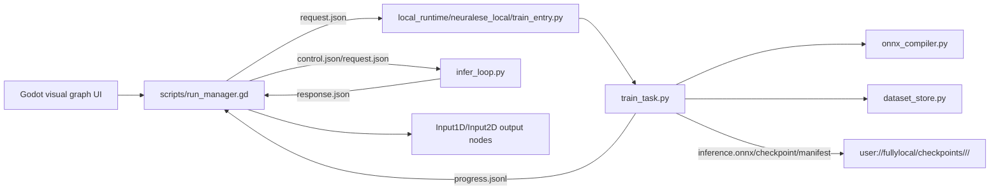
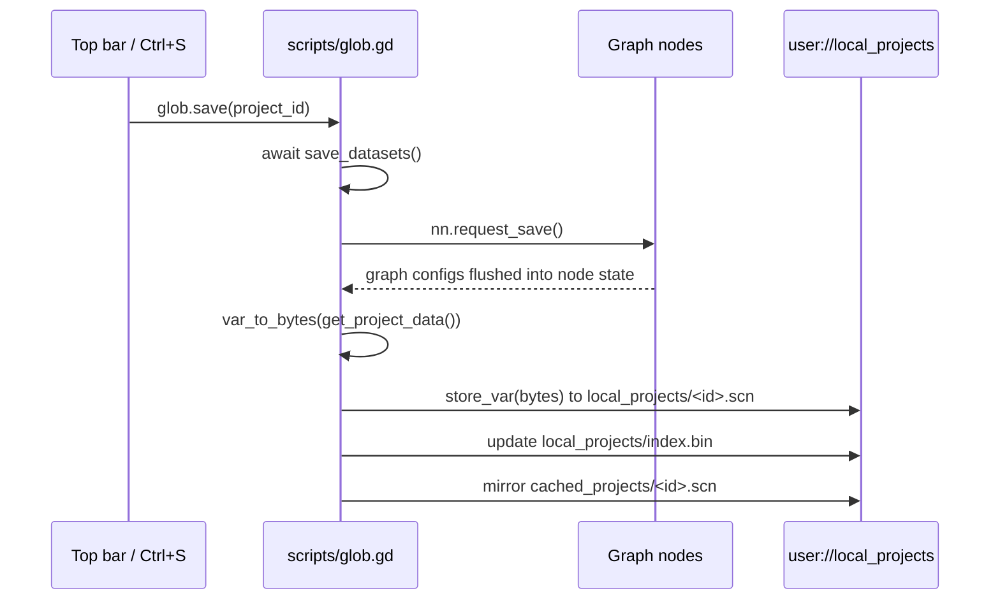
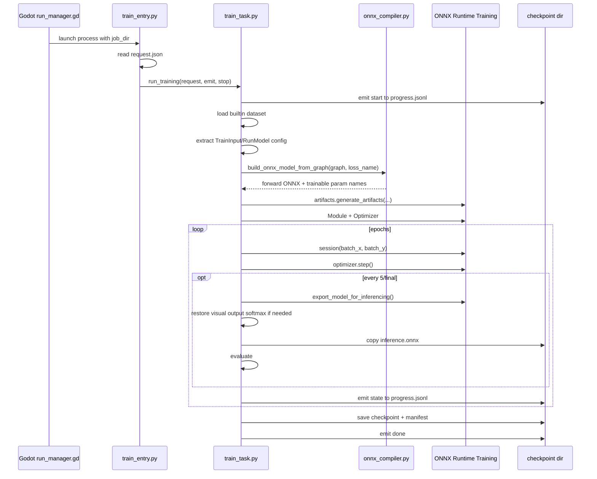
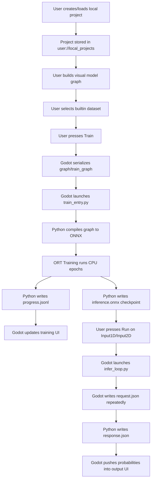

# Neuralese Local Runtime, Training, Inference, and Saving Documentation

This document describes the current local/offline systems added to the Neuralese Godot frontend:

- FullyLocal training through ONNX Runtime Training.
- FullyLocal inference through a persistent local Python process.
- Local project saving/loading without login or server access.
- Local checkpoints and context deletion.

It is intended for future maintenance and CTO onboarding. It documents actual code paths as of this implementation, including known limitations and operational risks.

## 1. System Overview

Neuralese is still primarily a Godot frontend that represents models as visual graph nodes. The local systems let the app perform three important tasks without relying on the remote backend:

1. Persist projects locally.
2. Train selected builtin datasets locally using an embedded Python + ONNX Runtime Training runtime.
3. Run local inference against the latest trained ONNX checkpoint.

The Godot side remains responsible for:

- UI state.
- Graph construction and validation.
- Serializing visual graphs with `graphs.get_syntax_tree(...)`.
- Launching local Python worker processes.
- Polling worker output files.
- Applying training metrics and inference outputs back into UI nodes.

The Python side is responsible for:

- Loading builtin NumPy datasets.
- Compiling Neuralese graph JSON into ONNX.
- Creating ORT training artifacts.
- Running CPU training.
- Exporting inference ONNX checkpoints.
- Running persistent CPU inference.

High-level data flow:



## 2. Important Files

### Godot side

- `scripts/run_manager.gd`
  - Main local training/inference bottleneck.
  - Chooses FullyLocal vs remote paths.
  - Creates training job directories.
  - Launches local Python training and inference processes.
  - Polls local progress files.
  - Owns checkpoint paths and context deletion.

- `scripts/glob.gd`
  - Owns local project saving/loading through `LocalSave`.
  - Stores project blobs under `user://local_projects`.
  - Loads/saves datasets through existing dataset persistence.

- `scripts/input_1d.gd`
  - Input1D runtime inference UI.
  - Opens/closes inference channel.
  - Sends changed 1D tensor values.

- `scripts/input_graph.gd`
  - Input2D runtime inference UI.
  - Opens/closes inference channel.
  - Sends 28x28 image pixels while drawing.

- `scripts/train_begin.gd`
  - User-facing training start/stop control.
  - Supplies epoch count and dataset information.
  - Calls into training head and `nn.start_train(...)`.

- `scripts/train_input.gd`
  - Training configuration node.
  - Owns optimizer/lr/weight decay/momentum UI.
  - Displays training acceptance/accuracy chart.

### Python side

- `local_runtime/neuralese_local/train_entry.py`
  - CLI entry point launched by Godot for local training.
  - Reads `<job_dir>/request.json`.
  - Writes JSONL progress through `ProgressJsonl`.

- `local_runtime/neuralese_local/train_task.py`
  - Main local training implementation.
  - Loads dataset.
  - Extracts train config.
  - Compiles graph to ONNX.
  - Generates ORT training/eval/optimizer artifacts.
  - Runs epochs.
  - Exports `inference.onnx`.
  - Restores visual output softmax for inference when appropriate.
  - Writes checkpoint/manifest/result.

- `local_runtime/neuralese_local/onnx_compiler.py`
  - Converts Neuralese syntax-tree graph JSON into forward ONNX.
  - Supports `InputNode`, `NeuronLayer`, `Flatten`, `Reshape2D`, `SoftmaxNode`, `Concat`, `Add`, pass-through model nodes.
  - For cross entropy training, skips visual `SoftmaxNode` when `props.config.role == "output"`.

- `local_runtime/neuralese_local/dataset_store.py`
  - Loads builtin datasets from `local_runtime/datasets/<name>`.
  - Supports `.npz` and `.npy` layouts.
  - Wraps arrays in `ArrayDataset`.

- `local_runtime/neuralese_local/infer_loop.py`
  - Persistent inference worker launched once per open inference channel.
  - Loads `inference.onnx` once.
  - Polls `request.json`.
  - Writes `response.json`.
  - Exits when `stop` file appears.

- `local_runtime/neuralese_local/infer_once.py`
  - One-shot inference helper.
  - Current Godot path uses `infer_loop.py` for live UI inference.

- `local_runtime/neuralese_local/progress_jsonl.py`
  - Appends progress packets to `progress.jsonl`.

- `local_runtime/neuralese_local/stop_flag.py`
  - File-based cancellation primitive for training workers.

## 3. Local Project Saving

Local saving is controlled by:

```gdscript
const LocalSave: bool = true
const LOCAL_PROJECT_DIR: String = "local_projects"
const LOCAL_PROJECT_INDEX: String = "local_projects/index.bin"
```

in `scripts/glob.gd`.

When `LocalSave` is enabled:

- `glob.save(...)` does not call `web.POST("save", ...)`.
- `glob.save_empty(...)` does not call the server.
- `glob.request_projects(...)` reads from the local project index.
- `glob.load_scene(...)` reads local project blobs.
- `glob.delete_project(...)` deletes local project files.
- `glob.open_last_project(...)` no longer requires `_logged_in`.

### Local files

Project files are stored in Godot's `user://` sandbox:

```text
user://local_projects/index.bin
user://local_projects/<project_id>.scn
user://cached_projects/<project_id>.scn
```

`index.bin` is a Godot `store_var` dictionary:

```gdscript
{
  "<project_id>": {
    "name": "<project display name>",
    "scene": "<project_id>",
    "local": true,
    "modified": <unix seconds>,
    "last_id": <ai/help last id>,
    "chat_id": "<chat id>",
    "contexts": [<context ids>]
  }
}
```

`<project_id>.scn` is a `PackedByteArray` produced by:

```gdscript
var bytes = var_to_bytes(get_project_data())
```

The same bytes are mirrored to `user://cached_projects/<project_id>.scn` for compatibility.

### Project blob shape

`glob.get_project_data(empty=false)` produces:

```gdscript
{
  "graphs": {
    <graph_id>: <graph.get_info()>
  },
  "lua": {
    <env script name>: <source text>
  },
  "registry": {
    "subgraph_registry": {
      <subgraph_id>: [<graph ids>]
    }
  },
  "camera": Vector3(<x>, <y>, <zoom>)
}
```

For empty projects, `graphs` and `lua` are empty and only the registry shell is returned.

### Save workflow



### Load workflow

```mermaid
sequenceDiagram
    participant UI as Works list/startup
    participant Glob as scripts/glob.gd
    participant Disk as user://local_projects
    participant Graphs as graph_manager
    participant Env as env tab

    UI->>Glob: load_scene(project_id)
    Glob->>Disk: read local_projects/<id>.scn
    Glob->>Glob: bytes_to_var(bytes)
    Glob->>Graphs: delete_all()
    Glob->>Graphs: load_graph(dat.graphs, dat.registry.subgraph_registry)
    Glob->>Env: env_dump = dat.lua; request_texts()
    Glob->>Glob: restore camera, scene name, last_id
```

### Local save caveats

- Chat contents are not fully embedded in the project blob. The index stores `last_id` and `chat_id` metadata, matching the old remote save payload, but not a complete chat archive.
- Dataset content is saved through existing dataset files under `user://datasets`, not in each project blob.
- Context/checkpoint files are stored separately under `user://fullylocal/checkpoints`.

## 4. FullyLocal Training

FullyLocal training is enabled by:

```gdscript
const FULLY_LOCAL_TRAINING := true
```

in `scripts/run_manager.gd`.

Builtin datasets currently accepted by the FullyLocal path:

```gdscript
const FULLY_LOCAL_DATASET_NAMES := {
    "mnist": true,
    "iris": true,
    "titanic": true,
    "car_track": true,
}
```

Training uses builtin NumPy datasets only. User-created JSON dataset conversion is intentionally not implemented yet.

### Training start call chain

1. User presses Train in `scripts/train_begin.gd`.
2. `train_begin.gd.train_start()`:
   - Sets button text to Stop.
   - Reads epoch count from `$YY`.
   - Finds the training head with `get_training_head()`.
   - Calls `old_head.train_start()`.
   - Calls `nn.start_train(old_head, additional_call, train)`.
3. `scripts/run_manager.gd.start_train(...)`:
   - Calls `_build_train_payload(train_input)`.
   - Resolves the `TrainBegin` origin with `graphs._reach_input(...)`.
   - Resolves the executable model input graph from the `RunModel` node.
   - Calls `graphs.get_syntax_tree(execute_input_origin)`.
   - Calls `graphs.get_syntax_tree(train_input_origin)`.
   - Checks the dataset name.
   - Routes builtin datasets into `_start_train_fully_local(...)`.

### Training payload

`_build_train_payload(...)` creates:

```gdscript
{
  "session": "neriqward",
  "graph": graphs.get_syntax_tree(execute_input_origin),
  "train_graph": graphs.get_syntax_tree(train_input_origin),
  "scene_id": str(glob.get_project_id()),
  "context": str(execute_input_origin.context_id),
  "epochs": <from TrainBegin>,
  "dataset": <dataset name>,
  "test_dataset": "",
  "batch_size": 0,
  "local": <bool>
}
```

`_start_train_fully_local(...)` modifies it:

```gdscript
payload["dataset_ref"] = {"kind": "builtin_numpy", "name": ds_name}
payload["runtime_root"] = ProjectSettings.globalize_path("res://local_runtime")
payload["job_dir"] = user://fullylocal/jobs/<job_id>
payload["checkpoint_dir"] = user://fullylocal/checkpoints/<project_id>/<context_id>
payload["local_mode"] = "fullylocal_ort"
payload.erase("local")
```

Then it writes:

```text
<job_dir>/request.json
```

and launches:

```text
local_runtime/python/python.exe local_runtime/neuralese_local/train_entry.py <job_dir>
```

### Training job files

```text
user://fullylocal/jobs/<job_id>/
  request.json
  progress.jsonl
  stop
  result.json
  artifacts/
    inference.onnx

user://fullylocal/checkpoints/<project_id>/<context_id>/
  inference.onnx
  checkpoint
  manifest.json
```

`stop` only exists when cancellation is requested.

### Python training workflow



### Graph-to-ONNX contract

The compiler expects the syntax tree produced by `graphs.get_syntax_tree(...)`:

```gdscript
{
  "pages": {
    "0": {
      <node_id>: {
        "type": "InputNode",
        "props": {
          "raw_values": [...],
          "config": {...},
          "shape": 784
        },
        "emit": {
          "input_out": {
            <next_node_id>: ["layer_in"]
          }
        }
      }
    }
  },
  "expect": {
    <node_id>: {
      "layer_in": 1
    }
  },
  "train": 1
}
```

Supported node types in `onnx_compiler.py`:

- `InputNode`, `input_1d`, `input_2d`
- `NeuronLayer`, `layer`, `dense_layer`
- Dense/linear layer
- Conv2D layer
- MaxPool2D layer
- Dropout layer
- `SoftmaxNode`, `softmax`
- `Flatten`, `flatten`
- `Reshape2D`, `reshape2d`
- `Concat`, `concat`
- `Add`, `AddNode`
- `OutputMap`, `ClassifierNode`, `RunModel`
- Pass-through training/meta nodes: `TrainInput`, `TrainBegin`, `DatasetName`, `ModelName`

Unsupported node types raise `ValueError`.

### Cross entropy and Softmax behavior

For cross entropy training, the compiler skips visual output Softmax nodes:

```python
if ntype in ("SoftmaxNode", "softmax") and props.config.role == "output":
    # pass through incoming tensor for training
```

Reason:

- ORT `CrossEntropyLoss` expects logits.
- Visual Neuralese graphs often include a terminal Softmax for understandable probability output.
- Training should use logits, but inference should honor the visual Softmax.

Important nuance:

- The compiler only skips the output Softmax.
- It does not remove a final layer activation. If the user draws `Dense(10, relu) -> Softmax(output)`, training receives the ReLU output as logits-like values.

After exporting an inference ONNX checkpoint, `train_task.py` calls:

```python
_restore_visual_output_softmax_for_inference(inference_path, graph, loss_name)
```

This re-adds `Softmax(axis=1)` to the saved inference model when the original graph had `SoftmaxNode` with `role == "output"` and the loss is cross entropy.

### Training progress packets

Python writes one JSON object per line to:

```text
<job_dir>/progress.jsonl
```

Common packets:

```json
{"phase": "start", "mode": "train", "backend": "fullylocal_ort"}
```

```json
{
  "phase": "state",
  "data": {
    "epoch": 0,
    "left": 4,
    "type": "loss",
    "data": {
      "train_loss": 0.5,
      "val_loss": 0.4,
      "train_acc": 0.9,
      "val_acc": 0.9,
      "length": 469,
      "batch_size": 128,
      "evaluated": true,
      "last_evaluated_epoch": 0,
      "epoch_seconds": 0.7,
      "eval_seconds": 0.1
    }
  }
}
```

```json
{"phase": "warning", "warning": "..."}
```

```json
{"phase": "done"}
```

```json
{"phase": "stopped"}
```

```json
{"phase": "error", "error": {"type": "TrainError", "message": "..."}}
```

Godot polls `progress.jsonl` in `_poll_local_training_jobs()`.

### Training UI update path

1. `run_manager.gd._poll_local_training_jobs()` reads new JSONL lines.
2. Each parsed packet goes to `_handle_train_state_dict(packet, additional, training_head)`.
3. `additional` is usually `train_begin.gd.additional_call`.
4. For `phase == "state"`:
   - `train_begin.gd.additional_call(...)` updates remaining epochs UI.
   - `run_manager.gd` reads `val_acc`.
   - Calls `training_head.push_acceptance(acc, 0.0)`.
5. `train_input.gd.push_acceptance(...)` updates the acceptance/accuracy chart.

### Optimizers

The embedded runtime currently uses `onnxruntime 1.15.1`.

In this installed package:

```python
class OptimType(Enum):
    AdamW = 1
```

There is no `OptimType.SGD` in the bundled `artifacts.py`, even though newer online docs show one.

Current behavior:

- `adam` and `adamw` use ORT `AdamW`.
- `sgd` tries to find `SGD`/`SGDOptimizer`.
- If unavailable, it emits a warning and falls back to AdamW.
- If SGD fallback is used and LR is above `1e-3`, LR is clamped to `1e-3`.

### Performance choices

Current defaults in `train_task.py`:

```python
DEFAULT_BATCH_SIZE = 128
EXPORT_EVAL_INTERVAL = 5
EVAL_MAX_SAMPLES = 2048
```

Behavior:

- Batch size defaults to 128 when Godot sends `batch_size: 0`.
- Training shuffles indices without mutating dataset arrays.
- Inference ONNX export/evaluation happens:
  - epoch 0,
  - every 5 epochs,
  - final epoch.
- Intermediate evaluation uses up to 2048 validation samples.
- Final evaluation uses the full validation set.

This avoids creating an ONNX export and full validation session every epoch.

## 5. FullyLocal Inference

Inference is persistent and file-based. Godot launches a Python worker once, then updates input by rewriting `request.json`.

### Inference channel state

`scripts/run_manager.gd` defines:

```gdscript
class LocalInferChannel:
    var model_path: String
    var graph: Dictionary
    var context_id: String
    var output_node_id: String
    var on_close: Callable
    var closed: bool
    var index: int
    var pid: int
    var job_dir: String
    var control_path: String
    var request_path: String
    var response_path: String
    var stop_path: String
    var last_response_index: int
    var last_request_msec: int
    var no_response_logged: bool
    var parse_fail_count: int
```

Open channels are stored in:

```gdscript
var inference_sockets := {}
```

The key is the input `Graph` node. The value is either a remote socket or `LocalInferChannel`.

### Opening an inference channel

Call chain:

```text
Input1D/Input2D run button
  -> nn.open_infer_channel(self, close_runner, run_but)
  -> run_manager.gd._open_infer_channel_fully_local(...)
```

`_open_infer_channel_fully_local(...)`:

1. Resolves checkpoint model path:

   ```text
   user://fullylocal/checkpoints/<project_id>/<context_id>/inference.onnx
   ```

2. Builds current graph syntax tree:

   ```gdscript
   var graph := graphs.get_syntax_tree(input)
   ```

3. Creates inference job dir:

   ```text
   user://fullylocal/infer/<context_id>/<job_id>/
   ```

   `<job_id>` is unique per channel open. This prevents stale `request.json`,
   `response.json`, and `stop` files from a previous Run/Stop cycle from being
   read by a new inference worker.

4. Writes `control.json`.
5. Launches:

   ```text
   local_runtime/python/python.exe local_runtime/neuralese_local/infer_loop.py <job_dir>
   ```

6. Calls `input.set_state_open()`.
7. Stores channel in `inference_sockets[input]`.

### Inference job files

```text
user://fullylocal/infer/<context_id>/<job_id>/
  control.json
  request.json
  response.json
  stop
```

### control.json

Written once before process launch:

```json
{
  "model_path": "absolute/path/to/inference.onnx",
  "graph": {...},
  "context": "<context_id>",
  "output_node_id": "<visual output node id>"
}
```

### request.json

Written repeatedly by Godot:

```json
{
  "seq": 6,
  "graph": {...},
  "data": {
    "raw_values": [0.0, 1.0, ...],
    "config": {...},
    "shape": 784
  },
  "context": "<context_id>",
  "output_node_id": "<visual output node id>",
  "index": 6
}
```

For graph shape updates:

```json
{
  "seq": 7,
  "graph": {...},
  "data": {
    "full_graph": {...}
  },
  "context": "<context_id>",
  "output_node_id": "<new output id>",
  "index": 7
}
```

### response.json

Written atomically by Python:

```json
{
  "phase": "ready",
  "ok": true,
  "index": -1
}
```

```json
{
  "phase": "inference",
  "ok": true,
  "index": 6,
  "result": {
    "<output_node_id>": {
      "model_out": [[[0.01, 0.02, 0.97]]]
    }
  }
}
```

```json
{
  "phase": "error",
  "ok": false,
  "index": 6,
  "error": {"type": "InferenceError", "message": "..."},
  "result": {}
}
```

```json
{
  "phase": "closed",
  "ok": true,
  "index": 6
}
```

### Python inference loop

`infer_loop.py`:

1. Reads `control.json`.
2. Creates `ort.InferenceSession(model_path, providers=["CPUExecutionProvider"])`.
3. Writes `ready`.
4. Loops until `stop` exists.
5. Reads `request.json`.
6. Ignores old `seq` values.
7. Extracts raw values:
   - Prefer `request.data.raw_values`.
   - Else inspect `full_graph`/`graph` for input node `props.raw_values`.
8. Shapes input according to ONNX input shape.
9. Runs `session.run(None, {input_name: input_array})`.
10. Writes `response.json` atomically.

Atomic write uses:

```python
tmp_path.write_text(...)
os.replace(tmp_path, response_path)
```

Godot still handles partial/invalid JSON gracefully with parse-failure counters.

### Godot inference polling

`run_manager.gd._poll_local_inference_channels()` runs in `_process(...)`.

For each local channel:

1. Skip closed channels.
2. Wait for `response.json`.
3. Open/read/parse response JSON.
4. Ignore responses with `index <= last_response_index`.
5. For `phase == "ready"`, only records readiness.
6. For `phase == "inference"`:
   - Calls `_infer_result_to_outputs(parsed)`.
   - Calls `infer_clear(input, outs)`.
7. For `phase == "error"`:
   - Emits Godot warning.
   - Clears polling with empty outputs.
8. For `phase == "closed"`:
   - Erases channel.
   - Calls `channel.on_close`.

### Applying inference outputs

`_infer_result_to_outputs(...)` expects:

```json
{
  "result": {
    "<node_id>": {
      "<port>": [
        [[...tensor values...]]
      ]
    }
  }
}
```

For each output node:

1. Finds graph node:

   ```gdscript
   var node: Graph = graphs._graphs.get(int(i))
   ```

2. Flattens tensor:

   ```gdscript
   var flattened = glob.flatten_array(to_push)
   ```

3. If `node.is_head`, calls:

   ```gdscript
   node.push_values(flattened, node.per)
   ```

4. Stores `outs[node.get_title()] = flattened`.

### Input1D live inference

`scripts/input_1d.gd`:

- `_on_run_released()` opens or closes inference.
- `_after_process(delta)` sends new inference data when:
  - channel is open,
  - cooldown elapsed,
  - tensor hash changed.
- `useful_properties()` includes `raw_values`, input feature config, and shape.
- `graph_updated()` sends `{"full_graph": graphs.get_syntax_tree(self)}` while running.

### Input2D live inference

`scripts/input_graph.gd`:

- `_on_run_released()` opens or closes inference.
- `_process(delta)` sends image pixels while drawing:

  ```gdscript
  if nn.is_infer_channel(self) and $TextureRect.drawing > 0.01 and cd < 0.01:
      nn.send_inference_data(self, useful_properties())
  ```

- `get_raw_values()` flattens the image red channel into a 1D list.
- `useful_properties()` marks the input as `Input2D` with rows/columns 28x28.

### Closing inference

`run_manager.gd.close_infer_channel(input)` for local channels:

1. Sets `sock.closed = true`.
2. Writes `stop` file.
3. Erases channel from `inference_sockets`.
4. Erases pending `inference_polling`.
5. Calls `sock.on_close`.

The input node's `close_runner()` resets button text to `Run!` and `running = false`.

Known detail:

- `close_runner()` currently calls `nn.close_infer_channel(self)` again. Since the channel was already erased, this produces a harmless "close ignored" debug log.

## 6. Checkpoints and Context Deletion

Local checkpoints live under:

```text
user://fullylocal/checkpoints/<project_id>/<context_id>/
```

Files:

- `inference.onnx`
- `checkpoint`
- `manifest.json`

`manifest.json` includes:

```json
{
  "status": "ok",
  "backend": "fullylocal_ort",
  "artifact": ".../inference.onnx",
  "checkpoint_dir": "...",
  "dataset": "mnist",
  "context": "<context_id>",
  "scene_id": "<project_id>",
  "model_outputs": ["<onnx output tensor>"],
  "loss": "cross_entropy",
  "optimizer": "adam",
  "actual_optimizer": "adamw",
  "learning_rate": 0.001,
  "export_eval_interval": 5
}
```

`run_manager.gd.delete_ctx(id)`:

- If `FULLY_LOCAL_TRAINING`, deletes local context directory.
- Else calls remote `delete_ctx`.

Deletion safety:

- `_remove_dir_recursive_abs(path)` refuses to delete paths outside the local checkpoint root.
- This is important because context ids originate from graph/runtime state.

## 7. Frontend-Backend Boundary

Local mode does not remove remote code. It branches around it.

### Remote training path

If dataset is not in `FULLY_LOCAL_DATASET_NAMES`, `start_train(...)` still routes to `_start_train_remote(...)`.

Remote path:

- Requires login.
- Opens websocket `ws/train`.
- Sends compressed project/model payload.
- Uploads local datasets via RLE block protocol when needed.

### Local training path

If dataset name is in `FULLY_LOCAL_DATASET_NAMES`, `start_train(...)` routes to `_start_train_fully_local(...)`.

Local path:

- Does not require login.
- Does not compress/upload datasets.
- Uses builtin NumPy datasets from `local_runtime/datasets`.
- Communicates only through local files.

### Local save path

If `glob.LocalSave` is true:

- Project list/save/load/delete are local.
- No login required.
- Remote project endpoints are not used for normal project workflows.

Other features such as AI help, model export, update checks, lessons, or remote datasets may still use network paths unless separately gated.

## 8. Builtin Dataset Layout

Builtin datasets live under:

```text
local_runtime/datasets/<dataset_name>/
```

Supported files:

```text
train.npz
```

or:

```text
train_x.npy
train_y.npy
val_x.npy
val_y.npy
test_x.npy
test_y.npy
```

`train.npz` keys:

- `x` or `train_x`
- `y` or `train_y`
- optional `val_x` or `test_x`
- optional `val_y` or `test_y`

Example MNIST:

```text
local_runtime/datasets/mnist/meta.json
local_runtime/datasets/mnist/train.npz
```

`meta.json` is used by the Godot dataset selector/metadata layer, while Python reads arrays from the `.npz`/`.npy` data files.

## 9. Debug Logging

Current local inference debug flag:

```gdscript
const FULLY_LOCAL_INFER_DEBUG := true
```

in `scripts/run_manager.gd`.

When enabled, logs include:

- Channel open request.
- Missing model or runtime entry.
- Job dir/control/request/response paths.
- Python PID.
- Request sequence number.
- Raw input length.
- Response parse failures.
- Response phases.
- Close/stop file writes.

`input_1d.gd` and `input_graph.gd` also log:

- Run button release.
- Open result.
- Auto sends.
- Graph update sends.
- Close runner state.

These logs were intentionally added for diagnosis and may be too noisy for release builds.

## 10. Maintenance Notes and Known Limitations

### Python runtime is embedded and ignored by git

`local_runtime/python/` is intentionally ignored. It must be present in shipped builds or recreated during packaging.

Required packages currently include:

- `numpy`
- `onnx`
- `onnxruntime-training`

The current embedded ORT version is `1.15.1`.

### SGD mismatch

The current online ONNX Runtime docs may show:

```python
artifacts.OptimType.SGD
```

The embedded `onnxruntime 1.15.1` package does not expose SGD in `artifacts.py`. It only exposes `AdamW`.

Do not assume docs for latest ORT match the embedded runtime. Check:

```text
local_runtime/python/Lib/site-packages/onnxruntime/training/artifacts.py
```

### User-created local datasets are not implemented for FullyLocal

FullyLocal training only supports builtin NumPy datasets. User-created Godot datasets still use the existing dataset persistence/compression system and remote training path unless conversion is added.

To add this:

1. Convert `glob.dataset_datas[name]` into NumPy arrays.
2. Write an `.npz` into a local job dir or dataset cache.
3. Add `dataset_ref.kind == "local_npz"` support in `dataset_store.py`.
4. Ensure target typing matches selected loss.

### Inference checkpoint freshness

Inference uses:

```text
user://fullylocal/checkpoints/<project_id>/<context_id>/inference.onnx
```

If a graph changes after training, the checkpoint may no longer match the visual graph. The system sends `full_graph` updates to the inference loop, but the ONNX model itself is fixed until retraining.

### Softmax training/inference split

For cross entropy:

- Training ONNX skips visual output Softmax.
- Exported inference ONNX restores visual output Softmax.

This means training metrics and inference output both make sense:

- Training loss sees logits.
- UI inference receives probabilities when the visual graph has Softmax.

### Output node id is visual, not ONNX tensor id

The Python inference response maps ONNX predictions to the visual output node id selected by Godot:

```json
{
  "<output_node_id>": {
	"model_out": [...]
  }
}
```

This is why `infer_loop.py` does not need to understand the entire visual graph execution; it only needs the final visual target id for UI routing.

### File-based IPC risks

Training and inference use simple local file protocols. Risks:

- Partial JSON reads.
- Stale `request.json`.
- Worker process crash leaving no response.
- Multiple channels sharing same context id/job dir.

Mitigations currently present:

- Inference response writes are atomic in Python.
- Godot ignores stale response indices.
- Godot logs parse failures and waits.
- Inference job dirs are unique per open channel under `user://fullylocal/infer/<context_id>/`.
- Training job dirs include timestamp/random suffix.

Potential future hardening:

- Add heartbeat timestamps.
- Add stderr/stdout capture files for Python workers.
- Add worker PID health checks.
- Add request atomic writes on the Godot side through temp + rename if feasible.

## 11. Suggested Future Refactors

1. Move local runtime constants into a dedicated config singleton.
2. Split `run_manager.gd` into:
   - `LocalTrainingManager`
   - `LocalInferenceManager`
   - `RemoteTrainingClient`
3. Replace file polling with named pipes or a lightweight local websocket if packaging permits.
4. Add a formal schema/version to `request.json`, `control.json`, and `response.json`.
5. Add automated smoke tests:
   - compile MLP graph,
   - train 1 epoch MNIST,
   - assert inference output sums to 1 when Softmax exists,
   - open/close persistent inference channel.
6. Add graph compatibility validation before training:
   - final output size vs dataset target classes,
   - loss vs target dtype,
   - input shape vs dataset shape,
   - unsupported nodes.
7. Add local dataset conversion for user-created datasets.

## 12. Quick Troubleshooting

### Training says no local dataset

Check:

- Dataset name is one of `FULLY_LOCAL_DATASET_NAMES`.
- Dataset files exist under `local_runtime/datasets/<name>`.
- `dataset_ref` in `request.json` is `{"kind": "builtin_numpy", "name": "<name>"}`.

### Training accuracy is stuck low

Check:

- Output size matches number of classes.
- Loss is `cross_entropy` for class labels.
- Dataset labels are integer class indices or one-hot arrays.
- Learning rate is sane.
- Final activation is intentional.
- Visual Softmax exists only if you want probability output in inference.

### SGD does not work

Check embedded ORT version and `artifacts.py`. Current embedded ORT has only AdamW.

### Inference outputs logits instead of probabilities

The exported checkpoint may be old. Retrain after the Softmax-restoration change. New checkpoints re-add visual output Softmax for cross entropy graphs.

### Stop button stays on Stop

Check:

- `close_infer_channel(...)` is called.
- Local channel `on_close` callback is valid.
- `close_runner()` logs in `input_1d.gd` or `input_graph.gd`.
- `stop` file is created under `user://fullylocal/infer/<context_id>/<job_id>/stop`.

### No inference updates after a few sends

Check logs:

- `[FullyLocalInfer] request queued`
- `[FullyLocalInfer] response received`
- `response parse failed`
- `waiting for response file`

Also inspect:

```text
user://fullylocal/infer/<context_id>/<job_id>/request.json
user://fullylocal/infer/<context_id>/<job_id>/response.json
```

If `request.json` seq increases but `response.json` index does not, the Python worker is stuck or crashed.

## 13. Current Local Workflow Summary


